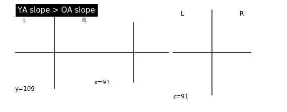
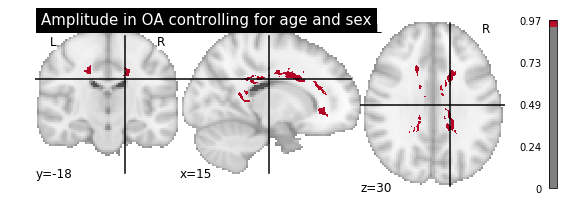

# GLM


<div markdown="1" class="cell code_cell">
<div class="input_area" markdown="1">
```python
import numpy as np
import pandas as pd
import matplotlib.pyplot as plt
import os
import sys

scan_dir = '/Volumes/G-DRIVE mobile/derivatives/'
data_dir = '/Users/megmcmahon/Box/CogNeuroLab/Aging Decision Making R01/data/'

```
</div>

</div>


<div markdown="1" class="cell code_cell">
<div class="input_area" markdown="1">
```python
d = []
d = pd.read_csv(data_dir + 'dataset_2020-04-09.csv')
d = d.sort_values('record_id', ascending = True)
d['sex'] = np.where(d['sex'] == 'Female', 0, 1)
d[0:5]

```
</div>

<div class="output_wrapper" markdown="1">
<div class="output_subarea" markdown="1">


<div markdown="0" class="output output_html">
<div>
<style scoped>
    .dataframe tbody tr th:only-of-type {
        vertical-align: middle;
    }

    .dataframe tbody tr th {
        vertical-align: top;
    }

    .dataframe thead th {
        text-align: right;
    }
</style>
<table border="1" class="dataframe">
  <thead>
    <tr style="text-align: right;">
      <th></th>
      <th>record_id</th>
      <th>actamp</th>
      <th>actbeta</th>
      <th>actphi</th>
      <th>actmin</th>
      <th>actmesor</th>
      <th>actupmesor</th>
      <th>actdownmesor</th>
      <th>actalph</th>
      <th>actwidthratio</th>
      <th>...</th>
      <th>cowat_zscore</th>
      <th>cowat_perseveration</th>
      <th>cowat_errors</th>
      <th>time_trails_a</th>
      <th>error_trails_a</th>
      <th>trails_a_z_score</th>
      <th>time_trails_b</th>
      <th>error_trails_b</th>
      <th>trails_b_z_score</th>
      <th>neuropsych_scoring_complete</th>
    </tr>
  </thead>
  <tbody>
    <tr>
      <td>0</td>
      <td>30003</td>
      <td>1.389856</td>
      <td>21.815009</td>
      <td>14.373034</td>
      <td>0.541285</td>
      <td>1.236213</td>
      <td>6.117306</td>
      <td>22.628763</td>
      <td>-0.556815</td>
      <td>0.687977</td>
      <td>...</td>
      <td>NaN</td>
      <td>NaN</td>
      <td>NaN</td>
      <td>35.0</td>
      <td>0.0</td>
      <td>-1.756914</td>
      <td>97.0</td>
      <td>0.0</td>
      <td>-3.784870</td>
      <td>2.0</td>
    </tr>
    <tr>
      <td>1</td>
      <td>30004</td>
      <td>1.630892</td>
      <td>4.438790</td>
      <td>15.128163</td>
      <td>0.000000</td>
      <td>0.815446</td>
      <td>6.927406</td>
      <td>23.328920</td>
      <td>-0.544804</td>
      <td>0.683396</td>
      <td>...</td>
      <td>NaN</td>
      <td>NaN</td>
      <td>NaN</td>
      <td>25.0</td>
      <td>0.0</td>
      <td>-0.068886</td>
      <td>59.0</td>
      <td>0.0</td>
      <td>-0.673139</td>
      <td>2.0</td>
    </tr>
    <tr>
      <td>2</td>
      <td>30008</td>
      <td>1.610484</td>
      <td>7.306045</td>
      <td>15.569911</td>
      <td>0.139627</td>
      <td>0.944868</td>
      <td>7.708287</td>
      <td>23.431534</td>
      <td>-0.468304</td>
      <td>0.655135</td>
      <td>...</td>
      <td>NaN</td>
      <td>NaN</td>
      <td>NaN</td>
      <td>27.0</td>
      <td>0.0</td>
      <td>-0.592431</td>
      <td>60.0</td>
      <td>1.0</td>
      <td>-0.869188</td>
      <td>2.0</td>
    </tr>
    <tr>
      <td>3</td>
      <td>30009</td>
      <td>1.951245</td>
      <td>7.026165</td>
      <td>14.377649</td>
      <td>0.081641</td>
      <td>1.057264</td>
      <td>6.388996</td>
      <td>22.366302</td>
      <td>-0.497424</td>
      <td>0.665721</td>
      <td>...</td>
      <td>NaN</td>
      <td>NaN</td>
      <td>NaN</td>
      <td>35.0</td>
      <td>0.0</td>
      <td>-1.216992</td>
      <td>61.0</td>
      <td>0.0</td>
      <td>-0.834951</td>
      <td>2.0</td>
    </tr>
    <tr>
      <td>4</td>
      <td>30012</td>
      <td>NaN</td>
      <td>NaN</td>
      <td>NaN</td>
      <td>NaN</td>
      <td>NaN</td>
      <td>NaN</td>
      <td>NaN</td>
      <td>NaN</td>
      <td>NaN</td>
      <td>...</td>
      <td>NaN</td>
      <td>NaN</td>
      <td>NaN</td>
      <td>35.0</td>
      <td>1.0</td>
      <td>-1.216992</td>
      <td>54.0</td>
      <td>0.0</td>
      <td>-0.268608</td>
      <td>2.0</td>
    </tr>
  </tbody>
</table>
<p>5 rows × 742 columns</p>
</div>
</div>


</div>
</div>
</div>


<div markdown="1" class="cell code_cell">
<div class="input_area" markdown="1">
```python
oa_files = []
oa_files = pd.DataFrame(os.listdir(scan_dir + '/tbss_oa/origdata'), columns = ['files'])
oa_files['record_id'] = oa_files['files'].str.split('-', expand = True)[1].str.split('_', expand = True)[0].astype(int)
oa_files = oa_files.drop('files', axis=1)
oa_files = oa_files.set_index('record_id')

oa_df = []
oa_df = d[d['Group'] == 'Older Adults']
oa_df = oa_df.set_index('record_id')

oa_dsn = []
oa_dsn = oa_files.join(oa_df, sort=True).dropna(subset = ['files'])

```
</div>

</div>


<div markdown="1" class="cell code_cell">
<div class="input_area" markdown="1">
```python
oa_dsn.shape

```
</div>

<div class="output_wrapper" markdown="1">
<div class="output_subarea" markdown="1">


{:.output_data_text}
```
(57, 741)
```


</div>
</div>
</div>


<div markdown="1" class="cell code_cell">
<div class="input_area" markdown="1">
```python
ya_files = []
ya_files = pd.DataFrame(os.listdir(scan_dir + '/tbss_ya/origdata'), columns = ['files'])
ya_files['record_id'] = ya_files['files'].str.split('-', expand = True)[1].str.split('_', expand = True)[0].astype(int)
ya_files = ya_files.drop('files', axis=1)
ya_files = ya_files.set_index('record_id')

ya_df = []
ya_df = d[d['Group'] == 'Young Adults']
ya_df = ya_df.set_index('record_id')

ya_dsn = []
ya_dsn = ya_files.join(ya_df, sort=True).dropna(subset = ['files'])

```
</div>

</div>


<div markdown="1" class="cell code_cell">
<div class="input_area" markdown="1">
```python
ya_dsn.shape

```
</div>

<div class="output_wrapper" markdown="1">
<div class="output_subarea" markdown="1">


{:.output_data_text}
```
(46, 741)
```


</div>
</div>
</div>


## Interaction Age Group x Rhythm Amplitude and WM

1. Concatenate all_FA images
2. Run fsl randomise looking for interaction of age group x RAR amplitude


<div markdown="1" class="cell code_cell">
<div class="input_area" markdown="1">
```bash%%bash

cd /Volumes/G-DRIVE\ mobile/derivatives/

fslmerge -h

printf "\nYoung Adults All FA\n"
fslinfo tbss_ya/stats/all_FA

printf "\nOlder Adults All FA\n"
fslinfo tbss_oa/stats/all_FA

```
</div>

<div class="output_wrapper" markdown="1">
<div class="output_subarea" markdown="1">
{:.output_stream}
```

Usage: fslmerge <-x/y/z/t/a/tr> <output> <file1 file2 .......> [tr value in seconds]
     -t : concatenate images in time
     -x : concatenate images in the x direction
     -y : concatenate images in the y direction
     -z : concatenate images in the z direction
     -a : auto-choose: single slices -> volume, volumes -> 4D (time series)
     -tr : concatenate images in time and set the output image tr to the final option value

Young Adults All FA
data_type	FLOAT32
dim1		182
dim2		218
dim3		182
dim4		46
datatype	16
pixdim1		1.000000
pixdim2		1.000000
pixdim3		1.000000
pixdim4		1.000000
cal_max		0.000000
cal_min		0.000000
file_type	NIFTI-1+

Older Adults All FA
data_type	FLOAT32
dim1		182
dim2		218
dim3		182
dim4		57
datatype	16
pixdim1		1.000000
pixdim2		1.000000
pixdim3		1.000000
pixdim4		1.000000
cal_max		0.000000
cal_min		0.000000
file_type	NIFTI-1+
```
</div>
</div>
</div>


<div markdown="1" class="cell code_cell">
<div class="input_area" markdown="1">
```bash%%bash

cd /Volumes/G-DRIVE\ mobile/derivatives/

fslmerge -t tbss/stats/all_FA_YA-OA tbss_ya/stats/all_FA tbss_oa/stats/all_FA

```
</div>

</div>


<div markdown="1" class="cell code_cell">
<div class="input_area" markdown="1">
```bash%%bash

cd /Volumes/G-DRIVE\ mobile/derivatives/

fslinfo tbss/stats/all_FA_YA-OA

```
</div>

<div class="output_wrapper" markdown="1">
<div class="output_subarea" markdown="1">
{:.output_stream}
```
data_type	FLOAT32
dim1		182
dim2		218
dim3		182
dim4		103
datatype	16
pixdim1		1.000000
pixdim2		1.000000
pixdim3		1.000000
pixdim4		1.000000
cal_max		0.000000
cal_min		0.000000
file_type	NIFTI-1+
```
</div>
</div>
</div>


<div markdown="1" class="cell code_cell">
<div class="input_area" markdown="1">
```python
from nilearn import image
from nilearn import plotting

scan_dir = '/Volumes/G-DRIVE mobile/derivatives/'
nii = scan_dir + 'tbss/stats/all_FA_YA-OA.nii.gz'
first_vol = image.index_img(nii, 0)
plotting.plot_img(first_vol)

```
</div>

<div class="output_wrapper" markdown="1">
<div class="output_subarea" markdown="1">


{:.output_data_text}
```
<nilearn.plotting.displays.OrthoSlicer at 0x119949d90>
```


</div>
</div>
<div class="output_wrapper" markdown="1">
<div class="output_subarea" markdown="1">

{:.output_png}


</div>
</div>
</div>


<div markdown="1" class="cell code_cell">
<div class="input_area" markdown="1">
```bash%%bash

fslmaths -h

```
</div>

<div class="output_wrapper" markdown="1">
<div class="output_subarea" markdown="1">
{:.output_stream}
```

Usage: fslmaths [-dt <datatype>] <first_input> [operations and inputs] <output> [-odt <datatype>]

Datatype information:
 -dt sets the datatype used internally for calculations (default float for all except double images)
 -odt sets the output datatype ( default is float )
 Possible datatypes are: char short int float double input
 "input" will set the datatype to that of the original image

Binary operations:
  (some inputs can be either an image or a number)
 -add   : add following input to current image
 -sub   : subtract following input from current image
 -mul   : multiply current image by following input
 -div   : divide current image by following input
 -rem   : modulus remainder - divide current image by following input and take remainder
 -mas   : use (following image>0) to mask current image
 -thr   : use following number to threshold current image (zero anything below the number)
 -thrp  : use following percentage (0-100) of ROBUST RANGE to threshold current image (zero anything below the number)
 -thrP  : use following percentage (0-100) of ROBUST RANGE of non-zero voxels and threshold below
 -uthr  : use following number to upper-threshold current image (zero anything above the number)
 -uthrp : use following percentage (0-100) of ROBUST RANGE to upper-threshold current image (zero anything above the number)
 -uthrP : use following percentage (0-100) of ROBUST RANGE of non-zero voxels and threshold above
 -max   : take maximum of following input and current image
 -min   : take minimum of following input and current image
 -seed  : seed random number generator with following number
 -restart : replace the current image with input for future processing operations
 -save : save the current working image to the input filename

Basic unary operations:
 -exp   : exponential
 -log   : natural logarithm
 -sin   : sine function
 -cos   : cosine function
 -tan   : tangent function
 -asin  : arc sine function
 -acos  : arc cosine function
 -atan  : arc tangent function
 -sqr   : square
 -sqrt  : square root
 -recip : reciprocal (1/current image)
 -abs   : absolute value
 -bin   : use (current image>0) to binarise
 -binv  : binarise and invert (binarisation and logical inversion)
 -fillh : fill holes in a binary mask (holes are internal - i.e. do not touch the edge of the FOV)
 -fillh26 : fill holes using 26 connectivity
 -index : replace each nonzero voxel with a unique (subject to wrapping) index number
 -grid <value> <spacing> : add a 3D grid of intensity <value> with grid spacing <spacing>
 -edge  : edge strength
 -tfce <H> <E> <connectivity>: enhance with TFCE, e.g. -tfce 2 0.5 6 (maybe change 6 to 26 for skeletons)
 -tfceS <H> <E> <connectivity> <X> <Y> <Z> <tfce_thresh>: show support area for voxel (X,Y,Z)
 -nan   : replace NaNs (improper numbers) with 0
 -nanm  : make NaN (improper number) mask with 1 for NaN voxels, 0 otherwise
 -rand  : add uniform noise (range 0:1)
 -randn : add Gaussian noise (mean=0 sigma=1)
 -inm <mean> :  (-i i ip.c) intensity normalisation (per 3D volume mean)
 -ing <mean> :  (-I i ip.c) intensity normalisation, global 4D mean)
 -range : set the output calmin/max to full data range

Matrix operations:
 -tensor_decomp : convert a 4D (6-timepoint )tensor image into L1,2,3,FA,MD,MO,V1,2,3 (remaining image in pipeline is FA)

Kernel operations (set BEFORE filtering operation if desired):
 -kernel 3D : 3x3x3 box centered on target voxel (set as default kernel)
 -kernel 2D : 3x3x1 box centered on target voxel
 -kernel box    <size>     : all voxels in a cube of width <size> mm centered on target voxel
 -kernel boxv   <size>     : all voxels in a cube of width <size> voxels centered on target voxel, CAUTION: size should be an odd number
 -kernel boxv3  <X> <Y> <Z>: all voxels in a cuboid of dimensions X x Y x Z centered on target voxel, CAUTION: size should be an odd number
 -kernel gauss  <sigma>    : gaussian kernel (sigma in mm, not voxels)
 -kernel sphere <size>     : all voxels in a sphere of radius <size> mm centered on target voxel
 -kernel file   <filename> : use external file as kernel

Spatial Filtering operations: N.B. all options apart from -s use the default kernel or that _previously_ specified by -kernel
 -dilM    : Mean Dilation of non-zero voxels
 -dilD    : Modal Dilation of non-zero voxels
 -dilF    : Maximum filtering of all voxels
 -dilall  : Apply -dilM repeatedly until the entire FOV is covered
 -ero     : Erode by zeroing non-zero voxels when zero voxels found in kernel
 -eroF    : Minimum filtering of all voxels
 -fmedian : Median Filtering 
 -fmean   : Mean filtering, kernel weighted (conventionally used with gauss kernel)
 -fmeanu  : Mean filtering, kernel weighted, un-normalised (gives edge effects)
 -s <sigma> : create a gauss kernel of sigma mm and perform mean filtering
 -subsamp2  : downsamples image by a factor of 2 (keeping new voxels centred on old)
 -subsamp2offc  : downsamples image by a factor of 2 (non-centred)

Dimensionality reduction operations:
  (the "T" can be replaced by X, Y or Z to collapse across a different dimension)
 -Tmean   : mean across time
 -Tstd    : standard deviation across time
 -Tmax    : max across time
 -Tmaxn   : time index of max across time
 -Tmin    : min across time
 -Tmedian : median across time
 -Tperc <percentage> : nth percentile (0-100) of FULL RANGE across time
 -Tar1    : temporal AR(1) coefficient (use -odt float and probably demean first)

Basic statistical operations:
 -pval    : Nonparametric uncorrected P-value, assuming timepoints are the permutations; first timepoint is actual (unpermuted) stats image
 -pval0   : Same as -pval, but treat zeros as missing data
 -cpval   : Same as -pval, but gives FWE corrected P-values
 -ztop    : Convert Z-stat to (uncorrected) P
 -ptoz    : Convert (uncorrected) P to Z
 -rank    : Convert data to ranks (over T dim)
 -ranknorm: Transform to Normal dist via ranks

Multi-argument operations:
 -roi <xmin> <xsize> <ymin> <ysize> <zmin> <zsize> <tmin> <tsize> : zero outside roi (using voxel coordinates). Inputting -1 for a size will set it to the full image extent for that dimension.
 -bptf  <hp_sigma> <lp_sigma> : (-t in ip.c) Bandpass temporal filtering; nonlinear highpass and Gaussian linear lowpass (with sigmas in volumes, not seconds); set either sigma<0 to skip that filter
 -roc <AROC-thresh> <outfile> [4Dnoiseonly] <truth> : take (normally binary) truth and test current image in ROC analysis against truth. <AROC-thresh> is usually 0.05 and is limit of Area-under-ROC measure FP axis. <outfile> is a text file of the ROC curve (triplets of values: FP TP threshold). If the truth image contains negative voxels these get excluded from all calculations. If <AROC-thresh> is positive then the [4Dnoiseonly] option needs to be set, and the FP rate is determined from this noise-only data, and is set to be the fraction of timepoints where any FP (anywhere) is seen, as found in the noise-only 4d-dataset. This is then controlling the FWE rate. If <AROC-thresh> is negative the FP rate is calculated from the zero-value parts of the <truth> image, this time averaging voxelwise FP rate over all timepoints. In both cases the TP rate is the average fraction of truth=positive voxels correctly found.

Combining 4D and 3D images:
 If you apply a Binary operation (one that takes the current image and a new image together), when one is 3D and the other is 4D,
 the 3D image is cloned temporally to match the temporal dimensions of the 4D image.

e.g. fslmaths inputVolume -add inputVolume2 output_volume
     fslmaths inputVolume -add 2.5 output_volume
     fslmaths inputVolume -add 2.5 -mul inputVolume2 output_volume

     fslmaths 4D_inputVolume -Tmean -mul -1 -add 4D_inputVolume demeaned_4D_inputVolume

```
</div>
</div>
</div>


<div markdown="1" class="cell code_cell">
<div class="input_area" markdown="1">
```bash%%bash

cd /Volumes/G-DRIVE\ mobile/derivatives/

fslmaths tbss/stats/all_FA_YA-OA -Tmean -thr 0.25 -bin tbss/stats/all_FA_YA-OA_mask

```
</div>

</div>


<div markdown="1" class="cell code_cell">
<div class="input_area" markdown="1">
```python
from nilearn import plotting

scan_dir = '/Volumes/G-DRIVE mobile/derivatives/'

plotting.plot_img(scan_dir + 'tbss/stats/all_FA_YA-OA_mask.nii.gz')

```
</div>

<div class="output_wrapper" markdown="1">
<div class="output_subarea" markdown="1">


{:.output_data_text}
```
<nilearn.plotting.displays.OrthoSlicer at 0x1194bab10>
```


</div>
</div>
<div class="output_wrapper" markdown="1">
<div class="output_subarea" markdown="1">

{:.output_png}


</div>
</div>
</div>


[FSL GLM 2 groups, continuous covariate interaction](https://fsl.fmrib.ox.ac.uk/fsl/fslwiki/GLM#Two_Groups_with_continuous_covariate_interaction) <br>

[Mumford Brain Stats](http://mumford.fmripower.org/mean_centering/)


<div markdown="1" class="cell code_cell">
<div class="input_area" markdown="1">
```python
import numpy as np
import pandas as pd
import os

scan_dir = '/Volumes/G-DRIVE mobile/derivatives/'
data_dir = '/Users/megmcmahon/Box/CogNeuroLab/Aging Decision Making R01/data/'

x1 = np.concatenate((np.ones(46), np.zeros(57)))
x2 = np.concatenate((np.zeros(46), np.ones(57)))

d = pd.read_csv(data_dir + 'dataset_2020-04-09.csv', usecols = ['record_id', 'actamp'])
d = d.sort_values('record_id', ascending = True)
d = d.set_index('record_id')

ya_files = pd.DataFrame(os.listdir(scan_dir + '/tbss_ya/origdata'), columns = ['files'])
oa_files = pd.DataFrame(os.listdir(scan_dir + '/tbss_oa/origdata'), columns = ['files'])
files = pd.DataFrame(np.concatenate([ya_files, oa_files]), columns = ['files'])
files['record_id'] = files['files'].str.split('-', expand = True)[1].str.split('_', expand = True)[0].astype(int)
files = files.set_index('record_id')

dsn = []
dsn = files.join(d, sort=True).dropna(subset = ['files'])

dsn['actamp'] = dsn['actamp'].fillna(dsn['actamp'].mean())
#NOT mean centering because testing the interaction
dsn

x3 = x1 * dsn['actamp'].values
x4 = x2 * dsn['actamp'].values

dsnmat = np.column_stack((x1, x2, x3, x4))
dsnmat

np.savetxt(scan_dir + 'tbss/stats/ya_oa_amp-ya_amp-oa.txt', dsnmat, fmt = '%f')

```
</div>

</div>


<div markdown="1" class="cell code_cell">
<div class="input_area" markdown="1">
```bash%%bash

cd /Volumes/G-DRIVE\ mobile/derivatives/tbss/stats

Text2Vest ya_oa_amp-ya_amp-oa.txt ya_oa_amp-ya_amp-oa.mat

printf "0 0 -1 1\n0 0 1 -1" > int.txt
Text2Vest int.txt int.con

```
</div>

</div>


<div markdown="1" class="cell code_cell">
<div class="input_area" markdown="1">
```bash%%bash

cd /Volumes/G-DRIVE\ mobile/derivatives/tbss/stats

randomise -i all_FA_YA-OA -o tbss_int -m all_FA_YA-OA_mask -d ya_oa_amp-ya_amp-oa.mat -t int.con -n 500 --T2 -D


```
</div>

<div class="output_wrapper" markdown="1">
<div class="output_subarea" markdown="1">
{:.output_stream}
```
randomise options: -i all_FA_YA-OA -o tbss_int -m all_FA_YA-OA_mask -d ya_oa_amp-ya_amp-oa.mat -t int.con -n 500 --T2 -D 
Loading Data: 
Data loaded
1.70561e+156 permutations required for exhaustive test of t-test 1
Doing 500 random permutations
Starting permutation 1 (Unpermuted data)
Starting permutation 2
Starting permutation 3
Starting permutation 4
Starting permutation 5
Starting permutation 6
Starting permutation 7
Starting permutation 8
Starting permutation 9
Starting permutation 10
Starting permutation 11
Starting permutation 12
Starting permutation 13
Starting permutation 14
Starting permutation 15
Starting permutation 16
Starting permutation 17
Starting permutation 18
Starting permutation 19
Starting permutation 20
Starting permutation 21
Starting permutation 22
Starting permutation 23
Starting permutation 24
Starting permutation 25
Starting permutation 26
Starting permutation 27
Starting permutation 28
Starting permutation 29
Starting permutation 30
Starting permutation 31
Starting permutation 32
Starting permutation 33
Starting permutation 34
Starting permutation 35
Starting permutation 36
Starting permutation 37
Starting permutation 38
Starting permutation 39
Starting permutation 40
Starting permutation 41
Starting permutation 42
Starting permutation 43
Starting permutation 44
Starting permutation 45
Starting permutation 46
Starting permutation 47
Starting permutation 48
Starting permutation 49
Starting permutation 50
Starting permutation 51
Starting permutation 52
Starting permutation 53
Starting permutation 54
Starting permutation 55
Starting permutation 56
Starting permutation 57
Starting permutation 58
Starting permutation 59
Starting permutation 60
Starting permutation 61
Starting permutation 62
Starting permutation 63
Starting permutation 64
Starting permutation 65
Starting permutation 66
Starting permutation 67
Starting permutation 68
Starting permutation 69
Starting permutation 70
Starting permutation 71
Starting permutation 72
Starting permutation 73
Starting permutation 74
Starting permutation 75
Starting permutation 76
Starting permutation 77
Starting permutation 78
Starting permutation 79
Starting permutation 80
Starting permutation 81
Starting permutation 82
Starting permutation 83
Starting permutation 84
Starting permutation 85
Starting permutation 86
Starting permutation 87
Starting permutation 88
Starting permutation 89
Starting permutation 90
Starting permutation 91
Starting permutation 92
Starting permutation 93
Starting permutation 94
Starting permutation 95
Starting permutation 96
Starting permutation 97
Starting permutation 98
Starting permutation 99
Starting permutation 100
Starting permutation 101
Starting permutation 102
Starting permutation 103
Starting permutation 104
Starting permutation 105
Starting permutation 106
Starting permutation 107
Starting permutation 108
Starting permutation 109
Starting permutation 110
Starting permutation 111
Starting permutation 112
Starting permutation 113
Starting permutation 114
Starting permutation 115
Starting permutation 116
Starting permutation 117
Starting permutation 118
Starting permutation 119
Starting permutation 120
Starting permutation 121
Starting permutation 122
Starting permutation 123
Starting permutation 124
Starting permutation 125
Starting permutation 126
Starting permutation 127
Starting permutation 128
Starting permutation 129
Starting permutation 130
Starting permutation 131
Starting permutation 132
Starting permutation 133
Starting permutation 134
Starting permutation 135
Starting permutation 136
Starting permutation 137
Starting permutation 138
Starting permutation 139
Starting permutation 140
Starting permutation 141
Starting permutation 142
Starting permutation 143
Starting permutation 144
Starting permutation 145
Starting permutation 146
Starting permutation 147
Starting permutation 148
Starting permutation 149
Starting permutation 150
Starting permutation 151
Starting permutation 152
Starting permutation 153
Starting permutation 154
Starting permutation 155
Starting permutation 156
Starting permutation 157
Starting permutation 158
Starting permutation 159
Starting permutation 160
Starting permutation 161
Starting permutation 162
Starting permutation 163
Starting permutation 164
Starting permutation 165
Starting permutation 166
Starting permutation 167
Starting permutation 168
Starting permutation 169
Starting permutation 170
Starting permutation 171
Starting permutation 172
Starting permutation 173
Starting permutation 174
Starting permutation 175
Starting permutation 176
Starting permutation 177
Starting permutation 178
Starting permutation 179
Starting permutation 180
Starting permutation 181
Starting permutation 182
Starting permutation 183
Starting permutation 184
Starting permutation 185
Starting permutation 186
Starting permutation 187
Starting permutation 188
Starting permutation 189
Starting permutation 190
Starting permutation 191
Starting permutation 192
Starting permutation 193
Starting permutation 194
Starting permutation 195
Starting permutation 196
Starting permutation 197
Starting permutation 198
Starting permutation 199
Starting permutation 200
Starting permutation 201
Starting permutation 202
Starting permutation 203
Starting permutation 204
Starting permutation 205
Starting permutation 206
Starting permutation 207
Starting permutation 208
Starting permutation 209
Starting permutation 210
Starting permutation 211
Starting permutation 212
Starting permutation 213
Starting permutation 214
Starting permutation 215
Starting permutation 216
Starting permutation 217
Starting permutation 218
Starting permutation 219
Starting permutation 220
Starting permutation 221
Starting permutation 222
Starting permutation 223
Starting permutation 224
Starting permutation 225
Starting permutation 226
Starting permutation 227
Starting permutation 228
Starting permutation 229
Starting permutation 230
Starting permutation 231
Starting permutation 232
Starting permutation 233
Starting permutation 234
Starting permutation 235
Starting permutation 236
Starting permutation 237
Starting permutation 238
Starting permutation 239
Starting permutation 240
Starting permutation 241
Starting permutation 242
Starting permutation 243
Starting permutation 244
Starting permutation 245
Starting permutation 246
Starting permutation 247
Starting permutation 248
Starting permutation 249
Starting permutation 250
Starting permutation 251
Starting permutation 252
Starting permutation 253
Starting permutation 254
Starting permutation 255
Starting permutation 256
Starting permutation 257
Starting permutation 258
Starting permutation 259
Starting permutation 260
Starting permutation 261
Starting permutation 262
Starting permutation 263
Starting permutation 264
Starting permutation 265
Starting permutation 266
Starting permutation 267
Starting permutation 268
Starting permutation 269
Starting permutation 270
Starting permutation 271
Starting permutation 272
Starting permutation 273
Starting permutation 274
Starting permutation 275
Starting permutation 276
Starting permutation 277
Starting permutation 278
Starting permutation 279
Starting permutation 280
Starting permutation 281
Starting permutation 282
Starting permutation 283
Starting permutation 284
Starting permutation 285
Starting permutation 286
Starting permutation 287
Starting permutation 288
Starting permutation 289
Starting permutation 290
Starting permutation 291
Starting permutation 292
Starting permutation 293
Starting permutation 294
Starting permutation 295
Starting permutation 296
Starting permutation 297
Starting permutation 298
Starting permutation 299
Starting permutation 300
Starting permutation 301
Starting permutation 302
Starting permutation 303
Starting permutation 304
Starting permutation 305
Starting permutation 306
Starting permutation 307
Starting permutation 308
Starting permutation 309
Starting permutation 310
Starting permutation 311
Starting permutation 312
Starting permutation 313
Starting permutation 314
Starting permutation 315
Starting permutation 316
Starting permutation 317
Starting permutation 318
Starting permutation 319
Starting permutation 320
Starting permutation 321
Starting permutation 322
Starting permutation 323
Starting permutation 324
Starting permutation 325
Starting permutation 326
Starting permutation 327
Starting permutation 328
Starting permutation 329
Starting permutation 330
Starting permutation 331
Starting permutation 332
Starting permutation 333
Starting permutation 334
Starting permutation 335
Starting permutation 336
Starting permutation 337
Starting permutation 338
Starting permutation 339
Starting permutation 340
Starting permutation 341
Starting permutation 342
Starting permutation 343
Starting permutation 344
Starting permutation 345
Starting permutation 346
Starting permutation 347
Starting permutation 348
Starting permutation 349
Starting permutation 350
Starting permutation 351
Starting permutation 352
Starting permutation 353
Starting permutation 354
Starting permutation 355
Starting permutation 356
Starting permutation 357
Starting permutation 358
Starting permutation 359
Starting permutation 360
Starting permutation 361
Starting permutation 362
Starting permutation 363
Starting permutation 364
Starting permutation 365
Starting permutation 366
Starting permutation 367
Starting permutation 368
Starting permutation 369
Starting permutation 370
Starting permutation 371
Starting permutation 372
Starting permutation 373
Starting permutation 374
Starting permutation 375
Starting permutation 376
Starting permutation 377
Starting permutation 378
Starting permutation 379
Starting permutation 380
Starting permutation 381
Starting permutation 382
Starting permutation 383
Starting permutation 384
Starting permutation 385
Starting permutation 386
Starting permutation 387
Starting permutation 388
Starting permutation 389
Starting permutation 390
Starting permutation 391
Starting permutation 392
Starting permutation 393
Starting permutation 394
Starting permutation 395
Starting permutation 396
Starting permutation 397
Starting permutation 398
Starting permutation 399
Starting permutation 400
Starting permutation 401
Starting permutation 402
Starting permutation 403
Starting permutation 404
Starting permutation 405
Starting permutation 406
Starting permutation 407
Starting permutation 408
Starting permutation 409
Starting permutation 410
Starting permutation 411
Starting permutation 412
Starting permutation 413
Starting permutation 414
Starting permutation 415
Starting permutation 416
Starting permutation 417
Starting permutation 418
Starting permutation 419
Starting permutation 420
Starting permutation 421
Starting permutation 422
Starting permutation 423
Starting permutation 424
Starting permutation 425
Starting permutation 426
Starting permutation 427
Starting permutation 428
Starting permutation 429
Starting permutation 430
Starting permutation 431
Starting permutation 432
Starting permutation 433
Starting permutation 434
Starting permutation 435
Starting permutation 436
Starting permutation 437
Starting permutation 438
Starting permutation 439
Starting permutation 440
Starting permutation 441
Starting permutation 442
Starting permutation 443
Starting permutation 444
Starting permutation 445
Starting permutation 446
Starting permutation 447
Starting permutation 448
Starting permutation 449
Starting permutation 450
Starting permutation 451
Starting permutation 452
Starting permutation 453
Starting permutation 454
Starting permutation 455
Starting permutation 456
Starting permutation 457
Starting permutation 458
Starting permutation 459
Starting permutation 460
Starting permutation 461
Starting permutation 462
Starting permutation 463
Starting permutation 464
Starting permutation 465
Starting permutation 466
Starting permutation 467
Starting permutation 468
Starting permutation 469
Starting permutation 470
Starting permutation 471
Starting permutation 472
Starting permutation 473
Starting permutation 474
Starting permutation 475
Starting permutation 476
Starting permutation 477
Starting permutation 478
Starting permutation 479
Starting permutation 480
Starting permutation 481
Starting permutation 482
Starting permutation 483
Starting permutation 484
Starting permutation 485
Starting permutation 486
Starting permutation 487
Starting permutation 488
Starting permutation 489
Starting permutation 490
Starting permutation 491
Starting permutation 492
Starting permutation 493
Starting permutation 494
Starting permutation 495
Starting permutation 496
Starting permutation 497
Starting permutation 498
Starting permutation 499
Starting permutation 500
Critical Value for: tbss_int_tfce_tstat1 is: 2.53442e+06
1.70561e+156 permutations required for exhaustive test of t-test 2
Doing 500 random permutations
Starting permutation 1 (Unpermuted data)
Starting permutation 2
Starting permutation 3
Starting permutation 4
Starting permutation 5
Starting permutation 6
Starting permutation 7
Starting permutation 8
Starting permutation 9
Starting permutation 10
Starting permutation 11
Starting permutation 12
Starting permutation 13
Starting permutation 14
Starting permutation 15
Starting permutation 16
Starting permutation 17
Starting permutation 18
Starting permutation 19
Starting permutation 20
Starting permutation 21
Starting permutation 22
Starting permutation 23
Starting permutation 24
Starting permutation 25
Starting permutation 26
Starting permutation 27
Starting permutation 28
Starting permutation 29
Starting permutation 30
Starting permutation 31
Starting permutation 32
Starting permutation 33
Starting permutation 34
Starting permutation 35
Starting permutation 36
Starting permutation 37
Starting permutation 38
Starting permutation 39
Starting permutation 40
Starting permutation 41
Starting permutation 42
Starting permutation 43
Starting permutation 44
Starting permutation 45
Starting permutation 46
Starting permutation 47
Starting permutation 48
Starting permutation 49
Starting permutation 50
Starting permutation 51
Starting permutation 52
Starting permutation 53
Starting permutation 54
Starting permutation 55
Starting permutation 56
Starting permutation 57
Starting permutation 58
Starting permutation 59
Starting permutation 60
Starting permutation 61
Starting permutation 62
Starting permutation 63
Starting permutation 64
Starting permutation 65
Starting permutation 66
Starting permutation 67
Starting permutation 68
Starting permutation 69
Starting permutation 70
Starting permutation 71
Starting permutation 72
Starting permutation 73
Starting permutation 74
Starting permutation 75
Starting permutation 76
Starting permutation 77
Starting permutation 78
Starting permutation 79
Starting permutation 80
Starting permutation 81
Starting permutation 82
Starting permutation 83
Starting permutation 84
Starting permutation 85
Starting permutation 86
Starting permutation 87
Starting permutation 88
Starting permutation 89
Starting permutation 90
Starting permutation 91
Starting permutation 92
Starting permutation 93
Starting permutation 94
Starting permutation 95
Starting permutation 96
Starting permutation 97
Starting permutation 98
Starting permutation 99
Starting permutation 100
Starting permutation 101
Starting permutation 102
Starting permutation 103
Starting permutation 104
Starting permutation 105
Starting permutation 106
Starting permutation 107
Starting permutation 108
Starting permutation 109
Starting permutation 110
Starting permutation 111
Starting permutation 112
Starting permutation 113
Starting permutation 114
Starting permutation 115
Starting permutation 116
Starting permutation 117
Starting permutation 118
Starting permutation 119
Starting permutation 120
Starting permutation 121
Starting permutation 122
Starting permutation 123
Starting permutation 124
Starting permutation 125
Starting permutation 126
Starting permutation 127
Starting permutation 128
Starting permutation 129
Starting permutation 130
Starting permutation 131
Starting permutation 132
Starting permutation 133
Starting permutation 134
Starting permutation 135
Starting permutation 136
Starting permutation 137
Starting permutation 138
Starting permutation 139
Starting permutation 140
Starting permutation 141
Starting permutation 142
Starting permutation 143
Starting permutation 144
Starting permutation 145
Starting permutation 146
Starting permutation 147
Starting permutation 148
Starting permutation 149
Starting permutation 150
Starting permutation 151
Starting permutation 152
Starting permutation 153
Starting permutation 154
Starting permutation 155
Starting permutation 156
Starting permutation 157
Starting permutation 158
Starting permutation 159
Starting permutation 160
Starting permutation 161
Starting permutation 162
Starting permutation 163
Starting permutation 164
Starting permutation 165
Starting permutation 166
Starting permutation 167
Starting permutation 168
Starting permutation 169
Starting permutation 170
Starting permutation 171
Starting permutation 172
Starting permutation 173
Starting permutation 174
Starting permutation 175
Starting permutation 176
Starting permutation 177
Starting permutation 178
Starting permutation 179
Starting permutation 180
Starting permutation 181
Starting permutation 182
Starting permutation 183
Starting permutation 184
Starting permutation 185
Starting permutation 186
Starting permutation 187
Starting permutation 188
Starting permutation 189
Starting permutation 190
Starting permutation 191
Starting permutation 192
Starting permutation 193
Starting permutation 194
Starting permutation 195
Starting permutation 196
Starting permutation 197
Starting permutation 198
Starting permutation 199
Starting permutation 200
Starting permutation 201
Starting permutation 202
Starting permutation 203
Starting permutation 204
Starting permutation 205
Starting permutation 206
Starting permutation 207
Starting permutation 208
Starting permutation 209
Starting permutation 210
Starting permutation 211
Starting permutation 212
Starting permutation 213
Starting permutation 214
Starting permutation 215
Starting permutation 216
Starting permutation 217
Starting permutation 218
Starting permutation 219
Starting permutation 220
Starting permutation 221
Starting permutation 222
Starting permutation 223
Starting permutation 224
Starting permutation 225
Starting permutation 226
Starting permutation 227
Starting permutation 228
Starting permutation 229
Starting permutation 230
Starting permutation 231
Starting permutation 232
Starting permutation 233
Starting permutation 234
Starting permutation 235
Starting permutation 236
Starting permutation 237
Starting permutation 238
Starting permutation 239
Starting permutation 240
Starting permutation 241
Starting permutation 242
Starting permutation 243
Starting permutation 244
Starting permutation 245
Starting permutation 246
Starting permutation 247
Starting permutation 248
Starting permutation 249
Starting permutation 250
Starting permutation 251
Starting permutation 252
Starting permutation 253
Starting permutation 254
Starting permutation 255
Starting permutation 256
Starting permutation 257
Starting permutation 258
Starting permutation 259
Starting permutation 260
Starting permutation 261
Starting permutation 262
Starting permutation 263
Starting permutation 264
Starting permutation 265
Starting permutation 266
Starting permutation 267
Starting permutation 268
Starting permutation 269
Starting permutation 270
Starting permutation 271
Starting permutation 272
Starting permutation 273
Starting permutation 274
Starting permutation 275
Starting permutation 276
Starting permutation 277
Starting permutation 278
Starting permutation 279
Starting permutation 280
Starting permutation 281
Starting permutation 282
Starting permutation 283
Starting permutation 284
Starting permutation 285
Starting permutation 286
Starting permutation 287
Starting permutation 288
Starting permutation 289
Starting permutation 290
Starting permutation 291
Starting permutation 292
Starting permutation 293
Starting permutation 294
Starting permutation 295
Starting permutation 296
Starting permutation 297
Starting permutation 298
Starting permutation 299
Starting permutation 300
Starting permutation 301
Starting permutation 302
Starting permutation 303
Starting permutation 304
Starting permutation 305
Starting permutation 306
Starting permutation 307
Starting permutation 308
Starting permutation 309
Starting permutation 310
Starting permutation 311
Starting permutation 312
Starting permutation 313
Starting permutation 314
Starting permutation 315
Starting permutation 316
Starting permutation 317
Starting permutation 318
Starting permutation 319
Starting permutation 320
Starting permutation 321
Starting permutation 322
Starting permutation 323
Starting permutation 324
Starting permutation 325
Starting permutation 326
Starting permutation 327
Starting permutation 328
Starting permutation 329
Starting permutation 330
Starting permutation 331
Starting permutation 332
Starting permutation 333
Starting permutation 334
Starting permutation 335
Starting permutation 336
Starting permutation 337
Starting permutation 338
Starting permutation 339
Starting permutation 340
Starting permutation 341
Starting permutation 342
Starting permutation 343
Starting permutation 344
Starting permutation 345
Starting permutation 346
Starting permutation 347
Starting permutation 348
Starting permutation 349
Starting permutation 350
Starting permutation 351
Starting permutation 352
Starting permutation 353
Starting permutation 354
Starting permutation 355
Starting permutation 356
Starting permutation 357
Starting permutation 358
Starting permutation 359
Starting permutation 360
Starting permutation 361
Starting permutation 362
Starting permutation 363
Starting permutation 364
Starting permutation 365
Starting permutation 366
Starting permutation 367
Starting permutation 368
Starting permutation 369
Starting permutation 370
Starting permutation 371
Starting permutation 372
Starting permutation 373
Starting permutation 374
Starting permutation 375
Starting permutation 376
Starting permutation 377
Starting permutation 378
Starting permutation 379
Starting permutation 380
Starting permutation 381
Starting permutation 382
Starting permutation 383
Starting permutation 384
Starting permutation 385
Starting permutation 386
Starting permutation 387
Starting permutation 388
Starting permutation 389
Starting permutation 390
Starting permutation 391
Starting permutation 392
Starting permutation 393
Starting permutation 394
Starting permutation 395
Starting permutation 396
Starting permutation 397
Starting permutation 398
Starting permutation 399
Starting permutation 400
Starting permutation 401
Starting permutation 402
Starting permutation 403
Starting permutation 404
Starting permutation 405
Starting permutation 406
Starting permutation 407
Starting permutation 408
Starting permutation 409
Starting permutation 410
Starting permutation 411
Starting permutation 412
Starting permutation 413
Starting permutation 414
Starting permutation 415
Starting permutation 416
Starting permutation 417
Starting permutation 418
Starting permutation 419
Starting permutation 420
Starting permutation 421
Starting permutation 422
Starting permutation 423
Starting permutation 424
Starting permutation 425
Starting permutation 426
Starting permutation 427
Starting permutation 428
Starting permutation 429
Starting permutation 430
Starting permutation 431
Starting permutation 432
Starting permutation 433
Starting permutation 434
Starting permutation 435
Starting permutation 436
Starting permutation 437
Starting permutation 438
Starting permutation 439
Starting permutation 440
Starting permutation 441
Starting permutation 442
Starting permutation 443
Starting permutation 444
Starting permutation 445
Starting permutation 446
Starting permutation 447
Starting permutation 448
Starting permutation 449
Starting permutation 450
Starting permutation 451
Starting permutation 452
Starting permutation 453
Starting permutation 454
Starting permutation 455
Starting permutation 456
Starting permutation 457
Starting permutation 458
Starting permutation 459
Starting permutation 460
Starting permutation 461
Starting permutation 462
Starting permutation 463
Starting permutation 464
Starting permutation 465
Starting permutation 466
Starting permutation 467
Starting permutation 468
Starting permutation 469
Starting permutation 470
Starting permutation 471
Starting permutation 472
Starting permutation 473
Starting permutation 474
Starting permutation 475
Starting permutation 476
Starting permutation 477
Starting permutation 478
Starting permutation 479
Starting permutation 480
Starting permutation 481
Starting permutation 482
Starting permutation 483
Starting permutation 484
Starting permutation 485
Starting permutation 486
Starting permutation 487
Starting permutation 488
Starting permutation 489
Starting permutation 490
Starting permutation 491
Starting permutation 492
Starting permutation 493
Starting permutation 494
Starting permutation 495
Starting permutation 496
Starting permutation 497
Starting permutation 498
Starting permutation 499
Starting permutation 500
Critical Value for: tbss_int_tfce_tstat2 is: 2.99338e+06
Finished, exiting.
```
</div>
</div>
</div>


<div markdown="1" class="cell code_cell">
<div class="input_area" markdown="1">
```bash%%bash

ls /Volumes/G-DRIVE\ mobile/derivatives/tbss/stats/tbss_int*

```
</div>

<div class="output_wrapper" markdown="1">
<div class="output_subarea" markdown="1">
{:.output_stream}
```
/Volumes/G-DRIVE mobile/derivatives/tbss/stats/tbss_int_tfce_corrp_tstat1.nii.gz
/Volumes/G-DRIVE mobile/derivatives/tbss/stats/tbss_int_tfce_corrp_tstat2.nii.gz
/Volumes/G-DRIVE mobile/derivatives/tbss/stats/tbss_int_tstat1.nii.gz
/Volumes/G-DRIVE mobile/derivatives/tbss/stats/tbss_int_tstat2.nii.gz
```
</div>
</div>
</div>


<div markdown="1" class="cell code_cell">
<div class="input_area" markdown="1">
```python
from nilearn import plotting

scan_dir = '/Volumes/G-DRIVE mobile/derivatives/'

plotting.plot_stat_map(scan_dir + 'tbss/stats/tbss_int_tfce_corrp_tstat1.nii.gz', title = 'YA slope > OA slope')

```
</div>

<div class="output_wrapper" markdown="1">
<div class="output_subarea" markdown="1">


{:.output_data_text}
```
<nilearn.plotting.displays.OrthoSlicer at 0x1211de590>
```


</div>
</div>
<div class="output_wrapper" markdown="1">
<div class="output_subarea" markdown="1">

{:.output_png}


</div>
</div>
</div>


<div markdown="1" class="cell code_cell">
<div class="input_area" markdown="1">
```python
from nilearn import plotting

scan_dir = '/Volumes/G-DRIVE mobile/derivatives/'

plotting.plot_stat_map(scan_dir + 'tbss/stats/tbss_int_tfce_corrp_tstat1.nii.gz', threshold = 0.90, title = 'YA slope > OA slope')

```
</div>

<div class="output_wrapper" markdown="1">
<div class="output_subarea" markdown="1">


{:.output_data_text}
```
<nilearn.plotting.displays.OrthoSlicer at 0x12156fe50>
```


</div>
</div>
<div class="output_wrapper" markdown="1">
<div class="output_subarea" markdown="1">

{:.output_png}


</div>
</div>
</div>


<div markdown="1" class="cell code_cell">
<div class="input_area" markdown="1">
```python
from nilearn import plotting

scan_dir = '/Volumes/G-DRIVE mobile/derivatives/'

plotting.plot_stat_map(scan_dir + 'tbss/stats/tbss_int_tstat1.nii.gz', title = 'YA slope > OA slope')


```
</div>

<div class="output_wrapper" markdown="1">
<div class="output_subarea" markdown="1">


{:.output_data_text}
```
<nilearn.plotting.displays.OrthoSlicer at 0x124b20950>
```


</div>
</div>
<div class="output_wrapper" markdown="1">
<div class="output_subarea" markdown="1">

{:.output_png}


</div>
</div>
</div>


<div markdown="1" class="cell code_cell">
<div class="input_area" markdown="1">
```python
from nilearn import plotting

scan_dir = '/Volumes/G-DRIVE mobile/derivatives/'

plotting.plot_stat_map(scan_dir + 'tbss/stats/tbss_int_tfce_corrp_tstat2.nii.gz', title = 'YA slope < OA slope')

```
</div>

<div class="output_wrapper" markdown="1">
<div class="output_subarea" markdown="1">


{:.output_data_text}
```
<nilearn.plotting.displays.OrthoSlicer at 0x121b1aa50>
```


</div>
</div>
<div class="output_wrapper" markdown="1">
<div class="output_subarea" markdown="1">

{:.output_png}


</div>
</div>
</div>


<div markdown="1" class="cell code_cell">
<div class="input_area" markdown="1">
```python
from nilearn import plotting

scan_dir = '/Volumes/G-DRIVE mobile/derivatives/'

plotting.plot_stat_map(scan_dir + 'tbss/stats/tbss_int_tfce_corrp_tstat2.nii.gz', threshold = 0.90, title = 'YA slope < OA slope')

```
</div>

<div class="output_wrapper" markdown="1">
<div class="output_subarea" markdown="1">


{:.output_data_text}
```
<nilearn.plotting.displays.OrthoSlicer at 0x1235cd710>
```


</div>
</div>
<div class="output_wrapper" markdown="1">
<div class="output_subarea" markdown="1">

{:.output_png}


</div>
</div>
</div>


### Rerun  using JHU atlas as mask


<div markdown="1" class="cell code_cell">
<div class="input_area" markdown="1">
```bash%%bash

cd /Volumes/G-DRIVE\ mobile/derivatives/roi/

fslmaths /usr/local/fsl/data/atlases/JHU/JHU-ICBM-labels-1mm.nii.gz -bin jhumask

```
</div>

</div>


<div markdown="1" class="cell code_cell">
<div class="input_area" markdown="1">
```python
from nilearn import plotting

scan_dir = '/Volumes/G-DRIVE mobile/derivatives/'

plotting.plot_img(scan_dir + 'roi/jhumask.nii.gz')

```
</div>

<div class="output_wrapper" markdown="1">
<div class="output_subarea" markdown="1">


{:.output_data_text}
```
<nilearn.plotting.displays.OrthoSlicer at 0x123908ad0>
```


</div>
</div>
<div class="output_wrapper" markdown="1">
<div class="output_subarea" markdown="1">

{:.output_png}


</div>
</div>
</div>


### Rerun interaction model with JHU mask


<div markdown="1" class="cell code_cell">
<div class="input_area" markdown="1">
```bash%%bash

cd /Volumes/G-DRIVE\ mobile/derivatives/tbss/stats

randomise -i all_FA_YA-OA -o tbss_int_jhu -m ../../roi/jhumask -d ya_oa_amp-ya_amp-oa.mat -t int.con -n 500 --T2 -D


```
</div>

<div class="output_wrapper" markdown="1">
<div class="output_subarea" markdown="1">
{:.output_stream}
```
randomise options: -i all_FA_YA-OA -o tbss_int_jhu -m ../../roi/jhumask -d ya_oa_amp-ya_amp-oa.mat -t int.con -n 500 --T2 -D 
Loading Data: 
Data loaded
1.70561e+156 permutations required for exhaustive test of t-test 1
Doing 500 random permutations
Starting permutation 1 (Unpermuted data)
Starting permutation 2
Starting permutation 3
Starting permutation 4
Starting permutation 5
Starting permutation 6
Starting permutation 7
Starting permutation 8
Starting permutation 9
Starting permutation 10
Starting permutation 11
Starting permutation 12
Starting permutation 13
Starting permutation 14
Starting permutation 15
Starting permutation 16
Starting permutation 17
Starting permutation 18
Starting permutation 19
Starting permutation 20
Starting permutation 21
Starting permutation 22
Starting permutation 23
Starting permutation 24
Starting permutation 25
Starting permutation 26
Starting permutation 27
Starting permutation 28
Starting permutation 29
Starting permutation 30
Starting permutation 31
Starting permutation 32
Starting permutation 33
Starting permutation 34
Starting permutation 35
Starting permutation 36
Starting permutation 37
Starting permutation 38
Starting permutation 39
Starting permutation 40
Starting permutation 41
Starting permutation 42
Starting permutation 43
Starting permutation 44
Starting permutation 45
Starting permutation 46
Starting permutation 47
Starting permutation 48
Starting permutation 49
Starting permutation 50
Starting permutation 51
Starting permutation 52
Starting permutation 53
Starting permutation 54
Starting permutation 55
Starting permutation 56
Starting permutation 57
Starting permutation 58
Starting permutation 59
Starting permutation 60
Starting permutation 61
Starting permutation 62
Starting permutation 63
Starting permutation 64
Starting permutation 65
Starting permutation 66
Starting permutation 67
Starting permutation 68
Starting permutation 69
Starting permutation 70
Starting permutation 71
Starting permutation 72
Starting permutation 73
Starting permutation 74
Starting permutation 75
Starting permutation 76
Starting permutation 77
Starting permutation 78
Starting permutation 79
Starting permutation 80
Starting permutation 81
Starting permutation 82
Starting permutation 83
Starting permutation 84
Starting permutation 85
Starting permutation 86
Starting permutation 87
Starting permutation 88
Starting permutation 89
Starting permutation 90
Starting permutation 91
Starting permutation 92
Starting permutation 93
Starting permutation 94
Starting permutation 95
Starting permutation 96
Starting permutation 97
Starting permutation 98
Starting permutation 99
Starting permutation 100
Starting permutation 101
Starting permutation 102
Starting permutation 103
Starting permutation 104
Starting permutation 105
Starting permutation 106
Starting permutation 107
Starting permutation 108
Starting permutation 109
Starting permutation 110
Starting permutation 111
Starting permutation 112
Starting permutation 113
Starting permutation 114
Starting permutation 115
Starting permutation 116
Starting permutation 117
Starting permutation 118
Starting permutation 119
Starting permutation 120
Starting permutation 121
Starting permutation 122
Starting permutation 123
Starting permutation 124
Starting permutation 125
Starting permutation 126
Starting permutation 127
Starting permutation 128
Starting permutation 129
Starting permutation 130
Starting permutation 131
Starting permutation 132
Starting permutation 133
Starting permutation 134
Starting permutation 135
Starting permutation 136
Starting permutation 137
Starting permutation 138
Starting permutation 139
Starting permutation 140
Starting permutation 141
Starting permutation 142
Starting permutation 143
Starting permutation 144
Starting permutation 145
Starting permutation 146
Starting permutation 147
Starting permutation 148
Starting permutation 149
Starting permutation 150
Starting permutation 151
Starting permutation 152
Starting permutation 153
Starting permutation 154
Starting permutation 155
Starting permutation 156
Starting permutation 157
Starting permutation 158
Starting permutation 159
Starting permutation 160
Starting permutation 161
Starting permutation 162
Starting permutation 163
Starting permutation 164
Starting permutation 165
Starting permutation 166
Starting permutation 167
Starting permutation 168
Starting permutation 169
Starting permutation 170
Starting permutation 171
Starting permutation 172
Starting permutation 173
Starting permutation 174
Starting permutation 175
Starting permutation 176
Starting permutation 177
Starting permutation 178
Starting permutation 179
Starting permutation 180
Starting permutation 181
Starting permutation 182
Starting permutation 183
Starting permutation 184
Starting permutation 185
Starting permutation 186
Starting permutation 187
Starting permutation 188
Starting permutation 189
Starting permutation 190
Starting permutation 191
Starting permutation 192
Starting permutation 193
Starting permutation 194
Starting permutation 195
Starting permutation 196
Starting permutation 197
Starting permutation 198
Starting permutation 199
Starting permutation 200
Starting permutation 201
Starting permutation 202
Starting permutation 203
Starting permutation 204
Starting permutation 205
Starting permutation 206
Starting permutation 207
Starting permutation 208
Starting permutation 209
Starting permutation 210
Starting permutation 211
Starting permutation 212
Starting permutation 213
Starting permutation 214
Starting permutation 215
Starting permutation 216
Starting permutation 217
Starting permutation 218
Starting permutation 219
Starting permutation 220
Starting permutation 221
Starting permutation 222
Starting permutation 223
Starting permutation 224
Starting permutation 225
Starting permutation 226
Starting permutation 227
Starting permutation 228
Starting permutation 229
Starting permutation 230
Starting permutation 231
Starting permutation 232
Starting permutation 233
Starting permutation 234
Starting permutation 235
Starting permutation 236
Starting permutation 237
Starting permutation 238
Starting permutation 239
Starting permutation 240
Starting permutation 241
Starting permutation 242
Starting permutation 243
Starting permutation 244
Starting permutation 245
Starting permutation 246
Starting permutation 247
Starting permutation 248
Starting permutation 249
Starting permutation 250
Starting permutation 251
Starting permutation 252
Starting permutation 253
Starting permutation 254
Starting permutation 255
Starting permutation 256
Starting permutation 257
Starting permutation 258
Starting permutation 259
Starting permutation 260
Starting permutation 261
Starting permutation 262
Starting permutation 263
Starting permutation 264
Starting permutation 265
Starting permutation 266
Starting permutation 267
Starting permutation 268
Starting permutation 269
Starting permutation 270
Starting permutation 271
Starting permutation 272
Starting permutation 273
Starting permutation 274
Starting permutation 275
Starting permutation 276
Starting permutation 277
Starting permutation 278
Starting permutation 279
Starting permutation 280
Starting permutation 281
Starting permutation 282
Starting permutation 283
Starting permutation 284
Starting permutation 285
Starting permutation 286
Starting permutation 287
Starting permutation 288
Starting permutation 289
Starting permutation 290
Starting permutation 291
Starting permutation 292
Starting permutation 293
Starting permutation 294
Starting permutation 295
Starting permutation 296
Starting permutation 297
Starting permutation 298
Starting permutation 299
Starting permutation 300
Starting permutation 301
Starting permutation 302
Starting permutation 303
Starting permutation 304
Starting permutation 305
Starting permutation 306
Starting permutation 307
Starting permutation 308
Starting permutation 309
Starting permutation 310
Starting permutation 311
Starting permutation 312
Starting permutation 313
Starting permutation 314
Starting permutation 315
Starting permutation 316
Starting permutation 317
Starting permutation 318
Starting permutation 319
Starting permutation 320
Starting permutation 321
Starting permutation 322
Starting permutation 323
Starting permutation 324
Starting permutation 325
Starting permutation 326
Starting permutation 327
Starting permutation 328
Starting permutation 329
Starting permutation 330
Starting permutation 331
Starting permutation 332
Starting permutation 333
Starting permutation 334
Starting permutation 335
Starting permutation 336
Starting permutation 337
Starting permutation 338
Starting permutation 339
Starting permutation 340
Starting permutation 341
Starting permutation 342
Starting permutation 343
Starting permutation 344
Starting permutation 345
Starting permutation 346
Starting permutation 347
Starting permutation 348
Starting permutation 349
Starting permutation 350
Starting permutation 351
Starting permutation 352
Starting permutation 353
Starting permutation 354
Starting permutation 355
Starting permutation 356
Starting permutation 357
Starting permutation 358
Starting permutation 359
Starting permutation 360
Starting permutation 361
Starting permutation 362
Starting permutation 363
Starting permutation 364
Starting permutation 365
Starting permutation 366
Starting permutation 367
Starting permutation 368
Starting permutation 369
Starting permutation 370
Starting permutation 371
Starting permutation 372
Starting permutation 373
Starting permutation 374
Starting permutation 375
Starting permutation 376
Starting permutation 377
Starting permutation 378
Starting permutation 379
Starting permutation 380
Starting permutation 381
Starting permutation 382
Starting permutation 383
Starting permutation 384
Starting permutation 385
Starting permutation 386
Starting permutation 387
Starting permutation 388
Starting permutation 389
Starting permutation 390
Starting permutation 391
Starting permutation 392
Starting permutation 393
Starting permutation 394
Starting permutation 395
Starting permutation 396
Starting permutation 397
Starting permutation 398
Starting permutation 399
Starting permutation 400
Starting permutation 401
Starting permutation 402
Starting permutation 403
Starting permutation 404
Starting permutation 405
Starting permutation 406
Starting permutation 407
Starting permutation 408
Starting permutation 409
Starting permutation 410
Starting permutation 411
Starting permutation 412
Starting permutation 413
Starting permutation 414
Starting permutation 415
Starting permutation 416
Starting permutation 417
Starting permutation 418
Starting permutation 419
Starting permutation 420
Starting permutation 421
Starting permutation 422
Starting permutation 423
Starting permutation 424
Starting permutation 425
Starting permutation 426
Starting permutation 427
Starting permutation 428
Starting permutation 429
Starting permutation 430
Starting permutation 431
Starting permutation 432
Starting permutation 433
Starting permutation 434
Starting permutation 435
Starting permutation 436
Starting permutation 437
Starting permutation 438
Starting permutation 439
Starting permutation 440
Starting permutation 441
Starting permutation 442
Starting permutation 443
Starting permutation 444
Starting permutation 445
Starting permutation 446
Starting permutation 447
Starting permutation 448
Starting permutation 449
Starting permutation 450
Starting permutation 451
Starting permutation 452
Starting permutation 453
Starting permutation 454
Starting permutation 455
Starting permutation 456
Starting permutation 457
Starting permutation 458
Starting permutation 459
Starting permutation 460
Starting permutation 461
Starting permutation 462
Starting permutation 463
Starting permutation 464
Starting permutation 465
Starting permutation 466
Starting permutation 467
Starting permutation 468
Starting permutation 469
Starting permutation 470
Starting permutation 471
Starting permutation 472
Starting permutation 473
Starting permutation 474
Starting permutation 475
Starting permutation 476
Starting permutation 477
Starting permutation 478
Starting permutation 479
Starting permutation 480
Starting permutation 481
Starting permutation 482
Starting permutation 483
Starting permutation 484
Starting permutation 485
Starting permutation 486
Starting permutation 487
Starting permutation 488
Starting permutation 489
Starting permutation 490
Starting permutation 491
Starting permutation 492
Starting permutation 493
Starting permutation 494
Starting permutation 495
Starting permutation 496
Starting permutation 497
Starting permutation 498
Starting permutation 499
Starting permutation 500
Critical Value for: tbss_int_jhu_tfce_tstat1 is: 782182
1.70561e+156 permutations required for exhaustive test of t-test 2
Doing 500 random permutations
Starting permutation 1 (Unpermuted data)
Starting permutation 2
Starting permutation 3
Starting permutation 4
Starting permutation 5
Starting permutation 6
Starting permutation 7
Starting permutation 8
Starting permutation 9
Starting permutation 10
Starting permutation 11
Starting permutation 12
Starting permutation 13
Starting permutation 14
Starting permutation 15
Starting permutation 16
Starting permutation 17
Starting permutation 18
Starting permutation 19
Starting permutation 20
Starting permutation 21
Starting permutation 22
Starting permutation 23
Starting permutation 24
Starting permutation 25
Starting permutation 26
Starting permutation 27
Starting permutation 28
Starting permutation 29
Starting permutation 30
Starting permutation 31
Starting permutation 32
Starting permutation 33
Starting permutation 34
Starting permutation 35
Starting permutation 36
Starting permutation 37
Starting permutation 38
Starting permutation 39
Starting permutation 40
Starting permutation 41
Starting permutation 42
Starting permutation 43
Starting permutation 44
Starting permutation 45
Starting permutation 46
Starting permutation 47
Starting permutation 48
Starting permutation 49
Starting permutation 50
Starting permutation 51
Starting permutation 52
Starting permutation 53
Starting permutation 54
Starting permutation 55
Starting permutation 56
Starting permutation 57
Starting permutation 58
Starting permutation 59
Starting permutation 60
Starting permutation 61
Starting permutation 62
Starting permutation 63
Starting permutation 64
Starting permutation 65
Starting permutation 66
Starting permutation 67
Starting permutation 68
Starting permutation 69
Starting permutation 70
Starting permutation 71
Starting permutation 72
Starting permutation 73
Starting permutation 74
Starting permutation 75
Starting permutation 76
Starting permutation 77
Starting permutation 78
Starting permutation 79
Starting permutation 80
Starting permutation 81
Starting permutation 82
Starting permutation 83
Starting permutation 84
Starting permutation 85
Starting permutation 86
Starting permutation 87
Starting permutation 88
Starting permutation 89
Starting permutation 90
Starting permutation 91
Starting permutation 92
Starting permutation 93
Starting permutation 94
Starting permutation 95
Starting permutation 96
Starting permutation 97
Starting permutation 98
Starting permutation 99
Starting permutation 100
Starting permutation 101
Starting permutation 102
Starting permutation 103
Starting permutation 104
Starting permutation 105
Starting permutation 106
Starting permutation 107
Starting permutation 108
Starting permutation 109
Starting permutation 110
Starting permutation 111
Starting permutation 112
Starting permutation 113
Starting permutation 114
Starting permutation 115
Starting permutation 116
Starting permutation 117
Starting permutation 118
Starting permutation 119
Starting permutation 120
Starting permutation 121
Starting permutation 122
Starting permutation 123
Starting permutation 124
Starting permutation 125
Starting permutation 126
Starting permutation 127
Starting permutation 128
Starting permutation 129
Starting permutation 130
Starting permutation 131
Starting permutation 132
Starting permutation 133
Starting permutation 134
Starting permutation 135
Starting permutation 136
Starting permutation 137
Starting permutation 138
Starting permutation 139
Starting permutation 140
Starting permutation 141
Starting permutation 142
Starting permutation 143
Starting permutation 144
Starting permutation 145
Starting permutation 146
Starting permutation 147
Starting permutation 148
Starting permutation 149
Starting permutation 150
Starting permutation 151
Starting permutation 152
Starting permutation 153
Starting permutation 154
Starting permutation 155
Starting permutation 156
Starting permutation 157
Starting permutation 158
Starting permutation 159
Starting permutation 160
Starting permutation 161
Starting permutation 162
Starting permutation 163
Starting permutation 164
Starting permutation 165
Starting permutation 166
Starting permutation 167
Starting permutation 168
Starting permutation 169
Starting permutation 170
Starting permutation 171
Starting permutation 172
Starting permutation 173
Starting permutation 174
Starting permutation 175
Starting permutation 176
Starting permutation 177
Starting permutation 178
Starting permutation 179
Starting permutation 180
Starting permutation 181
Starting permutation 182
Starting permutation 183
Starting permutation 184
Starting permutation 185
Starting permutation 186
Starting permutation 187
Starting permutation 188
Starting permutation 189
Starting permutation 190
Starting permutation 191
Starting permutation 192
Starting permutation 193
Starting permutation 194
Starting permutation 195
Starting permutation 196
Starting permutation 197
Starting permutation 198
Starting permutation 199
Starting permutation 200
Starting permutation 201
Starting permutation 202
Starting permutation 203
Starting permutation 204
Starting permutation 205
Starting permutation 206
Starting permutation 207
Starting permutation 208
Starting permutation 209
Starting permutation 210
Starting permutation 211
Starting permutation 212
Starting permutation 213
Starting permutation 214
Starting permutation 215
Starting permutation 216
Starting permutation 217
Starting permutation 218
Starting permutation 219
Starting permutation 220
Starting permutation 221
Starting permutation 222
Starting permutation 223
Starting permutation 224
Starting permutation 225
Starting permutation 226
Starting permutation 227
Starting permutation 228
Starting permutation 229
Starting permutation 230
Starting permutation 231
Starting permutation 232
Starting permutation 233
Starting permutation 234
Starting permutation 235
Starting permutation 236
Starting permutation 237
Starting permutation 238
Starting permutation 239
Starting permutation 240
Starting permutation 241
Starting permutation 242
Starting permutation 243
Starting permutation 244
Starting permutation 245
Starting permutation 246
Starting permutation 247
Starting permutation 248
Starting permutation 249
Starting permutation 250
Starting permutation 251
Starting permutation 252
Starting permutation 253
Starting permutation 254
Starting permutation 255
Starting permutation 256
Starting permutation 257
Starting permutation 258
Starting permutation 259
Starting permutation 260
Starting permutation 261
Starting permutation 262
Starting permutation 263
Starting permutation 264
Starting permutation 265
Starting permutation 266
Starting permutation 267
Starting permutation 268
Starting permutation 269
Starting permutation 270
Starting permutation 271
Starting permutation 272
Starting permutation 273
Starting permutation 274
Starting permutation 275
Starting permutation 276
Starting permutation 277
Starting permutation 278
Starting permutation 279
Starting permutation 280
Starting permutation 281
Starting permutation 282
Starting permutation 283
Starting permutation 284
Starting permutation 285
Starting permutation 286
Starting permutation 287
Starting permutation 288
Starting permutation 289
Starting permutation 290
Starting permutation 291
Starting permutation 292
Starting permutation 293
Starting permutation 294
Starting permutation 295
Starting permutation 296
Starting permutation 297
Starting permutation 298
Starting permutation 299
Starting permutation 300
Starting permutation 301
Starting permutation 302
Starting permutation 303
Starting permutation 304
Starting permutation 305
Starting permutation 306
Starting permutation 307
Starting permutation 308
Starting permutation 309
Starting permutation 310
Starting permutation 311
Starting permutation 312
Starting permutation 313
Starting permutation 314
Starting permutation 315
Starting permutation 316
Starting permutation 317
Starting permutation 318
Starting permutation 319
Starting permutation 320
Starting permutation 321
Starting permutation 322
Starting permutation 323
Starting permutation 324
Starting permutation 325
Starting permutation 326
Starting permutation 327
Starting permutation 328
Starting permutation 329
Starting permutation 330
Starting permutation 331
Starting permutation 332
Starting permutation 333
Starting permutation 334
Starting permutation 335
Starting permutation 336
Starting permutation 337
Starting permutation 338
Starting permutation 339
Starting permutation 340
Starting permutation 341
Starting permutation 342
Starting permutation 343
Starting permutation 344
Starting permutation 345
Starting permutation 346
Starting permutation 347
Starting permutation 348
Starting permutation 349
Starting permutation 350
Starting permutation 351
Starting permutation 352
Starting permutation 353
Starting permutation 354
Starting permutation 355
Starting permutation 356
Starting permutation 357
Starting permutation 358
Starting permutation 359
Starting permutation 360
Starting permutation 361
Starting permutation 362
Starting permutation 363
Starting permutation 364
Starting permutation 365
Starting permutation 366
Starting permutation 367
Starting permutation 368
Starting permutation 369
Starting permutation 370
Starting permutation 371
Starting permutation 372
Starting permutation 373
Starting permutation 374
Starting permutation 375
Starting permutation 376
Starting permutation 377
Starting permutation 378
Starting permutation 379
Starting permutation 380
Starting permutation 381
Starting permutation 382
Starting permutation 383
Starting permutation 384
Starting permutation 385
Starting permutation 386
Starting permutation 387
Starting permutation 388
Starting permutation 389
Starting permutation 390
Starting permutation 391
Starting permutation 392
Starting permutation 393
Starting permutation 394
Starting permutation 395
Starting permutation 396
Starting permutation 397
Starting permutation 398
Starting permutation 399
Starting permutation 400
Starting permutation 401
Starting permutation 402
Starting permutation 403
Starting permutation 404
Starting permutation 405
Starting permutation 406
Starting permutation 407
Starting permutation 408
Starting permutation 409
Starting permutation 410
Starting permutation 411
Starting permutation 412
Starting permutation 413
Starting permutation 414
Starting permutation 415
Starting permutation 416
Starting permutation 417
Starting permutation 418
Starting permutation 419
Starting permutation 420
Starting permutation 421
Starting permutation 422
Starting permutation 423
Starting permutation 424
Starting permutation 425
Starting permutation 426
Starting permutation 427
Starting permutation 428
Starting permutation 429
Starting permutation 430
Starting permutation 431
Starting permutation 432
Starting permutation 433
Starting permutation 434
Starting permutation 435
Starting permutation 436
Starting permutation 437
Starting permutation 438
Starting permutation 439
Starting permutation 440
Starting permutation 441
Starting permutation 442
Starting permutation 443
Starting permutation 444
Starting permutation 445
Starting permutation 446
Starting permutation 447
Starting permutation 448
Starting permutation 449
Starting permutation 450
Starting permutation 451
Starting permutation 452
Starting permutation 453
Starting permutation 454
Starting permutation 455
Starting permutation 456
Starting permutation 457
Starting permutation 458
Starting permutation 459
Starting permutation 460
Starting permutation 461
Starting permutation 462
Starting permutation 463
Starting permutation 464
Starting permutation 465
Starting permutation 466
Starting permutation 467
Starting permutation 468
Starting permutation 469
Starting permutation 470
Starting permutation 471
Starting permutation 472
Starting permutation 473
Starting permutation 474
Starting permutation 475
Starting permutation 476
Starting permutation 477
Starting permutation 478
Starting permutation 479
Starting permutation 480
Starting permutation 481
Starting permutation 482
Starting permutation 483
Starting permutation 484
Starting permutation 485
Starting permutation 486
Starting permutation 487
Starting permutation 488
Starting permutation 489
Starting permutation 490
Starting permutation 491
Starting permutation 492
Starting permutation 493
Starting permutation 494
Starting permutation 495
Starting permutation 496
Starting permutation 497
Starting permutation 498
Starting permutation 499
Starting permutation 500
Critical Value for: tbss_int_jhu_tfce_tstat2 is: 919248
Finished, exiting.
```
</div>
</div>
</div>


<div markdown="1" class="cell code_cell">
<div class="input_area" markdown="1">
```bash%%bash

ls /Volumes/G-DRIVE\ mobile/derivatives/tbss/stats/tbss_int_jhu*

```
</div>

<div class="output_wrapper" markdown="1">
<div class="output_subarea" markdown="1">
{:.output_stream}
```
/Volumes/G-DRIVE mobile/derivatives/tbss/stats/tbss_int_jhu_tfce_corrp_tstat1.nii.gz
/Volumes/G-DRIVE mobile/derivatives/tbss/stats/tbss_int_jhu_tfce_corrp_tstat2.nii.gz
/Volumes/G-DRIVE mobile/derivatives/tbss/stats/tbss_int_jhu_tstat1.nii.gz
/Volumes/G-DRIVE mobile/derivatives/tbss/stats/tbss_int_jhu_tstat2.nii.gz
```
</div>
</div>
</div>


<div markdown="1" class="cell code_cell">
<div class="input_area" markdown="1">
```python
from nilearn import plotting

scan_dir = '/Volumes/G-DRIVE mobile/derivatives/'

plotting.plot_stat_map(scan_dir + 'tbss/stats/tbss_int_jhu_tfce_corrp_tstat1.nii.gz', threshold = 0.95, title = 'YA < OA')


```
</div>

<div class="output_wrapper" markdown="1">
<div class="output_subarea" markdown="1">


{:.output_data_text}
```
<nilearn.plotting.displays.OrthoSlicer at 0x1275a1b50>
```


</div>
</div>
<div class="output_wrapper" markdown="1">
<div class="output_subarea" markdown="1">

{:.output_png}


</div>
</div>
</div>


<div markdown="1" class="cell code_cell">
<div class="input_area" markdown="1">
```python
from nilearn import plotting

scan_dir = '/Volumes/G-DRIVE mobile/derivatives/'

plotting.plot_stat_map(scan_dir + 'tbss/stats/tbss_int_jhu_tfce_corrp_tstat2.nii.gz', threshold = 0.95, title = 'YA < OA')


```
</div>

<div class="output_wrapper" markdown="1">
<div class="output_subarea" markdown="1">


{:.output_data_text}
```
<nilearn.plotting.displays.OrthoSlicer at 0x127743710>
```


</div>
</div>
<div class="output_wrapper" markdown="1">
<div class="output_subarea" markdown="1">

{:.output_png}


</div>
</div>
</div>


No significant interaction effect


## Rhythm Amplitude Effect Controlling for Age and Sex within Age Groups

[FSL GLM](https://fsl.fmrib.ox.ac.uk/fsl/fslwiki/GLM) <br>
Note that categorical covariates (e.g. gender) are treated in exactly the same way as continuous covariates - that is, use two indicator values (e.g. 0 and 1) and then demean these values as appropriate before entering them into the EV. <br>


<div markdown="1" class="cell code_cell">
<div class="input_area" markdown="1">
```python
d[['record_id', 'Group', 'actamp', 'age', 'sex']]

```
</div>

<div class="output_wrapper" markdown="1">
<div class="output_subarea" markdown="1">


<div markdown="0" class="output output_html">
<div>
<style scoped>
    .dataframe tbody tr th:only-of-type {
        vertical-align: middle;
    }

    .dataframe tbody tr th {
        vertical-align: top;
    }

    .dataframe thead th {
        text-align: right;
    }
</style>
<table border="1" class="dataframe">
  <thead>
    <tr style="text-align: right;">
      <th></th>
      <th>record_id</th>
      <th>Group</th>
      <th>actamp</th>
      <th>age</th>
      <th>sex</th>
    </tr>
  </thead>
  <tbody>
    <tr>
      <td>0</td>
      <td>30003</td>
      <td>Young Adults</td>
      <td>1.389856</td>
      <td>22</td>
      <td>0</td>
    </tr>
    <tr>
      <td>1</td>
      <td>30004</td>
      <td>Young Adults</td>
      <td>1.630892</td>
      <td>27</td>
      <td>0</td>
    </tr>
    <tr>
      <td>2</td>
      <td>30008</td>
      <td>Young Adults</td>
      <td>1.610484</td>
      <td>18</td>
      <td>0</td>
    </tr>
    <tr>
      <td>3</td>
      <td>30009</td>
      <td>Young Adults</td>
      <td>1.951245</td>
      <td>25</td>
      <td>0</td>
    </tr>
    <tr>
      <td>4</td>
      <td>30012</td>
      <td>Young Adults</td>
      <td>NaN</td>
      <td>30</td>
      <td>1</td>
    </tr>
    <tr>
      <td>...</td>
      <td>...</td>
      <td>...</td>
      <td>...</td>
      <td>...</td>
      <td>...</td>
    </tr>
    <tr>
      <td>125</td>
      <td>40861</td>
      <td>Older Adults</td>
      <td>1.120207</td>
      <td>69</td>
      <td>1</td>
    </tr>
    <tr>
      <td>126</td>
      <td>40876</td>
      <td>Older Adults</td>
      <td>1.655076</td>
      <td>71</td>
      <td>0</td>
    </tr>
    <tr>
      <td>127</td>
      <td>40878</td>
      <td>Older Adults</td>
      <td>1.851044</td>
      <td>71</td>
      <td>1</td>
    </tr>
    <tr>
      <td>128</td>
      <td>40891</td>
      <td>Older Adults</td>
      <td>NaN</td>
      <td>71</td>
      <td>1</td>
    </tr>
    <tr>
      <td>129</td>
      <td>40930</td>
      <td>Older Adults</td>
      <td>NaN</td>
      <td>73</td>
      <td>0</td>
    </tr>
  </tbody>
</table>
<p>130 rows × 5 columns</p>
</div>
</div>


</div>
</div>
</div>


<div markdown="1" class="cell code_cell">
<div class="input_area" markdown="1">
```python
d[['record_id', 'Group', 'actamp', 'fact', 'age', 'sex']].isnull().sum()

```
</div>

<div class="output_wrapper" markdown="1">
<div class="output_subarea" markdown="1">


{:.output_data_text}
```
record_id     0
Group         0
actamp       22
fact         22
age           0
sex           0
dtype: int64
```


</div>
</div>
</div>


<div markdown="1" class="cell code_cell">
<div class="input_area" markdown="1">
```python
oa_dsn

```
</div>

<div class="output_wrapper" markdown="1">
<div class="output_subarea" markdown="1">


<div markdown="0" class="output output_html">
<div>
<style scoped>
    .dataframe tbody tr th:only-of-type {
        vertical-align: middle;
    }

    .dataframe tbody tr th {
        vertical-align: top;
    }

    .dataframe thead th {
        text-align: right;
    }
</style>
<table border="1" class="dataframe">
  <thead>
    <tr style="text-align: right;">
      <th></th>
      <th>actamp</th>
      <th>actbeta</th>
      <th>actphi</th>
      <th>actmin</th>
      <th>actmesor</th>
      <th>actupmesor</th>
      <th>actdownmesor</th>
      <th>actalph</th>
      <th>actwidthratio</th>
      <th>rsqact</th>
      <th>...</th>
      <th>cowat_zscore</th>
      <th>cowat_perseveration</th>
      <th>cowat_errors</th>
      <th>time_trails_a</th>
      <th>error_trails_a</th>
      <th>trails_a_z_score</th>
      <th>time_trails_b</th>
      <th>error_trails_b</th>
      <th>trails_b_z_score</th>
      <th>neuropsych_scoring_complete</th>
    </tr>
    <tr>
      <th>record_id</th>
      <th></th>
      <th></th>
      <th></th>
      <th></th>
      <th></th>
      <th></th>
      <th></th>
      <th></th>
      <th></th>
      <th></th>
      <th></th>
      <th></th>
      <th></th>
      <th></th>
      <th></th>
      <th></th>
      <th></th>
      <th></th>
      <th></th>
      <th></th>
      <th></th>
    </tr>
  </thead>
  <tbody>
    <tr>
      <td>40160</td>
      <td>2.009123</td>
      <td>4.375208</td>
      <td>16.122209</td>
      <td>0.000000</td>
      <td>1.004561</td>
      <td>8.679981</td>
      <td>23.564437</td>
      <td>-0.368665</td>
      <td>0.620186</td>
      <td>0.516000</td>
      <td>...</td>
      <td>0.413223</td>
      <td>0.0</td>
      <td>1.0</td>
      <td>32.0</td>
      <td>0.0</td>
      <td>-0.097701</td>
      <td>57.0</td>
      <td>0.0</td>
      <td>0.407746</td>
      <td>2.0</td>
    </tr>
    <tr>
      <td>40170</td>
      <td>1.000000</td>
      <td>18.357338</td>
      <td>11.793086</td>
      <td>0.316077</td>
      <td>0.816077</td>
      <td>6.613137</td>
      <td>16.973035</td>
      <td>0.213045</td>
      <td>0.431662</td>
      <td>0.228348</td>
      <td>...</td>
      <td>-0.578512</td>
      <td>0.0</td>
      <td>0.0</td>
      <td>37.0</td>
      <td>0.0</td>
      <td>-0.472347</td>
      <td>79.0</td>
      <td>0.0</td>
      <td>-1.276047</td>
      <td>2.0</td>
    </tr>
    <tr>
      <td>40175</td>
      <td>3.145629</td>
      <td>1.734867</td>
      <td>19.382784</td>
      <td>0.166639</td>
      <td>1.739453</td>
      <td>13.382784</td>
      <td>25.382784</td>
      <td>1.000000</td>
      <td>0.500000</td>
      <td>0.275306</td>
      <td>...</td>
      <td>-1.570248</td>
      <td>0.0</td>
      <td>0.0</td>
      <td>30.0</td>
      <td>0.0</td>
      <td>0.197309</td>
      <td>47.0</td>
      <td>0.0</td>
      <td>2.161117</td>
      <td>2.0</td>
    </tr>
    <tr>
      <td>40288</td>
      <td>1.723074</td>
      <td>7.834020</td>
      <td>14.388184</td>
      <td>0.060388</td>
      <td>0.921925</td>
      <td>6.822426</td>
      <td>21.953941</td>
      <td>-0.398529</td>
      <td>0.630480</td>
      <td>0.500125</td>
      <td>...</td>
      <td>0.495868</td>
      <td>0.0</td>
      <td>1.0</td>
      <td>35.0</td>
      <td>0.0</td>
      <td>-0.528736</td>
      <td>71.0</td>
      <td>1.0</td>
      <td>-0.345347</td>
      <td>2.0</td>
    </tr>
    <tr>
      <td>40351</td>
      <td>2.034903</td>
      <td>2.818258</td>
      <td>15.697647</td>
      <td>0.000000</td>
      <td>1.017451</td>
      <td>8.838205</td>
      <td>22.557089</td>
      <td>-0.223106</td>
      <td>0.571620</td>
      <td>0.414192</td>
      <td>...</td>
      <td>0.000000</td>
      <td>3.0</td>
      <td>0.0</td>
      <td>26.0</td>
      <td>0.0</td>
      <td>0.764368</td>
      <td>67.0</td>
      <td>0.0</td>
      <td>-0.130178</td>
      <td>2.0</td>
    </tr>
    <tr>
      <td>40490</td>
      <td>1.494343</td>
      <td>7.446880</td>
      <td>16.223988</td>
      <td>0.150002</td>
      <td>0.897174</td>
      <td>7.636321</td>
      <td>24.811655</td>
      <td>-0.626806</td>
      <td>0.715639</td>
      <td>0.292686</td>
      <td>...</td>
      <td>1.983471</td>
      <td>0.0</td>
      <td>0.0</td>
      <td>34.0</td>
      <td>0.0</td>
      <td>0.423343</td>
      <td>55.0</td>
      <td>0.0</td>
      <td>1.299128</td>
      <td>2.0</td>
    </tr>
    <tr>
      <td>40496</td>
      <td>1.856626</td>
      <td>4.708866</td>
      <td>14.932983</td>
      <td>0.108322</td>
      <td>1.036635</td>
      <td>8.295505</td>
      <td>21.570462</td>
      <td>-0.166116</td>
      <td>0.553123</td>
      <td>0.480890</td>
      <td>...</td>
      <td>-0.082645</td>
      <td>3.0</td>
      <td>1.0</td>
      <td>22.0</td>
      <td>0.0</td>
      <td>1.769806</td>
      <td>52.0</td>
      <td>0.0</td>
      <td>1.624060</td>
      <td>2.0</td>
    </tr>
    <tr>
      <td>40512</td>
      <td>NaN</td>
      <td>NaN</td>
      <td>NaN</td>
      <td>NaN</td>
      <td>NaN</td>
      <td>NaN</td>
      <td>NaN</td>
      <td>NaN</td>
      <td>NaN</td>
      <td>NaN</td>
      <td>...</td>
      <td>0.578512</td>
      <td>3.0</td>
      <td>1.0</td>
      <td>26.0</td>
      <td>0.0</td>
      <td>0.764368</td>
      <td>50.0</td>
      <td>0.0</td>
      <td>0.784293</td>
      <td>2.0</td>
    </tr>
    <tr>
      <td>40519</td>
      <td>1.484620</td>
      <td>16.917736</td>
      <td>16.443227</td>
      <td>0.162149</td>
      <td>0.904459</td>
      <td>8.550522</td>
      <td>24.335932</td>
      <td>-0.475478</td>
      <td>0.657725</td>
      <td>0.389888</td>
      <td>...</td>
      <td>1.818182</td>
      <td>1.0</td>
      <td>0.0</td>
      <td>25.0</td>
      <td>2.0</td>
      <td>0.908046</td>
      <td>77.0</td>
      <td>1.0</td>
      <td>-0.668101</td>
      <td>2.0</td>
    </tr>
    <tr>
      <td>40520</td>
      <td>1.768507</td>
      <td>9.008670</td>
      <td>15.318379</td>
      <td>0.119443</td>
      <td>1.003697</td>
      <td>7.775827</td>
      <td>22.860932</td>
      <td>-0.392950</td>
      <td>0.628546</td>
      <td>0.550757</td>
      <td>...</td>
      <td>0.826446</td>
      <td>4.0</td>
      <td>0.0</td>
      <td>22.0</td>
      <td>0.0</td>
      <td>1.339080</td>
      <td>80.0</td>
      <td>2.0</td>
      <td>-0.829478</td>
      <td>2.0</td>
    </tr>
    <tr>
      <td>40522</td>
      <td>1.956256</td>
      <td>3.282676</td>
      <td>13.859673</td>
      <td>0.060243</td>
      <td>1.038371</td>
      <td>7.481278</td>
      <td>20.238067</td>
      <td>-0.098900</td>
      <td>0.531533</td>
      <td>0.446273</td>
      <td>...</td>
      <td>1.239669</td>
      <td>0.0</td>
      <td>1.0</td>
      <td>21.0</td>
      <td>0.0</td>
      <td>1.482759</td>
      <td>49.0</td>
      <td>0.0</td>
      <td>0.838085</td>
      <td>2.0</td>
    </tr>
    <tr>
      <td>40524</td>
      <td>1.215384</td>
      <td>14.503855</td>
      <td>12.756383</td>
      <td>0.122766</td>
      <td>0.730458</td>
      <td>5.834804</td>
      <td>19.677962</td>
      <td>-0.238933</td>
      <td>0.576798</td>
      <td>0.352599</td>
      <td>...</td>
      <td>0.826446</td>
      <td>0.0</td>
      <td>1.0</td>
      <td>24.0</td>
      <td>0.0</td>
      <td>1.113950</td>
      <td>54.0</td>
      <td>0.0</td>
      <td>1.340673</td>
      <td>2.0</td>
    </tr>
    <tr>
      <td>40547</td>
      <td>1.520798</td>
      <td>11.285574</td>
      <td>13.763364</td>
      <td>0.235649</td>
      <td>0.996049</td>
      <td>6.235423</td>
      <td>21.291305</td>
      <td>-0.389430</td>
      <td>0.627328</td>
      <td>0.426975</td>
      <td>...</td>
      <td>0.247934</td>
      <td>0.0</td>
      <td>0.0</td>
      <td>19.0</td>
      <td>0.0</td>
      <td>2.218236</td>
      <td>46.0</td>
      <td>0.0</td>
      <td>2.268528</td>
      <td>2.0</td>
    </tr>
    <tr>
      <td>40550</td>
      <td>1.576642</td>
      <td>42.886491</td>
      <td>15.623953</td>
      <td>0.344186</td>
      <td>1.132507</td>
      <td>7.647145</td>
      <td>23.600761</td>
      <td>-0.494731</td>
      <td>0.664734</td>
      <td>0.453596</td>
      <td>...</td>
      <td>-0.982143</td>
      <td>0.0</td>
      <td>0.0</td>
      <td>52.0</td>
      <td>0.0</td>
      <td>0.156015</td>
      <td>127.0</td>
      <td>0.0</td>
      <td>0.120140</td>
      <td>2.0</td>
    </tr>
    <tr>
      <td>40564</td>
      <td>1.880683</td>
      <td>3.750631</td>
      <td>16.245599</td>
      <td>0.085465</td>
      <td>1.025806</td>
      <td>8.722804</td>
      <td>23.768395</td>
      <td>-0.388189</td>
      <td>0.626900</td>
      <td>0.366350</td>
      <td>...</td>
      <td>1.312000</td>
      <td>0.0</td>
      <td>3.0</td>
      <td>20.0</td>
      <td>0.0</td>
      <td>2.068759</td>
      <td>47.0</td>
      <td>0.0</td>
      <td>2.161117</td>
      <td>2.0</td>
    </tr>
    <tr>
      <td>40601</td>
      <td>1.570738</td>
      <td>6.618892</td>
      <td>15.344976</td>
      <td>0.000000</td>
      <td>0.785369</td>
      <td>7.126382</td>
      <td>23.563570</td>
      <td>-0.548714</td>
      <td>0.684883</td>
      <td>0.380083</td>
      <td>...</td>
      <td>1.157025</td>
      <td>0.0</td>
      <td>0.0</td>
      <td>33.0</td>
      <td>0.0</td>
      <td>-0.241379</td>
      <td>47.0</td>
      <td>0.0</td>
      <td>0.945670</td>
      <td>2.0</td>
    </tr>
    <tr>
      <td>40608</td>
      <td>1.635047</td>
      <td>4.901697</td>
      <td>13.722311</td>
      <td>0.000000</td>
      <td>0.817524</td>
      <td>6.550920</td>
      <td>20.893702</td>
      <td>-0.301884</td>
      <td>0.597616</td>
      <td>0.434567</td>
      <td>...</td>
      <td>-0.661157</td>
      <td>3.0</td>
      <td>0.0</td>
      <td>29.0</td>
      <td>2.0</td>
      <td>1.250573</td>
      <td>65.0</td>
      <td>0.0</td>
      <td>1.434412</td>
      <td>2.0</td>
    </tr>
    <tr>
      <td>40615</td>
      <td>1.570765</td>
      <td>4.335539</td>
      <td>13.614169</td>
      <td>0.000000</td>
      <td>0.785383</td>
      <td>5.400062</td>
      <td>21.828276</td>
      <td>-0.547731</td>
      <td>0.684509</td>
      <td>0.291451</td>
      <td>...</td>
      <td>0.495868</td>
      <td>8.0</td>
      <td>0.0</td>
      <td>35.0</td>
      <td>0.0</td>
      <td>0.354282</td>
      <td>77.0</td>
      <td>0.0</td>
      <td>0.385127</td>
      <td>2.0</td>
    </tr>
    <tr>
      <td>40619</td>
      <td>1.680851</td>
      <td>5.004686</td>
      <td>16.971668</td>
      <td>0.106964</td>
      <td>0.947389</td>
      <td>9.099655</td>
      <td>24.843681</td>
      <td>-0.470705</td>
      <td>0.656001</td>
      <td>0.378229</td>
      <td>...</td>
      <td>1.652893</td>
      <td>2.0</td>
      <td>0.0</td>
      <td>24.0</td>
      <td>0.0</td>
      <td>1.051724</td>
      <td>43.0</td>
      <td>0.0</td>
      <td>1.160839</td>
      <td>2.0</td>
    </tr>
    <tr>
      <td>40623</td>
      <td>1.637567</td>
      <td>8.614504</td>
      <td>15.631333</td>
      <td>0.130142</td>
      <td>0.948925</td>
      <td>8.029391</td>
      <td>23.233276</td>
      <td>-0.407200</td>
      <td>0.633495</td>
      <td>0.476643</td>
      <td>...</td>
      <td>-1.090047</td>
      <td>2.0</td>
      <td>1.0</td>
      <td>58.0</td>
      <td>1.0</td>
      <td>-3.833333</td>
      <td>106.0</td>
      <td>2.0</td>
      <td>-2.228080</td>
      <td>2.0</td>
    </tr>
    <tr>
      <td>40624</td>
      <td>NaN</td>
      <td>NaN</td>
      <td>NaN</td>
      <td>NaN</td>
      <td>NaN</td>
      <td>NaN</td>
      <td>NaN</td>
      <td>NaN</td>
      <td>NaN</td>
      <td>NaN</td>
      <td>...</td>
      <td>1.404959</td>
      <td>2.0</td>
      <td>0.0</td>
      <td>30.0</td>
      <td>0.0</td>
      <td>1.193234</td>
      <td>58.0</td>
      <td>0.0</td>
      <td>1.587451</td>
      <td>2.0</td>
    </tr>
    <tr>
      <td>40629</td>
      <td>1.000000</td>
      <td>3.013999</td>
      <td>13.750802</td>
      <td>0.761170</td>
      <td>1.261170</td>
      <td>6.531359</td>
      <td>20.970245</td>
      <td>-0.313853</td>
      <td>0.601620</td>
      <td>0.091588</td>
      <td>...</td>
      <td>0.247934</td>
      <td>0.0</td>
      <td>1.0</td>
      <td>23.0</td>
      <td>0.0</td>
      <td>1.620329</td>
      <td>95.0</td>
      <td>0.0</td>
      <td>-2.994629</td>
      <td>2.0</td>
    </tr>
    <tr>
      <td>40638</td>
      <td>1.621311</td>
      <td>15.606548</td>
      <td>13.987567</td>
      <td>0.106075</td>
      <td>0.916731</td>
      <td>5.744883</td>
      <td>22.230251</td>
      <td>-0.553975</td>
      <td>0.686890</td>
      <td>0.439186</td>
      <td>...</td>
      <td>-0.247934</td>
      <td>0.0</td>
      <td>1.0</td>
      <td>23.0</td>
      <td>0.0</td>
      <td>1.594610</td>
      <td>75.0</td>
      <td>3.0</td>
      <td>1.215785</td>
      <td>2.0</td>
    </tr>
    <tr>
      <td>40649</td>
      <td>NaN</td>
      <td>NaN</td>
      <td>NaN</td>
      <td>NaN</td>
      <td>NaN</td>
      <td>NaN</td>
      <td>NaN</td>
      <td>NaN</td>
      <td>NaN</td>
      <td>NaN</td>
      <td>...</td>
      <td>0.826446</td>
      <td>2.0</td>
      <td>0.0</td>
      <td>26.0</td>
      <td>0.0</td>
      <td>0.795217</td>
      <td>44.0</td>
      <td>0.0</td>
      <td>2.483351</td>
      <td>2.0</td>
    </tr>
    <tr>
      <td>40650</td>
      <td>1.158056</td>
      <td>4.513459</td>
      <td>16.229717</td>
      <td>0.242820</td>
      <td>0.821848</td>
      <td>9.350711</td>
      <td>23.108723</td>
      <td>-0.228096</td>
      <td>0.573251</td>
      <td>0.243798</td>
      <td>...</td>
      <td>1.074380</td>
      <td>0.0</td>
      <td>0.0</td>
      <td>20.0</td>
      <td>0.0</td>
      <td>1.626437</td>
      <td>60.0</td>
      <td>1.0</td>
      <td>0.246369</td>
      <td>2.0</td>
    </tr>
    <tr>
      <td>40653</td>
      <td>1.768435</td>
      <td>9.227050</td>
      <td>13.976995</td>
      <td>0.037960</td>
      <td>0.922178</td>
      <td>5.045540</td>
      <td>22.908450</td>
      <td>-0.694303</td>
      <td>0.744288</td>
      <td>0.401769</td>
      <td>...</td>
      <td>-0.330579</td>
      <td>2.0</td>
      <td>5.0</td>
      <td>21.0</td>
      <td>0.0</td>
      <td>1.919283</td>
      <td>88.0</td>
      <td>2.0</td>
      <td>-2.242750</td>
      <td>2.0</td>
    </tr>
    <tr>
      <td>40655</td>
      <td>1.650572</td>
      <td>5.715172</td>
      <td>13.666774</td>
      <td>0.069016</td>
      <td>0.894302</td>
      <td>5.584830</td>
      <td>21.748719</td>
      <td>-0.518461</td>
      <td>0.673495</td>
      <td>0.356540</td>
      <td>...</td>
      <td>1.404959</td>
      <td>1.0</td>
      <td>0.0</td>
      <td>22.0</td>
      <td>0.0</td>
      <td>1.252072</td>
      <td>49.0</td>
      <td>0.0</td>
      <td>1.548400</td>
      <td>2.0</td>
    </tr>
    <tr>
      <td>40656</td>
      <td>1.153786</td>
      <td>10.796365</td>
      <td>12.782191</td>
      <td>0.685793</td>
      <td>1.262687</td>
      <td>4.643036</td>
      <td>20.921346</td>
      <td>-0.531210</td>
      <td>0.678263</td>
      <td>0.228996</td>
      <td>...</td>
      <td>0.661157</td>
      <td>6.0</td>
      <td>2.0</td>
      <td>41.0</td>
      <td>0.0</td>
      <td>-0.060083</td>
      <td>95.0</td>
      <td>1.0</td>
      <td>-0.362692</td>
      <td>2.0</td>
    </tr>
    <tr>
      <td>40658</td>
      <td>1.823778</td>
      <td>8.239358</td>
      <td>14.028941</td>
      <td>0.117844</td>
      <td>1.029733</td>
      <td>6.248428</td>
      <td>21.809454</td>
      <td>-0.449437</td>
      <td>0.648376</td>
      <td>0.533116</td>
      <td>...</td>
      <td>-0.578512</td>
      <td>1.0</td>
      <td>2.0</td>
      <td>35.0</td>
      <td>0.0</td>
      <td>-0.173393</td>
      <td>49.0</td>
      <td>0.0</td>
      <td>1.946294</td>
      <td>2.0</td>
    </tr>
    <tr>
      <td>40664</td>
      <td>1.467884</td>
      <td>8.212954</td>
      <td>14.902072</td>
      <td>0.391255</td>
      <td>1.125197</td>
      <td>7.310926</td>
      <td>22.493218</td>
      <td>-0.404616</td>
      <td>0.632595</td>
      <td>0.404602</td>
      <td>...</td>
      <td>-0.082645</td>
      <td>0.0</td>
      <td>1.0</td>
      <td>16.0</td>
      <td>0.0</td>
      <td>2.201149</td>
      <td>48.0</td>
      <td>0.0</td>
      <td>0.891877</td>
      <td>2.0</td>
    </tr>
    <tr>
      <td>40665</td>
      <td>1.614467</td>
      <td>11.169794</td>
      <td>14.518008</td>
      <td>0.094056</td>
      <td>0.901290</td>
      <td>6.037300</td>
      <td>22.998717</td>
      <td>-0.604745</td>
      <td>0.706726</td>
      <td>0.450963</td>
      <td>...</td>
      <td>-0.743802</td>
      <td>0.0</td>
      <td>1.0</td>
      <td>20.0</td>
      <td>0.0</td>
      <td>2.068759</td>
      <td>58.0</td>
      <td>0.0</td>
      <td>0.979592</td>
      <td>2.0</td>
    </tr>
    <tr>
      <td>40668</td>
      <td>1.539192</td>
      <td>33.298462</td>
      <td>15.765294</td>
      <td>0.159650</td>
      <td>0.929246</td>
      <td>7.782374</td>
      <td>23.748214</td>
      <td>-0.496121</td>
      <td>0.665243</td>
      <td>0.415990</td>
      <td>...</td>
      <td>-0.208000</td>
      <td>0.0</td>
      <td>2.0</td>
      <td>41.0</td>
      <td>1.0</td>
      <td>-1.390805</td>
      <td>59.0</td>
      <td>0.0</td>
      <td>0.300161</td>
      <td>2.0</td>
    </tr>
    <tr>
      <td>40672</td>
      <td>1.420438</td>
      <td>12.979059</td>
      <td>14.592491</td>
      <td>0.185674</td>
      <td>0.895893</td>
      <td>6.882386</td>
      <td>22.302597</td>
      <td>-0.432896</td>
      <td>0.642509</td>
      <td>0.422894</td>
      <td>...</td>
      <td>-0.247934</td>
      <td>0.0</td>
      <td>0.0</td>
      <td>23.0</td>
      <td>0.0</td>
      <td>1.195402</td>
      <td>66.0</td>
      <td>0.0</td>
      <td>-0.076385</td>
      <td>2.0</td>
    </tr>
    <tr>
      <td>40685</td>
      <td>NaN</td>
      <td>NaN</td>
      <td>NaN</td>
      <td>NaN</td>
      <td>NaN</td>
      <td>NaN</td>
      <td>NaN</td>
      <td>NaN</td>
      <td>NaN</td>
      <td>NaN</td>
      <td>...</td>
      <td>0.413223</td>
      <td>0.0</td>
      <td>0.0</td>
      <td>24.0</td>
      <td>0.0</td>
      <td>1.470852</td>
      <td>65.0</td>
      <td>3.0</td>
      <td>0.227712</td>
      <td>2.0</td>
    </tr>
    <tr>
      <td>40694</td>
      <td>1.153430</td>
      <td>20.256760</td>
      <td>15.699770</td>
      <td>0.169389</td>
      <td>0.746104</td>
      <td>7.140586</td>
      <td>24.258954</td>
      <td>-0.620979</td>
      <td>0.713265</td>
      <td>0.274427</td>
      <td>...</td>
      <td>-0.578512</td>
      <td>3.0</td>
      <td>1.0</td>
      <td>27.0</td>
      <td>1.0</td>
      <td>0.906768</td>
      <td>64.0</td>
      <td>0.0</td>
      <td>0.925218</td>
      <td>2.0</td>
    </tr>
    <tr>
      <td>40720</td>
      <td>1.678459</td>
      <td>10.491663</td>
      <td>14.352309</td>
      <td>0.171539</td>
      <td>1.010768</td>
      <td>6.408068</td>
      <td>22.296550</td>
      <td>-0.487304</td>
      <td>0.662020</td>
      <td>0.503664</td>
      <td>...</td>
      <td>-1.322314</td>
      <td>0.0</td>
      <td>0.0</td>
      <td>40.0</td>
      <td>0.0</td>
      <td>-0.920777</td>
      <td>85.0</td>
      <td>0.0</td>
      <td>-1.920516</td>
      <td>2.0</td>
    </tr>
    <tr>
      <td>40728</td>
      <td>1.938910</td>
      <td>9.252609</td>
      <td>15.353107</td>
      <td>0.196834</td>
      <td>1.166289</td>
      <td>7.569489</td>
      <td>23.136725</td>
      <td>-0.450163</td>
      <td>0.648635</td>
      <td>0.580491</td>
      <td>...</td>
      <td>-0.991736</td>
      <td>0.0</td>
      <td>1.0</td>
      <td>50.0</td>
      <td>0.0</td>
      <td>-2.683908</td>
      <td>127.0</td>
      <td>1.0</td>
      <td>-3.357719</td>
      <td>2.0</td>
    </tr>
    <tr>
      <td>40738</td>
      <td>1.468229</td>
      <td>7.178281</td>
      <td>18.723684</td>
      <td>0.000000</td>
      <td>0.734114</td>
      <td>9.981292</td>
      <td>27.466076</td>
      <td>-0.657846</td>
      <td>0.728533</td>
      <td>0.282619</td>
      <td>...</td>
      <td>2.231405</td>
      <td>7.0</td>
      <td>0.0</td>
      <td>48.0</td>
      <td>0.0</td>
      <td>0.161124</td>
      <td>73.0</td>
      <td>0.0</td>
      <td>1.259510</td>
      <td>2.0</td>
    </tr>
    <tr>
      <td>40743</td>
      <td>NaN</td>
      <td>NaN</td>
      <td>NaN</td>
      <td>NaN</td>
      <td>NaN</td>
      <td>NaN</td>
      <td>NaN</td>
      <td>NaN</td>
      <td>NaN</td>
      <td>NaN</td>
      <td>...</td>
      <td>1.712000</td>
      <td>1.0</td>
      <td>1.0</td>
      <td>24.0</td>
      <td>0.0</td>
      <td>1.051724</td>
      <td>48.0</td>
      <td>0.0</td>
      <td>0.891877</td>
      <td>2.0</td>
    </tr>
    <tr>
      <td>40750</td>
      <td>1.452763</td>
      <td>10.194858</td>
      <td>15.459629</td>
      <td>0.529098</td>
      <td>1.255480</td>
      <td>6.699236</td>
      <td>24.220022</td>
      <td>-0.661388</td>
      <td>0.730033</td>
      <td>0.365739</td>
      <td>...</td>
      <td>0.165289</td>
      <td>1.0</td>
      <td>0.0</td>
      <td>33.0</td>
      <td>0.0</td>
      <td>-0.241379</td>
      <td>61.0</td>
      <td>0.0</td>
      <td>0.192577</td>
      <td>2.0</td>
    </tr>
    <tr>
      <td>40758</td>
      <td>1.305116</td>
      <td>194.804102</td>
      <td>15.130947</td>
      <td>0.159567</td>
      <td>0.812125</td>
      <td>6.898319</td>
      <td>23.363575</td>
      <td>-0.551781</td>
      <td>0.686052</td>
      <td>0.383081</td>
      <td>...</td>
      <td>-1.440000</td>
      <td>0.0</td>
      <td>0.0</td>
      <td>47.0</td>
      <td>0.0</td>
      <td>-2.252874</td>
      <td>75.0</td>
      <td>0.0</td>
      <td>-0.560516</td>
      <td>2.0</td>
    </tr>
    <tr>
      <td>40767</td>
      <td>1.536005</td>
      <td>13.209081</td>
      <td>14.007707</td>
      <td>0.264585</td>
      <td>1.032587</td>
      <td>6.122500</td>
      <td>21.892914</td>
      <td>-0.473750</td>
      <td>0.657101</td>
      <td>0.437743</td>
      <td>...</td>
      <td>0.991736</td>
      <td>1.0</td>
      <td>1.0</td>
      <td>23.0</td>
      <td>1.0</td>
      <td>1.594610</td>
      <td>65.0</td>
      <td>1.0</td>
      <td>1.434412</td>
      <td>2.0</td>
    </tr>
    <tr>
      <td>40768</td>
      <td>1.327909</td>
      <td>5.262666</td>
      <td>15.921573</td>
      <td>0.581143</td>
      <td>1.245098</td>
      <td>9.547039</td>
      <td>22.296107</td>
      <td>-0.097894</td>
      <td>0.531211</td>
      <td>0.297279</td>
      <td>...</td>
      <td>0.495868</td>
      <td>0.0</td>
      <td>2.0</td>
      <td>32.0</td>
      <td>0.0</td>
      <td>0.275037</td>
      <td>71.0</td>
      <td>0.0</td>
      <td>-0.416756</td>
      <td>2.0</td>
    </tr>
    <tr>
      <td>40769</td>
      <td>1.128380</td>
      <td>21.805903</td>
      <td>13.169302</td>
      <td>0.308322</td>
      <td>0.872512</td>
      <td>6.211123</td>
      <td>20.127481</td>
      <td>-0.248227</td>
      <td>0.579848</td>
      <td>0.289007</td>
      <td>...</td>
      <td>1.900826</td>
      <td>2.0</td>
      <td>0.0</td>
      <td>33.0</td>
      <td>0.0</td>
      <td>0.492403</td>
      <td>128.0</td>
      <td>0.0</td>
      <td>-1.733693</td>
      <td>2.0</td>
    </tr>
    <tr>
      <td>40773</td>
      <td>1.701935</td>
      <td>6.313446</td>
      <td>14.968212</td>
      <td>0.029421</td>
      <td>0.880389</td>
      <td>7.188163</td>
      <td>22.748260</td>
      <td>-0.449329</td>
      <td>0.648337</td>
      <td>0.457301</td>
      <td>...</td>
      <td>0.743802</td>
      <td>0.0</td>
      <td>3.0</td>
      <td>31.0</td>
      <td>0.0</td>
      <td>0.630525</td>
      <td>54.0</td>
      <td>0.0</td>
      <td>1.340673</td>
      <td>2.0</td>
    </tr>
    <tr>
      <td>40775</td>
      <td>1.755416</td>
      <td>4.628770</td>
      <td>11.882714</td>
      <td>0.000000</td>
      <td>0.877708</td>
      <td>4.109889</td>
      <td>19.655538</td>
      <td>-0.447639</td>
      <td>0.647735</td>
      <td>0.437202</td>
      <td>...</td>
      <td>-0.446429</td>
      <td>2.0</td>
      <td>0.0</td>
      <td>35.0</td>
      <td>0.0</td>
      <td>0.954887</td>
      <td>119.0</td>
      <td>2.0</td>
      <td>0.306403</td>
      <td>2.0</td>
    </tr>
    <tr>
      <td>40777</td>
      <td>1.129945</td>
      <td>26.210610</td>
      <td>10.538072</td>
      <td>0.155596</td>
      <td>0.720569</td>
      <td>2.749486</td>
      <td>18.326658</td>
      <td>-0.451324</td>
      <td>0.649049</td>
      <td>0.301264</td>
      <td>...</td>
      <td>0.089286</td>
      <td>2.0</td>
      <td>0.0</td>
      <td>60.0</td>
      <td>2.0</td>
      <td>-0.219925</td>
      <td>220.0</td>
      <td>2.0</td>
      <td>-2.045169</td>
      <td>2.0</td>
    </tr>
    <tr>
      <td>40778</td>
      <td>1.605347</td>
      <td>4.974569</td>
      <td>12.924344</td>
      <td>0.000000</td>
      <td>0.802673</td>
      <td>5.102679</td>
      <td>20.746009</td>
      <td>-0.459035</td>
      <td>0.651805</td>
      <td>0.368897</td>
      <td>...</td>
      <td>-0.991736</td>
      <td>3.0</td>
      <td>0.0</td>
      <td>33.0</td>
      <td>1.0</td>
      <td>0.125561</td>
      <td>78.0</td>
      <td>0.0</td>
      <td>-1.168636</td>
      <td>2.0</td>
    </tr>
    <tr>
      <td>40779</td>
      <td>1.597805</td>
      <td>7.273678</td>
      <td>16.557667</td>
      <td>0.245666</td>
      <td>1.044568</td>
      <td>9.311892</td>
      <td>23.803442</td>
      <td>-0.320390</td>
      <td>0.603815</td>
      <td>0.450324</td>
      <td>...</td>
      <td>0.165289</td>
      <td>0.0</td>
      <td>0.0</td>
      <td>35.0</td>
      <td>1.0</td>
      <td>0.906537</td>
      <td>56.0</td>
      <td>0.0</td>
      <td>1.631176</td>
      <td>2.0</td>
    </tr>
    <tr>
      <td>40782</td>
      <td>1.867222</td>
      <td>9.777417</td>
      <td>15.684797</td>
      <td>0.124823</td>
      <td>1.058434</td>
      <td>8.075216</td>
      <td>23.294378</td>
      <td>-0.409025</td>
      <td>0.634132</td>
      <td>0.606179</td>
      <td>...</td>
      <td>-0.165289</td>
      <td>2.0</td>
      <td>1.0</td>
      <td>42.0</td>
      <td>0.0</td>
      <td>-1.596413</td>
      <td>56.0</td>
      <td>0.0</td>
      <td>1.194415</td>
      <td>2.0</td>
    </tr>
    <tr>
      <td>40784</td>
      <td>1.638484</td>
      <td>4.013564</td>
      <td>13.778423</td>
      <td>0.000000</td>
      <td>0.819242</td>
      <td>6.142796</td>
      <td>21.414050</td>
      <td>-0.415238</td>
      <td>0.636302</td>
      <td>0.351830</td>
      <td>...</td>
      <td>0.743802</td>
      <td>2.0</td>
      <td>0.0</td>
      <td>29.0</td>
      <td>0.0</td>
      <td>0.768646</td>
      <td>71.0</td>
      <td>0.0</td>
      <td>0.634400</td>
      <td>2.0</td>
    </tr>
    <tr>
      <td>40796</td>
      <td>1.417970</td>
      <td>28.079178</td>
      <td>12.807291</td>
      <td>0.089698</td>
      <td>0.798683</td>
      <td>5.820037</td>
      <td>19.794544</td>
      <td>-0.255593</td>
      <td>0.582271</td>
      <td>0.425053</td>
      <td>...</td>
      <td>0.165289</td>
      <td>3.0</td>
      <td>6.0</td>
      <td>40.0</td>
      <td>0.0</td>
      <td>0.008978</td>
      <td>92.0</td>
      <td>0.0</td>
      <td>-0.238056</td>
      <td>2.0</td>
    </tr>
    <tr>
      <td>40803</td>
      <td>1.601577</td>
      <td>5.722114</td>
      <td>14.585784</td>
      <td>0.075652</td>
      <td>0.876440</td>
      <td>7.798680</td>
      <td>21.372888</td>
      <td>-0.204607</td>
      <td>0.565592</td>
      <td>0.457753</td>
      <td>...</td>
      <td>2.231405</td>
      <td>2.0</td>
      <td>0.0</td>
      <td>58.0</td>
      <td>1.0</td>
      <td>-3.611360</td>
      <td>70.0</td>
      <td>0.0</td>
      <td>-0.309345</td>
      <td>2.0</td>
    </tr>
    <tr>
      <td>40811</td>
      <td>1.240522</td>
      <td>49.909737</td>
      <td>16.814586</td>
      <td>0.152820</td>
      <td>0.773081</td>
      <td>7.727075</td>
      <td>25.902098</td>
      <td>-0.723119</td>
      <td>0.757293</td>
      <td>0.263704</td>
      <td>...</td>
      <td>-0.826446</td>
      <td>4.0</td>
      <td>0.0</td>
      <td>27.0</td>
      <td>1.0</td>
      <td>0.906768</td>
      <td>70.0</td>
      <td>1.0</td>
      <td>0.675945</td>
      <td>2.0</td>
    </tr>
    <tr>
      <td>40861</td>
      <td>1.120207</td>
      <td>3.531025</td>
      <td>12.103077</td>
      <td>0.114951</td>
      <td>0.675055</td>
      <td>2.823691</td>
      <td>21.382463</td>
      <td>-0.756889</td>
      <td>0.773282</td>
      <td>0.088108</td>
      <td>...</td>
      <td>-1.487603</td>
      <td>1.0</td>
      <td>3.0</td>
      <td>33.0</td>
      <td>1.0</td>
      <td>0.125561</td>
      <td>90.0</td>
      <td>1.0</td>
      <td>-2.457573</td>
      <td>2.0</td>
    </tr>
    <tr>
      <td>40876</td>
      <td>1.655076</td>
      <td>5.400242</td>
      <td>16.008494</td>
      <td>0.093309</td>
      <td>0.920847</td>
      <td>8.155776</td>
      <td>23.861213</td>
      <td>-0.466243</td>
      <td>0.654393</td>
      <td>0.385489</td>
      <td>...</td>
      <td>NaN</td>
      <td>NaN</td>
      <td>NaN</td>
      <td>NaN</td>
      <td>NaN</td>
      <td>NaN</td>
      <td>NaN</td>
      <td>NaN</td>
      <td>NaN</td>
      <td>NaN</td>
    </tr>
    <tr>
      <td>40878</td>
      <td>1.851044</td>
      <td>7.733751</td>
      <td>13.721386</td>
      <td>0.088287</td>
      <td>1.013809</td>
      <td>5.588942</td>
      <td>21.853831</td>
      <td>-0.529720</td>
      <td>0.677704</td>
      <td>0.523932</td>
      <td>...</td>
      <td>NaN</td>
      <td>NaN</td>
      <td>NaN</td>
      <td>NaN</td>
      <td>NaN</td>
      <td>NaN</td>
      <td>NaN</td>
      <td>NaN</td>
      <td>NaN</td>
      <td>NaN</td>
    </tr>
  </tbody>
</table>
<p>57 rows × 741 columns</p>
</div>
</div>


</div>
</div>
</div>


<div markdown="1" class="cell code_cell">
<div class="input_area" markdown="1">
```python
imp = []
imp = oa_dsn[['actamp', 'fact', 'age', 'sex']]

imp['actamp'] = imp['actamp'].fillna(oa_dsn['actamp'].mean())
imp['actamp'] = imp['actamp'] - imp['actamp'].mean()

imp['fact'] = imp['fact'].fillna(oa_dsn['fact'].mean())
imp['fact'] = imp['fact'] - imp['fact'].mean()

imp['age'] = imp['age'] - imp['age'].mean()

imp['sex'] = imp['sex'] - imp['sex'].mean()

imp

np.savetxt(scan_dir + 'tbss_oa/stats/dsn_amp7-age-sex.txt', imp[['actamp', 'age', 'sex']].values, fmt = '%f')
np.savetxt(scan_dir + 'tbss_oa/stats/dsn_amp7.txt', imp[['actamp']].values, fmt = '%f')
np.savetxt(scan_dir + 'tbss_oa/stats/dsn_fact7.txt', imp[['fact']].values, fmt = '%f')


```
</div>

</div>


<div markdown="1" class="cell code_cell">
<div class="input_area" markdown="1">
```bash%%bash

cd /Volumes/G-DRIVE\ mobile/derivatives/tbss_oa/stats

Text2Vest dsn_amp7-age-sex.txt dsn_amp7-age-sex.mat
Text2Vest dsn_amp7.txt dsn_amp7.mat
Text2Vest dsn_fact7.txt dsn_fact7.mat

printf "1 0 0\n1 1 0\n1 -1 0\n-1 0 0\n-1 1 0" > 3var.txt
Text2Vest 3var.txt 3var.con
more 3var.con

```
</div>

<div class="output_wrapper" markdown="1">
<div class="output_subarea" markdown="1">
{:.output_stream}
```
/NumWaves 3
/NumPoints 5
/Matrix
1 0 0
1 1 0
1 -1 0
-1 0 0
-1 1 0```
</div>
</div>
</div>


<div markdown="1" class="cell code_cell">
<div class="input_area" markdown="1">
```python
imp = []
imp = ya_dsn[['actamp', 'fact', 'age', 'sex']]

imp['actamp'] = imp['actamp'].fillna(ya_dsn['actamp'].mean())
imp['actamp'] = imp['actamp'] - imp['actamp'].mean()

imp['fact'] = imp['fact'].fillna(ya_dsn['fact'].mean())
imp['fact'] = imp['fact'] - imp['fact'].mean()

imp['age'] = imp['age'] - imp['age'].mean()

imp['sex'] = imp['sex'] - imp['sex'].mean()

imp['ones'] = np.ones(len(imp))

imp

np.savetxt(scan_dir + 'tbss_ya/stats/dsn_amp7-age-sex.txt', imp[['actamp', 'age', 'sex']].values, fmt = '%f')
np.savetxt(scan_dir + 'tbss_ya/stats/dsn_amp7.txt', imp[['actamp']].values, fmt = '%f')
np.savetxt(scan_dir + 'tbss_ya/stats/dsn_fact7.txt', imp[['fact']].values, fmt = '%f')


```
</div>

</div>


<div markdown="1" class="cell code_cell">
<div class="input_area" markdown="1">
```bash%%bash

cd /Volumes/G-DRIVE\ mobile/derivatives/tbss_ya/stats

Text2Vest dsn_amp7-age-sex.txt dsn_amp7-age-sex.mat
Text2Vest dsn_amp7.txt dsn_amp7.mat
Text2Vest dsn_fact7.txt dsn_fact7.mat

printf "1 0 0\n1 1 0\n1 -1 0\n-1 0 0\n-1 1 0" > 3var.txt
Text2Vest 3var.txt 3var.con

```
</div>

</div>


<div markdown="1" class="cell code_cell">
<div class="input_area" markdown="1">
```bash%%bash
cd /Volumes/G-DRIVE\ mobile/derivatives/tbss_oa/stats
randomise -i all_FA -m ../../roi/jhumask -o tbss_oa_1-amp7-age-sex_jhu -d dsn_amp7-age-sex.mat \
-t 3var.con -n 500 --T2 -D

```
</div>

<div class="output_wrapper" markdown="1">
<div class="output_subarea" markdown="1">
{:.output_stream}
```
randomise options: -i all_FA -m ../../roi/jhumask -o tbss_oa_1-amp7-age-sex_jhu -d dsn_amp7-age-sex.mat -t 3var.con -n 500 --T2 -D 
Loading Data: 
Data loaded
1.68862e+74 permutations required for exhaustive test of t-test 1
Doing 500 random permutations
Starting permutation 1 (Unpermuted data)
Starting permutation 2
Starting permutation 3
Starting permutation 4
Starting permutation 5
Starting permutation 6
Starting permutation 7
Starting permutation 8
Starting permutation 9
Starting permutation 10
Starting permutation 11
Starting permutation 12
Starting permutation 13
Starting permutation 14
Starting permutation 15
Starting permutation 16
Starting permutation 17
Starting permutation 18
Starting permutation 19
Starting permutation 20
Starting permutation 21
Starting permutation 22
Starting permutation 23
Starting permutation 24
Starting permutation 25
Starting permutation 26
Starting permutation 27
Starting permutation 28
Starting permutation 29
Starting permutation 30
Starting permutation 31
Starting permutation 32
Starting permutation 33
Starting permutation 34
Starting permutation 35
Starting permutation 36
Starting permutation 37
Starting permutation 38
Starting permutation 39
Starting permutation 40
Starting permutation 41
Starting permutation 42
Starting permutation 43
Starting permutation 44
Starting permutation 45
Starting permutation 46
Starting permutation 47
Starting permutation 48
Starting permutation 49
Starting permutation 50
Starting permutation 51
Starting permutation 52
Starting permutation 53
Starting permutation 54
Starting permutation 55
Starting permutation 56
Starting permutation 57
Starting permutation 58
Starting permutation 59
Starting permutation 60
Starting permutation 61
Starting permutation 62
Starting permutation 63
Starting permutation 64
Starting permutation 65
Starting permutation 66
Starting permutation 67
Starting permutation 68
Starting permutation 69
Starting permutation 70
Starting permutation 71
Starting permutation 72
Starting permutation 73
Starting permutation 74
Starting permutation 75
Starting permutation 76
Starting permutation 77
Starting permutation 78
Starting permutation 79
Starting permutation 80
Starting permutation 81
Starting permutation 82
Starting permutation 83
Starting permutation 84
Starting permutation 85
Starting permutation 86
Starting permutation 87
Starting permutation 88
Starting permutation 89
Starting permutation 90
Starting permutation 91
Starting permutation 92
Starting permutation 93
Starting permutation 94
Starting permutation 95
Starting permutation 96
Starting permutation 97
Starting permutation 98
Starting permutation 99
Starting permutation 100
Starting permutation 101
Starting permutation 102
Starting permutation 103
Starting permutation 104
Starting permutation 105
Starting permutation 106
Starting permutation 107
Starting permutation 108
Starting permutation 109
Starting permutation 110
Starting permutation 111
Starting permutation 112
Starting permutation 113
Starting permutation 114
Starting permutation 115
Starting permutation 116
Starting permutation 117
Starting permutation 118
Starting permutation 119
Starting permutation 120
Starting permutation 121
Starting permutation 122
Starting permutation 123
Starting permutation 124
Starting permutation 125
Starting permutation 126
Starting permutation 127
Starting permutation 128
Starting permutation 129
Starting permutation 130
Starting permutation 131
Starting permutation 132
Starting permutation 133
Starting permutation 134
Starting permutation 135
Starting permutation 136
Starting permutation 137
Starting permutation 138
Starting permutation 139
Starting permutation 140
Starting permutation 141
Starting permutation 142
Starting permutation 143
Starting permutation 144
Starting permutation 145
Starting permutation 146
Starting permutation 147
Starting permutation 148
Starting permutation 149
Starting permutation 150
Starting permutation 151
Starting permutation 152
Starting permutation 153
Starting permutation 154
Starting permutation 155
Starting permutation 156
Starting permutation 157
Starting permutation 158
Starting permutation 159
Starting permutation 160
Starting permutation 161
Starting permutation 162
Starting permutation 163
Starting permutation 164
Starting permutation 165
Starting permutation 166
Starting permutation 167
Starting permutation 168
Starting permutation 169
Starting permutation 170
Starting permutation 171
Starting permutation 172
Starting permutation 173
Starting permutation 174
Starting permutation 175
Starting permutation 176
Starting permutation 177
Starting permutation 178
Starting permutation 179
Starting permutation 180
Starting permutation 181
Starting permutation 182
Starting permutation 183
Starting permutation 184
Starting permutation 185
Starting permutation 186
Starting permutation 187
Starting permutation 188
Starting permutation 189
Starting permutation 190
Starting permutation 191
Starting permutation 192
Starting permutation 193
Starting permutation 194
Starting permutation 195
Starting permutation 196
Starting permutation 197
Starting permutation 198
Starting permutation 199
Starting permutation 200
Starting permutation 201
Starting permutation 202
Starting permutation 203
Starting permutation 204
Starting permutation 205
Starting permutation 206
Starting permutation 207
Starting permutation 208
Starting permutation 209
Starting permutation 210
Starting permutation 211
Starting permutation 212
Starting permutation 213
Starting permutation 214
Starting permutation 215
Starting permutation 216
Starting permutation 217
Starting permutation 218
Starting permutation 219
Starting permutation 220
Starting permutation 221
Starting permutation 222
Starting permutation 223
Starting permutation 224
Starting permutation 225
Starting permutation 226
Starting permutation 227
Starting permutation 228
Starting permutation 229
Starting permutation 230
Starting permutation 231
Starting permutation 232
Starting permutation 233
Starting permutation 234
Starting permutation 235
Starting permutation 236
Starting permutation 237
Starting permutation 238
Starting permutation 239
Starting permutation 240
Starting permutation 241
Starting permutation 242
Starting permutation 243
Starting permutation 244
Starting permutation 245
Starting permutation 246
Starting permutation 247
Starting permutation 248
Starting permutation 249
Starting permutation 250
Starting permutation 251
Starting permutation 252
Starting permutation 253
Starting permutation 254
Starting permutation 255
Starting permutation 256
Starting permutation 257
Starting permutation 258
Starting permutation 259
Starting permutation 260
Starting permutation 261
Starting permutation 262
Starting permutation 263
Starting permutation 264
Starting permutation 265
Starting permutation 266
Starting permutation 267
Starting permutation 268
Starting permutation 269
Starting permutation 270
Starting permutation 271
Starting permutation 272
Starting permutation 273
Starting permutation 274
Starting permutation 275
Starting permutation 276
Starting permutation 277
Starting permutation 278
Starting permutation 279
Starting permutation 280
Starting permutation 281
Starting permutation 282
Starting permutation 283
Starting permutation 284
Starting permutation 285
Starting permutation 286
Starting permutation 287
Starting permutation 288
Starting permutation 289
Starting permutation 290
Starting permutation 291
Starting permutation 292
Starting permutation 293
Starting permutation 294
Starting permutation 295
Starting permutation 296
Starting permutation 297
Starting permutation 298
Starting permutation 299
Starting permutation 300
Starting permutation 301
Starting permutation 302
Starting permutation 303
Starting permutation 304
Starting permutation 305
Starting permutation 306
Starting permutation 307
Starting permutation 308
Starting permutation 309
Starting permutation 310
Starting permutation 311
Starting permutation 312
Starting permutation 313
Starting permutation 314
Starting permutation 315
Starting permutation 316
Starting permutation 317
Starting permutation 318
Starting permutation 319
Starting permutation 320
Starting permutation 321
Starting permutation 322
Starting permutation 323
Starting permutation 324
Starting permutation 325
Starting permutation 326
Starting permutation 327
Starting permutation 328
Starting permutation 329
Starting permutation 330
Starting permutation 331
Starting permutation 332
Starting permutation 333
Starting permutation 334
Starting permutation 335
Starting permutation 336
Starting permutation 337
Starting permutation 338
Starting permutation 339
Starting permutation 340
Starting permutation 341
Starting permutation 342
Starting permutation 343
Starting permutation 344
Starting permutation 345
Starting permutation 346
Starting permutation 347
Starting permutation 348
Starting permutation 349
Starting permutation 350
Starting permutation 351
Starting permutation 352
Starting permutation 353
Starting permutation 354
Starting permutation 355
Starting permutation 356
Starting permutation 357
Starting permutation 358
Starting permutation 359
Starting permutation 360
Starting permutation 361
Starting permutation 362
Starting permutation 363
Starting permutation 364
Starting permutation 365
Starting permutation 366
Starting permutation 367
Starting permutation 368
Starting permutation 369
Starting permutation 370
Starting permutation 371
Starting permutation 372
Starting permutation 373
Starting permutation 374
Starting permutation 375
Starting permutation 376
Starting permutation 377
Starting permutation 378
Starting permutation 379
Starting permutation 380
Starting permutation 381
Starting permutation 382
Starting permutation 383
Starting permutation 384
Starting permutation 385
Starting permutation 386
Starting permutation 387
Starting permutation 388
Starting permutation 389
Starting permutation 390
Starting permutation 391
Starting permutation 392
Starting permutation 393
Starting permutation 394
Starting permutation 395
Starting permutation 396
Starting permutation 397
Starting permutation 398
Starting permutation 399
Starting permutation 400
Starting permutation 401
Starting permutation 402
Starting permutation 403
Starting permutation 404
Starting permutation 405
Starting permutation 406
Starting permutation 407
Starting permutation 408
Starting permutation 409
Starting permutation 410
Starting permutation 411
Starting permutation 412
Starting permutation 413
Starting permutation 414
Starting permutation 415
Starting permutation 416
Starting permutation 417
Starting permutation 418
Starting permutation 419
Starting permutation 420
Starting permutation 421
Starting permutation 422
Starting permutation 423
Starting permutation 424
Starting permutation 425
Starting permutation 426
Starting permutation 427
Starting permutation 428
Starting permutation 429
Starting permutation 430
Starting permutation 431
Starting permutation 432
Starting permutation 433
Starting permutation 434
Starting permutation 435
Starting permutation 436
Starting permutation 437
Starting permutation 438
Starting permutation 439
Starting permutation 440
Starting permutation 441
Starting permutation 442
Starting permutation 443
Starting permutation 444
Starting permutation 445
Starting permutation 446
Starting permutation 447
Starting permutation 448
Starting permutation 449
Starting permutation 450
Starting permutation 451
Starting permutation 452
Starting permutation 453
Starting permutation 454
Starting permutation 455
Starting permutation 456
Starting permutation 457
Starting permutation 458
Starting permutation 459
Starting permutation 460
Starting permutation 461
Starting permutation 462
Starting permutation 463
Starting permutation 464
Starting permutation 465
Starting permutation 466
Starting permutation 467
Starting permutation 468
Starting permutation 469
Starting permutation 470
Starting permutation 471
Starting permutation 472
Starting permutation 473
Starting permutation 474
Starting permutation 475
Starting permutation 476
Starting permutation 477
Starting permutation 478
Starting permutation 479
Starting permutation 480
Starting permutation 481
Starting permutation 482
Starting permutation 483
Starting permutation 484
Starting permutation 485
Starting permutation 486
Starting permutation 487
Starting permutation 488
Starting permutation 489
Starting permutation 490
Starting permutation 491
Starting permutation 492
Starting permutation 493
Starting permutation 494
Starting permutation 495
Starting permutation 496
Starting permutation 497
Starting permutation 498
Starting permutation 499
Starting permutation 500
Critical Value for: tbss_oa_1-amp7-age-sex_jhu_tfce_tstat1 is: 742332
2.02635e+76 permutations required for exhaustive test of t-test 2
Doing 500 random permutations
Starting permutation 1 (Unpermuted data)
Starting permutation 2
Starting permutation 3
Starting permutation 4
Starting permutation 5
Starting permutation 6
Starting permutation 7
Starting permutation 8
Starting permutation 9
Starting permutation 10
Starting permutation 11
Starting permutation 12
Starting permutation 13
Starting permutation 14
Starting permutation 15
Starting permutation 16
Starting permutation 17
Starting permutation 18
Starting permutation 19
Starting permutation 20
Starting permutation 21
Starting permutation 22
Starting permutation 23
Starting permutation 24
Starting permutation 25
Starting permutation 26
Starting permutation 27
Starting permutation 28
Starting permutation 29
Starting permutation 30
Starting permutation 31
Starting permutation 32
Starting permutation 33
Starting permutation 34
Starting permutation 35
Starting permutation 36
Starting permutation 37
Starting permutation 38
Starting permutation 39
Starting permutation 40
Starting permutation 41
Starting permutation 42
Starting permutation 43
Starting permutation 44
Starting permutation 45
Starting permutation 46
Starting permutation 47
Starting permutation 48
Starting permutation 49
Starting permutation 50
Starting permutation 51
Starting permutation 52
Starting permutation 53
Starting permutation 54
Starting permutation 55
Starting permutation 56
Starting permutation 57
Starting permutation 58
Starting permutation 59
Starting permutation 60
Starting permutation 61
Starting permutation 62
Starting permutation 63
Starting permutation 64
Starting permutation 65
Starting permutation 66
Starting permutation 67
Starting permutation 68
Starting permutation 69
Starting permutation 70
Starting permutation 71
Starting permutation 72
Starting permutation 73
Starting permutation 74
Starting permutation 75
Starting permutation 76
Starting permutation 77
Starting permutation 78
Starting permutation 79
Starting permutation 80
Starting permutation 81
Starting permutation 82
Starting permutation 83
Starting permutation 84
Starting permutation 85
Starting permutation 86
Starting permutation 87
Starting permutation 88
Starting permutation 89
Starting permutation 90
Starting permutation 91
Starting permutation 92
Starting permutation 93
Starting permutation 94
Starting permutation 95
Starting permutation 96
Starting permutation 97
Starting permutation 98
Starting permutation 99
Starting permutation 100
Starting permutation 101
Starting permutation 102
Starting permutation 103
Starting permutation 104
Starting permutation 105
Starting permutation 106
Starting permutation 107
Starting permutation 108
Starting permutation 109
Starting permutation 110
Starting permutation 111
Starting permutation 112
Starting permutation 113
Starting permutation 114
Starting permutation 115
Starting permutation 116
Starting permutation 117
Starting permutation 118
Starting permutation 119
Starting permutation 120
Starting permutation 121
Starting permutation 122
Starting permutation 123
Starting permutation 124
Starting permutation 125
Starting permutation 126
Starting permutation 127
Starting permutation 128
Starting permutation 129
Starting permutation 130
Starting permutation 131
Starting permutation 132
Starting permutation 133
Starting permutation 134
Starting permutation 135
Starting permutation 136
Starting permutation 137
Starting permutation 138
Starting permutation 139
Starting permutation 140
Starting permutation 141
Starting permutation 142
Starting permutation 143
Starting permutation 144
Starting permutation 145
Starting permutation 146
Starting permutation 147
Starting permutation 148
Starting permutation 149
Starting permutation 150
Starting permutation 151
Starting permutation 152
Starting permutation 153
Starting permutation 154
Starting permutation 155
Starting permutation 156
Starting permutation 157
Starting permutation 158
Starting permutation 159
Starting permutation 160
Starting permutation 161
Starting permutation 162
Starting permutation 163
Starting permutation 164
Starting permutation 165
Starting permutation 166
Starting permutation 167
Starting permutation 168
Starting permutation 169
Starting permutation 170
Starting permutation 171
Starting permutation 172
Starting permutation 173
Starting permutation 174
Starting permutation 175
Starting permutation 176
Starting permutation 177
Starting permutation 178
Starting permutation 179
Starting permutation 180
Starting permutation 181
Starting permutation 182
Starting permutation 183
Starting permutation 184
Starting permutation 185
Starting permutation 186
Starting permutation 187
Starting permutation 188
Starting permutation 189
Starting permutation 190
Starting permutation 191
Starting permutation 192
Starting permutation 193
Starting permutation 194
Starting permutation 195
Starting permutation 196
Starting permutation 197
Starting permutation 198
Starting permutation 199
Starting permutation 200
Starting permutation 201
Starting permutation 202
Starting permutation 203
Starting permutation 204
Starting permutation 205
Starting permutation 206
Starting permutation 207
Starting permutation 208
Starting permutation 209
Starting permutation 210
Starting permutation 211
Starting permutation 212
Starting permutation 213
Starting permutation 214
Starting permutation 215
Starting permutation 216
Starting permutation 217
Starting permutation 218
Starting permutation 219
Starting permutation 220
Starting permutation 221
Starting permutation 222
Starting permutation 223
Starting permutation 224
Starting permutation 225
Starting permutation 226
Starting permutation 227
Starting permutation 228
Starting permutation 229
Starting permutation 230
Starting permutation 231
Starting permutation 232
Starting permutation 233
Starting permutation 234
Starting permutation 235
Starting permutation 236
Starting permutation 237
Starting permutation 238
Starting permutation 239
Starting permutation 240
Starting permutation 241
Starting permutation 242
Starting permutation 243
Starting permutation 244
Starting permutation 245
Starting permutation 246
Starting permutation 247
Starting permutation 248
Starting permutation 249
Starting permutation 250
Starting permutation 251
Starting permutation 252
Starting permutation 253
Starting permutation 254
Starting permutation 255
Starting permutation 256
Starting permutation 257
Starting permutation 258
Starting permutation 259
Starting permutation 260
Starting permutation 261
Starting permutation 262
Starting permutation 263
Starting permutation 264
Starting permutation 265
Starting permutation 266
Starting permutation 267
Starting permutation 268
Starting permutation 269
Starting permutation 270
Starting permutation 271
Starting permutation 272
Starting permutation 273
Starting permutation 274
Starting permutation 275
Starting permutation 276
Starting permutation 277
Starting permutation 278
Starting permutation 279
Starting permutation 280
Starting permutation 281
Starting permutation 282
Starting permutation 283
Starting permutation 284
Starting permutation 285
Starting permutation 286
Starting permutation 287
Starting permutation 288
Starting permutation 289
Starting permutation 290
Starting permutation 291
Starting permutation 292
Starting permutation 293
Starting permutation 294
Starting permutation 295
Starting permutation 296
Starting permutation 297
Starting permutation 298
Starting permutation 299
Starting permutation 300
Starting permutation 301
Starting permutation 302
Starting permutation 303
Starting permutation 304
Starting permutation 305
Starting permutation 306
Starting permutation 307
Starting permutation 308
Starting permutation 309
Starting permutation 310
Starting permutation 311
Starting permutation 312
Starting permutation 313
Starting permutation 314
Starting permutation 315
Starting permutation 316
Starting permutation 317
Starting permutation 318
Starting permutation 319
Starting permutation 320
Starting permutation 321
Starting permutation 322
Starting permutation 323
Starting permutation 324
Starting permutation 325
Starting permutation 326
Starting permutation 327
Starting permutation 328
Starting permutation 329
Starting permutation 330
Starting permutation 331
Starting permutation 332
Starting permutation 333
Starting permutation 334
Starting permutation 335
Starting permutation 336
Starting permutation 337
Starting permutation 338
Starting permutation 339
Starting permutation 340
Starting permutation 341
Starting permutation 342
Starting permutation 343
Starting permutation 344
Starting permutation 345
Starting permutation 346
Starting permutation 347
Starting permutation 348
Starting permutation 349
Starting permutation 350
Starting permutation 351
Starting permutation 352
Starting permutation 353
Starting permutation 354
Starting permutation 355
Starting permutation 356
Starting permutation 357
Starting permutation 358
Starting permutation 359
Starting permutation 360
Starting permutation 361
Starting permutation 362
Starting permutation 363
Starting permutation 364
Starting permutation 365
Starting permutation 366
Starting permutation 367
Starting permutation 368
Starting permutation 369
Starting permutation 370
Starting permutation 371
Starting permutation 372
Starting permutation 373
Starting permutation 374
Starting permutation 375
Starting permutation 376
Starting permutation 377
Starting permutation 378
Starting permutation 379
Starting permutation 380
Starting permutation 381
Starting permutation 382
Starting permutation 383
Starting permutation 384
Starting permutation 385
Starting permutation 386
Starting permutation 387
Starting permutation 388
Starting permutation 389
Starting permutation 390
Starting permutation 391
Starting permutation 392
Starting permutation 393
Starting permutation 394
Starting permutation 395
Starting permutation 396
Starting permutation 397
Starting permutation 398
Starting permutation 399
Starting permutation 400
Starting permutation 401
Starting permutation 402
Starting permutation 403
Starting permutation 404
Starting permutation 405
Starting permutation 406
Starting permutation 407
Starting permutation 408
Starting permutation 409
Starting permutation 410
Starting permutation 411
Starting permutation 412
Starting permutation 413
Starting permutation 414
Starting permutation 415
Starting permutation 416
Starting permutation 417
Starting permutation 418
Starting permutation 419
Starting permutation 420
Starting permutation 421
Starting permutation 422
Starting permutation 423
Starting permutation 424
Starting permutation 425
Starting permutation 426
Starting permutation 427
Starting permutation 428
Starting permutation 429
Starting permutation 430
Starting permutation 431
Starting permutation 432
Starting permutation 433
Starting permutation 434
Starting permutation 435
Starting permutation 436
Starting permutation 437
Starting permutation 438
Starting permutation 439
Starting permutation 440
Starting permutation 441
Starting permutation 442
Starting permutation 443
Starting permutation 444
Starting permutation 445
Starting permutation 446
Starting permutation 447
Starting permutation 448
Starting permutation 449
Starting permutation 450
Starting permutation 451
Starting permutation 452
Starting permutation 453
Starting permutation 454
Starting permutation 455
Starting permutation 456
Starting permutation 457
Starting permutation 458
Starting permutation 459
Starting permutation 460
Starting permutation 461
Starting permutation 462
Starting permutation 463
Starting permutation 464
Starting permutation 465
Starting permutation 466
Starting permutation 467
Starting permutation 468
Starting permutation 469
Starting permutation 470
Starting permutation 471
Starting permutation 472
Starting permutation 473
Starting permutation 474
Starting permutation 475
Starting permutation 476
Starting permutation 477
Starting permutation 478
Starting permutation 479
Starting permutation 480
Starting permutation 481
Starting permutation 482
Starting permutation 483
Starting permutation 484
Starting permutation 485
Starting permutation 486
Starting permutation 487
Starting permutation 488
Starting permutation 489
Starting permutation 490
Starting permutation 491
Starting permutation 492
Starting permutation 493
Starting permutation 494
Starting permutation 495
Starting permutation 496
Starting permutation 497
Starting permutation 498
Starting permutation 499
Starting permutation 500
Critical Value for: tbss_oa_1-amp7-age-sex_jhu_tfce_tstat2 is: 784646
2.02635e+76 permutations required for exhaustive test of t-test 3
Doing 500 random permutations
Starting permutation 1 (Unpermuted data)
Starting permutation 2
Starting permutation 3
Starting permutation 4
Starting permutation 5
Starting permutation 6
Starting permutation 7
Starting permutation 8
Starting permutation 9
Starting permutation 10
Starting permutation 11
Starting permutation 12
Starting permutation 13
Starting permutation 14
Starting permutation 15
Starting permutation 16
Starting permutation 17
Starting permutation 18
Starting permutation 19
Starting permutation 20
Starting permutation 21
Starting permutation 22
Starting permutation 23
Starting permutation 24
Starting permutation 25
Starting permutation 26
Starting permutation 27
Starting permutation 28
Starting permutation 29
Starting permutation 30
Starting permutation 31
Starting permutation 32
Starting permutation 33
Starting permutation 34
Starting permutation 35
Starting permutation 36
Starting permutation 37
Starting permutation 38
Starting permutation 39
Starting permutation 40
Starting permutation 41
Starting permutation 42
Starting permutation 43
Starting permutation 44
Starting permutation 45
Starting permutation 46
Starting permutation 47
Starting permutation 48
Starting permutation 49
Starting permutation 50
Starting permutation 51
Starting permutation 52
Starting permutation 53
Starting permutation 54
Starting permutation 55
Starting permutation 56
Starting permutation 57
Starting permutation 58
Starting permutation 59
Starting permutation 60
Starting permutation 61
Starting permutation 62
Starting permutation 63
Starting permutation 64
Starting permutation 65
Starting permutation 66
Starting permutation 67
Starting permutation 68
Starting permutation 69
Starting permutation 70
Starting permutation 71
Starting permutation 72
Starting permutation 73
Starting permutation 74
Starting permutation 75
Starting permutation 76
Starting permutation 77
Starting permutation 78
Starting permutation 79
Starting permutation 80
Starting permutation 81
Starting permutation 82
Starting permutation 83
Starting permutation 84
Starting permutation 85
Starting permutation 86
Starting permutation 87
Starting permutation 88
Starting permutation 89
Starting permutation 90
Starting permutation 91
Starting permutation 92
Starting permutation 93
Starting permutation 94
Starting permutation 95
Starting permutation 96
Starting permutation 97
Starting permutation 98
Starting permutation 99
Starting permutation 100
Starting permutation 101
Starting permutation 102
Starting permutation 103
Starting permutation 104
Starting permutation 105
Starting permutation 106
Starting permutation 107
Starting permutation 108
Starting permutation 109
Starting permutation 110
Starting permutation 111
Starting permutation 112
Starting permutation 113
Starting permutation 114
Starting permutation 115
Starting permutation 116
Starting permutation 117
Starting permutation 118
Starting permutation 119
Starting permutation 120
Starting permutation 121
Starting permutation 122
Starting permutation 123
Starting permutation 124
Starting permutation 125
Starting permutation 126
Starting permutation 127
Starting permutation 128
Starting permutation 129
Starting permutation 130
Starting permutation 131
Starting permutation 132
Starting permutation 133
Starting permutation 134
Starting permutation 135
Starting permutation 136
Starting permutation 137
Starting permutation 138
Starting permutation 139
Starting permutation 140
Starting permutation 141
Starting permutation 142
Starting permutation 143
Starting permutation 144
Starting permutation 145
Starting permutation 146
Starting permutation 147
Starting permutation 148
Starting permutation 149
Starting permutation 150
Starting permutation 151
Starting permutation 152
Starting permutation 153
Starting permutation 154
Starting permutation 155
Starting permutation 156
Starting permutation 157
Starting permutation 158
Starting permutation 159
Starting permutation 160
Starting permutation 161
Starting permutation 162
Starting permutation 163
Starting permutation 164
Starting permutation 165
Starting permutation 166
Starting permutation 167
Starting permutation 168
Starting permutation 169
Starting permutation 170
Starting permutation 171
Starting permutation 172
Starting permutation 173
Starting permutation 174
Starting permutation 175
Starting permutation 176
Starting permutation 177
Starting permutation 178
Starting permutation 179
Starting permutation 180
Starting permutation 181
Starting permutation 182
Starting permutation 183
Starting permutation 184
Starting permutation 185
Starting permutation 186
Starting permutation 187
Starting permutation 188
Starting permutation 189
Starting permutation 190
Starting permutation 191
Starting permutation 192
Starting permutation 193
Starting permutation 194
Starting permutation 195
Starting permutation 196
Starting permutation 197
Starting permutation 198
Starting permutation 199
Starting permutation 200
Starting permutation 201
Starting permutation 202
Starting permutation 203
Starting permutation 204
Starting permutation 205
Starting permutation 206
Starting permutation 207
Starting permutation 208
Starting permutation 209
Starting permutation 210
Starting permutation 211
Starting permutation 212
Starting permutation 213
Starting permutation 214
Starting permutation 215
Starting permutation 216
Starting permutation 217
Starting permutation 218
Starting permutation 219
Starting permutation 220
Starting permutation 221
Starting permutation 222
Starting permutation 223
Starting permutation 224
Starting permutation 225
Starting permutation 226
Starting permutation 227
Starting permutation 228
Starting permutation 229
Starting permutation 230
Starting permutation 231
Starting permutation 232
Starting permutation 233
Starting permutation 234
Starting permutation 235
Starting permutation 236
Starting permutation 237
Starting permutation 238
Starting permutation 239
Starting permutation 240
Starting permutation 241
Starting permutation 242
Starting permutation 243
Starting permutation 244
Starting permutation 245
Starting permutation 246
Starting permutation 247
Starting permutation 248
Starting permutation 249
Starting permutation 250
Starting permutation 251
Starting permutation 252
Starting permutation 253
Starting permutation 254
Starting permutation 255
Starting permutation 256
Starting permutation 257
Starting permutation 258
Starting permutation 259
Starting permutation 260
Starting permutation 261
Starting permutation 262
Starting permutation 263
Starting permutation 264
Starting permutation 265
Starting permutation 266
Starting permutation 267
Starting permutation 268
Starting permutation 269
Starting permutation 270
Starting permutation 271
Starting permutation 272
Starting permutation 273
Starting permutation 274
Starting permutation 275
Starting permutation 276
Starting permutation 277
Starting permutation 278
Starting permutation 279
Starting permutation 280
Starting permutation 281
Starting permutation 282
Starting permutation 283
Starting permutation 284
Starting permutation 285
Starting permutation 286
Starting permutation 287
Starting permutation 288
Starting permutation 289
Starting permutation 290
Starting permutation 291
Starting permutation 292
Starting permutation 293
Starting permutation 294
Starting permutation 295
Starting permutation 296
Starting permutation 297
Starting permutation 298
Starting permutation 299
Starting permutation 300
Starting permutation 301
Starting permutation 302
Starting permutation 303
Starting permutation 304
Starting permutation 305
Starting permutation 306
Starting permutation 307
Starting permutation 308
Starting permutation 309
Starting permutation 310
Starting permutation 311
Starting permutation 312
Starting permutation 313
Starting permutation 314
Starting permutation 315
Starting permutation 316
Starting permutation 317
Starting permutation 318
Starting permutation 319
Starting permutation 320
Starting permutation 321
Starting permutation 322
Starting permutation 323
Starting permutation 324
Starting permutation 325
Starting permutation 326
Starting permutation 327
Starting permutation 328
Starting permutation 329
Starting permutation 330
Starting permutation 331
Starting permutation 332
Starting permutation 333
Starting permutation 334
Starting permutation 335
Starting permutation 336
Starting permutation 337
Starting permutation 338
Starting permutation 339
Starting permutation 340
Starting permutation 341
Starting permutation 342
Starting permutation 343
Starting permutation 344
Starting permutation 345
Starting permutation 346
Starting permutation 347
Starting permutation 348
Starting permutation 349
Starting permutation 350
Starting permutation 351
Starting permutation 352
Starting permutation 353
Starting permutation 354
Starting permutation 355
Starting permutation 356
Starting permutation 357
Starting permutation 358
Starting permutation 359
Starting permutation 360
Starting permutation 361
Starting permutation 362
Starting permutation 363
Starting permutation 364
Starting permutation 365
Starting permutation 366
Starting permutation 367
Starting permutation 368
Starting permutation 369
Starting permutation 370
Starting permutation 371
Starting permutation 372
Starting permutation 373
Starting permutation 374
Starting permutation 375
Starting permutation 376
Starting permutation 377
Starting permutation 378
Starting permutation 379
Starting permutation 380
Starting permutation 381
Starting permutation 382
Starting permutation 383
Starting permutation 384
Starting permutation 385
Starting permutation 386
Starting permutation 387
Starting permutation 388
Starting permutation 389
Starting permutation 390
Starting permutation 391
Starting permutation 392
Starting permutation 393
Starting permutation 394
Starting permutation 395
Starting permutation 396
Starting permutation 397
Starting permutation 398
Starting permutation 399
Starting permutation 400
Starting permutation 401
Starting permutation 402
Starting permutation 403
Starting permutation 404
Starting permutation 405
Starting permutation 406
Starting permutation 407
Starting permutation 408
Starting permutation 409
Starting permutation 410
Starting permutation 411
Starting permutation 412
Starting permutation 413
Starting permutation 414
Starting permutation 415
Starting permutation 416
Starting permutation 417
Starting permutation 418
Starting permutation 419
Starting permutation 420
Starting permutation 421
Starting permutation 422
Starting permutation 423
Starting permutation 424
Starting permutation 425
Starting permutation 426
Starting permutation 427
Starting permutation 428
Starting permutation 429
Starting permutation 430
Starting permutation 431
Starting permutation 432
Starting permutation 433
Starting permutation 434
Starting permutation 435
Starting permutation 436
Starting permutation 437
Starting permutation 438
Starting permutation 439
Starting permutation 440
Starting permutation 441
Starting permutation 442
Starting permutation 443
Starting permutation 444
Starting permutation 445
Starting permutation 446
Starting permutation 447
Starting permutation 448
Starting permutation 449
Starting permutation 450
Starting permutation 451
Starting permutation 452
Starting permutation 453
Starting permutation 454
Starting permutation 455
Starting permutation 456
Starting permutation 457
Starting permutation 458
Starting permutation 459
Starting permutation 460
Starting permutation 461
Starting permutation 462
Starting permutation 463
Starting permutation 464
Starting permutation 465
Starting permutation 466
Starting permutation 467
Starting permutation 468
Starting permutation 469
Starting permutation 470
Starting permutation 471
Starting permutation 472
Starting permutation 473
Starting permutation 474
Starting permutation 475
Starting permutation 476
Starting permutation 477
Starting permutation 478
Starting permutation 479
Starting permutation 480
Starting permutation 481
Starting permutation 482
Starting permutation 483
Starting permutation 484
Starting permutation 485
Starting permutation 486
Starting permutation 487
Starting permutation 488
Starting permutation 489
Starting permutation 490
Starting permutation 491
Starting permutation 492
Starting permutation 493
Starting permutation 494
Starting permutation 495
Starting permutation 496
Starting permutation 497
Starting permutation 498
Starting permutation 499
Starting permutation 500
Critical Value for: tbss_oa_1-amp7-age-sex_jhu_tfce_tstat3 is: 702129
1.68862e+74 permutations required for exhaustive test of t-test 4
Doing 500 random permutations
Starting permutation 1 (Unpermuted data)
Starting permutation 2
Starting permutation 3
Starting permutation 4
Starting permutation 5
Starting permutation 6
Starting permutation 7
Starting permutation 8
Starting permutation 9
Starting permutation 10
Starting permutation 11
Starting permutation 12
Starting permutation 13
Starting permutation 14
Starting permutation 15
Starting permutation 16
Starting permutation 17
Starting permutation 18
Starting permutation 19
Starting permutation 20
Starting permutation 21
Starting permutation 22
Starting permutation 23
Starting permutation 24
Starting permutation 25
Starting permutation 26
Starting permutation 27
Starting permutation 28
Starting permutation 29
Starting permutation 30
Starting permutation 31
Starting permutation 32
Starting permutation 33
Starting permutation 34
Starting permutation 35
Starting permutation 36
Starting permutation 37
Starting permutation 38
Starting permutation 39
Starting permutation 40
Starting permutation 41
Starting permutation 42
Starting permutation 43
Starting permutation 44
Starting permutation 45
Starting permutation 46
Starting permutation 47
Starting permutation 48
Starting permutation 49
Starting permutation 50
Starting permutation 51
Starting permutation 52
Starting permutation 53
Starting permutation 54
Starting permutation 55
Starting permutation 56
Starting permutation 57
Starting permutation 58
Starting permutation 59
Starting permutation 60
Starting permutation 61
Starting permutation 62
Starting permutation 63
Starting permutation 64
Starting permutation 65
Starting permutation 66
Starting permutation 67
Starting permutation 68
Starting permutation 69
Starting permutation 70
Starting permutation 71
Starting permutation 72
Starting permutation 73
Starting permutation 74
Starting permutation 75
Starting permutation 76
Starting permutation 77
Starting permutation 78
Starting permutation 79
Starting permutation 80
Starting permutation 81
Starting permutation 82
Starting permutation 83
Starting permutation 84
Starting permutation 85
Starting permutation 86
Starting permutation 87
Starting permutation 88
Starting permutation 89
Starting permutation 90
Starting permutation 91
Starting permutation 92
Starting permutation 93
Starting permutation 94
Starting permutation 95
Starting permutation 96
Starting permutation 97
Starting permutation 98
Starting permutation 99
Starting permutation 100
Starting permutation 101
Starting permutation 102
Starting permutation 103
Starting permutation 104
Starting permutation 105
Starting permutation 106
Starting permutation 107
Starting permutation 108
Starting permutation 109
Starting permutation 110
Starting permutation 111
Starting permutation 112
Starting permutation 113
Starting permutation 114
Starting permutation 115
Starting permutation 116
Starting permutation 117
Starting permutation 118
Starting permutation 119
Starting permutation 120
Starting permutation 121
Starting permutation 122
Starting permutation 123
Starting permutation 124
Starting permutation 125
Starting permutation 126
Starting permutation 127
Starting permutation 128
Starting permutation 129
Starting permutation 130
Starting permutation 131
Starting permutation 132
Starting permutation 133
Starting permutation 134
Starting permutation 135
Starting permutation 136
Starting permutation 137
Starting permutation 138
Starting permutation 139
Starting permutation 140
Starting permutation 141
Starting permutation 142
Starting permutation 143
Starting permutation 144
Starting permutation 145
Starting permutation 146
Starting permutation 147
Starting permutation 148
Starting permutation 149
Starting permutation 150
Starting permutation 151
Starting permutation 152
Starting permutation 153
Starting permutation 154
Starting permutation 155
Starting permutation 156
Starting permutation 157
Starting permutation 158
Starting permutation 159
Starting permutation 160
Starting permutation 161
Starting permutation 162
Starting permutation 163
Starting permutation 164
Starting permutation 165
Starting permutation 166
Starting permutation 167
Starting permutation 168
Starting permutation 169
Starting permutation 170
Starting permutation 171
Starting permutation 172
Starting permutation 173
Starting permutation 174
Starting permutation 175
Starting permutation 176
Starting permutation 177
Starting permutation 178
Starting permutation 179
Starting permutation 180
Starting permutation 181
Starting permutation 182
Starting permutation 183
Starting permutation 184
Starting permutation 185
Starting permutation 186
Starting permutation 187
Starting permutation 188
Starting permutation 189
Starting permutation 190
Starting permutation 191
Starting permutation 192
Starting permutation 193
Starting permutation 194
Starting permutation 195
Starting permutation 196
Starting permutation 197
Starting permutation 198
Starting permutation 199
Starting permutation 200
Starting permutation 201
Starting permutation 202
Starting permutation 203
Starting permutation 204
Starting permutation 205
Starting permutation 206
Starting permutation 207
Starting permutation 208
Starting permutation 209
Starting permutation 210
Starting permutation 211
Starting permutation 212
Starting permutation 213
Starting permutation 214
Starting permutation 215
Starting permutation 216
Starting permutation 217
Starting permutation 218
Starting permutation 219
Starting permutation 220
Starting permutation 221
Starting permutation 222
Starting permutation 223
Starting permutation 224
Starting permutation 225
Starting permutation 226
Starting permutation 227
Starting permutation 228
Starting permutation 229
Starting permutation 230
Starting permutation 231
Starting permutation 232
Starting permutation 233
Starting permutation 234
Starting permutation 235
Starting permutation 236
Starting permutation 237
Starting permutation 238
Starting permutation 239
Starting permutation 240
Starting permutation 241
Starting permutation 242
Starting permutation 243
Starting permutation 244
Starting permutation 245
Starting permutation 246
Starting permutation 247
Starting permutation 248
Starting permutation 249
Starting permutation 250
Starting permutation 251
Starting permutation 252
Starting permutation 253
Starting permutation 254
Starting permutation 255
Starting permutation 256
Starting permutation 257
Starting permutation 258
Starting permutation 259
Starting permutation 260
Starting permutation 261
Starting permutation 262
Starting permutation 263
Starting permutation 264
Starting permutation 265
Starting permutation 266
Starting permutation 267
Starting permutation 268
Starting permutation 269
Starting permutation 270
Starting permutation 271
Starting permutation 272
Starting permutation 273
Starting permutation 274
Starting permutation 275
Starting permutation 276
Starting permutation 277
Starting permutation 278
Starting permutation 279
Starting permutation 280
Starting permutation 281
Starting permutation 282
Starting permutation 283
Starting permutation 284
Starting permutation 285
Starting permutation 286
Starting permutation 287
Starting permutation 288
Starting permutation 289
Starting permutation 290
Starting permutation 291
Starting permutation 292
Starting permutation 293
Starting permutation 294
Starting permutation 295
Starting permutation 296
Starting permutation 297
Starting permutation 298
Starting permutation 299
Starting permutation 300
Starting permutation 301
Starting permutation 302
Starting permutation 303
Starting permutation 304
Starting permutation 305
Starting permutation 306
Starting permutation 307
Starting permutation 308
Starting permutation 309
Starting permutation 310
Starting permutation 311
Starting permutation 312
Starting permutation 313
Starting permutation 314
Starting permutation 315
Starting permutation 316
Starting permutation 317
Starting permutation 318
Starting permutation 319
Starting permutation 320
Starting permutation 321
Starting permutation 322
Starting permutation 323
Starting permutation 324
Starting permutation 325
Starting permutation 326
Starting permutation 327
Starting permutation 328
Starting permutation 329
Starting permutation 330
Starting permutation 331
Starting permutation 332
Starting permutation 333
Starting permutation 334
Starting permutation 335
Starting permutation 336
Starting permutation 337
Starting permutation 338
Starting permutation 339
Starting permutation 340
Starting permutation 341
Starting permutation 342
Starting permutation 343
Starting permutation 344
Starting permutation 345
Starting permutation 346
Starting permutation 347
Starting permutation 348
Starting permutation 349
Starting permutation 350
Starting permutation 351
Starting permutation 352
Starting permutation 353
Starting permutation 354
Starting permutation 355
Starting permutation 356
Starting permutation 357
Starting permutation 358
Starting permutation 359
Starting permutation 360
Starting permutation 361
Starting permutation 362
Starting permutation 363
Starting permutation 364
Starting permutation 365
Starting permutation 366
Starting permutation 367
Starting permutation 368
Starting permutation 369
Starting permutation 370
Starting permutation 371
Starting permutation 372
Starting permutation 373
Starting permutation 374
Starting permutation 375
Starting permutation 376
Starting permutation 377
Starting permutation 378
Starting permutation 379
Starting permutation 380
Starting permutation 381
Starting permutation 382
Starting permutation 383
Starting permutation 384
Starting permutation 385
Starting permutation 386
Starting permutation 387
Starting permutation 388
Starting permutation 389
Starting permutation 390
Starting permutation 391
Starting permutation 392
Starting permutation 393
Starting permutation 394
Starting permutation 395
Starting permutation 396
Starting permutation 397
Starting permutation 398
Starting permutation 399
Starting permutation 400
Starting permutation 401
Starting permutation 402
Starting permutation 403
Starting permutation 404
Starting permutation 405
Starting permutation 406
Starting permutation 407
Starting permutation 408
Starting permutation 409
Starting permutation 410
Starting permutation 411
Starting permutation 412
Starting permutation 413
Starting permutation 414
Starting permutation 415
Starting permutation 416
Starting permutation 417
Starting permutation 418
Starting permutation 419
Starting permutation 420
Starting permutation 421
Starting permutation 422
Starting permutation 423
Starting permutation 424
Starting permutation 425
Starting permutation 426
Starting permutation 427
Starting permutation 428
Starting permutation 429
Starting permutation 430
Starting permutation 431
Starting permutation 432
Starting permutation 433
Starting permutation 434
Starting permutation 435
Starting permutation 436
Starting permutation 437
Starting permutation 438
Starting permutation 439
Starting permutation 440
Starting permutation 441
Starting permutation 442
Starting permutation 443
Starting permutation 444
Starting permutation 445
Starting permutation 446
Starting permutation 447
Starting permutation 448
Starting permutation 449
Starting permutation 450
Starting permutation 451
Starting permutation 452
Starting permutation 453
Starting permutation 454
Starting permutation 455
Starting permutation 456
Starting permutation 457
Starting permutation 458
Starting permutation 459
Starting permutation 460
Starting permutation 461
Starting permutation 462
Starting permutation 463
Starting permutation 464
Starting permutation 465
Starting permutation 466
Starting permutation 467
Starting permutation 468
Starting permutation 469
Starting permutation 470
Starting permutation 471
Starting permutation 472
Starting permutation 473
Starting permutation 474
Starting permutation 475
Starting permutation 476
Starting permutation 477
Starting permutation 478
Starting permutation 479
Starting permutation 480
Starting permutation 481
Starting permutation 482
Starting permutation 483
Starting permutation 484
Starting permutation 485
Starting permutation 486
Starting permutation 487
Starting permutation 488
Starting permutation 489
Starting permutation 490
Starting permutation 491
Starting permutation 492
Starting permutation 493
Starting permutation 494
Starting permutation 495
Starting permutation 496
Starting permutation 497
Starting permutation 498
Starting permutation 499
Starting permutation 500
Critical Value for: tbss_oa_1-amp7-age-sex_jhu_tfce_tstat4 is: 1.39957e+06
2.02635e+76 permutations required for exhaustive test of t-test 5
Doing 500 random permutations
Starting permutation 1 (Unpermuted data)
Starting permutation 2
Starting permutation 3
Starting permutation 4
Starting permutation 5
Starting permutation 6
Starting permutation 7
Starting permutation 8
Starting permutation 9
Starting permutation 10
Starting permutation 11
Starting permutation 12
Starting permutation 13
Starting permutation 14
Starting permutation 15
Starting permutation 16
Starting permutation 17
Starting permutation 18
Starting permutation 19
Starting permutation 20
Starting permutation 21
Starting permutation 22
Starting permutation 23
Starting permutation 24
Starting permutation 25
Starting permutation 26
Starting permutation 27
Starting permutation 28
Starting permutation 29
Starting permutation 30
Starting permutation 31
Starting permutation 32
Starting permutation 33
Starting permutation 34
Starting permutation 35
Starting permutation 36
Starting permutation 37
Starting permutation 38
Starting permutation 39
Starting permutation 40
Starting permutation 41
Starting permutation 42
Starting permutation 43
Starting permutation 44
Starting permutation 45
Starting permutation 46
Starting permutation 47
Starting permutation 48
Starting permutation 49
Starting permutation 50
Starting permutation 51
Starting permutation 52
Starting permutation 53
Starting permutation 54
Starting permutation 55
Starting permutation 56
Starting permutation 57
Starting permutation 58
Starting permutation 59
Starting permutation 60
Starting permutation 61
Starting permutation 62
Starting permutation 63
Starting permutation 64
Starting permutation 65
Starting permutation 66
Starting permutation 67
Starting permutation 68
Starting permutation 69
Starting permutation 70
Starting permutation 71
Starting permutation 72
Starting permutation 73
Starting permutation 74
Starting permutation 75
Starting permutation 76
Starting permutation 77
Starting permutation 78
Starting permutation 79
Starting permutation 80
Starting permutation 81
Starting permutation 82
Starting permutation 83
Starting permutation 84
Starting permutation 85
Starting permutation 86
Starting permutation 87
Starting permutation 88
Starting permutation 89
Starting permutation 90
Starting permutation 91
Starting permutation 92
Starting permutation 93
Starting permutation 94
Starting permutation 95
Starting permutation 96
Starting permutation 97
Starting permutation 98
Starting permutation 99
Starting permutation 100
Starting permutation 101
Starting permutation 102
Starting permutation 103
Starting permutation 104
Starting permutation 105
Starting permutation 106
Starting permutation 107
Starting permutation 108
Starting permutation 109
Starting permutation 110
Starting permutation 111
Starting permutation 112
Starting permutation 113
Starting permutation 114
Starting permutation 115
Starting permutation 116
Starting permutation 117
Starting permutation 118
Starting permutation 119
Starting permutation 120
Starting permutation 121
Starting permutation 122
Starting permutation 123
Starting permutation 124
Starting permutation 125
Starting permutation 126
Starting permutation 127
Starting permutation 128
Starting permutation 129
Starting permutation 130
Starting permutation 131
Starting permutation 132
Starting permutation 133
Starting permutation 134
Starting permutation 135
Starting permutation 136
Starting permutation 137
Starting permutation 138
Starting permutation 139
Starting permutation 140
Starting permutation 141
Starting permutation 142
Starting permutation 143
Starting permutation 144
Starting permutation 145
Starting permutation 146
Starting permutation 147
Starting permutation 148
Starting permutation 149
Starting permutation 150
Starting permutation 151
Starting permutation 152
Starting permutation 153
Starting permutation 154
Starting permutation 155
Starting permutation 156
Starting permutation 157
Starting permutation 158
Starting permutation 159
Starting permutation 160
Starting permutation 161
Starting permutation 162
Starting permutation 163
Starting permutation 164
Starting permutation 165
Starting permutation 166
Starting permutation 167
Starting permutation 168
Starting permutation 169
Starting permutation 170
Starting permutation 171
Starting permutation 172
Starting permutation 173
Starting permutation 174
Starting permutation 175
Starting permutation 176
Starting permutation 177
Starting permutation 178
Starting permutation 179
Starting permutation 180
Starting permutation 181
Starting permutation 182
Starting permutation 183
Starting permutation 184
Starting permutation 185
Starting permutation 186
Starting permutation 187
Starting permutation 188
Starting permutation 189
Starting permutation 190
Starting permutation 191
Starting permutation 192
Starting permutation 193
Starting permutation 194
Starting permutation 195
Starting permutation 196
Starting permutation 197
Starting permutation 198
Starting permutation 199
Starting permutation 200
Starting permutation 201
Starting permutation 202
Starting permutation 203
Starting permutation 204
Starting permutation 205
Starting permutation 206
Starting permutation 207
Starting permutation 208
Starting permutation 209
Starting permutation 210
Starting permutation 211
Starting permutation 212
Starting permutation 213
Starting permutation 214
Starting permutation 215
Starting permutation 216
Starting permutation 217
Starting permutation 218
Starting permutation 219
Starting permutation 220
Starting permutation 221
Starting permutation 222
Starting permutation 223
Starting permutation 224
Starting permutation 225
Starting permutation 226
Starting permutation 227
Starting permutation 228
Starting permutation 229
Starting permutation 230
Starting permutation 231
Starting permutation 232
Starting permutation 233
Starting permutation 234
Starting permutation 235
Starting permutation 236
Starting permutation 237
Starting permutation 238
Starting permutation 239
Starting permutation 240
Starting permutation 241
Starting permutation 242
Starting permutation 243
Starting permutation 244
Starting permutation 245
Starting permutation 246
Starting permutation 247
Starting permutation 248
Starting permutation 249
Starting permutation 250
Starting permutation 251
Starting permutation 252
Starting permutation 253
Starting permutation 254
Starting permutation 255
Starting permutation 256
Starting permutation 257
Starting permutation 258
Starting permutation 259
Starting permutation 260
Starting permutation 261
Starting permutation 262
Starting permutation 263
Starting permutation 264
Starting permutation 265
Starting permutation 266
Starting permutation 267
Starting permutation 268
Starting permutation 269
Starting permutation 270
Starting permutation 271
Starting permutation 272
Starting permutation 273
Starting permutation 274
Starting permutation 275
Starting permutation 276
Starting permutation 277
Starting permutation 278
Starting permutation 279
Starting permutation 280
Starting permutation 281
Starting permutation 282
Starting permutation 283
Starting permutation 284
Starting permutation 285
Starting permutation 286
Starting permutation 287
Starting permutation 288
Starting permutation 289
Starting permutation 290
Starting permutation 291
Starting permutation 292
Starting permutation 293
Starting permutation 294
Starting permutation 295
Starting permutation 296
Starting permutation 297
Starting permutation 298
Starting permutation 299
Starting permutation 300
Starting permutation 301
Starting permutation 302
Starting permutation 303
Starting permutation 304
Starting permutation 305
Starting permutation 306
Starting permutation 307
Starting permutation 308
Starting permutation 309
Starting permutation 310
Starting permutation 311
Starting permutation 312
Starting permutation 313
Starting permutation 314
Starting permutation 315
Starting permutation 316
Starting permutation 317
Starting permutation 318
Starting permutation 319
Starting permutation 320
Starting permutation 321
Starting permutation 322
Starting permutation 323
Starting permutation 324
Starting permutation 325
Starting permutation 326
Starting permutation 327
Starting permutation 328
Starting permutation 329
Starting permutation 330
Starting permutation 331
Starting permutation 332
Starting permutation 333
Starting permutation 334
Starting permutation 335
Starting permutation 336
Starting permutation 337
Starting permutation 338
Starting permutation 339
Starting permutation 340
Starting permutation 341
Starting permutation 342
Starting permutation 343
Starting permutation 344
Starting permutation 345
Starting permutation 346
Starting permutation 347
Starting permutation 348
Starting permutation 349
Starting permutation 350
Starting permutation 351
Starting permutation 352
Starting permutation 353
Starting permutation 354
Starting permutation 355
Starting permutation 356
Starting permutation 357
Starting permutation 358
Starting permutation 359
Starting permutation 360
Starting permutation 361
Starting permutation 362
Starting permutation 363
Starting permutation 364
Starting permutation 365
Starting permutation 366
Starting permutation 367
Starting permutation 368
Starting permutation 369
Starting permutation 370
Starting permutation 371
Starting permutation 372
Starting permutation 373
Starting permutation 374
Starting permutation 375
Starting permutation 376
Starting permutation 377
Starting permutation 378
Starting permutation 379
Starting permutation 380
Starting permutation 381
Starting permutation 382
Starting permutation 383
Starting permutation 384
Starting permutation 385
Starting permutation 386
Starting permutation 387
Starting permutation 388
Starting permutation 389
Starting permutation 390
Starting permutation 391
Starting permutation 392
Starting permutation 393
Starting permutation 394
Starting permutation 395
Starting permutation 396
Starting permutation 397
Starting permutation 398
Starting permutation 399
Starting permutation 400
Starting permutation 401
Starting permutation 402
Starting permutation 403
Starting permutation 404
Starting permutation 405
Starting permutation 406
Starting permutation 407
Starting permutation 408
Starting permutation 409
Starting permutation 410
Starting permutation 411
Starting permutation 412
Starting permutation 413
Starting permutation 414
Starting permutation 415
Starting permutation 416
Starting permutation 417
Starting permutation 418
Starting permutation 419
Starting permutation 420
Starting permutation 421
Starting permutation 422
Starting permutation 423
Starting permutation 424
Starting permutation 425
Starting permutation 426
Starting permutation 427
Starting permutation 428
Starting permutation 429
Starting permutation 430
Starting permutation 431
Starting permutation 432
Starting permutation 433
Starting permutation 434
Starting permutation 435
Starting permutation 436
Starting permutation 437
Starting permutation 438
Starting permutation 439
Starting permutation 440
Starting permutation 441
Starting permutation 442
Starting permutation 443
Starting permutation 444
Starting permutation 445
Starting permutation 446
Starting permutation 447
Starting permutation 448
Starting permutation 449
Starting permutation 450
Starting permutation 451
Starting permutation 452
Starting permutation 453
Starting permutation 454
Starting permutation 455
Starting permutation 456
Starting permutation 457
Starting permutation 458
Starting permutation 459
Starting permutation 460
Starting permutation 461
Starting permutation 462
Starting permutation 463
Starting permutation 464
Starting permutation 465
Starting permutation 466
Starting permutation 467
Starting permutation 468
Starting permutation 469
Starting permutation 470
Starting permutation 471
Starting permutation 472
Starting permutation 473
Starting permutation 474
Starting permutation 475
Starting permutation 476
Starting permutation 477
Starting permutation 478
Starting permutation 479
Starting permutation 480
Starting permutation 481
Starting permutation 482
Starting permutation 483
Starting permutation 484
Starting permutation 485
Starting permutation 486
Starting permutation 487
Starting permutation 488
Starting permutation 489
Starting permutation 490
Starting permutation 491
Starting permutation 492
Starting permutation 493
Starting permutation 494
Starting permutation 495
Starting permutation 496
Starting permutation 497
Starting permutation 498
Starting permutation 499
Starting permutation 500
Critical Value for: tbss_oa_1-amp7-age-sex_jhu_tfce_tstat5 is: 1.38855e+06
Finished, exiting.
```
</div>
</div>
</div>


<div markdown="1" class="cell code_cell">
<div class="input_area" markdown="1">
```python
from nilearn import plotting

scan_dir = '/Volumes/G-DRIVE mobile/derivatives/'

plotting.plot_stat_map(scan_dir + 'tbss_oa/stats/tbss_oa_1-amp7-age-sex_jhu_tfce_corrp_tstat1.nii.gz', threshold = 0.95, cmap = 'coolwarm', title = 'Amplitude in OA controlling for age and sex')


```
</div>

<div class="output_wrapper" markdown="1">
<div class="output_subarea" markdown="1">


{:.output_data_text}
```
<nilearn.plotting.displays.OrthoSlicer at 0x1291c7910>
```


</div>
</div>
<div class="output_wrapper" markdown="1">
<div class="output_subarea" markdown="1">

{:.output_png}


</div>
</div>
</div>


<div markdown="1" class="cell code_cell">
<div class="input_area" markdown="1">
```bash%%bash

cd /Volumes/G-DRIVE\ mobile/derivatives/tbss_oa/stats

cluster -i tbss_oa_1-amp7-age-sex_jhu_tfce_corrp_tstat1.nii.gz -t 0.95 --mm > cluster_t1_95_5-1.txt

more cluster_t1_95_5-1.txt

```
</div>

<div class="output_wrapper" markdown="1">
<div class="output_subarea" markdown="1">
{:.output_stream}
```
Cluster Index	Voxels	MAX	MAX X (mm)	MAX Y (mm)	MAX Z (mm)	COG X (mm)	COG Y (mm)	COG Z (mm)
1	10269	0.974	19	14	29	2.32	-4.27	21.6
```
</div>
</div>
</div>


Not controlling for age and sex


<div markdown="1" class="cell code_cell">
<div class="input_area" markdown="1">
```bash%%bash
cd /Volumes/G-DRIVE\ mobile/derivatives/tbss_oa/stats
randomise -i all_FA -m ../../roi/jhumask -o tbss_oa_amp7_jhu -d dsn_amp7.mat \
-t 1var.con -n 500 --T2 -D

```
</div>

<div class="output_wrapper" markdown="1">
<div class="output_subarea" markdown="1">
{:.output_stream}
```
randomise options: -i all_FA -m ../../roi/jhumask -o tbss_oa_amp7_jhu -d dsn_amp7.mat -t 1var.con -n 500 --T2 -D 
Loading Data: 
Data loaded
1.68862e+74 permutations required for exhaustive test of t-test 1
Doing 500 random permutations
Starting permutation 1 (Unpermuted data)
Starting permutation 2
Starting permutation 3
Starting permutation 4
Starting permutation 5
Starting permutation 6
Starting permutation 7
Starting permutation 8
Starting permutation 9
Starting permutation 10
Starting permutation 11
Starting permutation 12
Starting permutation 13
Starting permutation 14
Starting permutation 15
Starting permutation 16
Starting permutation 17
Starting permutation 18
Starting permutation 19
Starting permutation 20
Starting permutation 21
Starting permutation 22
Starting permutation 23
Starting permutation 24
Starting permutation 25
Starting permutation 26
Starting permutation 27
Starting permutation 28
Starting permutation 29
Starting permutation 30
Starting permutation 31
Starting permutation 32
Starting permutation 33
Starting permutation 34
Starting permutation 35
Starting permutation 36
Starting permutation 37
Starting permutation 38
Starting permutation 39
Starting permutation 40
Starting permutation 41
Starting permutation 42
Starting permutation 43
Starting permutation 44
Starting permutation 45
Starting permutation 46
Starting permutation 47
Starting permutation 48
Starting permutation 49
Starting permutation 50
Starting permutation 51
Starting permutation 52
Starting permutation 53
Starting permutation 54
Starting permutation 55
Starting permutation 56
Starting permutation 57
Starting permutation 58
Starting permutation 59
Starting permutation 60
Starting permutation 61
Starting permutation 62
Starting permutation 63
Starting permutation 64
Starting permutation 65
Starting permutation 66
Starting permutation 67
Starting permutation 68
Starting permutation 69
Starting permutation 70
Starting permutation 71
Starting permutation 72
Starting permutation 73
Starting permutation 74
Starting permutation 75
Starting permutation 76
Starting permutation 77
Starting permutation 78
Starting permutation 79
Starting permutation 80
Starting permutation 81
Starting permutation 82
Starting permutation 83
Starting permutation 84
Starting permutation 85
Starting permutation 86
Starting permutation 87
Starting permutation 88
Starting permutation 89
Starting permutation 90
Starting permutation 91
Starting permutation 92
Starting permutation 93
Starting permutation 94
Starting permutation 95
Starting permutation 96
Starting permutation 97
Starting permutation 98
Starting permutation 99
Starting permutation 100
Starting permutation 101
Starting permutation 102
Starting permutation 103
Starting permutation 104
Starting permutation 105
Starting permutation 106
Starting permutation 107
Starting permutation 108
Starting permutation 109
Starting permutation 110
Starting permutation 111
Starting permutation 112
Starting permutation 113
Starting permutation 114
Starting permutation 115
Starting permutation 116
Starting permutation 117
Starting permutation 118
Starting permutation 119
Starting permutation 120
Starting permutation 121
Starting permutation 122
Starting permutation 123
Starting permutation 124
Starting permutation 125
Starting permutation 126
Starting permutation 127
Starting permutation 128
Starting permutation 129
Starting permutation 130
Starting permutation 131
Starting permutation 132
Starting permutation 133
Starting permutation 134
Starting permutation 135
Starting permutation 136
Starting permutation 137
Starting permutation 138
Starting permutation 139
Starting permutation 140
Starting permutation 141
Starting permutation 142
Starting permutation 143
Starting permutation 144
Starting permutation 145
Starting permutation 146
Starting permutation 147
Starting permutation 148
Starting permutation 149
Starting permutation 150
Starting permutation 151
Starting permutation 152
Starting permutation 153
Starting permutation 154
Starting permutation 155
Starting permutation 156
Starting permutation 157
Starting permutation 158
Starting permutation 159
Starting permutation 160
Starting permutation 161
Starting permutation 162
Starting permutation 163
Starting permutation 164
Starting permutation 165
Starting permutation 166
Starting permutation 167
Starting permutation 168
Starting permutation 169
Starting permutation 170
Starting permutation 171
Starting permutation 172
Starting permutation 173
Starting permutation 174
Starting permutation 175
Starting permutation 176
Starting permutation 177
Starting permutation 178
Starting permutation 179
Starting permutation 180
Starting permutation 181
Starting permutation 182
Starting permutation 183
Starting permutation 184
Starting permutation 185
Starting permutation 186
Starting permutation 187
Starting permutation 188
Starting permutation 189
Starting permutation 190
Starting permutation 191
Starting permutation 192
Starting permutation 193
Starting permutation 194
Starting permutation 195
Starting permutation 196
Starting permutation 197
Starting permutation 198
Starting permutation 199
Starting permutation 200
Starting permutation 201
Starting permutation 202
Starting permutation 203
Starting permutation 204
Starting permutation 205
Starting permutation 206
Starting permutation 207
Starting permutation 208
Starting permutation 209
Starting permutation 210
Starting permutation 211
Starting permutation 212
Starting permutation 213
Starting permutation 214
Starting permutation 215
Starting permutation 216
Starting permutation 217
Starting permutation 218
Starting permutation 219
Starting permutation 220
Starting permutation 221
Starting permutation 222
Starting permutation 223
Starting permutation 224
Starting permutation 225
Starting permutation 226
Starting permutation 227
Starting permutation 228
Starting permutation 229
Starting permutation 230
Starting permutation 231
Starting permutation 232
Starting permutation 233
Starting permutation 234
Starting permutation 235
Starting permutation 236
Starting permutation 237
Starting permutation 238
Starting permutation 239
Starting permutation 240
Starting permutation 241
Starting permutation 242
Starting permutation 243
Starting permutation 244
Starting permutation 245
Starting permutation 246
Starting permutation 247
Starting permutation 248
Starting permutation 249
Starting permutation 250
Starting permutation 251
Starting permutation 252
Starting permutation 253
Starting permutation 254
Starting permutation 255
Starting permutation 256
Starting permutation 257
Starting permutation 258
Starting permutation 259
Starting permutation 260
Starting permutation 261
Starting permutation 262
Starting permutation 263
Starting permutation 264
Starting permutation 265
Starting permutation 266
Starting permutation 267
Starting permutation 268
Starting permutation 269
Starting permutation 270
Starting permutation 271
Starting permutation 272
Starting permutation 273
Starting permutation 274
Starting permutation 275
Starting permutation 276
Starting permutation 277
Starting permutation 278
Starting permutation 279
Starting permutation 280
Starting permutation 281
Starting permutation 282
Starting permutation 283
Starting permutation 284
Starting permutation 285
Starting permutation 286
Starting permutation 287
Starting permutation 288
Starting permutation 289
Starting permutation 290
Starting permutation 291
Starting permutation 292
Starting permutation 293
Starting permutation 294
Starting permutation 295
Starting permutation 296
Starting permutation 297
Starting permutation 298
Starting permutation 299
Starting permutation 300
Starting permutation 301
Starting permutation 302
Starting permutation 303
Starting permutation 304
Starting permutation 305
Starting permutation 306
Starting permutation 307
Starting permutation 308
Starting permutation 309
Starting permutation 310
Starting permutation 311
Starting permutation 312
Starting permutation 313
Starting permutation 314
Starting permutation 315
Starting permutation 316
Starting permutation 317
Starting permutation 318
Starting permutation 319
Starting permutation 320
Starting permutation 321
Starting permutation 322
Starting permutation 323
Starting permutation 324
Starting permutation 325
Starting permutation 326
Starting permutation 327
Starting permutation 328
Starting permutation 329
Starting permutation 330
Starting permutation 331
Starting permutation 332
Starting permutation 333
Starting permutation 334
Starting permutation 335
Starting permutation 336
Starting permutation 337
Starting permutation 338
Starting permutation 339
Starting permutation 340
Starting permutation 341
Starting permutation 342
Starting permutation 343
Starting permutation 344
Starting permutation 345
Starting permutation 346
Starting permutation 347
Starting permutation 348
Starting permutation 349
Starting permutation 350
Starting permutation 351
Starting permutation 352
Starting permutation 353
Starting permutation 354
Starting permutation 355
Starting permutation 356
Starting permutation 357
Starting permutation 358
Starting permutation 359
Starting permutation 360
Starting permutation 361
Starting permutation 362
Starting permutation 363
Starting permutation 364
Starting permutation 365
Starting permutation 366
Starting permutation 367
Starting permutation 368
Starting permutation 369
Starting permutation 370
Starting permutation 371
Starting permutation 372
Starting permutation 373
Starting permutation 374
Starting permutation 375
Starting permutation 376
Starting permutation 377
Starting permutation 378
Starting permutation 379
Starting permutation 380
Starting permutation 381
Starting permutation 382
Starting permutation 383
Starting permutation 384
Starting permutation 385
Starting permutation 386
Starting permutation 387
Starting permutation 388
Starting permutation 389
Starting permutation 390
Starting permutation 391
Starting permutation 392
Starting permutation 393
Starting permutation 394
Starting permutation 395
Starting permutation 396
Starting permutation 397
Starting permutation 398
Starting permutation 399
Starting permutation 400
Starting permutation 401
Starting permutation 402
Starting permutation 403
Starting permutation 404
Starting permutation 405
Starting permutation 406
Starting permutation 407
Starting permutation 408
Starting permutation 409
Starting permutation 410
Starting permutation 411
Starting permutation 412
Starting permutation 413
Starting permutation 414
Starting permutation 415
Starting permutation 416
Starting permutation 417
Starting permutation 418
Starting permutation 419
Starting permutation 420
Starting permutation 421
Starting permutation 422
Starting permutation 423
Starting permutation 424
Starting permutation 425
Starting permutation 426
Starting permutation 427
Starting permutation 428
Starting permutation 429
Starting permutation 430
Starting permutation 431
Starting permutation 432
Starting permutation 433
Starting permutation 434
Starting permutation 435
Starting permutation 436
Starting permutation 437
Starting permutation 438
Starting permutation 439
Starting permutation 440
Starting permutation 441
Starting permutation 442
Starting permutation 443
Starting permutation 444
Starting permutation 445
Starting permutation 446
Starting permutation 447
Starting permutation 448
Starting permutation 449
Starting permutation 450
Starting permutation 451
Starting permutation 452
Starting permutation 453
Starting permutation 454
Starting permutation 455
Starting permutation 456
Starting permutation 457
Starting permutation 458
Starting permutation 459
Starting permutation 460
Starting permutation 461
Starting permutation 462
Starting permutation 463
Starting permutation 464
Starting permutation 465
Starting permutation 466
Starting permutation 467
Starting permutation 468
Starting permutation 469
Starting permutation 470
Starting permutation 471
Starting permutation 472
Starting permutation 473
Starting permutation 474
Starting permutation 475
Starting permutation 476
Starting permutation 477
Starting permutation 478
Starting permutation 479
Starting permutation 480
Starting permutation 481
Starting permutation 482
Starting permutation 483
Starting permutation 484
Starting permutation 485
Starting permutation 486
Starting permutation 487
Starting permutation 488
Starting permutation 489
Starting permutation 490
Starting permutation 491
Starting permutation 492
Starting permutation 493
Starting permutation 494
Starting permutation 495
Starting permutation 496
Starting permutation 497
Starting permutation 498
Starting permutation 499
Starting permutation 500
Critical Value for: tbss_oa_amp7_jhu_tfce_tstat1 is: 746972
1.68862e+74 permutations required for exhaustive test of t-test 2
Doing 500 random permutations
Starting permutation 1 (Unpermuted data)
Starting permutation 2
Starting permutation 3
Starting permutation 4
Starting permutation 5
Starting permutation 6
Starting permutation 7
Starting permutation 8
Starting permutation 9
Starting permutation 10
Starting permutation 11
Starting permutation 12
Starting permutation 13
Starting permutation 14
Starting permutation 15
Starting permutation 16
Starting permutation 17
Starting permutation 18
Starting permutation 19
Starting permutation 20
Starting permutation 21
Starting permutation 22
Starting permutation 23
Starting permutation 24
Starting permutation 25
Starting permutation 26
Starting permutation 27
Starting permutation 28
Starting permutation 29
Starting permutation 30
Starting permutation 31
Starting permutation 32
Starting permutation 33
Starting permutation 34
Starting permutation 35
Starting permutation 36
Starting permutation 37
Starting permutation 38
Starting permutation 39
Starting permutation 40
Starting permutation 41
Starting permutation 42
Starting permutation 43
Starting permutation 44
Starting permutation 45
Starting permutation 46
Starting permutation 47
Starting permutation 48
Starting permutation 49
Starting permutation 50
Starting permutation 51
Starting permutation 52
Starting permutation 53
Starting permutation 54
Starting permutation 55
Starting permutation 56
Starting permutation 57
Starting permutation 58
Starting permutation 59
Starting permutation 60
Starting permutation 61
Starting permutation 62
Starting permutation 63
Starting permutation 64
Starting permutation 65
Starting permutation 66
Starting permutation 67
Starting permutation 68
Starting permutation 69
Starting permutation 70
Starting permutation 71
Starting permutation 72
Starting permutation 73
Starting permutation 74
Starting permutation 75
Starting permutation 76
Starting permutation 77
Starting permutation 78
Starting permutation 79
Starting permutation 80
Starting permutation 81
Starting permutation 82
Starting permutation 83
Starting permutation 84
Starting permutation 85
Starting permutation 86
Starting permutation 87
Starting permutation 88
Starting permutation 89
Starting permutation 90
Starting permutation 91
Starting permutation 92
Starting permutation 93
Starting permutation 94
Starting permutation 95
Starting permutation 96
Starting permutation 97
Starting permutation 98
Starting permutation 99
Starting permutation 100
Starting permutation 101
Starting permutation 102
Starting permutation 103
Starting permutation 104
Starting permutation 105
Starting permutation 106
Starting permutation 107
Starting permutation 108
Starting permutation 109
Starting permutation 110
Starting permutation 111
Starting permutation 112
Starting permutation 113
Starting permutation 114
Starting permutation 115
Starting permutation 116
Starting permutation 117
Starting permutation 118
Starting permutation 119
Starting permutation 120
Starting permutation 121
Starting permutation 122
Starting permutation 123
Starting permutation 124
Starting permutation 125
Starting permutation 126
Starting permutation 127
Starting permutation 128
Starting permutation 129
Starting permutation 130
Starting permutation 131
Starting permutation 132
Starting permutation 133
Starting permutation 134
Starting permutation 135
Starting permutation 136
Starting permutation 137
Starting permutation 138
Starting permutation 139
Starting permutation 140
Starting permutation 141
Starting permutation 142
Starting permutation 143
Starting permutation 144
Starting permutation 145
Starting permutation 146
Starting permutation 147
Starting permutation 148
Starting permutation 149
Starting permutation 150
Starting permutation 151
Starting permutation 152
Starting permutation 153
Starting permutation 154
Starting permutation 155
Starting permutation 156
Starting permutation 157
Starting permutation 158
Starting permutation 159
Starting permutation 160
Starting permutation 161
Starting permutation 162
Starting permutation 163
Starting permutation 164
Starting permutation 165
Starting permutation 166
Starting permutation 167
Starting permutation 168
Starting permutation 169
Starting permutation 170
Starting permutation 171
Starting permutation 172
Starting permutation 173
Starting permutation 174
Starting permutation 175
Starting permutation 176
Starting permutation 177
Starting permutation 178
Starting permutation 179
Starting permutation 180
Starting permutation 181
Starting permutation 182
Starting permutation 183
Starting permutation 184
Starting permutation 185
Starting permutation 186
Starting permutation 187
Starting permutation 188
Starting permutation 189
Starting permutation 190
Starting permutation 191
Starting permutation 192
Starting permutation 193
Starting permutation 194
Starting permutation 195
Starting permutation 196
Starting permutation 197
Starting permutation 198
Starting permutation 199
Starting permutation 200
Starting permutation 201
Starting permutation 202
Starting permutation 203
Starting permutation 204
Starting permutation 205
Starting permutation 206
Starting permutation 207
Starting permutation 208
Starting permutation 209
Starting permutation 210
Starting permutation 211
Starting permutation 212
Starting permutation 213
Starting permutation 214
Starting permutation 215
Starting permutation 216
Starting permutation 217
Starting permutation 218
Starting permutation 219
Starting permutation 220
Starting permutation 221
Starting permutation 222
Starting permutation 223
Starting permutation 224
Starting permutation 225
Starting permutation 226
Starting permutation 227
Starting permutation 228
Starting permutation 229
Starting permutation 230
Starting permutation 231
Starting permutation 232
Starting permutation 233
Starting permutation 234
Starting permutation 235
Starting permutation 236
Starting permutation 237
Starting permutation 238
Starting permutation 239
Starting permutation 240
Starting permutation 241
Starting permutation 242
Starting permutation 243
Starting permutation 244
Starting permutation 245
Starting permutation 246
Starting permutation 247
Starting permutation 248
Starting permutation 249
Starting permutation 250
Starting permutation 251
Starting permutation 252
Starting permutation 253
Starting permutation 254
Starting permutation 255
Starting permutation 256
Starting permutation 257
Starting permutation 258
Starting permutation 259
Starting permutation 260
Starting permutation 261
Starting permutation 262
Starting permutation 263
Starting permutation 264
Starting permutation 265
Starting permutation 266
Starting permutation 267
Starting permutation 268
Starting permutation 269
Starting permutation 270
Starting permutation 271
Starting permutation 272
Starting permutation 273
Starting permutation 274
Starting permutation 275
Starting permutation 276
Starting permutation 277
Starting permutation 278
Starting permutation 279
Starting permutation 280
Starting permutation 281
Starting permutation 282
Starting permutation 283
Starting permutation 284
Starting permutation 285
Starting permutation 286
Starting permutation 287
Starting permutation 288
Starting permutation 289
Starting permutation 290
Starting permutation 291
Starting permutation 292
Starting permutation 293
Starting permutation 294
Starting permutation 295
Starting permutation 296
Starting permutation 297
Starting permutation 298
Starting permutation 299
Starting permutation 300
Starting permutation 301
Starting permutation 302
Starting permutation 303
Starting permutation 304
Starting permutation 305
Starting permutation 306
Starting permutation 307
Starting permutation 308
Starting permutation 309
Starting permutation 310
Starting permutation 311
Starting permutation 312
Starting permutation 313
Starting permutation 314
Starting permutation 315
Starting permutation 316
Starting permutation 317
Starting permutation 318
Starting permutation 319
Starting permutation 320
Starting permutation 321
Starting permutation 322
Starting permutation 323
Starting permutation 324
Starting permutation 325
Starting permutation 326
Starting permutation 327
Starting permutation 328
Starting permutation 329
Starting permutation 330
Starting permutation 331
Starting permutation 332
Starting permutation 333
Starting permutation 334
Starting permutation 335
Starting permutation 336
Starting permutation 337
Starting permutation 338
Starting permutation 339
Starting permutation 340
Starting permutation 341
Starting permutation 342
Starting permutation 343
Starting permutation 344
Starting permutation 345
Starting permutation 346
Starting permutation 347
Starting permutation 348
Starting permutation 349
Starting permutation 350
Starting permutation 351
Starting permutation 352
Starting permutation 353
Starting permutation 354
Starting permutation 355
Starting permutation 356
Starting permutation 357
Starting permutation 358
Starting permutation 359
Starting permutation 360
Starting permutation 361
Starting permutation 362
Starting permutation 363
Starting permutation 364
Starting permutation 365
Starting permutation 366
Starting permutation 367
Starting permutation 368
Starting permutation 369
Starting permutation 370
Starting permutation 371
Starting permutation 372
Starting permutation 373
Starting permutation 374
Starting permutation 375
Starting permutation 376
Starting permutation 377
Starting permutation 378
Starting permutation 379
Starting permutation 380
Starting permutation 381
Starting permutation 382
Starting permutation 383
Starting permutation 384
Starting permutation 385
Starting permutation 386
Starting permutation 387
Starting permutation 388
Starting permutation 389
Starting permutation 390
Starting permutation 391
Starting permutation 392
Starting permutation 393
Starting permutation 394
Starting permutation 395
Starting permutation 396
Starting permutation 397
Starting permutation 398
Starting permutation 399
Starting permutation 400
Starting permutation 401
Starting permutation 402
Starting permutation 403
Starting permutation 404
Starting permutation 405
Starting permutation 406
Starting permutation 407
Starting permutation 408
Starting permutation 409
Starting permutation 410
Starting permutation 411
Starting permutation 412
Starting permutation 413
Starting permutation 414
Starting permutation 415
Starting permutation 416
Starting permutation 417
Starting permutation 418
Starting permutation 419
Starting permutation 420
Starting permutation 421
Starting permutation 422
Starting permutation 423
Starting permutation 424
Starting permutation 425
Starting permutation 426
Starting permutation 427
Starting permutation 428
Starting permutation 429
Starting permutation 430
Starting permutation 431
Starting permutation 432
Starting permutation 433
Starting permutation 434
Starting permutation 435
Starting permutation 436
Starting permutation 437
Starting permutation 438
Starting permutation 439
Starting permutation 440
Starting permutation 441
Starting permutation 442
Starting permutation 443
Starting permutation 444
Starting permutation 445
Starting permutation 446
Starting permutation 447
Starting permutation 448
Starting permutation 449
Starting permutation 450
Starting permutation 451
Starting permutation 452
Starting permutation 453
Starting permutation 454
Starting permutation 455
Starting permutation 456
Starting permutation 457
Starting permutation 458
Starting permutation 459
Starting permutation 460
Starting permutation 461
Starting permutation 462
Starting permutation 463
Starting permutation 464
Starting permutation 465
Starting permutation 466
Starting permutation 467
Starting permutation 468
Starting permutation 469
Starting permutation 470
Starting permutation 471
Starting permutation 472
Starting permutation 473
Starting permutation 474
Starting permutation 475
Starting permutation 476
Starting permutation 477
Starting permutation 478
Starting permutation 479
Starting permutation 480
Starting permutation 481
Starting permutation 482
Starting permutation 483
Starting permutation 484
Starting permutation 485
Starting permutation 486
Starting permutation 487
Starting permutation 488
Starting permutation 489
Starting permutation 490
Starting permutation 491
Starting permutation 492
Starting permutation 493
Starting permutation 494
Starting permutation 495
Starting permutation 496
Starting permutation 497
Starting permutation 498
Starting permutation 499
Starting permutation 500
Critical Value for: tbss_oa_amp7_jhu_tfce_tstat2 is: 1.38216e+06
Finished, exiting.
```
</div>
</div>
</div>


<div markdown="1" class="cell code_cell">
<div class="input_area" markdown="1">
```python
from nilearn import plotting

scan_dir = '/Volumes/G-DRIVE mobile/derivatives/'

plotting.plot_stat_map(scan_dir + 'tbss_oa/stats/tbss_oa_amp7_jhu_tfce_corrp_tstat1.nii.gz', threshold = 0.95, cmap = 'coolwarm', title = 'Amplitude in OA')


```
</div>

<div class="output_wrapper" markdown="1">
<div class="output_subarea" markdown="1">


{:.output_data_text}
```
<nilearn.plotting.displays.OrthoSlicer at 0x114392f10>
```


</div>
</div>
<div class="output_wrapper" markdown="1">
<div class="output_subarea" markdown="1">

{:.output_png}


</div>
</div>
</div>


<div markdown="1" class="cell code_cell">
<div class="input_area" markdown="1">
```bash%%bash
#skeleton
cd /Volumes/G-DRIVE\ mobile/derivatives/tbss_oa/stats
randomise -i all_FA_skeletonised -o tbss_oa_1-amp7-age-sex -d dsn_amp7-age-sex.mat \
-t 3var.con -n 500 --T2 -D


```
</div>

<div class="output_wrapper" markdown="1">
<div class="output_subarea" markdown="1">
{:.output_stream}
```
randomise options: -i all_FA_skeletonised -o tbss_oa_1-amp7-age-sex -d dsn_amp7-age-sex.mat -t 3var.con -n 500 --T2 -D 
Loading Data: 
Data loaded
1.68862e+74 permutations required for exhaustive test of t-test 1
Doing 500 random permutations
Starting permutation 1 (Unpermuted data)
Starting permutation 2
Starting permutation 3
Starting permutation 4
Starting permutation 5
Starting permutation 6
Starting permutation 7
Starting permutation 8
Starting permutation 9
Starting permutation 10
Starting permutation 11
Starting permutation 12
Starting permutation 13
Starting permutation 14
Starting permutation 15
Starting permutation 16
Starting permutation 17
Starting permutation 18
Starting permutation 19
Starting permutation 20
Starting permutation 21
Starting permutation 22
Starting permutation 23
Starting permutation 24
Starting permutation 25
Starting permutation 26
Starting permutation 27
Starting permutation 28
Starting permutation 29
Starting permutation 30
Starting permutation 31
Starting permutation 32
Starting permutation 33
Starting permutation 34
Starting permutation 35
Starting permutation 36
Starting permutation 37
Starting permutation 38
Starting permutation 39
Starting permutation 40
Starting permutation 41
Starting permutation 42
Starting permutation 43
Starting permutation 44
Starting permutation 45
Starting permutation 46
Starting permutation 47
Starting permutation 48
Starting permutation 49
Starting permutation 50
Starting permutation 51
Starting permutation 52
Starting permutation 53
Starting permutation 54
Starting permutation 55
Starting permutation 56
Starting permutation 57
Starting permutation 58
Starting permutation 59
Starting permutation 60
Starting permutation 61
Starting permutation 62
Starting permutation 63
Starting permutation 64
Starting permutation 65
Starting permutation 66
Starting permutation 67
Starting permutation 68
Starting permutation 69
Starting permutation 70
Starting permutation 71
Starting permutation 72
Starting permutation 73
Starting permutation 74
Starting permutation 75
Starting permutation 76
Starting permutation 77
Starting permutation 78
Starting permutation 79
Starting permutation 80
Starting permutation 81
Starting permutation 82
Starting permutation 83
Starting permutation 84
Starting permutation 85
Starting permutation 86
Starting permutation 87
Starting permutation 88
Starting permutation 89
Starting permutation 90
Starting permutation 91
Starting permutation 92
Starting permutation 93
Starting permutation 94
Starting permutation 95
Starting permutation 96
Starting permutation 97
Starting permutation 98
Starting permutation 99
Starting permutation 100
Starting permutation 101
Starting permutation 102
Starting permutation 103
Starting permutation 104
Starting permutation 105
Starting permutation 106
Starting permutation 107
Starting permutation 108
Starting permutation 109
Starting permutation 110
Starting permutation 111
Starting permutation 112
Starting permutation 113
Starting permutation 114
Starting permutation 115
Starting permutation 116
Starting permutation 117
Starting permutation 118
Starting permutation 119
Starting permutation 120
Starting permutation 121
Starting permutation 122
Starting permutation 123
Starting permutation 124
Starting permutation 125
Starting permutation 126
Starting permutation 127
Starting permutation 128
Starting permutation 129
Starting permutation 130
Starting permutation 131
Starting permutation 132
Starting permutation 133
Starting permutation 134
Starting permutation 135
Starting permutation 136
Starting permutation 137
Starting permutation 138
Starting permutation 139
Starting permutation 140
Starting permutation 141
Starting permutation 142
Starting permutation 143
Starting permutation 144
Starting permutation 145
Starting permutation 146
Starting permutation 147
Starting permutation 148
Starting permutation 149
Starting permutation 150
Starting permutation 151
Starting permutation 152
Starting permutation 153
Starting permutation 154
Starting permutation 155
Starting permutation 156
Starting permutation 157
Starting permutation 158
Starting permutation 159
Starting permutation 160
Starting permutation 161
Starting permutation 162
Starting permutation 163
Starting permutation 164
Starting permutation 165
Starting permutation 166
Starting permutation 167
Starting permutation 168
Starting permutation 169
Starting permutation 170
Starting permutation 171
Starting permutation 172
Starting permutation 173
Starting permutation 174
Starting permutation 175
Starting permutation 176
Starting permutation 177
Starting permutation 178
Starting permutation 179
Starting permutation 180
Starting permutation 181
Starting permutation 182
Starting permutation 183
Starting permutation 184
Starting permutation 185
Starting permutation 186
Starting permutation 187
Starting permutation 188
Starting permutation 189
Starting permutation 190
Starting permutation 191
Starting permutation 192
Starting permutation 193
Starting permutation 194
Starting permutation 195
Starting permutation 196
Starting permutation 197
Starting permutation 198
Starting permutation 199
Starting permutation 200
Starting permutation 201
Starting permutation 202
Starting permutation 203
Starting permutation 204
Starting permutation 205
Starting permutation 206
Starting permutation 207
Starting permutation 208
Starting permutation 209
Starting permutation 210
Starting permutation 211
Starting permutation 212
Starting permutation 213
Starting permutation 214
Starting permutation 215
Starting permutation 216
Starting permutation 217
Starting permutation 218
Starting permutation 219
Starting permutation 220
Starting permutation 221
Starting permutation 222
Starting permutation 223
Starting permutation 224
Starting permutation 225
Starting permutation 226
Starting permutation 227
Starting permutation 228
Starting permutation 229
Starting permutation 230
Starting permutation 231
Starting permutation 232
Starting permutation 233
Starting permutation 234
Starting permutation 235
Starting permutation 236
Starting permutation 237
Starting permutation 238
Starting permutation 239
Starting permutation 240
Starting permutation 241
Starting permutation 242
Starting permutation 243
Starting permutation 244
Starting permutation 245
Starting permutation 246
Starting permutation 247
Starting permutation 248
Starting permutation 249
Starting permutation 250
Starting permutation 251
Starting permutation 252
Starting permutation 253
Starting permutation 254
Starting permutation 255
Starting permutation 256
Starting permutation 257
Starting permutation 258
Starting permutation 259
Starting permutation 260
Starting permutation 261
Starting permutation 262
Starting permutation 263
Starting permutation 264
Starting permutation 265
Starting permutation 266
Starting permutation 267
Starting permutation 268
Starting permutation 269
Starting permutation 270
Starting permutation 271
Starting permutation 272
Starting permutation 273
Starting permutation 274
Starting permutation 275
Starting permutation 276
Starting permutation 277
Starting permutation 278
Starting permutation 279
Starting permutation 280
Starting permutation 281
Starting permutation 282
Starting permutation 283
Starting permutation 284
Starting permutation 285
Starting permutation 286
Starting permutation 287
Starting permutation 288
Starting permutation 289
Starting permutation 290
Starting permutation 291
Starting permutation 292
Starting permutation 293
Starting permutation 294
Starting permutation 295
Starting permutation 296
Starting permutation 297
Starting permutation 298
Starting permutation 299
Starting permutation 300
Starting permutation 301
Starting permutation 302
Starting permutation 303
Starting permutation 304
Starting permutation 305
Starting permutation 306
Starting permutation 307
Starting permutation 308
Starting permutation 309
Starting permutation 310
Starting permutation 311
Starting permutation 312
Starting permutation 313
Starting permutation 314
Starting permutation 315
Starting permutation 316
Starting permutation 317
Starting permutation 318
Starting permutation 319
Starting permutation 320
Starting permutation 321
Starting permutation 322
Starting permutation 323
Starting permutation 324
Starting permutation 325
Starting permutation 326
Starting permutation 327
Starting permutation 328
Starting permutation 329
Starting permutation 330
Starting permutation 331
Starting permutation 332
Starting permutation 333
Starting permutation 334
Starting permutation 335
Starting permutation 336
Starting permutation 337
Starting permutation 338
Starting permutation 339
Starting permutation 340
Starting permutation 341
Starting permutation 342
Starting permutation 343
Starting permutation 344
Starting permutation 345
Starting permutation 346
Starting permutation 347
Starting permutation 348
Starting permutation 349
Starting permutation 350
Starting permutation 351
Starting permutation 352
Starting permutation 353
Starting permutation 354
Starting permutation 355
Starting permutation 356
Starting permutation 357
Starting permutation 358
Starting permutation 359
Starting permutation 360
Starting permutation 361
Starting permutation 362
Starting permutation 363
Starting permutation 364
Starting permutation 365
Starting permutation 366
Starting permutation 367
Starting permutation 368
Starting permutation 369
Starting permutation 370
Starting permutation 371
Starting permutation 372
Starting permutation 373
Starting permutation 374
Starting permutation 375
Starting permutation 376
Starting permutation 377
Starting permutation 378
Starting permutation 379
Starting permutation 380
Starting permutation 381
Starting permutation 382
Starting permutation 383
Starting permutation 384
Starting permutation 385
Starting permutation 386
Starting permutation 387
Starting permutation 388
Starting permutation 389
Starting permutation 390
Starting permutation 391
Starting permutation 392
Starting permutation 393
Starting permutation 394
Starting permutation 395
Starting permutation 396
Starting permutation 397
Starting permutation 398
Starting permutation 399
Starting permutation 400
Starting permutation 401
Starting permutation 402
Starting permutation 403
Starting permutation 404
Starting permutation 405
Starting permutation 406
Starting permutation 407
Starting permutation 408
Starting permutation 409
Starting permutation 410
Starting permutation 411
Starting permutation 412
Starting permutation 413
Starting permutation 414
Starting permutation 415
Starting permutation 416
Starting permutation 417
Starting permutation 418
Starting permutation 419
Starting permutation 420
Starting permutation 421
Starting permutation 422
Starting permutation 423
Starting permutation 424
Starting permutation 425
Starting permutation 426
Starting permutation 427
Starting permutation 428
Starting permutation 429
Starting permutation 430
Starting permutation 431
Starting permutation 432
Starting permutation 433
Starting permutation 434
Starting permutation 435
Starting permutation 436
Starting permutation 437
Starting permutation 438
Starting permutation 439
Starting permutation 440
Starting permutation 441
Starting permutation 442
Starting permutation 443
Starting permutation 444
Starting permutation 445
Starting permutation 446
Starting permutation 447
Starting permutation 448
Starting permutation 449
Starting permutation 450
Starting permutation 451
Starting permutation 452
Starting permutation 453
Starting permutation 454
Starting permutation 455
Starting permutation 456
Starting permutation 457
Starting permutation 458
Starting permutation 459
Starting permutation 460
Starting permutation 461
Starting permutation 462
Starting permutation 463
Starting permutation 464
Starting permutation 465
Starting permutation 466
Starting permutation 467
Starting permutation 468
Starting permutation 469
Starting permutation 470
Starting permutation 471
Starting permutation 472
Starting permutation 473
Starting permutation 474
Starting permutation 475
Starting permutation 476
Starting permutation 477
Starting permutation 478
Starting permutation 479
Starting permutation 480
Starting permutation 481
Starting permutation 482
Starting permutation 483
Starting permutation 484
Starting permutation 485
Starting permutation 486
Starting permutation 487
Starting permutation 488
Starting permutation 489
Starting permutation 490
Starting permutation 491
Starting permutation 492
Starting permutation 493
Starting permutation 494
Starting permutation 495
Starting permutation 496
Starting permutation 497
Starting permutation 498
Starting permutation 499
Starting permutation 500
Critical Value for: tbss_oa_1-amp7-age-sex_tfce_tstat1 is: 236530
2.02635e+76 permutations required for exhaustive test of t-test 2
Doing 500 random permutations
Starting permutation 1 (Unpermuted data)
Starting permutation 2
Starting permutation 3
Starting permutation 4
Starting permutation 5
Starting permutation 6
Starting permutation 7
Starting permutation 8
Starting permutation 9
Starting permutation 10
Starting permutation 11
Starting permutation 12
Starting permutation 13
Starting permutation 14
Starting permutation 15
Starting permutation 16
Starting permutation 17
Starting permutation 18
Starting permutation 19
Starting permutation 20
Starting permutation 21
Starting permutation 22
Starting permutation 23
Starting permutation 24
Starting permutation 25
Starting permutation 26
Starting permutation 27
Starting permutation 28
Starting permutation 29
Starting permutation 30
Starting permutation 31
Starting permutation 32
Starting permutation 33
Starting permutation 34
Starting permutation 35
Starting permutation 36
Starting permutation 37
Starting permutation 38
Starting permutation 39
Starting permutation 40
Starting permutation 41
Starting permutation 42
Starting permutation 43
Starting permutation 44
Starting permutation 45
Starting permutation 46
Starting permutation 47
Starting permutation 48
Starting permutation 49
Starting permutation 50
Starting permutation 51
Starting permutation 52
Starting permutation 53
Starting permutation 54
Starting permutation 55
Starting permutation 56
Starting permutation 57
Starting permutation 58
Starting permutation 59
Starting permutation 60
Starting permutation 61
Starting permutation 62
Starting permutation 63
Starting permutation 64
Starting permutation 65
Starting permutation 66
Starting permutation 67
Starting permutation 68
Starting permutation 69
Starting permutation 70
Starting permutation 71
Starting permutation 72
Starting permutation 73
Starting permutation 74
Starting permutation 75
Starting permutation 76
Starting permutation 77
Starting permutation 78
Starting permutation 79
Starting permutation 80
Starting permutation 81
Starting permutation 82
Starting permutation 83
Starting permutation 84
Starting permutation 85
Starting permutation 86
Starting permutation 87
Starting permutation 88
Starting permutation 89
Starting permutation 90
Starting permutation 91
Starting permutation 92
Starting permutation 93
Starting permutation 94
Starting permutation 95
Starting permutation 96
Starting permutation 97
Starting permutation 98
Starting permutation 99
Starting permutation 100
Starting permutation 101
Starting permutation 102
Starting permutation 103
Starting permutation 104
Starting permutation 105
Starting permutation 106
Starting permutation 107
Starting permutation 108
Starting permutation 109
Starting permutation 110
Starting permutation 111
Starting permutation 112
Starting permutation 113
Starting permutation 114
Starting permutation 115
Starting permutation 116
Starting permutation 117
Starting permutation 118
Starting permutation 119
Starting permutation 120
Starting permutation 121
Starting permutation 122
Starting permutation 123
Starting permutation 124
Starting permutation 125
Starting permutation 126
Starting permutation 127
Starting permutation 128
Starting permutation 129
Starting permutation 130
Starting permutation 131
Starting permutation 132
Starting permutation 133
Starting permutation 134
Starting permutation 135
Starting permutation 136
Starting permutation 137
Starting permutation 138
Starting permutation 139
Starting permutation 140
Starting permutation 141
Starting permutation 142
Starting permutation 143
Starting permutation 144
Starting permutation 145
Starting permutation 146
Starting permutation 147
Starting permutation 148
Starting permutation 149
Starting permutation 150
Starting permutation 151
Starting permutation 152
Starting permutation 153
Starting permutation 154
Starting permutation 155
Starting permutation 156
Starting permutation 157
Starting permutation 158
Starting permutation 159
Starting permutation 160
Starting permutation 161
Starting permutation 162
Starting permutation 163
Starting permutation 164
Starting permutation 165
Starting permutation 166
Starting permutation 167
Starting permutation 168
Starting permutation 169
Starting permutation 170
Starting permutation 171
Starting permutation 172
Starting permutation 173
Starting permutation 174
Starting permutation 175
Starting permutation 176
Starting permutation 177
Starting permutation 178
Starting permutation 179
Starting permutation 180
Starting permutation 181
Starting permutation 182
Starting permutation 183
Starting permutation 184
Starting permutation 185
Starting permutation 186
Starting permutation 187
Starting permutation 188
Starting permutation 189
Starting permutation 190
Starting permutation 191
Starting permutation 192
Starting permutation 193
Starting permutation 194
Starting permutation 195
Starting permutation 196
Starting permutation 197
Starting permutation 198
Starting permutation 199
Starting permutation 200
Starting permutation 201
Starting permutation 202
Starting permutation 203
Starting permutation 204
Starting permutation 205
Starting permutation 206
Starting permutation 207
Starting permutation 208
Starting permutation 209
Starting permutation 210
Starting permutation 211
Starting permutation 212
Starting permutation 213
Starting permutation 214
Starting permutation 215
Starting permutation 216
Starting permutation 217
Starting permutation 218
Starting permutation 219
Starting permutation 220
Starting permutation 221
Starting permutation 222
Starting permutation 223
Starting permutation 224
Starting permutation 225
Starting permutation 226
Starting permutation 227
Starting permutation 228
Starting permutation 229
Starting permutation 230
Starting permutation 231
Starting permutation 232
Starting permutation 233
Starting permutation 234
Starting permutation 235
Starting permutation 236
Starting permutation 237
Starting permutation 238
Starting permutation 239
Starting permutation 240
Starting permutation 241
Starting permutation 242
Starting permutation 243
Starting permutation 244
Starting permutation 245
Starting permutation 246
Starting permutation 247
Starting permutation 248
Starting permutation 249
Starting permutation 250
Starting permutation 251
Starting permutation 252
Starting permutation 253
Starting permutation 254
Starting permutation 255
Starting permutation 256
Starting permutation 257
Starting permutation 258
Starting permutation 259
Starting permutation 260
Starting permutation 261
Starting permutation 262
Starting permutation 263
Starting permutation 264
Starting permutation 265
Starting permutation 266
Starting permutation 267
Starting permutation 268
Starting permutation 269
Starting permutation 270
Starting permutation 271
Starting permutation 272
Starting permutation 273
Starting permutation 274
Starting permutation 275
Starting permutation 276
Starting permutation 277
Starting permutation 278
Starting permutation 279
Starting permutation 280
Starting permutation 281
Starting permutation 282
Starting permutation 283
Starting permutation 284
Starting permutation 285
Starting permutation 286
Starting permutation 287
Starting permutation 288
Starting permutation 289
Starting permutation 290
Starting permutation 291
Starting permutation 292
Starting permutation 293
Starting permutation 294
Starting permutation 295
Starting permutation 296
Starting permutation 297
Starting permutation 298
Starting permutation 299
Starting permutation 300
Starting permutation 301
Starting permutation 302
Starting permutation 303
Starting permutation 304
Starting permutation 305
Starting permutation 306
Starting permutation 307
Starting permutation 308
Starting permutation 309
Starting permutation 310
Starting permutation 311
Starting permutation 312
Starting permutation 313
Starting permutation 314
Starting permutation 315
Starting permutation 316
Starting permutation 317
Starting permutation 318
Starting permutation 319
Starting permutation 320
Starting permutation 321
Starting permutation 322
Starting permutation 323
Starting permutation 324
Starting permutation 325
Starting permutation 326
Starting permutation 327
Starting permutation 328
Starting permutation 329
Starting permutation 330
Starting permutation 331
Starting permutation 332
Starting permutation 333
Starting permutation 334
Starting permutation 335
Starting permutation 336
Starting permutation 337
Starting permutation 338
Starting permutation 339
Starting permutation 340
Starting permutation 341
Starting permutation 342
Starting permutation 343
Starting permutation 344
Starting permutation 345
Starting permutation 346
Starting permutation 347
Starting permutation 348
Starting permutation 349
Starting permutation 350
Starting permutation 351
Starting permutation 352
Starting permutation 353
Starting permutation 354
Starting permutation 355
Starting permutation 356
Starting permutation 357
Starting permutation 358
Starting permutation 359
Starting permutation 360
Starting permutation 361
Starting permutation 362
Starting permutation 363
Starting permutation 364
Starting permutation 365
Starting permutation 366
Starting permutation 367
Starting permutation 368
Starting permutation 369
Starting permutation 370
Starting permutation 371
Starting permutation 372
Starting permutation 373
Starting permutation 374
Starting permutation 375
Starting permutation 376
Starting permutation 377
Starting permutation 378
Starting permutation 379
Starting permutation 380
Starting permutation 381
Starting permutation 382
Starting permutation 383
Starting permutation 384
Starting permutation 385
Starting permutation 386
Starting permutation 387
Starting permutation 388
Starting permutation 389
Starting permutation 390
Starting permutation 391
Starting permutation 392
Starting permutation 393
Starting permutation 394
Starting permutation 395
Starting permutation 396
Starting permutation 397
Starting permutation 398
Starting permutation 399
Starting permutation 400
Starting permutation 401
Starting permutation 402
Starting permutation 403
Starting permutation 404
Starting permutation 405
Starting permutation 406
Starting permutation 407
Starting permutation 408
Starting permutation 409
Starting permutation 410
Starting permutation 411
Starting permutation 412
Starting permutation 413
Starting permutation 414
Starting permutation 415
Starting permutation 416
Starting permutation 417
Starting permutation 418
Starting permutation 419
Starting permutation 420
Starting permutation 421
Starting permutation 422
Starting permutation 423
Starting permutation 424
Starting permutation 425
Starting permutation 426
Starting permutation 427
Starting permutation 428
Starting permutation 429
Starting permutation 430
Starting permutation 431
Starting permutation 432
Starting permutation 433
Starting permutation 434
Starting permutation 435
Starting permutation 436
Starting permutation 437
Starting permutation 438
Starting permutation 439
Starting permutation 440
Starting permutation 441
Starting permutation 442
Starting permutation 443
Starting permutation 444
Starting permutation 445
Starting permutation 446
Starting permutation 447
Starting permutation 448
Starting permutation 449
Starting permutation 450
Starting permutation 451
Starting permutation 452
Starting permutation 453
Starting permutation 454
Starting permutation 455
Starting permutation 456
Starting permutation 457
Starting permutation 458
Starting permutation 459
Starting permutation 460
Starting permutation 461
Starting permutation 462
Starting permutation 463
Starting permutation 464
Starting permutation 465
Starting permutation 466
Starting permutation 467
Starting permutation 468
Starting permutation 469
Starting permutation 470
Starting permutation 471
Starting permutation 472
Starting permutation 473
Starting permutation 474
Starting permutation 475
Starting permutation 476
Starting permutation 477
Starting permutation 478
Starting permutation 479
Starting permutation 480
Starting permutation 481
Starting permutation 482
Starting permutation 483
Starting permutation 484
Starting permutation 485
Starting permutation 486
Starting permutation 487
Starting permutation 488
Starting permutation 489
Starting permutation 490
Starting permutation 491
Starting permutation 492
Starting permutation 493
Starting permutation 494
Starting permutation 495
Starting permutation 496
Starting permutation 497
Starting permutation 498
Starting permutation 499
Starting permutation 500
Critical Value for: tbss_oa_1-amp7-age-sex_tfce_tstat2 is: 226398
2.02635e+76 permutations required for exhaustive test of t-test 3
Doing 500 random permutations
Starting permutation 1 (Unpermuted data)
Starting permutation 2
Starting permutation 3
Starting permutation 4
Starting permutation 5
Starting permutation 6
Starting permutation 7
Starting permutation 8
Starting permutation 9
Starting permutation 10
Starting permutation 11
Starting permutation 12
Starting permutation 13
Starting permutation 14
Starting permutation 15
Starting permutation 16
Starting permutation 17
Starting permutation 18
Starting permutation 19
Starting permutation 20
Starting permutation 21
Starting permutation 22
Starting permutation 23
Starting permutation 24
Starting permutation 25
Starting permutation 26
Starting permutation 27
Starting permutation 28
Starting permutation 29
Starting permutation 30
Starting permutation 31
Starting permutation 32
Starting permutation 33
Starting permutation 34
Starting permutation 35
Starting permutation 36
Starting permutation 37
Starting permutation 38
Starting permutation 39
Starting permutation 40
Starting permutation 41
Starting permutation 42
Starting permutation 43
Starting permutation 44
Starting permutation 45
Starting permutation 46
Starting permutation 47
Starting permutation 48
Starting permutation 49
Starting permutation 50
Starting permutation 51
Starting permutation 52
Starting permutation 53
Starting permutation 54
Starting permutation 55
Starting permutation 56
Starting permutation 57
Starting permutation 58
Starting permutation 59
Starting permutation 60
Starting permutation 61
Starting permutation 62
Starting permutation 63
Starting permutation 64
Starting permutation 65
Starting permutation 66
Starting permutation 67
Starting permutation 68
Starting permutation 69
Starting permutation 70
Starting permutation 71
Starting permutation 72
Starting permutation 73
Starting permutation 74
Starting permutation 75
Starting permutation 76
Starting permutation 77
Starting permutation 78
Starting permutation 79
Starting permutation 80
Starting permutation 81
Starting permutation 82
Starting permutation 83
Starting permutation 84
Starting permutation 85
Starting permutation 86
Starting permutation 87
Starting permutation 88
Starting permutation 89
Starting permutation 90
Starting permutation 91
Starting permutation 92
Starting permutation 93
Starting permutation 94
Starting permutation 95
Starting permutation 96
Starting permutation 97
Starting permutation 98
Starting permutation 99
Starting permutation 100
Starting permutation 101
Starting permutation 102
Starting permutation 103
Starting permutation 104
Starting permutation 105
Starting permutation 106
Starting permutation 107
Starting permutation 108
Starting permutation 109
Starting permutation 110
Starting permutation 111
Starting permutation 112
Starting permutation 113
Starting permutation 114
Starting permutation 115
Starting permutation 116
Starting permutation 117
Starting permutation 118
Starting permutation 119
Starting permutation 120
Starting permutation 121
Starting permutation 122
Starting permutation 123
Starting permutation 124
Starting permutation 125
Starting permutation 126
Starting permutation 127
Starting permutation 128
Starting permutation 129
Starting permutation 130
Starting permutation 131
Starting permutation 132
Starting permutation 133
Starting permutation 134
Starting permutation 135
Starting permutation 136
Starting permutation 137
Starting permutation 138
Starting permutation 139
Starting permutation 140
Starting permutation 141
Starting permutation 142
Starting permutation 143
Starting permutation 144
Starting permutation 145
Starting permutation 146
Starting permutation 147
Starting permutation 148
Starting permutation 149
Starting permutation 150
Starting permutation 151
Starting permutation 152
Starting permutation 153
Starting permutation 154
Starting permutation 155
Starting permutation 156
Starting permutation 157
Starting permutation 158
Starting permutation 159
Starting permutation 160
Starting permutation 161
Starting permutation 162
Starting permutation 163
Starting permutation 164
Starting permutation 165
Starting permutation 166
Starting permutation 167
Starting permutation 168
Starting permutation 169
Starting permutation 170
Starting permutation 171
Starting permutation 172
Starting permutation 173
Starting permutation 174
Starting permutation 175
Starting permutation 176
Starting permutation 177
Starting permutation 178
Starting permutation 179
Starting permutation 180
Starting permutation 181
Starting permutation 182
Starting permutation 183
Starting permutation 184
Starting permutation 185
Starting permutation 186
Starting permutation 187
Starting permutation 188
Starting permutation 189
Starting permutation 190
Starting permutation 191
Starting permutation 192
Starting permutation 193
Starting permutation 194
Starting permutation 195
Starting permutation 196
Starting permutation 197
Starting permutation 198
Starting permutation 199
Starting permutation 200
Starting permutation 201
Starting permutation 202
Starting permutation 203
Starting permutation 204
Starting permutation 205
Starting permutation 206
Starting permutation 207
Starting permutation 208
Starting permutation 209
Starting permutation 210
Starting permutation 211
Starting permutation 212
Starting permutation 213
Starting permutation 214
Starting permutation 215
Starting permutation 216
Starting permutation 217
Starting permutation 218
Starting permutation 219
Starting permutation 220
Starting permutation 221
Starting permutation 222
Starting permutation 223
Starting permutation 224
Starting permutation 225
Starting permutation 226
Starting permutation 227
Starting permutation 228
Starting permutation 229
Starting permutation 230
Starting permutation 231
Starting permutation 232
Starting permutation 233
Starting permutation 234
Starting permutation 235
Starting permutation 236
Starting permutation 237
Starting permutation 238
Starting permutation 239
Starting permutation 240
Starting permutation 241
Starting permutation 242
Starting permutation 243
Starting permutation 244
Starting permutation 245
Starting permutation 246
Starting permutation 247
Starting permutation 248
Starting permutation 249
Starting permutation 250
Starting permutation 251
Starting permutation 252
Starting permutation 253
Starting permutation 254
Starting permutation 255
Starting permutation 256
Starting permutation 257
Starting permutation 258
Starting permutation 259
Starting permutation 260
Starting permutation 261
Starting permutation 262
Starting permutation 263
Starting permutation 264
Starting permutation 265
Starting permutation 266
Starting permutation 267
Starting permutation 268
Starting permutation 269
Starting permutation 270
Starting permutation 271
Starting permutation 272
Starting permutation 273
Starting permutation 274
Starting permutation 275
Starting permutation 276
Starting permutation 277
Starting permutation 278
Starting permutation 279
Starting permutation 280
Starting permutation 281
Starting permutation 282
Starting permutation 283
Starting permutation 284
Starting permutation 285
Starting permutation 286
Starting permutation 287
Starting permutation 288
Starting permutation 289
Starting permutation 290
Starting permutation 291
Starting permutation 292
Starting permutation 293
Starting permutation 294
Starting permutation 295
Starting permutation 296
Starting permutation 297
Starting permutation 298
Starting permutation 299
Starting permutation 300
Starting permutation 301
Starting permutation 302
Starting permutation 303
Starting permutation 304
Starting permutation 305
Starting permutation 306
Starting permutation 307
Starting permutation 308
Starting permutation 309
Starting permutation 310
Starting permutation 311
Starting permutation 312
Starting permutation 313
Starting permutation 314
Starting permutation 315
Starting permutation 316
Starting permutation 317
Starting permutation 318
Starting permutation 319
Starting permutation 320
Starting permutation 321
Starting permutation 322
Starting permutation 323
Starting permutation 324
Starting permutation 325
Starting permutation 326
Starting permutation 327
Starting permutation 328
Starting permutation 329
Starting permutation 330
Starting permutation 331
Starting permutation 332
Starting permutation 333
Starting permutation 334
Starting permutation 335
Starting permutation 336
Starting permutation 337
Starting permutation 338
Starting permutation 339
Starting permutation 340
Starting permutation 341
Starting permutation 342
Starting permutation 343
Starting permutation 344
Starting permutation 345
Starting permutation 346
Starting permutation 347
Starting permutation 348
Starting permutation 349
Starting permutation 350
Starting permutation 351
Starting permutation 352
Starting permutation 353
Starting permutation 354
Starting permutation 355
Starting permutation 356
Starting permutation 357
Starting permutation 358
Starting permutation 359
Starting permutation 360
Starting permutation 361
Starting permutation 362
Starting permutation 363
Starting permutation 364
Starting permutation 365
Starting permutation 366
Starting permutation 367
Starting permutation 368
Starting permutation 369
Starting permutation 370
Starting permutation 371
Starting permutation 372
Starting permutation 373
Starting permutation 374
Starting permutation 375
Starting permutation 376
Starting permutation 377
Starting permutation 378
Starting permutation 379
Starting permutation 380
Starting permutation 381
Starting permutation 382
Starting permutation 383
Starting permutation 384
Starting permutation 385
Starting permutation 386
Starting permutation 387
Starting permutation 388
Starting permutation 389
Starting permutation 390
Starting permutation 391
Starting permutation 392
Starting permutation 393
Starting permutation 394
Starting permutation 395
Starting permutation 396
Starting permutation 397
Starting permutation 398
Starting permutation 399
Starting permutation 400
Starting permutation 401
Starting permutation 402
Starting permutation 403
Starting permutation 404
Starting permutation 405
Starting permutation 406
Starting permutation 407
Starting permutation 408
Starting permutation 409
Starting permutation 410
Starting permutation 411
Starting permutation 412
Starting permutation 413
Starting permutation 414
Starting permutation 415
Starting permutation 416
Starting permutation 417
Starting permutation 418
Starting permutation 419
Starting permutation 420
Starting permutation 421
Starting permutation 422
Starting permutation 423
Starting permutation 424
Starting permutation 425
Starting permutation 426
Starting permutation 427
Starting permutation 428
Starting permutation 429
Starting permutation 430
Starting permutation 431
Starting permutation 432
Starting permutation 433
Starting permutation 434
Starting permutation 435
Starting permutation 436
Starting permutation 437
Starting permutation 438
Starting permutation 439
Starting permutation 440
Starting permutation 441
Starting permutation 442
Starting permutation 443
Starting permutation 444
Starting permutation 445
Starting permutation 446
Starting permutation 447
Starting permutation 448
Starting permutation 449
Starting permutation 450
Starting permutation 451
Starting permutation 452
Starting permutation 453
Starting permutation 454
Starting permutation 455
Starting permutation 456
Starting permutation 457
Starting permutation 458
Starting permutation 459
Starting permutation 460
Starting permutation 461
Starting permutation 462
Starting permutation 463
Starting permutation 464
Starting permutation 465
Starting permutation 466
Starting permutation 467
Starting permutation 468
Starting permutation 469
Starting permutation 470
Starting permutation 471
Starting permutation 472
Starting permutation 473
Starting permutation 474
Starting permutation 475
Starting permutation 476
Starting permutation 477
Starting permutation 478
Starting permutation 479
Starting permutation 480
Starting permutation 481
Starting permutation 482
Starting permutation 483
Starting permutation 484
Starting permutation 485
Starting permutation 486
Starting permutation 487
Starting permutation 488
Starting permutation 489
Starting permutation 490
Starting permutation 491
Starting permutation 492
Starting permutation 493
Starting permutation 494
Starting permutation 495
Starting permutation 496
Starting permutation 497
Starting permutation 498
Starting permutation 499
Starting permutation 500
Critical Value for: tbss_oa_1-amp7-age-sex_tfce_tstat3 is: 229666
1.68862e+74 permutations required for exhaustive test of t-test 4
Doing 500 random permutations
Starting permutation 1 (Unpermuted data)
Starting permutation 2
Starting permutation 3
Starting permutation 4
Starting permutation 5
Starting permutation 6
Starting permutation 7
Starting permutation 8
Starting permutation 9
Starting permutation 10
Starting permutation 11
Starting permutation 12
Starting permutation 13
Starting permutation 14
Starting permutation 15
Starting permutation 16
Starting permutation 17
Starting permutation 18
Starting permutation 19
Starting permutation 20
Starting permutation 21
Starting permutation 22
Starting permutation 23
Starting permutation 24
Starting permutation 25
Starting permutation 26
Starting permutation 27
Starting permutation 28
Starting permutation 29
Starting permutation 30
Starting permutation 31
Starting permutation 32
Starting permutation 33
Starting permutation 34
Starting permutation 35
Starting permutation 36
Starting permutation 37
Starting permutation 38
Starting permutation 39
Starting permutation 40
Starting permutation 41
Starting permutation 42
Starting permutation 43
Starting permutation 44
Starting permutation 45
Starting permutation 46
Starting permutation 47
Starting permutation 48
Starting permutation 49
Starting permutation 50
Starting permutation 51
Starting permutation 52
Starting permutation 53
Starting permutation 54
Starting permutation 55
Starting permutation 56
Starting permutation 57
Starting permutation 58
Starting permutation 59
Starting permutation 60
Starting permutation 61
Starting permutation 62
Starting permutation 63
Starting permutation 64
Starting permutation 65
Starting permutation 66
Starting permutation 67
Starting permutation 68
Starting permutation 69
Starting permutation 70
Starting permutation 71
Starting permutation 72
Starting permutation 73
Starting permutation 74
Starting permutation 75
Starting permutation 76
Starting permutation 77
Starting permutation 78
Starting permutation 79
Starting permutation 80
Starting permutation 81
Starting permutation 82
Starting permutation 83
Starting permutation 84
Starting permutation 85
Starting permutation 86
Starting permutation 87
Starting permutation 88
Starting permutation 89
Starting permutation 90
Starting permutation 91
Starting permutation 92
Starting permutation 93
Starting permutation 94
Starting permutation 95
Starting permutation 96
Starting permutation 97
Starting permutation 98
Starting permutation 99
Starting permutation 100
Starting permutation 101
Starting permutation 102
Starting permutation 103
Starting permutation 104
Starting permutation 105
Starting permutation 106
Starting permutation 107
Starting permutation 108
Starting permutation 109
Starting permutation 110
Starting permutation 111
Starting permutation 112
Starting permutation 113
Starting permutation 114
Starting permutation 115
Starting permutation 116
Starting permutation 117
Starting permutation 118
Starting permutation 119
Starting permutation 120
Starting permutation 121
Starting permutation 122
Starting permutation 123
Starting permutation 124
Starting permutation 125
Starting permutation 126
Starting permutation 127
Starting permutation 128
Starting permutation 129
Starting permutation 130
Starting permutation 131
Starting permutation 132
Starting permutation 133
Starting permutation 134
Starting permutation 135
Starting permutation 136
Starting permutation 137
Starting permutation 138
Starting permutation 139
Starting permutation 140
Starting permutation 141
Starting permutation 142
Starting permutation 143
Starting permutation 144
Starting permutation 145
Starting permutation 146
Starting permutation 147
Starting permutation 148
Starting permutation 149
Starting permutation 150
Starting permutation 151
Starting permutation 152
Starting permutation 153
Starting permutation 154
Starting permutation 155
Starting permutation 156
Starting permutation 157
Starting permutation 158
Starting permutation 159
Starting permutation 160
Starting permutation 161
Starting permutation 162
Starting permutation 163
Starting permutation 164
Starting permutation 165
Starting permutation 166
Starting permutation 167
Starting permutation 168
Starting permutation 169
Starting permutation 170
Starting permutation 171
Starting permutation 172
Starting permutation 173
Starting permutation 174
Starting permutation 175
Starting permutation 176
Starting permutation 177
Starting permutation 178
Starting permutation 179
Starting permutation 180
Starting permutation 181
Starting permutation 182
Starting permutation 183
Starting permutation 184
Starting permutation 185
Starting permutation 186
Starting permutation 187
Starting permutation 188
Starting permutation 189
Starting permutation 190
Starting permutation 191
Starting permutation 192
Starting permutation 193
Starting permutation 194
Starting permutation 195
Starting permutation 196
Starting permutation 197
Starting permutation 198
Starting permutation 199
Starting permutation 200
Starting permutation 201
Starting permutation 202
Starting permutation 203
Starting permutation 204
Starting permutation 205
Starting permutation 206
Starting permutation 207
Starting permutation 208
Starting permutation 209
Starting permutation 210
Starting permutation 211
Starting permutation 212
Starting permutation 213
Starting permutation 214
Starting permutation 215
Starting permutation 216
Starting permutation 217
Starting permutation 218
Starting permutation 219
Starting permutation 220
Starting permutation 221
Starting permutation 222
Starting permutation 223
Starting permutation 224
Starting permutation 225
Starting permutation 226
Starting permutation 227
Starting permutation 228
Starting permutation 229
Starting permutation 230
Starting permutation 231
Starting permutation 232
Starting permutation 233
Starting permutation 234
Starting permutation 235
Starting permutation 236
Starting permutation 237
Starting permutation 238
Starting permutation 239
Starting permutation 240
Starting permutation 241
Starting permutation 242
Starting permutation 243
Starting permutation 244
Starting permutation 245
Starting permutation 246
Starting permutation 247
Starting permutation 248
Starting permutation 249
Starting permutation 250
Starting permutation 251
Starting permutation 252
Starting permutation 253
Starting permutation 254
Starting permutation 255
Starting permutation 256
Starting permutation 257
Starting permutation 258
Starting permutation 259
Starting permutation 260
Starting permutation 261
Starting permutation 262
Starting permutation 263
Starting permutation 264
Starting permutation 265
Starting permutation 266
Starting permutation 267
Starting permutation 268
Starting permutation 269
Starting permutation 270
Starting permutation 271
Starting permutation 272
Starting permutation 273
Starting permutation 274
Starting permutation 275
Starting permutation 276
Starting permutation 277
Starting permutation 278
Starting permutation 279
Starting permutation 280
Starting permutation 281
Starting permutation 282
Starting permutation 283
Starting permutation 284
Starting permutation 285
Starting permutation 286
Starting permutation 287
Starting permutation 288
Starting permutation 289
Starting permutation 290
Starting permutation 291
Starting permutation 292
Starting permutation 293
Starting permutation 294
Starting permutation 295
Starting permutation 296
Starting permutation 297
Starting permutation 298
Starting permutation 299
Starting permutation 300
Starting permutation 301
Starting permutation 302
Starting permutation 303
Starting permutation 304
Starting permutation 305
Starting permutation 306
Starting permutation 307
Starting permutation 308
Starting permutation 309
Starting permutation 310
Starting permutation 311
Starting permutation 312
Starting permutation 313
Starting permutation 314
Starting permutation 315
Starting permutation 316
Starting permutation 317
Starting permutation 318
Starting permutation 319
Starting permutation 320
Starting permutation 321
Starting permutation 322
Starting permutation 323
Starting permutation 324
Starting permutation 325
Starting permutation 326
Starting permutation 327
Starting permutation 328
Starting permutation 329
Starting permutation 330
Starting permutation 331
Starting permutation 332
Starting permutation 333
Starting permutation 334
Starting permutation 335
Starting permutation 336
Starting permutation 337
Starting permutation 338
Starting permutation 339
Starting permutation 340
Starting permutation 341
Starting permutation 342
Starting permutation 343
Starting permutation 344
Starting permutation 345
Starting permutation 346
Starting permutation 347
Starting permutation 348
Starting permutation 349
Starting permutation 350
Starting permutation 351
Starting permutation 352
Starting permutation 353
Starting permutation 354
Starting permutation 355
Starting permutation 356
Starting permutation 357
Starting permutation 358
Starting permutation 359
Starting permutation 360
Starting permutation 361
Starting permutation 362
Starting permutation 363
Starting permutation 364
Starting permutation 365
Starting permutation 366
Starting permutation 367
Starting permutation 368
Starting permutation 369
Starting permutation 370
Starting permutation 371
Starting permutation 372
Starting permutation 373
Starting permutation 374
Starting permutation 375
Starting permutation 376
Starting permutation 377
Starting permutation 378
Starting permutation 379
Starting permutation 380
Starting permutation 381
Starting permutation 382
Starting permutation 383
Starting permutation 384
Starting permutation 385
Starting permutation 386
Starting permutation 387
Starting permutation 388
Starting permutation 389
Starting permutation 390
Starting permutation 391
Starting permutation 392
Starting permutation 393
Starting permutation 394
Starting permutation 395
Starting permutation 396
Starting permutation 397
Starting permutation 398
Starting permutation 399
Starting permutation 400
Starting permutation 401
Starting permutation 402
Starting permutation 403
Starting permutation 404
Starting permutation 405
Starting permutation 406
Starting permutation 407
Starting permutation 408
Starting permutation 409
Starting permutation 410
Starting permutation 411
Starting permutation 412
Starting permutation 413
Starting permutation 414
Starting permutation 415
Starting permutation 416
Starting permutation 417
Starting permutation 418
Starting permutation 419
Starting permutation 420
Starting permutation 421
Starting permutation 422
Starting permutation 423
Starting permutation 424
Starting permutation 425
Starting permutation 426
Starting permutation 427
Starting permutation 428
Starting permutation 429
Starting permutation 430
Starting permutation 431
Starting permutation 432
Starting permutation 433
Starting permutation 434
Starting permutation 435
Starting permutation 436
Starting permutation 437
Starting permutation 438
Starting permutation 439
Starting permutation 440
Starting permutation 441
Starting permutation 442
Starting permutation 443
Starting permutation 444
Starting permutation 445
Starting permutation 446
Starting permutation 447
Starting permutation 448
Starting permutation 449
Starting permutation 450
Starting permutation 451
Starting permutation 452
Starting permutation 453
Starting permutation 454
Starting permutation 455
Starting permutation 456
Starting permutation 457
Starting permutation 458
Starting permutation 459
Starting permutation 460
Starting permutation 461
Starting permutation 462
Starting permutation 463
Starting permutation 464
Starting permutation 465
Starting permutation 466
Starting permutation 467
Starting permutation 468
Starting permutation 469
Starting permutation 470
Starting permutation 471
Starting permutation 472
Starting permutation 473
Starting permutation 474
Starting permutation 475
Starting permutation 476
Starting permutation 477
Starting permutation 478
Starting permutation 479
Starting permutation 480
Starting permutation 481
Starting permutation 482
Starting permutation 483
Starting permutation 484
Starting permutation 485
Starting permutation 486
Starting permutation 487
Starting permutation 488
Starting permutation 489
Starting permutation 490
Starting permutation 491
Starting permutation 492
Starting permutation 493
Starting permutation 494
Starting permutation 495
Starting permutation 496
Starting permutation 497
Starting permutation 498
Starting permutation 499
Starting permutation 500
Critical Value for: tbss_oa_1-amp7-age-sex_tfce_tstat4 is: 345386
2.02635e+76 permutations required for exhaustive test of t-test 5
Doing 500 random permutations
Starting permutation 1 (Unpermuted data)
Starting permutation 2
Starting permutation 3
Starting permutation 4
Starting permutation 5
Starting permutation 6
Starting permutation 7
Starting permutation 8
Starting permutation 9
Starting permutation 10
Starting permutation 11
Starting permutation 12
Starting permutation 13
Starting permutation 14
Starting permutation 15
Starting permutation 16
Starting permutation 17
Starting permutation 18
Starting permutation 19
Starting permutation 20
Starting permutation 21
Starting permutation 22
Starting permutation 23
Starting permutation 24
Starting permutation 25
Starting permutation 26
Starting permutation 27
Starting permutation 28
Starting permutation 29
Starting permutation 30
Starting permutation 31
Starting permutation 32
Starting permutation 33
Starting permutation 34
Starting permutation 35
Starting permutation 36
Starting permutation 37
Starting permutation 38
Starting permutation 39
Starting permutation 40
Starting permutation 41
Starting permutation 42
Starting permutation 43
Starting permutation 44
Starting permutation 45
Starting permutation 46
Starting permutation 47
Starting permutation 48
Starting permutation 49
Starting permutation 50
Starting permutation 51
Starting permutation 52
Starting permutation 53
Starting permutation 54
Starting permutation 55
Starting permutation 56
Starting permutation 57
Starting permutation 58
Starting permutation 59
Starting permutation 60
Starting permutation 61
Starting permutation 62
Starting permutation 63
Starting permutation 64
Starting permutation 65
Starting permutation 66
Starting permutation 67
Starting permutation 68
Starting permutation 69
Starting permutation 70
Starting permutation 71
Starting permutation 72
Starting permutation 73
Starting permutation 74
Starting permutation 75
Starting permutation 76
Starting permutation 77
Starting permutation 78
Starting permutation 79
Starting permutation 80
Starting permutation 81
Starting permutation 82
Starting permutation 83
Starting permutation 84
Starting permutation 85
Starting permutation 86
Starting permutation 87
Starting permutation 88
Starting permutation 89
Starting permutation 90
Starting permutation 91
Starting permutation 92
Starting permutation 93
Starting permutation 94
Starting permutation 95
Starting permutation 96
Starting permutation 97
Starting permutation 98
Starting permutation 99
Starting permutation 100
Starting permutation 101
Starting permutation 102
Starting permutation 103
Starting permutation 104
Starting permutation 105
Starting permutation 106
Starting permutation 107
Starting permutation 108
Starting permutation 109
Starting permutation 110
Starting permutation 111
Starting permutation 112
Starting permutation 113
Starting permutation 114
Starting permutation 115
Starting permutation 116
Starting permutation 117
Starting permutation 118
Starting permutation 119
Starting permutation 120
Starting permutation 121
Starting permutation 122
Starting permutation 123
Starting permutation 124
Starting permutation 125
Starting permutation 126
Starting permutation 127
Starting permutation 128
Starting permutation 129
Starting permutation 130
Starting permutation 131
Starting permutation 132
Starting permutation 133
Starting permutation 134
Starting permutation 135
Starting permutation 136
Starting permutation 137
Starting permutation 138
Starting permutation 139
Starting permutation 140
Starting permutation 141
Starting permutation 142
Starting permutation 143
Starting permutation 144
Starting permutation 145
Starting permutation 146
Starting permutation 147
Starting permutation 148
Starting permutation 149
Starting permutation 150
Starting permutation 151
Starting permutation 152
Starting permutation 153
Starting permutation 154
Starting permutation 155
Starting permutation 156
Starting permutation 157
Starting permutation 158
Starting permutation 159
Starting permutation 160
Starting permutation 161
Starting permutation 162
Starting permutation 163
Starting permutation 164
Starting permutation 165
Starting permutation 166
Starting permutation 167
Starting permutation 168
Starting permutation 169
Starting permutation 170
Starting permutation 171
Starting permutation 172
Starting permutation 173
Starting permutation 174
Starting permutation 175
Starting permutation 176
Starting permutation 177
Starting permutation 178
Starting permutation 179
Starting permutation 180
Starting permutation 181
Starting permutation 182
Starting permutation 183
Starting permutation 184
Starting permutation 185
Starting permutation 186
Starting permutation 187
Starting permutation 188
Starting permutation 189
Starting permutation 190
Starting permutation 191
Starting permutation 192
Starting permutation 193
Starting permutation 194
Starting permutation 195
Starting permutation 196
Starting permutation 197
Starting permutation 198
Starting permutation 199
Starting permutation 200
Starting permutation 201
Starting permutation 202
Starting permutation 203
Starting permutation 204
Starting permutation 205
Starting permutation 206
Starting permutation 207
Starting permutation 208
Starting permutation 209
Starting permutation 210
Starting permutation 211
Starting permutation 212
Starting permutation 213
Starting permutation 214
Starting permutation 215
Starting permutation 216
Starting permutation 217
Starting permutation 218
Starting permutation 219
Starting permutation 220
Starting permutation 221
Starting permutation 222
Starting permutation 223
Starting permutation 224
Starting permutation 225
Starting permutation 226
Starting permutation 227
Starting permutation 228
Starting permutation 229
Starting permutation 230
Starting permutation 231
Starting permutation 232
Starting permutation 233
Starting permutation 234
Starting permutation 235
Starting permutation 236
Starting permutation 237
Starting permutation 238
Starting permutation 239
Starting permutation 240
Starting permutation 241
Starting permutation 242
Starting permutation 243
Starting permutation 244
Starting permutation 245
Starting permutation 246
Starting permutation 247
Starting permutation 248
Starting permutation 249
Starting permutation 250
Starting permutation 251
Starting permutation 252
Starting permutation 253
Starting permutation 254
Starting permutation 255
Starting permutation 256
Starting permutation 257
Starting permutation 258
Starting permutation 259
Starting permutation 260
Starting permutation 261
Starting permutation 262
Starting permutation 263
Starting permutation 264
Starting permutation 265
Starting permutation 266
Starting permutation 267
Starting permutation 268
Starting permutation 269
Starting permutation 270
Starting permutation 271
Starting permutation 272
Starting permutation 273
Starting permutation 274
Starting permutation 275
Starting permutation 276
Starting permutation 277
Starting permutation 278
Starting permutation 279
Starting permutation 280
Starting permutation 281
Starting permutation 282
Starting permutation 283
Starting permutation 284
Starting permutation 285
Starting permutation 286
Starting permutation 287
Starting permutation 288
Starting permutation 289
Starting permutation 290
Starting permutation 291
Starting permutation 292
Starting permutation 293
Starting permutation 294
Starting permutation 295
Starting permutation 296
Starting permutation 297
Starting permutation 298
Starting permutation 299
Starting permutation 300
Starting permutation 301
Starting permutation 302
Starting permutation 303
Starting permutation 304
Starting permutation 305
Starting permutation 306
Starting permutation 307
Starting permutation 308
Starting permutation 309
Starting permutation 310
Starting permutation 311
Starting permutation 312
Starting permutation 313
Starting permutation 314
Starting permutation 315
Starting permutation 316
Starting permutation 317
Starting permutation 318
Starting permutation 319
Starting permutation 320
Starting permutation 321
Starting permutation 322
Starting permutation 323
Starting permutation 324
Starting permutation 325
Starting permutation 326
Starting permutation 327
Starting permutation 328
Starting permutation 329
Starting permutation 330
Starting permutation 331
Starting permutation 332
Starting permutation 333
Starting permutation 334
Starting permutation 335
Starting permutation 336
Starting permutation 337
Starting permutation 338
Starting permutation 339
Starting permutation 340
Starting permutation 341
Starting permutation 342
Starting permutation 343
Starting permutation 344
Starting permutation 345
Starting permutation 346
Starting permutation 347
Starting permutation 348
Starting permutation 349
Starting permutation 350
Starting permutation 351
Starting permutation 352
Starting permutation 353
Starting permutation 354
Starting permutation 355
Starting permutation 356
Starting permutation 357
Starting permutation 358
Starting permutation 359
Starting permutation 360
Starting permutation 361
Starting permutation 362
Starting permutation 363
Starting permutation 364
Starting permutation 365
Starting permutation 366
Starting permutation 367
Starting permutation 368
Starting permutation 369
Starting permutation 370
Starting permutation 371
Starting permutation 372
Starting permutation 373
Starting permutation 374
Starting permutation 375
Starting permutation 376
Starting permutation 377
Starting permutation 378
Starting permutation 379
Starting permutation 380
Starting permutation 381
Starting permutation 382
Starting permutation 383
Starting permutation 384
Starting permutation 385
Starting permutation 386
Starting permutation 387
Starting permutation 388
Starting permutation 389
Starting permutation 390
Starting permutation 391
Starting permutation 392
Starting permutation 393
Starting permutation 394
Starting permutation 395
Starting permutation 396
Starting permutation 397
Starting permutation 398
Starting permutation 399
Starting permutation 400
Starting permutation 401
Starting permutation 402
Starting permutation 403
Starting permutation 404
Starting permutation 405
Starting permutation 406
Starting permutation 407
Starting permutation 408
Starting permutation 409
Starting permutation 410
Starting permutation 411
Starting permutation 412
Starting permutation 413
Starting permutation 414
Starting permutation 415
Starting permutation 416
Starting permutation 417
Starting permutation 418
Starting permutation 419
Starting permutation 420
Starting permutation 421
Starting permutation 422
Starting permutation 423
Starting permutation 424
Starting permutation 425
Starting permutation 426
Starting permutation 427
Starting permutation 428
Starting permutation 429
Starting permutation 430
Starting permutation 431
Starting permutation 432
Starting permutation 433
Starting permutation 434
Starting permutation 435
Starting permutation 436
Starting permutation 437
Starting permutation 438
Starting permutation 439
Starting permutation 440
Starting permutation 441
Starting permutation 442
Starting permutation 443
Starting permutation 444
Starting permutation 445
Starting permutation 446
Starting permutation 447
Starting permutation 448
Starting permutation 449
Starting permutation 450
Starting permutation 451
Starting permutation 452
Starting permutation 453
Starting permutation 454
Starting permutation 455
Starting permutation 456
Starting permutation 457
Starting permutation 458
Starting permutation 459
Starting permutation 460
Starting permutation 461
Starting permutation 462
Starting permutation 463
Starting permutation 464
Starting permutation 465
Starting permutation 466
Starting permutation 467
Starting permutation 468
Starting permutation 469
Starting permutation 470
Starting permutation 471
Starting permutation 472
Starting permutation 473
Starting permutation 474
Starting permutation 475
Starting permutation 476
Starting permutation 477
Starting permutation 478
Starting permutation 479
Starting permutation 480
Starting permutation 481
Starting permutation 482
Starting permutation 483
Starting permutation 484
Starting permutation 485
Starting permutation 486
Starting permutation 487
Starting permutation 488
Starting permutation 489
Starting permutation 490
Starting permutation 491
Starting permutation 492
Starting permutation 493
Starting permutation 494
Starting permutation 495
Starting permutation 496
Starting permutation 497
Starting permutation 498
Starting permutation 499
Starting permutation 500
Critical Value for: tbss_oa_1-amp7-age-sex_tfce_tstat5 is: 382199
Finished, exiting.
```
</div>
</div>
</div>


<div markdown="1" class="cell code_cell">
<div class="input_area" markdown="1">
```bash%%bash
#jhu mask all FA 
cd /Volumes/G-DRIVE\ mobile/derivatives/tbss_ya/stats
randomise -i all_FA -m ../../roi/jhumask -o tbss_ya_amp7-age-sex_jhu -d dsn_amp7-age-sex.mat \
-t 3var.con -n 500 --T2 -D

```
</div>

<div class="output_wrapper" markdown="1">
<div class="output_subarea" markdown="1">
{:.output_stream}
```
randomise options: -i all_FA -m ../../roi/jhumask -o tbss_ya_amp7-age-sex_jhu -d dsn_amp7-age-sex.mat -t 3var.con -n 500 --T2 -D 
Loading Data: 
Data loaded
2.27456e+52 permutations required for exhaustive test of t-test 1
Doing 500 random permutations
Starting permutation 1 (Unpermuted data)
Starting permutation 2
Starting permutation 3
Starting permutation 4
Starting permutation 5
Starting permutation 6
Starting permutation 7
Starting permutation 8
Starting permutation 9
Starting permutation 10
Starting permutation 11
Starting permutation 12
Starting permutation 13
Starting permutation 14
Starting permutation 15
Starting permutation 16
Starting permutation 17
Starting permutation 18
Starting permutation 19
Starting permutation 20
Starting permutation 21
Starting permutation 22
Starting permutation 23
Starting permutation 24
Starting permutation 25
Starting permutation 26
Starting permutation 27
Starting permutation 28
Starting permutation 29
Starting permutation 30
Starting permutation 31
Starting permutation 32
Starting permutation 33
Starting permutation 34
Starting permutation 35
Starting permutation 36
Starting permutation 37
Starting permutation 38
Starting permutation 39
Starting permutation 40
Starting permutation 41
Starting permutation 42
Starting permutation 43
Starting permutation 44
Starting permutation 45
Starting permutation 46
Starting permutation 47
Starting permutation 48
Starting permutation 49
Starting permutation 50
Starting permutation 51
Starting permutation 52
Starting permutation 53
Starting permutation 54
Starting permutation 55
Starting permutation 56
Starting permutation 57
Starting permutation 58
Starting permutation 59
Starting permutation 60
Starting permutation 61
Starting permutation 62
Starting permutation 63
Starting permutation 64
Starting permutation 65
Starting permutation 66
Starting permutation 67
Starting permutation 68
Starting permutation 69
Starting permutation 70
Starting permutation 71
Starting permutation 72
Starting permutation 73
Starting permutation 74
Starting permutation 75
Starting permutation 76
Starting permutation 77
Starting permutation 78
Starting permutation 79
Starting permutation 80
Starting permutation 81
Starting permutation 82
Starting permutation 83
Starting permutation 84
Starting permutation 85
Starting permutation 86
Starting permutation 87
Starting permutation 88
Starting permutation 89
Starting permutation 90
Starting permutation 91
Starting permutation 92
Starting permutation 93
Starting permutation 94
Starting permutation 95
Starting permutation 96
Starting permutation 97
Starting permutation 98
Starting permutation 99
Starting permutation 100
Starting permutation 101
Starting permutation 102
Starting permutation 103
Starting permutation 104
Starting permutation 105
Starting permutation 106
Starting permutation 107
Starting permutation 108
Starting permutation 109
Starting permutation 110
Starting permutation 111
Starting permutation 112
Starting permutation 113
Starting permutation 114
Starting permutation 115
Starting permutation 116
Starting permutation 117
Starting permutation 118
Starting permutation 119
Starting permutation 120
Starting permutation 121
Starting permutation 122
Starting permutation 123
Starting permutation 124
Starting permutation 125
Starting permutation 126
Starting permutation 127
Starting permutation 128
Starting permutation 129
Starting permutation 130
Starting permutation 131
Starting permutation 132
Starting permutation 133
Starting permutation 134
Starting permutation 135
Starting permutation 136
Starting permutation 137
Starting permutation 138
Starting permutation 139
Starting permutation 140
Starting permutation 141
Starting permutation 142
Starting permutation 143
Starting permutation 144
Starting permutation 145
Starting permutation 146
Starting permutation 147
Starting permutation 148
Starting permutation 149
Starting permutation 150
Starting permutation 151
Starting permutation 152
Starting permutation 153
Starting permutation 154
Starting permutation 155
Starting permutation 156
Starting permutation 157
Starting permutation 158
Starting permutation 159
Starting permutation 160
Starting permutation 161
Starting permutation 162
Starting permutation 163
Starting permutation 164
Starting permutation 165
Starting permutation 166
Starting permutation 167
Starting permutation 168
Starting permutation 169
Starting permutation 170
Starting permutation 171
Starting permutation 172
Starting permutation 173
Starting permutation 174
Starting permutation 175
Starting permutation 176
Starting permutation 177
Starting permutation 178
Starting permutation 179
Starting permutation 180
Starting permutation 181
Starting permutation 182
Starting permutation 183
Starting permutation 184
Starting permutation 185
Starting permutation 186
Starting permutation 187
Starting permutation 188
Starting permutation 189
Starting permutation 190
Starting permutation 191
Starting permutation 192
Starting permutation 193
Starting permutation 194
Starting permutation 195
Starting permutation 196
Starting permutation 197
Starting permutation 198
Starting permutation 199
Starting permutation 200
Starting permutation 201
Starting permutation 202
Starting permutation 203
Starting permutation 204
Starting permutation 205
Starting permutation 206
Starting permutation 207
Starting permutation 208
Starting permutation 209
Starting permutation 210
Starting permutation 211
Starting permutation 212
Starting permutation 213
Starting permutation 214
Starting permutation 215
Starting permutation 216
Starting permutation 217
Starting permutation 218
Starting permutation 219
Starting permutation 220
Starting permutation 221
Starting permutation 222
Starting permutation 223
Starting permutation 224
Starting permutation 225
Starting permutation 226
Starting permutation 227
Starting permutation 228
Starting permutation 229
Starting permutation 230
Starting permutation 231
Starting permutation 232
Starting permutation 233
Starting permutation 234
Starting permutation 235
Starting permutation 236
Starting permutation 237
Starting permutation 238
Starting permutation 239
Starting permutation 240
Starting permutation 241
Starting permutation 242
Starting permutation 243
Starting permutation 244
Starting permutation 245
Starting permutation 246
Starting permutation 247
Starting permutation 248
Starting permutation 249
Starting permutation 250
Starting permutation 251
Starting permutation 252
Starting permutation 253
Starting permutation 254
Starting permutation 255
Starting permutation 256
Starting permutation 257
Starting permutation 258
Starting permutation 259
Starting permutation 260
Starting permutation 261
Starting permutation 262
Starting permutation 263
Starting permutation 264
Starting permutation 265
Starting permutation 266
Starting permutation 267
Starting permutation 268
Starting permutation 269
Starting permutation 270
Starting permutation 271
Starting permutation 272
Starting permutation 273
Starting permutation 274
Starting permutation 275
Starting permutation 276
Starting permutation 277
Starting permutation 278
Starting permutation 279
Starting permutation 280
Starting permutation 281
Starting permutation 282
Starting permutation 283
Starting permutation 284
Starting permutation 285
Starting permutation 286
Starting permutation 287
Starting permutation 288
Starting permutation 289
Starting permutation 290
Starting permutation 291
Starting permutation 292
Starting permutation 293
Starting permutation 294
Starting permutation 295
Starting permutation 296
Starting permutation 297
Starting permutation 298
Starting permutation 299
Starting permutation 300
Starting permutation 301
Starting permutation 302
Starting permutation 303
Starting permutation 304
Starting permutation 305
Starting permutation 306
Starting permutation 307
Starting permutation 308
Starting permutation 309
Starting permutation 310
Starting permutation 311
Starting permutation 312
Starting permutation 313
Starting permutation 314
Starting permutation 315
Starting permutation 316
Starting permutation 317
Starting permutation 318
Starting permutation 319
Starting permutation 320
Starting permutation 321
Starting permutation 322
Starting permutation 323
Starting permutation 324
Starting permutation 325
Starting permutation 326
Starting permutation 327
Starting permutation 328
Starting permutation 329
Starting permutation 330
Starting permutation 331
Starting permutation 332
Starting permutation 333
Starting permutation 334
Starting permutation 335
Starting permutation 336
Starting permutation 337
Starting permutation 338
Starting permutation 339
Starting permutation 340
Starting permutation 341
Starting permutation 342
Starting permutation 343
Starting permutation 344
Starting permutation 345
Starting permutation 346
Starting permutation 347
Starting permutation 348
Starting permutation 349
Starting permutation 350
Starting permutation 351
Starting permutation 352
Starting permutation 353
Starting permutation 354
Starting permutation 355
Starting permutation 356
Starting permutation 357
Starting permutation 358
Starting permutation 359
Starting permutation 360
Starting permutation 361
Starting permutation 362
Starting permutation 363
Starting permutation 364
Starting permutation 365
Starting permutation 366
Starting permutation 367
Starting permutation 368
Starting permutation 369
Starting permutation 370
Starting permutation 371
Starting permutation 372
Starting permutation 373
Starting permutation 374
Starting permutation 375
Starting permutation 376
Starting permutation 377
Starting permutation 378
Starting permutation 379
Starting permutation 380
Starting permutation 381
Starting permutation 382
Starting permutation 383
Starting permutation 384
Starting permutation 385
Starting permutation 386
Starting permutation 387
Starting permutation 388
Starting permutation 389
Starting permutation 390
Starting permutation 391
Starting permutation 392
Starting permutation 393
Starting permutation 394
Starting permutation 395
Starting permutation 396
Starting permutation 397
Starting permutation 398
Starting permutation 399
Starting permutation 400
Starting permutation 401
Starting permutation 402
Starting permutation 403
Starting permutation 404
Starting permutation 405
Starting permutation 406
Starting permutation 407
Starting permutation 408
Starting permutation 409
Starting permutation 410
Starting permutation 411
Starting permutation 412
Starting permutation 413
Starting permutation 414
Starting permutation 415
Starting permutation 416
Starting permutation 417
Starting permutation 418
Starting permutation 419
Starting permutation 420
Starting permutation 421
Starting permutation 422
Starting permutation 423
Starting permutation 424
Starting permutation 425
Starting permutation 426
Starting permutation 427
Starting permutation 428
Starting permutation 429
Starting permutation 430
Starting permutation 431
Starting permutation 432
Starting permutation 433
Starting permutation 434
Starting permutation 435
Starting permutation 436
Starting permutation 437
Starting permutation 438
Starting permutation 439
Starting permutation 440
Starting permutation 441
Starting permutation 442
Starting permutation 443
Starting permutation 444
Starting permutation 445
Starting permutation 446
Starting permutation 447
Starting permutation 448
Starting permutation 449
Starting permutation 450
Starting permutation 451
Starting permutation 452
Starting permutation 453
Starting permutation 454
Starting permutation 455
Starting permutation 456
Starting permutation 457
Starting permutation 458
Starting permutation 459
Starting permutation 460
Starting permutation 461
Starting permutation 462
Starting permutation 463
Starting permutation 464
Starting permutation 465
Starting permutation 466
Starting permutation 467
Starting permutation 468
Starting permutation 469
Starting permutation 470
Starting permutation 471
Starting permutation 472
Starting permutation 473
Starting permutation 474
Starting permutation 475
Starting permutation 476
Starting permutation 477
Starting permutation 478
Starting permutation 479
Starting permutation 480
Starting permutation 481
Starting permutation 482
Starting permutation 483
Starting permutation 484
Starting permutation 485
Starting permutation 486
Starting permutation 487
Starting permutation 488
Starting permutation 489
Starting permutation 490
Starting permutation 491
Starting permutation 492
Starting permutation 493
Starting permutation 494
Starting permutation 495
Starting permutation 496
Starting permutation 497
Starting permutation 498
Starting permutation 499
Starting permutation 500
Critical Value for: tbss_ya_amp7-age-sex_jhu_tfce_tstat1 is: 655995
2.75131e+57 permutations required for exhaustive test of t-test 2
Doing 500 random permutations
Starting permutation 1 (Unpermuted data)
Starting permutation 2
Starting permutation 3
Starting permutation 4
Starting permutation 5
Starting permutation 6
Starting permutation 7
Starting permutation 8
Starting permutation 9
Starting permutation 10
Starting permutation 11
Starting permutation 12
Starting permutation 13
Starting permutation 14
Starting permutation 15
Starting permutation 16
Starting permutation 17
Starting permutation 18
Starting permutation 19
Starting permutation 20
Starting permutation 21
Starting permutation 22
Starting permutation 23
Starting permutation 24
Starting permutation 25
Starting permutation 26
Starting permutation 27
Starting permutation 28
Starting permutation 29
Starting permutation 30
Starting permutation 31
Starting permutation 32
Starting permutation 33
Starting permutation 34
Starting permutation 35
Starting permutation 36
Starting permutation 37
Starting permutation 38
Starting permutation 39
Starting permutation 40
Starting permutation 41
Starting permutation 42
Starting permutation 43
Starting permutation 44
Starting permutation 45
Starting permutation 46
Starting permutation 47
Starting permutation 48
Starting permutation 49
Starting permutation 50
Starting permutation 51
Starting permutation 52
Starting permutation 53
Starting permutation 54
Starting permutation 55
Starting permutation 56
Starting permutation 57
Starting permutation 58
Starting permutation 59
Starting permutation 60
Starting permutation 61
Starting permutation 62
Starting permutation 63
Starting permutation 64
Starting permutation 65
Starting permutation 66
Starting permutation 67
Starting permutation 68
Starting permutation 69
Starting permutation 70
Starting permutation 71
Starting permutation 72
Starting permutation 73
Starting permutation 74
Starting permutation 75
Starting permutation 76
Starting permutation 77
Starting permutation 78
Starting permutation 79
Starting permutation 80
Starting permutation 81
Starting permutation 82
Starting permutation 83
Starting permutation 84
Starting permutation 85
Starting permutation 86
Starting permutation 87
Starting permutation 88
Starting permutation 89
Starting permutation 90
Starting permutation 91
Starting permutation 92
Starting permutation 93
Starting permutation 94
Starting permutation 95
Starting permutation 96
Starting permutation 97
Starting permutation 98
Starting permutation 99
Starting permutation 100
Starting permutation 101
Starting permutation 102
Starting permutation 103
Starting permutation 104
Starting permutation 105
Starting permutation 106
Starting permutation 107
Starting permutation 108
Starting permutation 109
Starting permutation 110
Starting permutation 111
Starting permutation 112
Starting permutation 113
Starting permutation 114
Starting permutation 115
Starting permutation 116
Starting permutation 117
Starting permutation 118
Starting permutation 119
Starting permutation 120
Starting permutation 121
Starting permutation 122
Starting permutation 123
Starting permutation 124
Starting permutation 125
Starting permutation 126
Starting permutation 127
Starting permutation 128
Starting permutation 129
Starting permutation 130
Starting permutation 131
Starting permutation 132
Starting permutation 133
Starting permutation 134
Starting permutation 135
Starting permutation 136
Starting permutation 137
Starting permutation 138
Starting permutation 139
Starting permutation 140
Starting permutation 141
Starting permutation 142
Starting permutation 143
Starting permutation 144
Starting permutation 145
Starting permutation 146
Starting permutation 147
Starting permutation 148
Starting permutation 149
Starting permutation 150
Starting permutation 151
Starting permutation 152
Starting permutation 153
Starting permutation 154
Starting permutation 155
Starting permutation 156
Starting permutation 157
Starting permutation 158
Starting permutation 159
Starting permutation 160
Starting permutation 161
Starting permutation 162
Starting permutation 163
Starting permutation 164
Starting permutation 165
Starting permutation 166
Starting permutation 167
Starting permutation 168
Starting permutation 169
Starting permutation 170
Starting permutation 171
Starting permutation 172
Starting permutation 173
Starting permutation 174
Starting permutation 175
Starting permutation 176
Starting permutation 177
Starting permutation 178
Starting permutation 179
Starting permutation 180
Starting permutation 181
Starting permutation 182
Starting permutation 183
Starting permutation 184
Starting permutation 185
Starting permutation 186
Starting permutation 187
Starting permutation 188
Starting permutation 189
Starting permutation 190
Starting permutation 191
Starting permutation 192
Starting permutation 193
Starting permutation 194
Starting permutation 195
Starting permutation 196
Starting permutation 197
Starting permutation 198
Starting permutation 199
Starting permutation 200
Starting permutation 201
Starting permutation 202
Starting permutation 203
Starting permutation 204
Starting permutation 205
Starting permutation 206
Starting permutation 207
Starting permutation 208
Starting permutation 209
Starting permutation 210
Starting permutation 211
Starting permutation 212
Starting permutation 213
Starting permutation 214
Starting permutation 215
Starting permutation 216
Starting permutation 217
Starting permutation 218
Starting permutation 219
Starting permutation 220
Starting permutation 221
Starting permutation 222
Starting permutation 223
Starting permutation 224
Starting permutation 225
Starting permutation 226
Starting permutation 227
Starting permutation 228
Starting permutation 229
Starting permutation 230
Starting permutation 231
Starting permutation 232
Starting permutation 233
Starting permutation 234
Starting permutation 235
Starting permutation 236
Starting permutation 237
Starting permutation 238
Starting permutation 239
Starting permutation 240
Starting permutation 241
Starting permutation 242
Starting permutation 243
Starting permutation 244
Starting permutation 245
Starting permutation 246
Starting permutation 247
Starting permutation 248
Starting permutation 249
Starting permutation 250
Starting permutation 251
Starting permutation 252
Starting permutation 253
Starting permutation 254
Starting permutation 255
Starting permutation 256
Starting permutation 257
Starting permutation 258
Starting permutation 259
Starting permutation 260
Starting permutation 261
Starting permutation 262
Starting permutation 263
Starting permutation 264
Starting permutation 265
Starting permutation 266
Starting permutation 267
Starting permutation 268
Starting permutation 269
Starting permutation 270
Starting permutation 271
Starting permutation 272
Starting permutation 273
Starting permutation 274
Starting permutation 275
Starting permutation 276
Starting permutation 277
Starting permutation 278
Starting permutation 279
Starting permutation 280
Starting permutation 281
Starting permutation 282
Starting permutation 283
Starting permutation 284
Starting permutation 285
Starting permutation 286
Starting permutation 287
Starting permutation 288
Starting permutation 289
Starting permutation 290
Starting permutation 291
Starting permutation 292
Starting permutation 293
Starting permutation 294
Starting permutation 295
Starting permutation 296
Starting permutation 297
Starting permutation 298
Starting permutation 299
Starting permutation 300
Starting permutation 301
Starting permutation 302
Starting permutation 303
Starting permutation 304
Starting permutation 305
Starting permutation 306
Starting permutation 307
Starting permutation 308
Starting permutation 309
Starting permutation 310
Starting permutation 311
Starting permutation 312
Starting permutation 313
Starting permutation 314
Starting permutation 315
Starting permutation 316
Starting permutation 317
Starting permutation 318
Starting permutation 319
Starting permutation 320
Starting permutation 321
Starting permutation 322
Starting permutation 323
Starting permutation 324
Starting permutation 325
Starting permutation 326
Starting permutation 327
Starting permutation 328
Starting permutation 329
Starting permutation 330
Starting permutation 331
Starting permutation 332
Starting permutation 333
Starting permutation 334
Starting permutation 335
Starting permutation 336
Starting permutation 337
Starting permutation 338
Starting permutation 339
Starting permutation 340
Starting permutation 341
Starting permutation 342
Starting permutation 343
Starting permutation 344
Starting permutation 345
Starting permutation 346
Starting permutation 347
Starting permutation 348
Starting permutation 349
Starting permutation 350
Starting permutation 351
Starting permutation 352
Starting permutation 353
Starting permutation 354
Starting permutation 355
Starting permutation 356
Starting permutation 357
Starting permutation 358
Starting permutation 359
Starting permutation 360
Starting permutation 361
Starting permutation 362
Starting permutation 363
Starting permutation 364
Starting permutation 365
Starting permutation 366
Starting permutation 367
Starting permutation 368
Starting permutation 369
Starting permutation 370
Starting permutation 371
Starting permutation 372
Starting permutation 373
Starting permutation 374
Starting permutation 375
Starting permutation 376
Starting permutation 377
Starting permutation 378
Starting permutation 379
Starting permutation 380
Starting permutation 381
Starting permutation 382
Starting permutation 383
Starting permutation 384
Starting permutation 385
Starting permutation 386
Starting permutation 387
Starting permutation 388
Starting permutation 389
Starting permutation 390
Starting permutation 391
Starting permutation 392
Starting permutation 393
Starting permutation 394
Starting permutation 395
Starting permutation 396
Starting permutation 397
Starting permutation 398
Starting permutation 399
Starting permutation 400
Starting permutation 401
Starting permutation 402
Starting permutation 403
Starting permutation 404
Starting permutation 405
Starting permutation 406
Starting permutation 407
Starting permutation 408
Starting permutation 409
Starting permutation 410
Starting permutation 411
Starting permutation 412
Starting permutation 413
Starting permutation 414
Starting permutation 415
Starting permutation 416
Starting permutation 417
Starting permutation 418
Starting permutation 419
Starting permutation 420
Starting permutation 421
Starting permutation 422
Starting permutation 423
Starting permutation 424
Starting permutation 425
Starting permutation 426
Starting permutation 427
Starting permutation 428
Starting permutation 429
Starting permutation 430
Starting permutation 431
Starting permutation 432
Starting permutation 433
Starting permutation 434
Starting permutation 435
Starting permutation 436
Starting permutation 437
Starting permutation 438
Starting permutation 439
Starting permutation 440
Starting permutation 441
Starting permutation 442
Starting permutation 443
Starting permutation 444
Starting permutation 445
Starting permutation 446
Starting permutation 447
Starting permutation 448
Starting permutation 449
Starting permutation 450
Starting permutation 451
Starting permutation 452
Starting permutation 453
Starting permutation 454
Starting permutation 455
Starting permutation 456
Starting permutation 457
Starting permutation 458
Starting permutation 459
Starting permutation 460
Starting permutation 461
Starting permutation 462
Starting permutation 463
Starting permutation 464
Starting permutation 465
Starting permutation 466
Starting permutation 467
Starting permutation 468
Starting permutation 469
Starting permutation 470
Starting permutation 471
Starting permutation 472
Starting permutation 473
Starting permutation 474
Starting permutation 475
Starting permutation 476
Starting permutation 477
Starting permutation 478
Starting permutation 479
Starting permutation 480
Starting permutation 481
Starting permutation 482
Starting permutation 483
Starting permutation 484
Starting permutation 485
Starting permutation 486
Starting permutation 487
Starting permutation 488
Starting permutation 489
Starting permutation 490
Starting permutation 491
Starting permutation 492
Starting permutation 493
Starting permutation 494
Starting permutation 495
Starting permutation 496
Starting permutation 497
Starting permutation 498
Starting permutation 499
Starting permutation 500
Critical Value for: tbss_ya_amp7-age-sex_jhu_tfce_tstat2 is: 667245
2.75131e+57 permutations required for exhaustive test of t-test 3
Doing 500 random permutations
Starting permutation 1 (Unpermuted data)
Starting permutation 2
Starting permutation 3
Starting permutation 4
Starting permutation 5
Starting permutation 6
Starting permutation 7
Starting permutation 8
Starting permutation 9
Starting permutation 10
Starting permutation 11
Starting permutation 12
Starting permutation 13
Starting permutation 14
Starting permutation 15
Starting permutation 16
Starting permutation 17
Starting permutation 18
Starting permutation 19
Starting permutation 20
Starting permutation 21
Starting permutation 22
Starting permutation 23
Starting permutation 24
Starting permutation 25
Starting permutation 26
Starting permutation 27
Starting permutation 28
Starting permutation 29
Starting permutation 30
Starting permutation 31
Starting permutation 32
Starting permutation 33
Starting permutation 34
Starting permutation 35
Starting permutation 36
Starting permutation 37
Starting permutation 38
Starting permutation 39
Starting permutation 40
Starting permutation 41
Starting permutation 42
Starting permutation 43
Starting permutation 44
Starting permutation 45
Starting permutation 46
Starting permutation 47
Starting permutation 48
Starting permutation 49
Starting permutation 50
Starting permutation 51
Starting permutation 52
Starting permutation 53
Starting permutation 54
Starting permutation 55
Starting permutation 56
Starting permutation 57
Starting permutation 58
Starting permutation 59
Starting permutation 60
Starting permutation 61
Starting permutation 62
Starting permutation 63
Starting permutation 64
Starting permutation 65
Starting permutation 66
Starting permutation 67
Starting permutation 68
Starting permutation 69
Starting permutation 70
Starting permutation 71
Starting permutation 72
Starting permutation 73
Starting permutation 74
Starting permutation 75
Starting permutation 76
Starting permutation 77
Starting permutation 78
Starting permutation 79
Starting permutation 80
Starting permutation 81
Starting permutation 82
Starting permutation 83
Starting permutation 84
Starting permutation 85
Starting permutation 86
Starting permutation 87
Starting permutation 88
Starting permutation 89
Starting permutation 90
Starting permutation 91
Starting permutation 92
Starting permutation 93
Starting permutation 94
Starting permutation 95
Starting permutation 96
Starting permutation 97
Starting permutation 98
Starting permutation 99
Starting permutation 100
Starting permutation 101
Starting permutation 102
Starting permutation 103
Starting permutation 104
Starting permutation 105
Starting permutation 106
Starting permutation 107
Starting permutation 108
Starting permutation 109
Starting permutation 110
Starting permutation 111
Starting permutation 112
Starting permutation 113
Starting permutation 114
Starting permutation 115
Starting permutation 116
Starting permutation 117
Starting permutation 118
Starting permutation 119
Starting permutation 120
Starting permutation 121
Starting permutation 122
Starting permutation 123
Starting permutation 124
Starting permutation 125
Starting permutation 126
Starting permutation 127
Starting permutation 128
Starting permutation 129
Starting permutation 130
Starting permutation 131
Starting permutation 132
Starting permutation 133
Starting permutation 134
Starting permutation 135
Starting permutation 136
Starting permutation 137
Starting permutation 138
Starting permutation 139
Starting permutation 140
Starting permutation 141
Starting permutation 142
Starting permutation 143
Starting permutation 144
Starting permutation 145
Starting permutation 146
Starting permutation 147
Starting permutation 148
Starting permutation 149
Starting permutation 150
Starting permutation 151
Starting permutation 152
Starting permutation 153
Starting permutation 154
Starting permutation 155
Starting permutation 156
Starting permutation 157
Starting permutation 158
Starting permutation 159
Starting permutation 160
Starting permutation 161
Starting permutation 162
Starting permutation 163
Starting permutation 164
Starting permutation 165
Starting permutation 166
Starting permutation 167
Starting permutation 168
Starting permutation 169
Starting permutation 170
Starting permutation 171
Starting permutation 172
Starting permutation 173
Starting permutation 174
Starting permutation 175
Starting permutation 176
Starting permutation 177
Starting permutation 178
Starting permutation 179
Starting permutation 180
Starting permutation 181
Starting permutation 182
Starting permutation 183
Starting permutation 184
Starting permutation 185
Starting permutation 186
Starting permutation 187
Starting permutation 188
Starting permutation 189
Starting permutation 190
Starting permutation 191
Starting permutation 192
Starting permutation 193
Starting permutation 194
Starting permutation 195
Starting permutation 196
Starting permutation 197
Starting permutation 198
Starting permutation 199
Starting permutation 200
Starting permutation 201
Starting permutation 202
Starting permutation 203
Starting permutation 204
Starting permutation 205
Starting permutation 206
Starting permutation 207
Starting permutation 208
Starting permutation 209
Starting permutation 210
Starting permutation 211
Starting permutation 212
Starting permutation 213
Starting permutation 214
Starting permutation 215
Starting permutation 216
Starting permutation 217
Starting permutation 218
Starting permutation 219
Starting permutation 220
Starting permutation 221
Starting permutation 222
Starting permutation 223
Starting permutation 224
Starting permutation 225
Starting permutation 226
Starting permutation 227
Starting permutation 228
Starting permutation 229
Starting permutation 230
Starting permutation 231
Starting permutation 232
Starting permutation 233
Starting permutation 234
Starting permutation 235
Starting permutation 236
Starting permutation 237
Starting permutation 238
Starting permutation 239
Starting permutation 240
Starting permutation 241
Starting permutation 242
Starting permutation 243
Starting permutation 244
Starting permutation 245
Starting permutation 246
Starting permutation 247
Starting permutation 248
Starting permutation 249
Starting permutation 250
Starting permutation 251
Starting permutation 252
Starting permutation 253
Starting permutation 254
Starting permutation 255
Starting permutation 256
Starting permutation 257
Starting permutation 258
Starting permutation 259
Starting permutation 260
Starting permutation 261
Starting permutation 262
Starting permutation 263
Starting permutation 264
Starting permutation 265
Starting permutation 266
Starting permutation 267
Starting permutation 268
Starting permutation 269
Starting permutation 270
Starting permutation 271
Starting permutation 272
Starting permutation 273
Starting permutation 274
Starting permutation 275
Starting permutation 276
Starting permutation 277
Starting permutation 278
Starting permutation 279
Starting permutation 280
Starting permutation 281
Starting permutation 282
Starting permutation 283
Starting permutation 284
Starting permutation 285
Starting permutation 286
Starting permutation 287
Starting permutation 288
Starting permutation 289
Starting permutation 290
Starting permutation 291
Starting permutation 292
Starting permutation 293
Starting permutation 294
Starting permutation 295
Starting permutation 296
Starting permutation 297
Starting permutation 298
Starting permutation 299
Starting permutation 300
Starting permutation 301
Starting permutation 302
Starting permutation 303
Starting permutation 304
Starting permutation 305
Starting permutation 306
Starting permutation 307
Starting permutation 308
Starting permutation 309
Starting permutation 310
Starting permutation 311
Starting permutation 312
Starting permutation 313
Starting permutation 314
Starting permutation 315
Starting permutation 316
Starting permutation 317
Starting permutation 318
Starting permutation 319
Starting permutation 320
Starting permutation 321
Starting permutation 322
Starting permutation 323
Starting permutation 324
Starting permutation 325
Starting permutation 326
Starting permutation 327
Starting permutation 328
Starting permutation 329
Starting permutation 330
Starting permutation 331
Starting permutation 332
Starting permutation 333
Starting permutation 334
Starting permutation 335
Starting permutation 336
Starting permutation 337
Starting permutation 338
Starting permutation 339
Starting permutation 340
Starting permutation 341
Starting permutation 342
Starting permutation 343
Starting permutation 344
Starting permutation 345
Starting permutation 346
Starting permutation 347
Starting permutation 348
Starting permutation 349
Starting permutation 350
Starting permutation 351
Starting permutation 352
Starting permutation 353
Starting permutation 354
Starting permutation 355
Starting permutation 356
Starting permutation 357
Starting permutation 358
Starting permutation 359
Starting permutation 360
Starting permutation 361
Starting permutation 362
Starting permutation 363
Starting permutation 364
Starting permutation 365
Starting permutation 366
Starting permutation 367
Starting permutation 368
Starting permutation 369
Starting permutation 370
Starting permutation 371
Starting permutation 372
Starting permutation 373
Starting permutation 374
Starting permutation 375
Starting permutation 376
Starting permutation 377
Starting permutation 378
Starting permutation 379
Starting permutation 380
Starting permutation 381
Starting permutation 382
Starting permutation 383
Starting permutation 384
Starting permutation 385
Starting permutation 386
Starting permutation 387
Starting permutation 388
Starting permutation 389
Starting permutation 390
Starting permutation 391
Starting permutation 392
Starting permutation 393
Starting permutation 394
Starting permutation 395
Starting permutation 396
Starting permutation 397
Starting permutation 398
Starting permutation 399
Starting permutation 400
Starting permutation 401
Starting permutation 402
Starting permutation 403
Starting permutation 404
Starting permutation 405
Starting permutation 406
Starting permutation 407
Starting permutation 408
Starting permutation 409
Starting permutation 410
Starting permutation 411
Starting permutation 412
Starting permutation 413
Starting permutation 414
Starting permutation 415
Starting permutation 416
Starting permutation 417
Starting permutation 418
Starting permutation 419
Starting permutation 420
Starting permutation 421
Starting permutation 422
Starting permutation 423
Starting permutation 424
Starting permutation 425
Starting permutation 426
Starting permutation 427
Starting permutation 428
Starting permutation 429
Starting permutation 430
Starting permutation 431
Starting permutation 432
Starting permutation 433
Starting permutation 434
Starting permutation 435
Starting permutation 436
Starting permutation 437
Starting permutation 438
Starting permutation 439
Starting permutation 440
Starting permutation 441
Starting permutation 442
Starting permutation 443
Starting permutation 444
Starting permutation 445
Starting permutation 446
Starting permutation 447
Starting permutation 448
Starting permutation 449
Starting permutation 450
Starting permutation 451
Starting permutation 452
Starting permutation 453
Starting permutation 454
Starting permutation 455
Starting permutation 456
Starting permutation 457
Starting permutation 458
Starting permutation 459
Starting permutation 460
Starting permutation 461
Starting permutation 462
Starting permutation 463
Starting permutation 464
Starting permutation 465
Starting permutation 466
Starting permutation 467
Starting permutation 468
Starting permutation 469
Starting permutation 470
Starting permutation 471
Starting permutation 472
Starting permutation 473
Starting permutation 474
Starting permutation 475
Starting permutation 476
Starting permutation 477
Starting permutation 478
Starting permutation 479
Starting permutation 480
Starting permutation 481
Starting permutation 482
Starting permutation 483
Starting permutation 484
Starting permutation 485
Starting permutation 486
Starting permutation 487
Starting permutation 488
Starting permutation 489
Starting permutation 490
Starting permutation 491
Starting permutation 492
Starting permutation 493
Starting permutation 494
Starting permutation 495
Starting permutation 496
Starting permutation 497
Starting permutation 498
Starting permutation 499
Starting permutation 500
Critical Value for: tbss_ya_amp7-age-sex_jhu_tfce_tstat3 is: 645739
2.27456e+52 permutations required for exhaustive test of t-test 4
Doing 500 random permutations
Starting permutation 1 (Unpermuted data)
Starting permutation 2
Starting permutation 3
Starting permutation 4
Starting permutation 5
Starting permutation 6
Starting permutation 7
Starting permutation 8
Starting permutation 9
Starting permutation 10
Starting permutation 11
Starting permutation 12
Starting permutation 13
Starting permutation 14
Starting permutation 15
Starting permutation 16
Starting permutation 17
Starting permutation 18
Starting permutation 19
Starting permutation 20
Starting permutation 21
Starting permutation 22
Starting permutation 23
Starting permutation 24
Starting permutation 25
Starting permutation 26
Starting permutation 27
Starting permutation 28
Starting permutation 29
Starting permutation 30
Starting permutation 31
Starting permutation 32
Starting permutation 33
Starting permutation 34
Starting permutation 35
Starting permutation 36
Starting permutation 37
Starting permutation 38
Starting permutation 39
Starting permutation 40
Starting permutation 41
Starting permutation 42
Starting permutation 43
Starting permutation 44
Starting permutation 45
Starting permutation 46
Starting permutation 47
Starting permutation 48
Starting permutation 49
Starting permutation 50
Starting permutation 51
Starting permutation 52
Starting permutation 53
Starting permutation 54
Starting permutation 55
Starting permutation 56
Starting permutation 57
Starting permutation 58
Starting permutation 59
Starting permutation 60
Starting permutation 61
Starting permutation 62
Starting permutation 63
Starting permutation 64
Starting permutation 65
Starting permutation 66
Starting permutation 67
Starting permutation 68
Starting permutation 69
Starting permutation 70
Starting permutation 71
Starting permutation 72
Starting permutation 73
Starting permutation 74
Starting permutation 75
Starting permutation 76
Starting permutation 77
Starting permutation 78
Starting permutation 79
Starting permutation 80
Starting permutation 81
Starting permutation 82
Starting permutation 83
Starting permutation 84
Starting permutation 85
Starting permutation 86
Starting permutation 87
Starting permutation 88
Starting permutation 89
Starting permutation 90
Starting permutation 91
Starting permutation 92
Starting permutation 93
Starting permutation 94
Starting permutation 95
Starting permutation 96
Starting permutation 97
Starting permutation 98
Starting permutation 99
Starting permutation 100
Starting permutation 101
Starting permutation 102
Starting permutation 103
Starting permutation 104
Starting permutation 105
Starting permutation 106
Starting permutation 107
Starting permutation 108
Starting permutation 109
Starting permutation 110
Starting permutation 111
Starting permutation 112
Starting permutation 113
Starting permutation 114
Starting permutation 115
Starting permutation 116
Starting permutation 117
Starting permutation 118
Starting permutation 119
Starting permutation 120
Starting permutation 121
Starting permutation 122
Starting permutation 123
Starting permutation 124
Starting permutation 125
Starting permutation 126
Starting permutation 127
Starting permutation 128
Starting permutation 129
Starting permutation 130
Starting permutation 131
Starting permutation 132
Starting permutation 133
Starting permutation 134
Starting permutation 135
Starting permutation 136
Starting permutation 137
Starting permutation 138
Starting permutation 139
Starting permutation 140
Starting permutation 141
Starting permutation 142
Starting permutation 143
Starting permutation 144
Starting permutation 145
Starting permutation 146
Starting permutation 147
Starting permutation 148
Starting permutation 149
Starting permutation 150
Starting permutation 151
Starting permutation 152
Starting permutation 153
Starting permutation 154
Starting permutation 155
Starting permutation 156
Starting permutation 157
Starting permutation 158
Starting permutation 159
Starting permutation 160
Starting permutation 161
Starting permutation 162
Starting permutation 163
Starting permutation 164
Starting permutation 165
Starting permutation 166
Starting permutation 167
Starting permutation 168
Starting permutation 169
Starting permutation 170
Starting permutation 171
Starting permutation 172
Starting permutation 173
Starting permutation 174
Starting permutation 175
Starting permutation 176
Starting permutation 177
Starting permutation 178
Starting permutation 179
Starting permutation 180
Starting permutation 181
Starting permutation 182
Starting permutation 183
Starting permutation 184
Starting permutation 185
Starting permutation 186
Starting permutation 187
Starting permutation 188
Starting permutation 189
Starting permutation 190
Starting permutation 191
Starting permutation 192
Starting permutation 193
Starting permutation 194
Starting permutation 195
Starting permutation 196
Starting permutation 197
Starting permutation 198
Starting permutation 199
Starting permutation 200
Starting permutation 201
Starting permutation 202
Starting permutation 203
Starting permutation 204
Starting permutation 205
Starting permutation 206
Starting permutation 207
Starting permutation 208
Starting permutation 209
Starting permutation 210
Starting permutation 211
Starting permutation 212
Starting permutation 213
Starting permutation 214
Starting permutation 215
Starting permutation 216
Starting permutation 217
Starting permutation 218
Starting permutation 219
Starting permutation 220
Starting permutation 221
Starting permutation 222
Starting permutation 223
Starting permutation 224
Starting permutation 225
Starting permutation 226
Starting permutation 227
Starting permutation 228
Starting permutation 229
Starting permutation 230
Starting permutation 231
Starting permutation 232
Starting permutation 233
Starting permutation 234
Starting permutation 235
Starting permutation 236
Starting permutation 237
Starting permutation 238
Starting permutation 239
Starting permutation 240
Starting permutation 241
Starting permutation 242
Starting permutation 243
Starting permutation 244
Starting permutation 245
Starting permutation 246
Starting permutation 247
Starting permutation 248
Starting permutation 249
Starting permutation 250
Starting permutation 251
Starting permutation 252
Starting permutation 253
Starting permutation 254
Starting permutation 255
Starting permutation 256
Starting permutation 257
Starting permutation 258
Starting permutation 259
Starting permutation 260
Starting permutation 261
Starting permutation 262
Starting permutation 263
Starting permutation 264
Starting permutation 265
Starting permutation 266
Starting permutation 267
Starting permutation 268
Starting permutation 269
Starting permutation 270
Starting permutation 271
Starting permutation 272
Starting permutation 273
Starting permutation 274
Starting permutation 275
Starting permutation 276
Starting permutation 277
Starting permutation 278
Starting permutation 279
Starting permutation 280
Starting permutation 281
Starting permutation 282
Starting permutation 283
Starting permutation 284
Starting permutation 285
Starting permutation 286
Starting permutation 287
Starting permutation 288
Starting permutation 289
Starting permutation 290
Starting permutation 291
Starting permutation 292
Starting permutation 293
Starting permutation 294
Starting permutation 295
Starting permutation 296
Starting permutation 297
Starting permutation 298
Starting permutation 299
Starting permutation 300
Starting permutation 301
Starting permutation 302
Starting permutation 303
Starting permutation 304
Starting permutation 305
Starting permutation 306
Starting permutation 307
Starting permutation 308
Starting permutation 309
Starting permutation 310
Starting permutation 311
Starting permutation 312
Starting permutation 313
Starting permutation 314
Starting permutation 315
Starting permutation 316
Starting permutation 317
Starting permutation 318
Starting permutation 319
Starting permutation 320
Starting permutation 321
Starting permutation 322
Starting permutation 323
Starting permutation 324
Starting permutation 325
Starting permutation 326
Starting permutation 327
Starting permutation 328
Starting permutation 329
Starting permutation 330
Starting permutation 331
Starting permutation 332
Starting permutation 333
Starting permutation 334
Starting permutation 335
Starting permutation 336
Starting permutation 337
Starting permutation 338
Starting permutation 339
Starting permutation 340
Starting permutation 341
Starting permutation 342
Starting permutation 343
Starting permutation 344
Starting permutation 345
Starting permutation 346
Starting permutation 347
Starting permutation 348
Starting permutation 349
Starting permutation 350
Starting permutation 351
Starting permutation 352
Starting permutation 353
Starting permutation 354
Starting permutation 355
Starting permutation 356
Starting permutation 357
Starting permutation 358
Starting permutation 359
Starting permutation 360
Starting permutation 361
Starting permutation 362
Starting permutation 363
Starting permutation 364
Starting permutation 365
Starting permutation 366
Starting permutation 367
Starting permutation 368
Starting permutation 369
Starting permutation 370
Starting permutation 371
Starting permutation 372
Starting permutation 373
Starting permutation 374
Starting permutation 375
Starting permutation 376
Starting permutation 377
Starting permutation 378
Starting permutation 379
Starting permutation 380
Starting permutation 381
Starting permutation 382
Starting permutation 383
Starting permutation 384
Starting permutation 385
Starting permutation 386
Starting permutation 387
Starting permutation 388
Starting permutation 389
Starting permutation 390
Starting permutation 391
Starting permutation 392
Starting permutation 393
Starting permutation 394
Starting permutation 395
Starting permutation 396
Starting permutation 397
Starting permutation 398
Starting permutation 399
Starting permutation 400
Starting permutation 401
Starting permutation 402
Starting permutation 403
Starting permutation 404
Starting permutation 405
Starting permutation 406
Starting permutation 407
Starting permutation 408
Starting permutation 409
Starting permutation 410
Starting permutation 411
Starting permutation 412
Starting permutation 413
Starting permutation 414
Starting permutation 415
Starting permutation 416
Starting permutation 417
Starting permutation 418
Starting permutation 419
Starting permutation 420
Starting permutation 421
Starting permutation 422
Starting permutation 423
Starting permutation 424
Starting permutation 425
Starting permutation 426
Starting permutation 427
Starting permutation 428
Starting permutation 429
Starting permutation 430
Starting permutation 431
Starting permutation 432
Starting permutation 433
Starting permutation 434
Starting permutation 435
Starting permutation 436
Starting permutation 437
Starting permutation 438
Starting permutation 439
Starting permutation 440
Starting permutation 441
Starting permutation 442
Starting permutation 443
Starting permutation 444
Starting permutation 445
Starting permutation 446
Starting permutation 447
Starting permutation 448
Starting permutation 449
Starting permutation 450
Starting permutation 451
Starting permutation 452
Starting permutation 453
Starting permutation 454
Starting permutation 455
Starting permutation 456
Starting permutation 457
Starting permutation 458
Starting permutation 459
Starting permutation 460
Starting permutation 461
Starting permutation 462
Starting permutation 463
Starting permutation 464
Starting permutation 465
Starting permutation 466
Starting permutation 467
Starting permutation 468
Starting permutation 469
Starting permutation 470
Starting permutation 471
Starting permutation 472
Starting permutation 473
Starting permutation 474
Starting permutation 475
Starting permutation 476
Starting permutation 477
Starting permutation 478
Starting permutation 479
Starting permutation 480
Starting permutation 481
Starting permutation 482
Starting permutation 483
Starting permutation 484
Starting permutation 485
Starting permutation 486
Starting permutation 487
Starting permutation 488
Starting permutation 489
Starting permutation 490
Starting permutation 491
Starting permutation 492
Starting permutation 493
Starting permutation 494
Starting permutation 495
Starting permutation 496
Starting permutation 497
Starting permutation 498
Starting permutation 499
Starting permutation 500
Critical Value for: tbss_ya_amp7-age-sex_jhu_tfce_tstat4 is: 728595
2.75131e+57 permutations required for exhaustive test of t-test 5
Doing 500 random permutations
Starting permutation 1 (Unpermuted data)
Starting permutation 2
Starting permutation 3
Starting permutation 4
Starting permutation 5
Starting permutation 6
Starting permutation 7
Starting permutation 8
Starting permutation 9
Starting permutation 10
Starting permutation 11
Starting permutation 12
Starting permutation 13
Starting permutation 14
Starting permutation 15
Starting permutation 16
Starting permutation 17
Starting permutation 18
Starting permutation 19
Starting permutation 20
Starting permutation 21
Starting permutation 22
Starting permutation 23
Starting permutation 24
Starting permutation 25
Starting permutation 26
Starting permutation 27
Starting permutation 28
Starting permutation 29
Starting permutation 30
Starting permutation 31
Starting permutation 32
Starting permutation 33
Starting permutation 34
Starting permutation 35
Starting permutation 36
Starting permutation 37
Starting permutation 38
Starting permutation 39
Starting permutation 40
Starting permutation 41
Starting permutation 42
Starting permutation 43
Starting permutation 44
Starting permutation 45
Starting permutation 46
Starting permutation 47
Starting permutation 48
Starting permutation 49
Starting permutation 50
Starting permutation 51
Starting permutation 52
Starting permutation 53
Starting permutation 54
Starting permutation 55
Starting permutation 56
Starting permutation 57
Starting permutation 58
Starting permutation 59
Starting permutation 60
Starting permutation 61
Starting permutation 62
Starting permutation 63
Starting permutation 64
Starting permutation 65
Starting permutation 66
Starting permutation 67
Starting permutation 68
Starting permutation 69
Starting permutation 70
Starting permutation 71
Starting permutation 72
Starting permutation 73
Starting permutation 74
Starting permutation 75
Starting permutation 76
Starting permutation 77
Starting permutation 78
Starting permutation 79
Starting permutation 80
Starting permutation 81
Starting permutation 82
Starting permutation 83
Starting permutation 84
Starting permutation 85
Starting permutation 86
Starting permutation 87
Starting permutation 88
Starting permutation 89
Starting permutation 90
Starting permutation 91
Starting permutation 92
Starting permutation 93
Starting permutation 94
Starting permutation 95
Starting permutation 96
Starting permutation 97
Starting permutation 98
Starting permutation 99
Starting permutation 100
Starting permutation 101
Starting permutation 102
Starting permutation 103
Starting permutation 104
Starting permutation 105
Starting permutation 106
Starting permutation 107
Starting permutation 108
Starting permutation 109
Starting permutation 110
Starting permutation 111
Starting permutation 112
Starting permutation 113
Starting permutation 114
Starting permutation 115
Starting permutation 116
Starting permutation 117
Starting permutation 118
Starting permutation 119
Starting permutation 120
Starting permutation 121
Starting permutation 122
Starting permutation 123
Starting permutation 124
Starting permutation 125
Starting permutation 126
Starting permutation 127
Starting permutation 128
Starting permutation 129
Starting permutation 130
Starting permutation 131
Starting permutation 132
Starting permutation 133
Starting permutation 134
Starting permutation 135
Starting permutation 136
Starting permutation 137
Starting permutation 138
Starting permutation 139
Starting permutation 140
Starting permutation 141
Starting permutation 142
Starting permutation 143
Starting permutation 144
Starting permutation 145
Starting permutation 146
Starting permutation 147
Starting permutation 148
Starting permutation 149
Starting permutation 150
Starting permutation 151
Starting permutation 152
Starting permutation 153
Starting permutation 154
Starting permutation 155
Starting permutation 156
Starting permutation 157
Starting permutation 158
Starting permutation 159
Starting permutation 160
Starting permutation 161
Starting permutation 162
Starting permutation 163
Starting permutation 164
Starting permutation 165
Starting permutation 166
Starting permutation 167
Starting permutation 168
Starting permutation 169
Starting permutation 170
Starting permutation 171
Starting permutation 172
Starting permutation 173
Starting permutation 174
Starting permutation 175
Starting permutation 176
Starting permutation 177
Starting permutation 178
Starting permutation 179
Starting permutation 180
Starting permutation 181
Starting permutation 182
Starting permutation 183
Starting permutation 184
Starting permutation 185
Starting permutation 186
Starting permutation 187
Starting permutation 188
Starting permutation 189
Starting permutation 190
Starting permutation 191
Starting permutation 192
Starting permutation 193
Starting permutation 194
Starting permutation 195
Starting permutation 196
Starting permutation 197
Starting permutation 198
Starting permutation 199
Starting permutation 200
Starting permutation 201
Starting permutation 202
Starting permutation 203
Starting permutation 204
Starting permutation 205
Starting permutation 206
Starting permutation 207
Starting permutation 208
Starting permutation 209
Starting permutation 210
Starting permutation 211
Starting permutation 212
Starting permutation 213
Starting permutation 214
Starting permutation 215
Starting permutation 216
Starting permutation 217
Starting permutation 218
Starting permutation 219
Starting permutation 220
Starting permutation 221
Starting permutation 222
Starting permutation 223
Starting permutation 224
Starting permutation 225
Starting permutation 226
Starting permutation 227
Starting permutation 228
Starting permutation 229
Starting permutation 230
Starting permutation 231
Starting permutation 232
Starting permutation 233
Starting permutation 234
Starting permutation 235
Starting permutation 236
Starting permutation 237
Starting permutation 238
Starting permutation 239
Starting permutation 240
Starting permutation 241
Starting permutation 242
Starting permutation 243
Starting permutation 244
Starting permutation 245
Starting permutation 246
Starting permutation 247
Starting permutation 248
Starting permutation 249
Starting permutation 250
Starting permutation 251
Starting permutation 252
Starting permutation 253
Starting permutation 254
Starting permutation 255
Starting permutation 256
Starting permutation 257
Starting permutation 258
Starting permutation 259
Starting permutation 260
Starting permutation 261
Starting permutation 262
Starting permutation 263
Starting permutation 264
Starting permutation 265
Starting permutation 266
Starting permutation 267
Starting permutation 268
Starting permutation 269
Starting permutation 270
Starting permutation 271
Starting permutation 272
Starting permutation 273
Starting permutation 274
Starting permutation 275
Starting permutation 276
Starting permutation 277
Starting permutation 278
Starting permutation 279
Starting permutation 280
Starting permutation 281
Starting permutation 282
Starting permutation 283
Starting permutation 284
Starting permutation 285
Starting permutation 286
Starting permutation 287
Starting permutation 288
Starting permutation 289
Starting permutation 290
Starting permutation 291
Starting permutation 292
Starting permutation 293
Starting permutation 294
Starting permutation 295
Starting permutation 296
Starting permutation 297
Starting permutation 298
Starting permutation 299
Starting permutation 300
Starting permutation 301
Starting permutation 302
Starting permutation 303
Starting permutation 304
Starting permutation 305
Starting permutation 306
Starting permutation 307
Starting permutation 308
Starting permutation 309
Starting permutation 310
Starting permutation 311
Starting permutation 312
Starting permutation 313
Starting permutation 314
Starting permutation 315
Starting permutation 316
Starting permutation 317
Starting permutation 318
Starting permutation 319
Starting permutation 320
Starting permutation 321
Starting permutation 322
Starting permutation 323
Starting permutation 324
Starting permutation 325
Starting permutation 326
Starting permutation 327
Starting permutation 328
Starting permutation 329
Starting permutation 330
Starting permutation 331
Starting permutation 332
Starting permutation 333
Starting permutation 334
Starting permutation 335
Starting permutation 336
Starting permutation 337
Starting permutation 338
Starting permutation 339
Starting permutation 340
Starting permutation 341
Starting permutation 342
Starting permutation 343
Starting permutation 344
Starting permutation 345
Starting permutation 346
Starting permutation 347
Starting permutation 348
Starting permutation 349
Starting permutation 350
Starting permutation 351
Starting permutation 352
Starting permutation 353
Starting permutation 354
Starting permutation 355
Starting permutation 356
Starting permutation 357
Starting permutation 358
Starting permutation 359
Starting permutation 360
Starting permutation 361
Starting permutation 362
Starting permutation 363
Starting permutation 364
Starting permutation 365
Starting permutation 366
Starting permutation 367
Starting permutation 368
Starting permutation 369
Starting permutation 370
Starting permutation 371
Starting permutation 372
Starting permutation 373
Starting permutation 374
Starting permutation 375
Starting permutation 376
Starting permutation 377
Starting permutation 378
Starting permutation 379
Starting permutation 380
Starting permutation 381
Starting permutation 382
Starting permutation 383
Starting permutation 384
Starting permutation 385
Starting permutation 386
Starting permutation 387
Starting permutation 388
Starting permutation 389
Starting permutation 390
Starting permutation 391
Starting permutation 392
Starting permutation 393
Starting permutation 394
Starting permutation 395
Starting permutation 396
Starting permutation 397
Starting permutation 398
Starting permutation 399
Starting permutation 400
Starting permutation 401
Starting permutation 402
Starting permutation 403
Starting permutation 404
Starting permutation 405
Starting permutation 406
Starting permutation 407
Starting permutation 408
Starting permutation 409
Starting permutation 410
Starting permutation 411
Starting permutation 412
Starting permutation 413
Starting permutation 414
Starting permutation 415
Starting permutation 416
Starting permutation 417
Starting permutation 418
Starting permutation 419
Starting permutation 420
Starting permutation 421
Starting permutation 422
Starting permutation 423
Starting permutation 424
Starting permutation 425
Starting permutation 426
Starting permutation 427
Starting permutation 428
Starting permutation 429
Starting permutation 430
Starting permutation 431
Starting permutation 432
Starting permutation 433
Starting permutation 434
Starting permutation 435
Starting permutation 436
Starting permutation 437
Starting permutation 438
Starting permutation 439
Starting permutation 440
Starting permutation 441
Starting permutation 442
Starting permutation 443
Starting permutation 444
Starting permutation 445
Starting permutation 446
Starting permutation 447
Starting permutation 448
Starting permutation 449
Starting permutation 450
Starting permutation 451
Starting permutation 452
Starting permutation 453
Starting permutation 454
Starting permutation 455
Starting permutation 456
Starting permutation 457
Starting permutation 458
Starting permutation 459
Starting permutation 460
Starting permutation 461
Starting permutation 462
Starting permutation 463
Starting permutation 464
Starting permutation 465
Starting permutation 466
Starting permutation 467
Starting permutation 468
Starting permutation 469
Starting permutation 470
Starting permutation 471
Starting permutation 472
Starting permutation 473
Starting permutation 474
Starting permutation 475
Starting permutation 476
Starting permutation 477
Starting permutation 478
Starting permutation 479
Starting permutation 480
Starting permutation 481
Starting permutation 482
Starting permutation 483
Starting permutation 484
Starting permutation 485
Starting permutation 486
Starting permutation 487
Starting permutation 488
Starting permutation 489
Starting permutation 490
Starting permutation 491
Starting permutation 492
Starting permutation 493
Starting permutation 494
Starting permutation 495
Starting permutation 496
Starting permutation 497
Starting permutation 498
Starting permutation 499
Starting permutation 500
Critical Value for: tbss_ya_amp7-age-sex_jhu_tfce_tstat5 is: 623032
Finished, exiting.
```
</div>
</div>
</div>


<div markdown="1" class="cell code_cell">
<div class="input_area" markdown="1">
```python
from nilearn import plotting

scan_dir = '/Volumes/G-DRIVE mobile/derivatives/'

plotting.plot_stat_map(scan_dir + 'tbss_ya/stats/tbss_ya_amp7-age-sex_jhu_tfce_corrp_tstat1.nii.gz', threshold = 0.95, cmap = 'coolwarm', title = 'Amplitude in YA controlling for age and sex')


```
</div>

<div class="output_wrapper" markdown="1">
<div class="output_subarea" markdown="1">


{:.output_data_text}
```
<nilearn.plotting.displays.OrthoSlicer at 0x12a7c6b10>
```


</div>
</div>
<div class="output_wrapper" markdown="1">
<div class="output_subarea" markdown="1">

{:.output_png}


</div>
</div>
</div>


<div markdown="1" class="cell code_cell">
<div class="input_area" markdown="1">
```bash%%bash

cd /Volumes/G-DRIVE\ mobile/derivatives/tbss_ya/stats

cluster -i tbss_ya_amp7-age-sex_jhu_tfce_corrp_tstat1.nii.gz -t 0.95 --mm > cluster_t1_95_5-1.txt

more cluster_t1_95_5-1.txt

```
</div>

<div class="output_wrapper" markdown="1">
<div class="output_subarea" markdown="1">
{:.output_stream}
```
Cluster Index	Voxels	MAX	MAX X (mm)	MAX Y (mm)	MAX Z (mm)	COG X (mm)	COG Y (mm)	COG Z (mm)
3	13735	0.982	17	30	-12	-1.83	-0.972	17.9
2	79	0.954	41	-34	-5	39.3	-37.5	0.519
1	47	0.954	-38	-50	-4	-38	-49.4	-3.87
```
</div>
</div>
</div>


Not controlling for age and sex


<div markdown="1" class="cell code_cell">
<div class="input_area" markdown="1">
```bash%%bash
cd /Volumes/G-DRIVE\ mobile/derivatives/tbss_ya/stats
randomise -i all_FA -m ../../roi/jhumask -o tbss_ya_amp7_jhu -d dsn_amp7.mat \
-t 1var.con -n 500 --T2 -D

```
</div>

<div class="output_wrapper" markdown="1">
<div class="output_subarea" markdown="1">
{:.output_stream}
```
randomise options: -i all_FA -m ../../roi/jhumask -o tbss_ya_amp7_jhu -d dsn_amp7.mat -t 1var.con -n 500 --T2 -D 
Loading Data: 
Data loaded
2.27456e+52 permutations required for exhaustive test of t-test 1
Doing 500 random permutations
Starting permutation 1 (Unpermuted data)
Starting permutation 2
Starting permutation 3
Starting permutation 4
Starting permutation 5
Starting permutation 6
Starting permutation 7
Starting permutation 8
Starting permutation 9
Starting permutation 10
Starting permutation 11
Starting permutation 12
Starting permutation 13
Starting permutation 14
Starting permutation 15
Starting permutation 16
Starting permutation 17
Starting permutation 18
Starting permutation 19
Starting permutation 20
Starting permutation 21
Starting permutation 22
Starting permutation 23
Starting permutation 24
Starting permutation 25
Starting permutation 26
Starting permutation 27
Starting permutation 28
Starting permutation 29
Starting permutation 30
Starting permutation 31
Starting permutation 32
Starting permutation 33
Starting permutation 34
Starting permutation 35
Starting permutation 36
Starting permutation 37
Starting permutation 38
Starting permutation 39
Starting permutation 40
Starting permutation 41
Starting permutation 42
Starting permutation 43
Starting permutation 44
Starting permutation 45
Starting permutation 46
Starting permutation 47
Starting permutation 48
Starting permutation 49
Starting permutation 50
Starting permutation 51
Starting permutation 52
Starting permutation 53
Starting permutation 54
Starting permutation 55
Starting permutation 56
Starting permutation 57
Starting permutation 58
Starting permutation 59
Starting permutation 60
Starting permutation 61
Starting permutation 62
Starting permutation 63
Starting permutation 64
Starting permutation 65
Starting permutation 66
Starting permutation 67
Starting permutation 68
Starting permutation 69
Starting permutation 70
Starting permutation 71
Starting permutation 72
Starting permutation 73
Starting permutation 74
Starting permutation 75
Starting permutation 76
Starting permutation 77
Starting permutation 78
Starting permutation 79
Starting permutation 80
Starting permutation 81
Starting permutation 82
Starting permutation 83
Starting permutation 84
Starting permutation 85
Starting permutation 86
Starting permutation 87
Starting permutation 88
Starting permutation 89
Starting permutation 90
Starting permutation 91
Starting permutation 92
Starting permutation 93
Starting permutation 94
Starting permutation 95
Starting permutation 96
Starting permutation 97
Starting permutation 98
Starting permutation 99
Starting permutation 100
Starting permutation 101
Starting permutation 102
Starting permutation 103
Starting permutation 104
Starting permutation 105
Starting permutation 106
Starting permutation 107
Starting permutation 108
Starting permutation 109
Starting permutation 110
Starting permutation 111
Starting permutation 112
Starting permutation 113
Starting permutation 114
Starting permutation 115
Starting permutation 116
Starting permutation 117
Starting permutation 118
Starting permutation 119
Starting permutation 120
Starting permutation 121
Starting permutation 122
Starting permutation 123
Starting permutation 124
Starting permutation 125
Starting permutation 126
Starting permutation 127
Starting permutation 128
Starting permutation 129
Starting permutation 130
Starting permutation 131
Starting permutation 132
Starting permutation 133
Starting permutation 134
Starting permutation 135
Starting permutation 136
Starting permutation 137
Starting permutation 138
Starting permutation 139
Starting permutation 140
Starting permutation 141
Starting permutation 142
Starting permutation 143
Starting permutation 144
Starting permutation 145
Starting permutation 146
Starting permutation 147
Starting permutation 148
Starting permutation 149
Starting permutation 150
Starting permutation 151
Starting permutation 152
Starting permutation 153
Starting permutation 154
Starting permutation 155
Starting permutation 156
Starting permutation 157
Starting permutation 158
Starting permutation 159
Starting permutation 160
Starting permutation 161
Starting permutation 162
Starting permutation 163
Starting permutation 164
Starting permutation 165
Starting permutation 166
Starting permutation 167
Starting permutation 168
Starting permutation 169
Starting permutation 170
Starting permutation 171
Starting permutation 172
Starting permutation 173
Starting permutation 174
Starting permutation 175
Starting permutation 176
Starting permutation 177
Starting permutation 178
Starting permutation 179
Starting permutation 180
Starting permutation 181
Starting permutation 182
Starting permutation 183
Starting permutation 184
Starting permutation 185
Starting permutation 186
Starting permutation 187
Starting permutation 188
Starting permutation 189
Starting permutation 190
Starting permutation 191
Starting permutation 192
Starting permutation 193
Starting permutation 194
Starting permutation 195
Starting permutation 196
Starting permutation 197
Starting permutation 198
Starting permutation 199
Starting permutation 200
Starting permutation 201
Starting permutation 202
Starting permutation 203
Starting permutation 204
Starting permutation 205
Starting permutation 206
Starting permutation 207
Starting permutation 208
Starting permutation 209
Starting permutation 210
Starting permutation 211
Starting permutation 212
Starting permutation 213
Starting permutation 214
Starting permutation 215
Starting permutation 216
Starting permutation 217
Starting permutation 218
Starting permutation 219
Starting permutation 220
Starting permutation 221
Starting permutation 222
Starting permutation 223
Starting permutation 224
Starting permutation 225
Starting permutation 226
Starting permutation 227
Starting permutation 228
Starting permutation 229
Starting permutation 230
Starting permutation 231
Starting permutation 232
Starting permutation 233
Starting permutation 234
Starting permutation 235
Starting permutation 236
Starting permutation 237
Starting permutation 238
Starting permutation 239
Starting permutation 240
Starting permutation 241
Starting permutation 242
Starting permutation 243
Starting permutation 244
Starting permutation 245
Starting permutation 246
Starting permutation 247
Starting permutation 248
Starting permutation 249
Starting permutation 250
Starting permutation 251
Starting permutation 252
Starting permutation 253
Starting permutation 254
Starting permutation 255
Starting permutation 256
Starting permutation 257
Starting permutation 258
Starting permutation 259
Starting permutation 260
Starting permutation 261
Starting permutation 262
Starting permutation 263
Starting permutation 264
Starting permutation 265
Starting permutation 266
Starting permutation 267
Starting permutation 268
Starting permutation 269
Starting permutation 270
Starting permutation 271
Starting permutation 272
Starting permutation 273
Starting permutation 274
Starting permutation 275
Starting permutation 276
Starting permutation 277
Starting permutation 278
Starting permutation 279
Starting permutation 280
Starting permutation 281
Starting permutation 282
Starting permutation 283
Starting permutation 284
Starting permutation 285
Starting permutation 286
Starting permutation 287
Starting permutation 288
Starting permutation 289
Starting permutation 290
Starting permutation 291
Starting permutation 292
Starting permutation 293
Starting permutation 294
Starting permutation 295
Starting permutation 296
Starting permutation 297
Starting permutation 298
Starting permutation 299
Starting permutation 300
Starting permutation 301
Starting permutation 302
Starting permutation 303
Starting permutation 304
Starting permutation 305
Starting permutation 306
Starting permutation 307
Starting permutation 308
Starting permutation 309
Starting permutation 310
Starting permutation 311
Starting permutation 312
Starting permutation 313
Starting permutation 314
Starting permutation 315
Starting permutation 316
Starting permutation 317
Starting permutation 318
Starting permutation 319
Starting permutation 320
Starting permutation 321
Starting permutation 322
Starting permutation 323
Starting permutation 324
Starting permutation 325
Starting permutation 326
Starting permutation 327
Starting permutation 328
Starting permutation 329
Starting permutation 330
Starting permutation 331
Starting permutation 332
Starting permutation 333
Starting permutation 334
Starting permutation 335
Starting permutation 336
Starting permutation 337
Starting permutation 338
Starting permutation 339
Starting permutation 340
Starting permutation 341
Starting permutation 342
Starting permutation 343
Starting permutation 344
Starting permutation 345
Starting permutation 346
Starting permutation 347
Starting permutation 348
Starting permutation 349
Starting permutation 350
Starting permutation 351
Starting permutation 352
Starting permutation 353
Starting permutation 354
Starting permutation 355
Starting permutation 356
Starting permutation 357
Starting permutation 358
Starting permutation 359
Starting permutation 360
Starting permutation 361
Starting permutation 362
Starting permutation 363
Starting permutation 364
Starting permutation 365
Starting permutation 366
Starting permutation 367
Starting permutation 368
Starting permutation 369
Starting permutation 370
Starting permutation 371
Starting permutation 372
Starting permutation 373
Starting permutation 374
Starting permutation 375
Starting permutation 376
Starting permutation 377
Starting permutation 378
Starting permutation 379
Starting permutation 380
Starting permutation 381
Starting permutation 382
Starting permutation 383
Starting permutation 384
Starting permutation 385
Starting permutation 386
Starting permutation 387
Starting permutation 388
Starting permutation 389
Starting permutation 390
Starting permutation 391
Starting permutation 392
Starting permutation 393
Starting permutation 394
Starting permutation 395
Starting permutation 396
Starting permutation 397
Starting permutation 398
Starting permutation 399
Starting permutation 400
Starting permutation 401
Starting permutation 402
Starting permutation 403
Starting permutation 404
Starting permutation 405
Starting permutation 406
Starting permutation 407
Starting permutation 408
Starting permutation 409
Starting permutation 410
Starting permutation 411
Starting permutation 412
Starting permutation 413
Starting permutation 414
Starting permutation 415
Starting permutation 416
Starting permutation 417
Starting permutation 418
Starting permutation 419
Starting permutation 420
Starting permutation 421
Starting permutation 422
Starting permutation 423
Starting permutation 424
Starting permutation 425
Starting permutation 426
Starting permutation 427
Starting permutation 428
Starting permutation 429
Starting permutation 430
Starting permutation 431
Starting permutation 432
Starting permutation 433
Starting permutation 434
Starting permutation 435
Starting permutation 436
Starting permutation 437
Starting permutation 438
Starting permutation 439
Starting permutation 440
Starting permutation 441
Starting permutation 442
Starting permutation 443
Starting permutation 444
Starting permutation 445
Starting permutation 446
Starting permutation 447
Starting permutation 448
Starting permutation 449
Starting permutation 450
Starting permutation 451
Starting permutation 452
Starting permutation 453
Starting permutation 454
Starting permutation 455
Starting permutation 456
Starting permutation 457
Starting permutation 458
Starting permutation 459
Starting permutation 460
Starting permutation 461
Starting permutation 462
Starting permutation 463
Starting permutation 464
Starting permutation 465
Starting permutation 466
Starting permutation 467
Starting permutation 468
Starting permutation 469
Starting permutation 470
Starting permutation 471
Starting permutation 472
Starting permutation 473
Starting permutation 474
Starting permutation 475
Starting permutation 476
Starting permutation 477
Starting permutation 478
Starting permutation 479
Starting permutation 480
Starting permutation 481
Starting permutation 482
Starting permutation 483
Starting permutation 484
Starting permutation 485
Starting permutation 486
Starting permutation 487
Starting permutation 488
Starting permutation 489
Starting permutation 490
Starting permutation 491
Starting permutation 492
Starting permutation 493
Starting permutation 494
Starting permutation 495
Starting permutation 496
Starting permutation 497
Starting permutation 498
Starting permutation 499
Starting permutation 500
Critical Value for: tbss_ya_amp7_jhu_tfce_tstat1 is: 680998
2.27456e+52 permutations required for exhaustive test of t-test 2
Doing 500 random permutations
Starting permutation 1 (Unpermuted data)
Starting permutation 2
Starting permutation 3
Starting permutation 4
Starting permutation 5
Starting permutation 6
Starting permutation 7
Starting permutation 8
Starting permutation 9
Starting permutation 10
Starting permutation 11
Starting permutation 12
Starting permutation 13
Starting permutation 14
Starting permutation 15
Starting permutation 16
Starting permutation 17
Starting permutation 18
Starting permutation 19
Starting permutation 20
Starting permutation 21
Starting permutation 22
Starting permutation 23
Starting permutation 24
Starting permutation 25
Starting permutation 26
Starting permutation 27
Starting permutation 28
Starting permutation 29
Starting permutation 30
Starting permutation 31
Starting permutation 32
Starting permutation 33
Starting permutation 34
Starting permutation 35
Starting permutation 36
Starting permutation 37
Starting permutation 38
Starting permutation 39
Starting permutation 40
Starting permutation 41
Starting permutation 42
Starting permutation 43
Starting permutation 44
Starting permutation 45
Starting permutation 46
Starting permutation 47
Starting permutation 48
Starting permutation 49
Starting permutation 50
Starting permutation 51
Starting permutation 52
Starting permutation 53
Starting permutation 54
Starting permutation 55
Starting permutation 56
Starting permutation 57
Starting permutation 58
Starting permutation 59
Starting permutation 60
Starting permutation 61
Starting permutation 62
Starting permutation 63
Starting permutation 64
Starting permutation 65
Starting permutation 66
Starting permutation 67
Starting permutation 68
Starting permutation 69
Starting permutation 70
Starting permutation 71
Starting permutation 72
Starting permutation 73
Starting permutation 74
Starting permutation 75
Starting permutation 76
Starting permutation 77
Starting permutation 78
Starting permutation 79
Starting permutation 80
Starting permutation 81
Starting permutation 82
Starting permutation 83
Starting permutation 84
Starting permutation 85
Starting permutation 86
Starting permutation 87
Starting permutation 88
Starting permutation 89
Starting permutation 90
Starting permutation 91
Starting permutation 92
Starting permutation 93
Starting permutation 94
Starting permutation 95
Starting permutation 96
Starting permutation 97
Starting permutation 98
Starting permutation 99
Starting permutation 100
Starting permutation 101
Starting permutation 102
Starting permutation 103
Starting permutation 104
Starting permutation 105
Starting permutation 106
Starting permutation 107
Starting permutation 108
Starting permutation 109
Starting permutation 110
Starting permutation 111
Starting permutation 112
Starting permutation 113
Starting permutation 114
Starting permutation 115
Starting permutation 116
Starting permutation 117
Starting permutation 118
Starting permutation 119
Starting permutation 120
Starting permutation 121
Starting permutation 122
Starting permutation 123
Starting permutation 124
Starting permutation 125
Starting permutation 126
Starting permutation 127
Starting permutation 128
Starting permutation 129
Starting permutation 130
Starting permutation 131
Starting permutation 132
Starting permutation 133
Starting permutation 134
Starting permutation 135
Starting permutation 136
Starting permutation 137
Starting permutation 138
Starting permutation 139
Starting permutation 140
Starting permutation 141
Starting permutation 142
Starting permutation 143
Starting permutation 144
Starting permutation 145
Starting permutation 146
Starting permutation 147
Starting permutation 148
Starting permutation 149
Starting permutation 150
Starting permutation 151
Starting permutation 152
Starting permutation 153
Starting permutation 154
Starting permutation 155
Starting permutation 156
Starting permutation 157
Starting permutation 158
Starting permutation 159
Starting permutation 160
Starting permutation 161
Starting permutation 162
Starting permutation 163
Starting permutation 164
Starting permutation 165
Starting permutation 166
Starting permutation 167
Starting permutation 168
Starting permutation 169
Starting permutation 170
Starting permutation 171
Starting permutation 172
Starting permutation 173
Starting permutation 174
Starting permutation 175
Starting permutation 176
Starting permutation 177
Starting permutation 178
Starting permutation 179
Starting permutation 180
Starting permutation 181
Starting permutation 182
Starting permutation 183
Starting permutation 184
Starting permutation 185
Starting permutation 186
Starting permutation 187
Starting permutation 188
Starting permutation 189
Starting permutation 190
Starting permutation 191
Starting permutation 192
Starting permutation 193
Starting permutation 194
Starting permutation 195
Starting permutation 196
Starting permutation 197
Starting permutation 198
Starting permutation 199
Starting permutation 200
Starting permutation 201
Starting permutation 202
Starting permutation 203
Starting permutation 204
Starting permutation 205
Starting permutation 206
Starting permutation 207
Starting permutation 208
Starting permutation 209
Starting permutation 210
Starting permutation 211
Starting permutation 212
Starting permutation 213
Starting permutation 214
Starting permutation 215
Starting permutation 216
Starting permutation 217
Starting permutation 218
Starting permutation 219
Starting permutation 220
Starting permutation 221
Starting permutation 222
Starting permutation 223
Starting permutation 224
Starting permutation 225
Starting permutation 226
Starting permutation 227
Starting permutation 228
Starting permutation 229
Starting permutation 230
Starting permutation 231
Starting permutation 232
Starting permutation 233
Starting permutation 234
Starting permutation 235
Starting permutation 236
Starting permutation 237
Starting permutation 238
Starting permutation 239
Starting permutation 240
Starting permutation 241
Starting permutation 242
Starting permutation 243
Starting permutation 244
Starting permutation 245
Starting permutation 246
Starting permutation 247
Starting permutation 248
Starting permutation 249
Starting permutation 250
Starting permutation 251
Starting permutation 252
Starting permutation 253
Starting permutation 254
Starting permutation 255
Starting permutation 256
Starting permutation 257
Starting permutation 258
Starting permutation 259
Starting permutation 260
Starting permutation 261
Starting permutation 262
Starting permutation 263
Starting permutation 264
Starting permutation 265
Starting permutation 266
Starting permutation 267
Starting permutation 268
Starting permutation 269
Starting permutation 270
Starting permutation 271
Starting permutation 272
Starting permutation 273
Starting permutation 274
Starting permutation 275
Starting permutation 276
Starting permutation 277
Starting permutation 278
Starting permutation 279
Starting permutation 280
Starting permutation 281
Starting permutation 282
Starting permutation 283
Starting permutation 284
Starting permutation 285
Starting permutation 286
Starting permutation 287
Starting permutation 288
Starting permutation 289
Starting permutation 290
Starting permutation 291
Starting permutation 292
Starting permutation 293
Starting permutation 294
Starting permutation 295
Starting permutation 296
Starting permutation 297
Starting permutation 298
Starting permutation 299
Starting permutation 300
Starting permutation 301
Starting permutation 302
Starting permutation 303
Starting permutation 304
Starting permutation 305
Starting permutation 306
Starting permutation 307
Starting permutation 308
Starting permutation 309
Starting permutation 310
Starting permutation 311
Starting permutation 312
Starting permutation 313
Starting permutation 314
Starting permutation 315
Starting permutation 316
Starting permutation 317
Starting permutation 318
Starting permutation 319
Starting permutation 320
Starting permutation 321
Starting permutation 322
Starting permutation 323
Starting permutation 324
Starting permutation 325
Starting permutation 326
Starting permutation 327
Starting permutation 328
Starting permutation 329
Starting permutation 330
Starting permutation 331
Starting permutation 332
Starting permutation 333
Starting permutation 334
Starting permutation 335
Starting permutation 336
Starting permutation 337
Starting permutation 338
Starting permutation 339
Starting permutation 340
Starting permutation 341
Starting permutation 342
Starting permutation 343
Starting permutation 344
Starting permutation 345
Starting permutation 346
Starting permutation 347
Starting permutation 348
Starting permutation 349
Starting permutation 350
Starting permutation 351
Starting permutation 352
Starting permutation 353
Starting permutation 354
Starting permutation 355
Starting permutation 356
Starting permutation 357
Starting permutation 358
Starting permutation 359
Starting permutation 360
Starting permutation 361
Starting permutation 362
Starting permutation 363
Starting permutation 364
Starting permutation 365
Starting permutation 366
Starting permutation 367
Starting permutation 368
Starting permutation 369
Starting permutation 370
Starting permutation 371
Starting permutation 372
Starting permutation 373
Starting permutation 374
Starting permutation 375
Starting permutation 376
Starting permutation 377
Starting permutation 378
Starting permutation 379
Starting permutation 380
Starting permutation 381
Starting permutation 382
Starting permutation 383
Starting permutation 384
Starting permutation 385
Starting permutation 386
Starting permutation 387
Starting permutation 388
Starting permutation 389
Starting permutation 390
Starting permutation 391
Starting permutation 392
Starting permutation 393
Starting permutation 394
Starting permutation 395
Starting permutation 396
Starting permutation 397
Starting permutation 398
Starting permutation 399
Starting permutation 400
Starting permutation 401
Starting permutation 402
Starting permutation 403
Starting permutation 404
Starting permutation 405
Starting permutation 406
Starting permutation 407
Starting permutation 408
Starting permutation 409
Starting permutation 410
Starting permutation 411
Starting permutation 412
Starting permutation 413
Starting permutation 414
Starting permutation 415
Starting permutation 416
Starting permutation 417
Starting permutation 418
Starting permutation 419
Starting permutation 420
Starting permutation 421
Starting permutation 422
Starting permutation 423
Starting permutation 424
Starting permutation 425
Starting permutation 426
Starting permutation 427
Starting permutation 428
Starting permutation 429
Starting permutation 430
Starting permutation 431
Starting permutation 432
Starting permutation 433
Starting permutation 434
Starting permutation 435
Starting permutation 436
Starting permutation 437
Starting permutation 438
Starting permutation 439
Starting permutation 440
Starting permutation 441
Starting permutation 442
Starting permutation 443
Starting permutation 444
Starting permutation 445
Starting permutation 446
Starting permutation 447
Starting permutation 448
Starting permutation 449
Starting permutation 450
Starting permutation 451
Starting permutation 452
Starting permutation 453
Starting permutation 454
Starting permutation 455
Starting permutation 456
Starting permutation 457
Starting permutation 458
Starting permutation 459
Starting permutation 460
Starting permutation 461
Starting permutation 462
Starting permutation 463
Starting permutation 464
Starting permutation 465
Starting permutation 466
Starting permutation 467
Starting permutation 468
Starting permutation 469
Starting permutation 470
Starting permutation 471
Starting permutation 472
Starting permutation 473
Starting permutation 474
Starting permutation 475
Starting permutation 476
Starting permutation 477
Starting permutation 478
Starting permutation 479
Starting permutation 480
Starting permutation 481
Starting permutation 482
Starting permutation 483
Starting permutation 484
Starting permutation 485
Starting permutation 486
Starting permutation 487
Starting permutation 488
Starting permutation 489
Starting permutation 490
Starting permutation 491
Starting permutation 492
Starting permutation 493
Starting permutation 494
Starting permutation 495
Starting permutation 496
Starting permutation 497
Starting permutation 498
Starting permutation 499
Starting permutation 500
Critical Value for: tbss_ya_amp7_jhu_tfce_tstat2 is: 740556
Finished, exiting.
```
</div>
</div>
</div>


<div markdown="1" class="cell code_cell">
<div class="input_area" markdown="1">
```python
from nilearn import plotting

scan_dir = '/Volumes/G-DRIVE mobile/derivatives/'

plotting.plot_stat_map(scan_dir + 'tbss_ya/stats/tbss_ya_amp7_jhu_tfce_corrp_tstat1.nii.gz', threshold = 0.95, cmap = 'coolwarm', title = 'Amplitude in YA')


```
</div>

<div class="output_wrapper" markdown="1">
<div class="output_subarea" markdown="1">


{:.output_data_text}
```
<nilearn.plotting.displays.OrthoSlicer at 0x114c97790>
```


</div>
</div>
<div class="output_wrapper" markdown="1">
<div class="output_subarea" markdown="1">

{:.output_png}


</div>
</div>
</div>


<div markdown="1" class="cell code_cell">
<div class="input_area" markdown="1">
```bash%%bash

fslmaths -h

```
</div>

<div class="output_wrapper" markdown="1">
<div class="output_subarea" markdown="1">
{:.output_stream}
```

Usage: fslmaths [-dt <datatype>] <first_input> [operations and inputs] <output> [-odt <datatype>]

Datatype information:
 -dt sets the datatype used internally for calculations (default float for all except double images)
 -odt sets the output datatype ( default is float )
 Possible datatypes are: char short int float double input
 "input" will set the datatype to that of the original image

Binary operations:
  (some inputs can be either an image or a number)
 -add   : add following input to current image
 -sub   : subtract following input from current image
 -mul   : multiply current image by following input
 -div   : divide current image by following input
 -rem   : modulus remainder - divide current image by following input and take remainder
 -mas   : use (following image>0) to mask current image
 -thr   : use following number to threshold current image (zero anything below the number)
 -thrp  : use following percentage (0-100) of ROBUST RANGE to threshold current image (zero anything below the number)
 -thrP  : use following percentage (0-100) of ROBUST RANGE of non-zero voxels and threshold below
 -uthr  : use following number to upper-threshold current image (zero anything above the number)
 -uthrp : use following percentage (0-100) of ROBUST RANGE to upper-threshold current image (zero anything above the number)
 -uthrP : use following percentage (0-100) of ROBUST RANGE of non-zero voxels and threshold above
 -max   : take maximum of following input and current image
 -min   : take minimum of following input and current image
 -seed  : seed random number generator with following number
 -restart : replace the current image with input for future processing operations
 -save : save the current working image to the input filename

Basic unary operations:
 -exp   : exponential
 -log   : natural logarithm
 -sin   : sine function
 -cos   : cosine function
 -tan   : tangent function
 -asin  : arc sine function
 -acos  : arc cosine function
 -atan  : arc tangent function
 -sqr   : square
 -sqrt  : square root
 -recip : reciprocal (1/current image)
 -abs   : absolute value
 -bin   : use (current image>0) to binarise
 -binv  : binarise and invert (binarisation and logical inversion)
 -fillh : fill holes in a binary mask (holes are internal - i.e. do not touch the edge of the FOV)
 -fillh26 : fill holes using 26 connectivity
 -index : replace each nonzero voxel with a unique (subject to wrapping) index number
 -grid <value> <spacing> : add a 3D grid of intensity <value> with grid spacing <spacing>
 -edge  : edge strength
 -tfce <H> <E> <connectivity>: enhance with TFCE, e.g. -tfce 2 0.5 6 (maybe change 6 to 26 for skeletons)
 -tfceS <H> <E> <connectivity> <X> <Y> <Z> <tfce_thresh>: show support area for voxel (X,Y,Z)
 -nan   : replace NaNs (improper numbers) with 0
 -nanm  : make NaN (improper number) mask with 1 for NaN voxels, 0 otherwise
 -rand  : add uniform noise (range 0:1)
 -randn : add Gaussian noise (mean=0 sigma=1)
 -inm <mean> :  (-i i ip.c) intensity normalisation (per 3D volume mean)
 -ing <mean> :  (-I i ip.c) intensity normalisation, global 4D mean)
 -range : set the output calmin/max to full data range

Matrix operations:
 -tensor_decomp : convert a 4D (6-timepoint )tensor image into L1,2,3,FA,MD,MO,V1,2,3 (remaining image in pipeline is FA)

Kernel operations (set BEFORE filtering operation if desired):
 -kernel 3D : 3x3x3 box centered on target voxel (set as default kernel)
 -kernel 2D : 3x3x1 box centered on target voxel
 -kernel box    <size>     : all voxels in a cube of width <size> mm centered on target voxel
 -kernel boxv   <size>     : all voxels in a cube of width <size> voxels centered on target voxel, CAUTION: size should be an odd number
 -kernel boxv3  <X> <Y> <Z>: all voxels in a cuboid of dimensions X x Y x Z centered on target voxel, CAUTION: size should be an odd number
 -kernel gauss  <sigma>    : gaussian kernel (sigma in mm, not voxels)
 -kernel sphere <size>     : all voxels in a sphere of radius <size> mm centered on target voxel
 -kernel file   <filename> : use external file as kernel

Spatial Filtering operations: N.B. all options apart from -s use the default kernel or that _previously_ specified by -kernel
 -dilM    : Mean Dilation of non-zero voxels
 -dilD    : Modal Dilation of non-zero voxels
 -dilF    : Maximum filtering of all voxels
 -dilall  : Apply -dilM repeatedly until the entire FOV is covered
 -ero     : Erode by zeroing non-zero voxels when zero voxels found in kernel
 -eroF    : Minimum filtering of all voxels
 -fmedian : Median Filtering 
 -fmean   : Mean filtering, kernel weighted (conventionally used with gauss kernel)
 -fmeanu  : Mean filtering, kernel weighted, un-normalised (gives edge effects)
 -s <sigma> : create a gauss kernel of sigma mm and perform mean filtering
 -subsamp2  : downsamples image by a factor of 2 (keeping new voxels centred on old)
 -subsamp2offc  : downsamples image by a factor of 2 (non-centred)

Dimensionality reduction operations:
  (the "T" can be replaced by X, Y or Z to collapse across a different dimension)
 -Tmean   : mean across time
 -Tstd    : standard deviation across time
 -Tmax    : max across time
 -Tmaxn   : time index of max across time
 -Tmin    : min across time
 -Tmedian : median across time
 -Tperc <percentage> : nth percentile (0-100) of FULL RANGE across time
 -Tar1    : temporal AR(1) coefficient (use -odt float and probably demean first)

Basic statistical operations:
 -pval    : Nonparametric uncorrected P-value, assuming timepoints are the permutations; first timepoint is actual (unpermuted) stats image
 -pval0   : Same as -pval, but treat zeros as missing data
 -cpval   : Same as -pval, but gives FWE corrected P-values
 -ztop    : Convert Z-stat to (uncorrected) P
 -ptoz    : Convert (uncorrected) P to Z
 -rank    : Convert data to ranks (over T dim)
 -ranknorm: Transform to Normal dist via ranks

Multi-argument operations:
 -roi <xmin> <xsize> <ymin> <ysize> <zmin> <zsize> <tmin> <tsize> : zero outside roi (using voxel coordinates). Inputting -1 for a size will set it to the full image extent for that dimension.
 -bptf  <hp_sigma> <lp_sigma> : (-t in ip.c) Bandpass temporal filtering; nonlinear highpass and Gaussian linear lowpass (with sigmas in volumes, not seconds); set either sigma<0 to skip that filter
 -roc <AROC-thresh> <outfile> [4Dnoiseonly] <truth> : take (normally binary) truth and test current image in ROC analysis against truth. <AROC-thresh> is usually 0.05 and is limit of Area-under-ROC measure FP axis. <outfile> is a text file of the ROC curve (triplets of values: FP TP threshold). If the truth image contains negative voxels these get excluded from all calculations. If <AROC-thresh> is positive then the [4Dnoiseonly] option needs to be set, and the FP rate is determined from this noise-only data, and is set to be the fraction of timepoints where any FP (anywhere) is seen, as found in the noise-only 4d-dataset. This is then controlling the FWE rate. If <AROC-thresh> is negative the FP rate is calculated from the zero-value parts of the <truth> image, this time averaging voxelwise FP rate over all timepoints. In both cases the TP rate is the average fraction of truth=positive voxels correctly found.

Combining 4D and 3D images:
 If you apply a Binary operation (one that takes the current image and a new image together), when one is 3D and the other is 4D,
 the 3D image is cloned temporally to match the temporal dimensions of the 4D image.

e.g. fslmaths inputVolume -add inputVolume2 output_volume
     fslmaths inputVolume -add 2.5 output_volume
     fslmaths inputVolume -add 2.5 -mul inputVolume2 output_volume

     fslmaths 4D_inputVolume -Tmean -mul -1 -add 4D_inputVolume demeaned_4D_inputVolume

```
</div>
</div>
</div>


<div markdown="1" class="cell code_cell">
<div class="input_area" markdown="1">
```bash%%bash

#Extract map with regions of overlap for YA and OA

cd /Volumes/G-DRIVE\ mobile/derivatives/tbss_ya/stats
fslmaths tbss_ya_amp7_jhu_tfce_corrp_tstat1.nii.gz -thr 0.95 -bin tbss_ya_amp7_jhu_tfce_corrp_tstat1_bin.nii.gz

cd /Volumes/G-DRIVE\ mobile/derivatives/tbss_oa/stats
fslmaths tbss_oa_amp7_jhu_tfce_corrp_tstat1.nii.gz -thr 0.95 -bin tbss_oa_amp7_jhu_tfce_corrp_tstat1_bin.nii.gz

cd /Volumes/G-DRIVE\ mobile/derivatives/tbss/stats
fslmaths ../../tbss_oa/stats/tbss_oa_amp7_jhu_tfce_corrp_tstat1_bin.nii.gz -mul 2 -add ../../tbss_ya/stats/tbss_ya_amp7_jhu_tfce_corrp_tstat1_bin.nii.gz tbss_amp7_jhu_tfce_corrp_tstat1_bin_yaoa-sum.nii.gz

```
</div>

</div>


<div markdown="1" class="cell code_cell">
<div class="input_area" markdown="1">
```python
from nilearn import plotting

scan_dir = '/Volumes/G-DRIVE mobile/derivatives/'

plotting.plot_img(scan_dir + 'tbss/stats/tbss_amp7_jhu_tfce_corrp_tstat1_bin_yaoa-sum.nii.gz')


```
</div>

<div class="output_wrapper" markdown="1">
<div class="output_subarea" markdown="1">


{:.output_data_text}
```
<nilearn.plotting.displays.OrthoSlicer at 0x118a2f650>
```


</div>
</div>
<div class="output_wrapper" markdown="1">
<div class="output_subarea" markdown="1">

{:.output_png}


</div>
</div>
</div>


<div markdown="1" class="cell code_cell">
<div class="input_area" markdown="1">
```bash%%bash
cd /Volumes/G-DRIVE\ mobile/derivatives/tbss_ya/stats
randomise -i all_FA_skeletonised -o tbss_ya_amp7-age-sex -d dsn_amp7-age-sex.mat \
-t 3var.con -n 500 --T2 -D


```
</div>

<div class="output_wrapper" markdown="1">
<div class="output_subarea" markdown="1">
{:.output_stream}
```
randomise options: -i all_FA_skeletonised -o tbss_ya_amp7-age-sex -d dsn_amp7-age-sex.mat -t 3var.con -n 500 --T2 -D 
Loading Data: 
Data loaded
2.27456e+52 permutations required for exhaustive test of t-test 1
Doing 500 random permutations
Starting permutation 1 (Unpermuted data)
Starting permutation 2
Starting permutation 3
Starting permutation 4
Starting permutation 5
Starting permutation 6
Starting permutation 7
Starting permutation 8
Starting permutation 9
Starting permutation 10
Starting permutation 11
Starting permutation 12
Starting permutation 13
Starting permutation 14
Starting permutation 15
Starting permutation 16
Starting permutation 17
Starting permutation 18
Starting permutation 19
Starting permutation 20
Starting permutation 21
Starting permutation 22
Starting permutation 23
Starting permutation 24
Starting permutation 25
Starting permutation 26
Starting permutation 27
Starting permutation 28
Starting permutation 29
Starting permutation 30
Starting permutation 31
Starting permutation 32
Starting permutation 33
Starting permutation 34
Starting permutation 35
Starting permutation 36
Starting permutation 37
Starting permutation 38
Starting permutation 39
Starting permutation 40
Starting permutation 41
Starting permutation 42
Starting permutation 43
Starting permutation 44
Starting permutation 45
Starting permutation 46
Starting permutation 47
Starting permutation 48
Starting permutation 49
Starting permutation 50
Starting permutation 51
Starting permutation 52
Starting permutation 53
Starting permutation 54
Starting permutation 55
Starting permutation 56
Starting permutation 57
Starting permutation 58
Starting permutation 59
Starting permutation 60
Starting permutation 61
Starting permutation 62
Starting permutation 63
Starting permutation 64
Starting permutation 65
Starting permutation 66
Starting permutation 67
Starting permutation 68
Starting permutation 69
Starting permutation 70
Starting permutation 71
Starting permutation 72
Starting permutation 73
Starting permutation 74
Starting permutation 75
Starting permutation 76
Starting permutation 77
Starting permutation 78
Starting permutation 79
Starting permutation 80
Starting permutation 81
Starting permutation 82
Starting permutation 83
Starting permutation 84
Starting permutation 85
Starting permutation 86
Starting permutation 87
Starting permutation 88
Starting permutation 89
Starting permutation 90
Starting permutation 91
Starting permutation 92
Starting permutation 93
Starting permutation 94
Starting permutation 95
Starting permutation 96
Starting permutation 97
Starting permutation 98
Starting permutation 99
Starting permutation 100
Starting permutation 101
Starting permutation 102
Starting permutation 103
Starting permutation 104
Starting permutation 105
Starting permutation 106
Starting permutation 107
Starting permutation 108
Starting permutation 109
Starting permutation 110
Starting permutation 111
Starting permutation 112
Starting permutation 113
Starting permutation 114
Starting permutation 115
Starting permutation 116
Starting permutation 117
Starting permutation 118
Starting permutation 119
Starting permutation 120
Starting permutation 121
Starting permutation 122
Starting permutation 123
Starting permutation 124
Starting permutation 125
Starting permutation 126
Starting permutation 127
Starting permutation 128
Starting permutation 129
Starting permutation 130
Starting permutation 131
Starting permutation 132
Starting permutation 133
Starting permutation 134
Starting permutation 135
Starting permutation 136
Starting permutation 137
Starting permutation 138
Starting permutation 139
Starting permutation 140
Starting permutation 141
Starting permutation 142
Starting permutation 143
Starting permutation 144
Starting permutation 145
Starting permutation 146
Starting permutation 147
Starting permutation 148
Starting permutation 149
Starting permutation 150
Starting permutation 151
Starting permutation 152
Starting permutation 153
Starting permutation 154
Starting permutation 155
Starting permutation 156
Starting permutation 157
Starting permutation 158
Starting permutation 159
Starting permutation 160
Starting permutation 161
Starting permutation 162
Starting permutation 163
Starting permutation 164
Starting permutation 165
Starting permutation 166
Starting permutation 167
Starting permutation 168
Starting permutation 169
Starting permutation 170
Starting permutation 171
Starting permutation 172
Starting permutation 173
Starting permutation 174
Starting permutation 175
Starting permutation 176
Starting permutation 177
Starting permutation 178
Starting permutation 179
Starting permutation 180
Starting permutation 181
Starting permutation 182
Starting permutation 183
Starting permutation 184
Starting permutation 185
Starting permutation 186
Starting permutation 187
Starting permutation 188
Starting permutation 189
Starting permutation 190
Starting permutation 191
Starting permutation 192
Starting permutation 193
Starting permutation 194
Starting permutation 195
Starting permutation 196
Starting permutation 197
Starting permutation 198
Starting permutation 199
Starting permutation 200
Starting permutation 201
Starting permutation 202
Starting permutation 203
Starting permutation 204
Starting permutation 205
Starting permutation 206
Starting permutation 207
Starting permutation 208
Starting permutation 209
Starting permutation 210
Starting permutation 211
Starting permutation 212
Starting permutation 213
Starting permutation 214
Starting permutation 215
Starting permutation 216
Starting permutation 217
Starting permutation 218
Starting permutation 219
Starting permutation 220
Starting permutation 221
Starting permutation 222
Starting permutation 223
Starting permutation 224
Starting permutation 225
Starting permutation 226
Starting permutation 227
Starting permutation 228
Starting permutation 229
Starting permutation 230
Starting permutation 231
Starting permutation 232
Starting permutation 233
Starting permutation 234
Starting permutation 235
Starting permutation 236
Starting permutation 237
Starting permutation 238
Starting permutation 239
Starting permutation 240
Starting permutation 241
Starting permutation 242
Starting permutation 243
Starting permutation 244
Starting permutation 245
Starting permutation 246
Starting permutation 247
Starting permutation 248
Starting permutation 249
Starting permutation 250
Starting permutation 251
Starting permutation 252
Starting permutation 253
Starting permutation 254
Starting permutation 255
Starting permutation 256
Starting permutation 257
Starting permutation 258
Starting permutation 259
Starting permutation 260
Starting permutation 261
Starting permutation 262
Starting permutation 263
Starting permutation 264
Starting permutation 265
Starting permutation 266
Starting permutation 267
Starting permutation 268
Starting permutation 269
Starting permutation 270
Starting permutation 271
Starting permutation 272
Starting permutation 273
Starting permutation 274
Starting permutation 275
Starting permutation 276
Starting permutation 277
Starting permutation 278
Starting permutation 279
Starting permutation 280
Starting permutation 281
Starting permutation 282
Starting permutation 283
Starting permutation 284
Starting permutation 285
Starting permutation 286
Starting permutation 287
Starting permutation 288
Starting permutation 289
Starting permutation 290
Starting permutation 291
Starting permutation 292
Starting permutation 293
Starting permutation 294
Starting permutation 295
Starting permutation 296
Starting permutation 297
Starting permutation 298
Starting permutation 299
Starting permutation 300
Starting permutation 301
Starting permutation 302
Starting permutation 303
Starting permutation 304
Starting permutation 305
Starting permutation 306
Starting permutation 307
Starting permutation 308
Starting permutation 309
Starting permutation 310
Starting permutation 311
Starting permutation 312
Starting permutation 313
Starting permutation 314
Starting permutation 315
Starting permutation 316
Starting permutation 317
Starting permutation 318
Starting permutation 319
Starting permutation 320
Starting permutation 321
Starting permutation 322
Starting permutation 323
Starting permutation 324
Starting permutation 325
Starting permutation 326
Starting permutation 327
Starting permutation 328
Starting permutation 329
Starting permutation 330
Starting permutation 331
Starting permutation 332
Starting permutation 333
Starting permutation 334
Starting permutation 335
Starting permutation 336
Starting permutation 337
Starting permutation 338
Starting permutation 339
Starting permutation 340
Starting permutation 341
Starting permutation 342
Starting permutation 343
Starting permutation 344
Starting permutation 345
Starting permutation 346
Starting permutation 347
Starting permutation 348
Starting permutation 349
Starting permutation 350
Starting permutation 351
Starting permutation 352
Starting permutation 353
Starting permutation 354
Starting permutation 355
Starting permutation 356
Starting permutation 357
Starting permutation 358
Starting permutation 359
Starting permutation 360
Starting permutation 361
Starting permutation 362
Starting permutation 363
Starting permutation 364
Starting permutation 365
Starting permutation 366
Starting permutation 367
Starting permutation 368
Starting permutation 369
Starting permutation 370
Starting permutation 371
Starting permutation 372
Starting permutation 373
Starting permutation 374
Starting permutation 375
Starting permutation 376
Starting permutation 377
Starting permutation 378
Starting permutation 379
Starting permutation 380
Starting permutation 381
Starting permutation 382
Starting permutation 383
Starting permutation 384
Starting permutation 385
Starting permutation 386
Starting permutation 387
Starting permutation 388
Starting permutation 389
Starting permutation 390
Starting permutation 391
Starting permutation 392
Starting permutation 393
Starting permutation 394
Starting permutation 395
Starting permutation 396
Starting permutation 397
Starting permutation 398
Starting permutation 399
Starting permutation 400
Starting permutation 401
Starting permutation 402
Starting permutation 403
Starting permutation 404
Starting permutation 405
Starting permutation 406
Starting permutation 407
Starting permutation 408
Starting permutation 409
Starting permutation 410
Starting permutation 411
Starting permutation 412
Starting permutation 413
Starting permutation 414
Starting permutation 415
Starting permutation 416
Starting permutation 417
Starting permutation 418
Starting permutation 419
Starting permutation 420
Starting permutation 421
Starting permutation 422
Starting permutation 423
Starting permutation 424
Starting permutation 425
Starting permutation 426
Starting permutation 427
Starting permutation 428
Starting permutation 429
Starting permutation 430
Starting permutation 431
Starting permutation 432
Starting permutation 433
Starting permutation 434
Starting permutation 435
Starting permutation 436
Starting permutation 437
Starting permutation 438
Starting permutation 439
Starting permutation 440
Starting permutation 441
Starting permutation 442
Starting permutation 443
Starting permutation 444
Starting permutation 445
Starting permutation 446
Starting permutation 447
Starting permutation 448
Starting permutation 449
Starting permutation 450
Starting permutation 451
Starting permutation 452
Starting permutation 453
Starting permutation 454
Starting permutation 455
Starting permutation 456
Starting permutation 457
Starting permutation 458
Starting permutation 459
Starting permutation 460
Starting permutation 461
Starting permutation 462
Starting permutation 463
Starting permutation 464
Starting permutation 465
Starting permutation 466
Starting permutation 467
Starting permutation 468
Starting permutation 469
Starting permutation 470
Starting permutation 471
Starting permutation 472
Starting permutation 473
Starting permutation 474
Starting permutation 475
Starting permutation 476
Starting permutation 477
Starting permutation 478
Starting permutation 479
Starting permutation 480
Starting permutation 481
Starting permutation 482
Starting permutation 483
Starting permutation 484
Starting permutation 485
Starting permutation 486
Starting permutation 487
Starting permutation 488
Starting permutation 489
Starting permutation 490
Starting permutation 491
Starting permutation 492
Starting permutation 493
Starting permutation 494
Starting permutation 495
Starting permutation 496
Starting permutation 497
Starting permutation 498
Starting permutation 499
Starting permutation 500
Critical Value for: tbss_ya_amp7-age-sex_tfce_tstat1 is: 199016
2.75131e+57 permutations required for exhaustive test of t-test 2
Doing 500 random permutations
Starting permutation 1 (Unpermuted data)
Starting permutation 2
Starting permutation 3
Starting permutation 4
Starting permutation 5
Starting permutation 6
Starting permutation 7
Starting permutation 8
Starting permutation 9
Starting permutation 10
Starting permutation 11
Starting permutation 12
Starting permutation 13
Starting permutation 14
Starting permutation 15
Starting permutation 16
Starting permutation 17
Starting permutation 18
Starting permutation 19
Starting permutation 20
Starting permutation 21
Starting permutation 22
Starting permutation 23
Starting permutation 24
Starting permutation 25
Starting permutation 26
Starting permutation 27
Starting permutation 28
Starting permutation 29
Starting permutation 30
Starting permutation 31
Starting permutation 32
Starting permutation 33
Starting permutation 34
Starting permutation 35
Starting permutation 36
Starting permutation 37
Starting permutation 38
Starting permutation 39
Starting permutation 40
Starting permutation 41
Starting permutation 42
Starting permutation 43
Starting permutation 44
Starting permutation 45
Starting permutation 46
Starting permutation 47
Starting permutation 48
Starting permutation 49
Starting permutation 50
Starting permutation 51
Starting permutation 52
Starting permutation 53
Starting permutation 54
Starting permutation 55
Starting permutation 56
Starting permutation 57
Starting permutation 58
Starting permutation 59
Starting permutation 60
Starting permutation 61
Starting permutation 62
Starting permutation 63
Starting permutation 64
Starting permutation 65
Starting permutation 66
Starting permutation 67
Starting permutation 68
Starting permutation 69
Starting permutation 70
Starting permutation 71
Starting permutation 72
Starting permutation 73
Starting permutation 74
Starting permutation 75
Starting permutation 76
Starting permutation 77
Starting permutation 78
Starting permutation 79
Starting permutation 80
Starting permutation 81
Starting permutation 82
Starting permutation 83
Starting permutation 84
Starting permutation 85
Starting permutation 86
Starting permutation 87
Starting permutation 88
Starting permutation 89
Starting permutation 90
Starting permutation 91
Starting permutation 92
Starting permutation 93
Starting permutation 94
Starting permutation 95
Starting permutation 96
Starting permutation 97
Starting permutation 98
Starting permutation 99
Starting permutation 100
Starting permutation 101
Starting permutation 102
Starting permutation 103
Starting permutation 104
Starting permutation 105
Starting permutation 106
Starting permutation 107
Starting permutation 108
Starting permutation 109
Starting permutation 110
Starting permutation 111
Starting permutation 112
Starting permutation 113
Starting permutation 114
Starting permutation 115
Starting permutation 116
Starting permutation 117
Starting permutation 118
Starting permutation 119
Starting permutation 120
Starting permutation 121
Starting permutation 122
Starting permutation 123
Starting permutation 124
Starting permutation 125
Starting permutation 126
Starting permutation 127
Starting permutation 128
Starting permutation 129
Starting permutation 130
Starting permutation 131
Starting permutation 132
Starting permutation 133
Starting permutation 134
Starting permutation 135
Starting permutation 136
Starting permutation 137
Starting permutation 138
Starting permutation 139
Starting permutation 140
Starting permutation 141
Starting permutation 142
Starting permutation 143
Starting permutation 144
Starting permutation 145
Starting permutation 146
Starting permutation 147
Starting permutation 148
Starting permutation 149
Starting permutation 150
Starting permutation 151
Starting permutation 152
Starting permutation 153
Starting permutation 154
Starting permutation 155
Starting permutation 156
Starting permutation 157
Starting permutation 158
Starting permutation 159
Starting permutation 160
Starting permutation 161
Starting permutation 162
Starting permutation 163
Starting permutation 164
Starting permutation 165
Starting permutation 166
Starting permutation 167
Starting permutation 168
Starting permutation 169
Starting permutation 170
Starting permutation 171
Starting permutation 172
Starting permutation 173
Starting permutation 174
Starting permutation 175
Starting permutation 176
Starting permutation 177
Starting permutation 178
Starting permutation 179
Starting permutation 180
Starting permutation 181
Starting permutation 182
Starting permutation 183
Starting permutation 184
Starting permutation 185
Starting permutation 186
Starting permutation 187
Starting permutation 188
Starting permutation 189
Starting permutation 190
Starting permutation 191
Starting permutation 192
Starting permutation 193
Starting permutation 194
Starting permutation 195
Starting permutation 196
Starting permutation 197
Starting permutation 198
Starting permutation 199
Starting permutation 200
Starting permutation 201
Starting permutation 202
Starting permutation 203
Starting permutation 204
Starting permutation 205
Starting permutation 206
Starting permutation 207
Starting permutation 208
Starting permutation 209
Starting permutation 210
Starting permutation 211
Starting permutation 212
Starting permutation 213
Starting permutation 214
Starting permutation 215
Starting permutation 216
Starting permutation 217
Starting permutation 218
Starting permutation 219
Starting permutation 220
Starting permutation 221
Starting permutation 222
Starting permutation 223
Starting permutation 224
Starting permutation 225
Starting permutation 226
Starting permutation 227
Starting permutation 228
Starting permutation 229
Starting permutation 230
Starting permutation 231
Starting permutation 232
Starting permutation 233
Starting permutation 234
Starting permutation 235
Starting permutation 236
Starting permutation 237
Starting permutation 238
Starting permutation 239
Starting permutation 240
Starting permutation 241
Starting permutation 242
Starting permutation 243
Starting permutation 244
Starting permutation 245
Starting permutation 246
Starting permutation 247
Starting permutation 248
Starting permutation 249
Starting permutation 250
Starting permutation 251
Starting permutation 252
Starting permutation 253
Starting permutation 254
Starting permutation 255
Starting permutation 256
Starting permutation 257
Starting permutation 258
Starting permutation 259
Starting permutation 260
Starting permutation 261
Starting permutation 262
Starting permutation 263
Starting permutation 264
Starting permutation 265
Starting permutation 266
Starting permutation 267
Starting permutation 268
Starting permutation 269
Starting permutation 270
Starting permutation 271
Starting permutation 272
Starting permutation 273
Starting permutation 274
Starting permutation 275
Starting permutation 276
Starting permutation 277
Starting permutation 278
Starting permutation 279
Starting permutation 280
Starting permutation 281
Starting permutation 282
Starting permutation 283
Starting permutation 284
Starting permutation 285
Starting permutation 286
Starting permutation 287
Starting permutation 288
Starting permutation 289
Starting permutation 290
Starting permutation 291
Starting permutation 292
Starting permutation 293
Starting permutation 294
Starting permutation 295
Starting permutation 296
Starting permutation 297
Starting permutation 298
Starting permutation 299
Starting permutation 300
Starting permutation 301
Starting permutation 302
Starting permutation 303
Starting permutation 304
Starting permutation 305
Starting permutation 306
Starting permutation 307
Starting permutation 308
Starting permutation 309
Starting permutation 310
Starting permutation 311
Starting permutation 312
Starting permutation 313
Starting permutation 314
Starting permutation 315
Starting permutation 316
Starting permutation 317
Starting permutation 318
Starting permutation 319
Starting permutation 320
Starting permutation 321
Starting permutation 322
Starting permutation 323
Starting permutation 324
Starting permutation 325
Starting permutation 326
Starting permutation 327
Starting permutation 328
Starting permutation 329
Starting permutation 330
Starting permutation 331
Starting permutation 332
Starting permutation 333
Starting permutation 334
Starting permutation 335
Starting permutation 336
Starting permutation 337
Starting permutation 338
Starting permutation 339
Starting permutation 340
Starting permutation 341
Starting permutation 342
Starting permutation 343
Starting permutation 344
Starting permutation 345
Starting permutation 346
Starting permutation 347
Starting permutation 348
Starting permutation 349
Starting permutation 350
Starting permutation 351
Starting permutation 352
Starting permutation 353
Starting permutation 354
Starting permutation 355
Starting permutation 356
Starting permutation 357
Starting permutation 358
Starting permutation 359
Starting permutation 360
Starting permutation 361
Starting permutation 362
Starting permutation 363
Starting permutation 364
Starting permutation 365
Starting permutation 366
Starting permutation 367
Starting permutation 368
Starting permutation 369
Starting permutation 370
Starting permutation 371
Starting permutation 372
Starting permutation 373
Starting permutation 374
Starting permutation 375
Starting permutation 376
Starting permutation 377
Starting permutation 378
Starting permutation 379
Starting permutation 380
Starting permutation 381
Starting permutation 382
Starting permutation 383
Starting permutation 384
Starting permutation 385
Starting permutation 386
Starting permutation 387
Starting permutation 388
Starting permutation 389
Starting permutation 390
Starting permutation 391
Starting permutation 392
Starting permutation 393
Starting permutation 394
Starting permutation 395
Starting permutation 396
Starting permutation 397
Starting permutation 398
Starting permutation 399
Starting permutation 400
Starting permutation 401
Starting permutation 402
Starting permutation 403
Starting permutation 404
Starting permutation 405
Starting permutation 406
Starting permutation 407
Starting permutation 408
Starting permutation 409
Starting permutation 410
Starting permutation 411
Starting permutation 412
Starting permutation 413
Starting permutation 414
Starting permutation 415
Starting permutation 416
Starting permutation 417
Starting permutation 418
Starting permutation 419
Starting permutation 420
Starting permutation 421
Starting permutation 422
Starting permutation 423
Starting permutation 424
Starting permutation 425
Starting permutation 426
Starting permutation 427
Starting permutation 428
Starting permutation 429
Starting permutation 430
Starting permutation 431
Starting permutation 432
Starting permutation 433
Starting permutation 434
Starting permutation 435
Starting permutation 436
Starting permutation 437
Starting permutation 438
Starting permutation 439
Starting permutation 440
Starting permutation 441
Starting permutation 442
Starting permutation 443
Starting permutation 444
Starting permutation 445
Starting permutation 446
Starting permutation 447
Starting permutation 448
Starting permutation 449
Starting permutation 450
Starting permutation 451
Starting permutation 452
Starting permutation 453
Starting permutation 454
Starting permutation 455
Starting permutation 456
Starting permutation 457
Starting permutation 458
Starting permutation 459
Starting permutation 460
Starting permutation 461
Starting permutation 462
Starting permutation 463
Starting permutation 464
Starting permutation 465
Starting permutation 466
Starting permutation 467
Starting permutation 468
Starting permutation 469
Starting permutation 470
Starting permutation 471
Starting permutation 472
Starting permutation 473
Starting permutation 474
Starting permutation 475
Starting permutation 476
Starting permutation 477
Starting permutation 478
Starting permutation 479
Starting permutation 480
Starting permutation 481
Starting permutation 482
Starting permutation 483
Starting permutation 484
Starting permutation 485
Starting permutation 486
Starting permutation 487
Starting permutation 488
Starting permutation 489
Starting permutation 490
Starting permutation 491
Starting permutation 492
Starting permutation 493
Starting permutation 494
Starting permutation 495
Starting permutation 496
Starting permutation 497
Starting permutation 498
Starting permutation 499
Starting permutation 500
Critical Value for: tbss_ya_amp7-age-sex_tfce_tstat2 is: 210205
2.75131e+57 permutations required for exhaustive test of t-test 3
Doing 500 random permutations
Starting permutation 1 (Unpermuted data)
Starting permutation 2
Starting permutation 3
Starting permutation 4
Starting permutation 5
Starting permutation 6
Starting permutation 7
Starting permutation 8
Starting permutation 9
Starting permutation 10
Starting permutation 11
Starting permutation 12
Starting permutation 13
Starting permutation 14
Starting permutation 15
Starting permutation 16
Starting permutation 17
Starting permutation 18
Starting permutation 19
Starting permutation 20
Starting permutation 21
Starting permutation 22
Starting permutation 23
Starting permutation 24
Starting permutation 25
Starting permutation 26
Starting permutation 27
Starting permutation 28
Starting permutation 29
Starting permutation 30
Starting permutation 31
Starting permutation 32
Starting permutation 33
Starting permutation 34
Starting permutation 35
Starting permutation 36
Starting permutation 37
Starting permutation 38
Starting permutation 39
Starting permutation 40
Starting permutation 41
Starting permutation 42
Starting permutation 43
Starting permutation 44
Starting permutation 45
Starting permutation 46
Starting permutation 47
Starting permutation 48
Starting permutation 49
Starting permutation 50
Starting permutation 51
Starting permutation 52
Starting permutation 53
Starting permutation 54
Starting permutation 55
Starting permutation 56
Starting permutation 57
Starting permutation 58
Starting permutation 59
Starting permutation 60
Starting permutation 61
Starting permutation 62
Starting permutation 63
Starting permutation 64
Starting permutation 65
Starting permutation 66
Starting permutation 67
Starting permutation 68
Starting permutation 69
Starting permutation 70
Starting permutation 71
Starting permutation 72
Starting permutation 73
Starting permutation 74
Starting permutation 75
Starting permutation 76
Starting permutation 77
Starting permutation 78
Starting permutation 79
Starting permutation 80
Starting permutation 81
Starting permutation 82
Starting permutation 83
Starting permutation 84
Starting permutation 85
Starting permutation 86
Starting permutation 87
Starting permutation 88
Starting permutation 89
Starting permutation 90
Starting permutation 91
Starting permutation 92
Starting permutation 93
Starting permutation 94
Starting permutation 95
Starting permutation 96
Starting permutation 97
Starting permutation 98
Starting permutation 99
Starting permutation 100
Starting permutation 101
Starting permutation 102
Starting permutation 103
Starting permutation 104
Starting permutation 105
Starting permutation 106
Starting permutation 107
Starting permutation 108
Starting permutation 109
Starting permutation 110
Starting permutation 111
Starting permutation 112
Starting permutation 113
Starting permutation 114
Starting permutation 115
Starting permutation 116
Starting permutation 117
Starting permutation 118
Starting permutation 119
Starting permutation 120
Starting permutation 121
Starting permutation 122
Starting permutation 123
Starting permutation 124
Starting permutation 125
Starting permutation 126
Starting permutation 127
Starting permutation 128
Starting permutation 129
Starting permutation 130
Starting permutation 131
Starting permutation 132
Starting permutation 133
Starting permutation 134
Starting permutation 135
Starting permutation 136
Starting permutation 137
Starting permutation 138
Starting permutation 139
Starting permutation 140
Starting permutation 141
Starting permutation 142
Starting permutation 143
Starting permutation 144
Starting permutation 145
Starting permutation 146
Starting permutation 147
Starting permutation 148
Starting permutation 149
Starting permutation 150
Starting permutation 151
Starting permutation 152
Starting permutation 153
Starting permutation 154
Starting permutation 155
Starting permutation 156
Starting permutation 157
Starting permutation 158
Starting permutation 159
Starting permutation 160
Starting permutation 161
Starting permutation 162
Starting permutation 163
Starting permutation 164
Starting permutation 165
Starting permutation 166
Starting permutation 167
Starting permutation 168
Starting permutation 169
Starting permutation 170
Starting permutation 171
Starting permutation 172
Starting permutation 173
Starting permutation 174
Starting permutation 175
Starting permutation 176
Starting permutation 177
Starting permutation 178
Starting permutation 179
Starting permutation 180
Starting permutation 181
Starting permutation 182
Starting permutation 183
Starting permutation 184
Starting permutation 185
Starting permutation 186
Starting permutation 187
Starting permutation 188
Starting permutation 189
Starting permutation 190
Starting permutation 191
Starting permutation 192
Starting permutation 193
Starting permutation 194
Starting permutation 195
Starting permutation 196
Starting permutation 197
Starting permutation 198
Starting permutation 199
Starting permutation 200
Starting permutation 201
Starting permutation 202
Starting permutation 203
Starting permutation 204
Starting permutation 205
Starting permutation 206
Starting permutation 207
Starting permutation 208
Starting permutation 209
Starting permutation 210
Starting permutation 211
Starting permutation 212
Starting permutation 213
Starting permutation 214
Starting permutation 215
Starting permutation 216
Starting permutation 217
Starting permutation 218
Starting permutation 219
Starting permutation 220
Starting permutation 221
Starting permutation 222
Starting permutation 223
Starting permutation 224
Starting permutation 225
Starting permutation 226
Starting permutation 227
Starting permutation 228
Starting permutation 229
Starting permutation 230
Starting permutation 231
Starting permutation 232
Starting permutation 233
Starting permutation 234
Starting permutation 235
Starting permutation 236
Starting permutation 237
Starting permutation 238
Starting permutation 239
Starting permutation 240
Starting permutation 241
Starting permutation 242
Starting permutation 243
Starting permutation 244
Starting permutation 245
Starting permutation 246
Starting permutation 247
Starting permutation 248
Starting permutation 249
Starting permutation 250
Starting permutation 251
Starting permutation 252
Starting permutation 253
Starting permutation 254
Starting permutation 255
Starting permutation 256
Starting permutation 257
Starting permutation 258
Starting permutation 259
Starting permutation 260
Starting permutation 261
Starting permutation 262
Starting permutation 263
Starting permutation 264
Starting permutation 265
Starting permutation 266
Starting permutation 267
Starting permutation 268
Starting permutation 269
Starting permutation 270
Starting permutation 271
Starting permutation 272
Starting permutation 273
Starting permutation 274
Starting permutation 275
Starting permutation 276
Starting permutation 277
Starting permutation 278
Starting permutation 279
Starting permutation 280
Starting permutation 281
Starting permutation 282
Starting permutation 283
Starting permutation 284
Starting permutation 285
Starting permutation 286
Starting permutation 287
Starting permutation 288
Starting permutation 289
Starting permutation 290
Starting permutation 291
Starting permutation 292
Starting permutation 293
Starting permutation 294
Starting permutation 295
Starting permutation 296
Starting permutation 297
Starting permutation 298
Starting permutation 299
Starting permutation 300
Starting permutation 301
Starting permutation 302
Starting permutation 303
Starting permutation 304
Starting permutation 305
Starting permutation 306
Starting permutation 307
Starting permutation 308
Starting permutation 309
Starting permutation 310
Starting permutation 311
Starting permutation 312
Starting permutation 313
Starting permutation 314
Starting permutation 315
Starting permutation 316
Starting permutation 317
Starting permutation 318
Starting permutation 319
Starting permutation 320
Starting permutation 321
Starting permutation 322
Starting permutation 323
Starting permutation 324
Starting permutation 325
Starting permutation 326
Starting permutation 327
Starting permutation 328
Starting permutation 329
Starting permutation 330
Starting permutation 331
Starting permutation 332
Starting permutation 333
Starting permutation 334
Starting permutation 335
Starting permutation 336
Starting permutation 337
Starting permutation 338
Starting permutation 339
Starting permutation 340
Starting permutation 341
Starting permutation 342
Starting permutation 343
Starting permutation 344
Starting permutation 345
Starting permutation 346
Starting permutation 347
Starting permutation 348
Starting permutation 349
Starting permutation 350
Starting permutation 351
Starting permutation 352
Starting permutation 353
Starting permutation 354
Starting permutation 355
Starting permutation 356
Starting permutation 357
Starting permutation 358
Starting permutation 359
Starting permutation 360
Starting permutation 361
Starting permutation 362
Starting permutation 363
Starting permutation 364
Starting permutation 365
Starting permutation 366
Starting permutation 367
Starting permutation 368
Starting permutation 369
Starting permutation 370
Starting permutation 371
Starting permutation 372
Starting permutation 373
Starting permutation 374
Starting permutation 375
Starting permutation 376
Starting permutation 377
Starting permutation 378
Starting permutation 379
Starting permutation 380
Starting permutation 381
Starting permutation 382
Starting permutation 383
Starting permutation 384
Starting permutation 385
Starting permutation 386
Starting permutation 387
Starting permutation 388
Starting permutation 389
Starting permutation 390
Starting permutation 391
Starting permutation 392
Starting permutation 393
Starting permutation 394
Starting permutation 395
Starting permutation 396
Starting permutation 397
Starting permutation 398
Starting permutation 399
Starting permutation 400
Starting permutation 401
Starting permutation 402
Starting permutation 403
Starting permutation 404
Starting permutation 405
Starting permutation 406
Starting permutation 407
Starting permutation 408
Starting permutation 409
Starting permutation 410
Starting permutation 411
Starting permutation 412
Starting permutation 413
Starting permutation 414
Starting permutation 415
Starting permutation 416
Starting permutation 417
Starting permutation 418
Starting permutation 419
Starting permutation 420
Starting permutation 421
Starting permutation 422
Starting permutation 423
Starting permutation 424
Starting permutation 425
Starting permutation 426
Starting permutation 427
Starting permutation 428
Starting permutation 429
Starting permutation 430
Starting permutation 431
Starting permutation 432
Starting permutation 433
Starting permutation 434
Starting permutation 435
Starting permutation 436
Starting permutation 437
Starting permutation 438
Starting permutation 439
Starting permutation 440
Starting permutation 441
Starting permutation 442
Starting permutation 443
Starting permutation 444
Starting permutation 445
Starting permutation 446
Starting permutation 447
Starting permutation 448
Starting permutation 449
Starting permutation 450
Starting permutation 451
Starting permutation 452
Starting permutation 453
Starting permutation 454
Starting permutation 455
Starting permutation 456
Starting permutation 457
Starting permutation 458
Starting permutation 459
Starting permutation 460
Starting permutation 461
Starting permutation 462
Starting permutation 463
Starting permutation 464
Starting permutation 465
Starting permutation 466
Starting permutation 467
Starting permutation 468
Starting permutation 469
Starting permutation 470
Starting permutation 471
Starting permutation 472
Starting permutation 473
Starting permutation 474
Starting permutation 475
Starting permutation 476
Starting permutation 477
Starting permutation 478
Starting permutation 479
Starting permutation 480
Starting permutation 481
Starting permutation 482
Starting permutation 483
Starting permutation 484
Starting permutation 485
Starting permutation 486
Starting permutation 487
Starting permutation 488
Starting permutation 489
Starting permutation 490
Starting permutation 491
Starting permutation 492
Starting permutation 493
Starting permutation 494
Starting permutation 495
Starting permutation 496
Starting permutation 497
Starting permutation 498
Starting permutation 499
Starting permutation 500
Critical Value for: tbss_ya_amp7-age-sex_tfce_tstat3 is: 195192
2.27456e+52 permutations required for exhaustive test of t-test 4
Doing 500 random permutations
Starting permutation 1 (Unpermuted data)
Starting permutation 2
Starting permutation 3
Starting permutation 4
Starting permutation 5
Starting permutation 6
Starting permutation 7
Starting permutation 8
Starting permutation 9
Starting permutation 10
Starting permutation 11
Starting permutation 12
Starting permutation 13
Starting permutation 14
Starting permutation 15
Starting permutation 16
Starting permutation 17
Starting permutation 18
Starting permutation 19
Starting permutation 20
Starting permutation 21
Starting permutation 22
Starting permutation 23
Starting permutation 24
Starting permutation 25
Starting permutation 26
Starting permutation 27
Starting permutation 28
Starting permutation 29
Starting permutation 30
Starting permutation 31
Starting permutation 32
Starting permutation 33
Starting permutation 34
Starting permutation 35
Starting permutation 36
Starting permutation 37
Starting permutation 38
Starting permutation 39
Starting permutation 40
Starting permutation 41
Starting permutation 42
Starting permutation 43
Starting permutation 44
Starting permutation 45
Starting permutation 46
Starting permutation 47
Starting permutation 48
Starting permutation 49
Starting permutation 50
Starting permutation 51
Starting permutation 52
Starting permutation 53
Starting permutation 54
Starting permutation 55
Starting permutation 56
Starting permutation 57
Starting permutation 58
Starting permutation 59
Starting permutation 60
Starting permutation 61
Starting permutation 62
Starting permutation 63
Starting permutation 64
Starting permutation 65
Starting permutation 66
Starting permutation 67
Starting permutation 68
Starting permutation 69
Starting permutation 70
Starting permutation 71
Starting permutation 72
Starting permutation 73
Starting permutation 74
Starting permutation 75
Starting permutation 76
Starting permutation 77
Starting permutation 78
Starting permutation 79
Starting permutation 80
Starting permutation 81
Starting permutation 82
Starting permutation 83
Starting permutation 84
Starting permutation 85
Starting permutation 86
Starting permutation 87
Starting permutation 88
Starting permutation 89
Starting permutation 90
Starting permutation 91
Starting permutation 92
Starting permutation 93
Starting permutation 94
Starting permutation 95
Starting permutation 96
Starting permutation 97
Starting permutation 98
Starting permutation 99
Starting permutation 100
Starting permutation 101
Starting permutation 102
Starting permutation 103
Starting permutation 104
Starting permutation 105
Starting permutation 106
Starting permutation 107
Starting permutation 108
Starting permutation 109
Starting permutation 110
Starting permutation 111
Starting permutation 112
Starting permutation 113
Starting permutation 114
Starting permutation 115
Starting permutation 116
Starting permutation 117
Starting permutation 118
Starting permutation 119
Starting permutation 120
Starting permutation 121
Starting permutation 122
Starting permutation 123
Starting permutation 124
Starting permutation 125
Starting permutation 126
Starting permutation 127
Starting permutation 128
Starting permutation 129
Starting permutation 130
Starting permutation 131
Starting permutation 132
Starting permutation 133
Starting permutation 134
Starting permutation 135
Starting permutation 136
Starting permutation 137
Starting permutation 138
Starting permutation 139
Starting permutation 140
Starting permutation 141
Starting permutation 142
Starting permutation 143
Starting permutation 144
Starting permutation 145
Starting permutation 146
Starting permutation 147
Starting permutation 148
Starting permutation 149
Starting permutation 150
Starting permutation 151
Starting permutation 152
Starting permutation 153
Starting permutation 154
Starting permutation 155
Starting permutation 156
Starting permutation 157
Starting permutation 158
Starting permutation 159
Starting permutation 160
Starting permutation 161
Starting permutation 162
Starting permutation 163
Starting permutation 164
Starting permutation 165
Starting permutation 166
Starting permutation 167
Starting permutation 168
Starting permutation 169
Starting permutation 170
Starting permutation 171
Starting permutation 172
Starting permutation 173
Starting permutation 174
Starting permutation 175
Starting permutation 176
Starting permutation 177
Starting permutation 178
Starting permutation 179
Starting permutation 180
Starting permutation 181
Starting permutation 182
Starting permutation 183
Starting permutation 184
Starting permutation 185
Starting permutation 186
Starting permutation 187
Starting permutation 188
Starting permutation 189
Starting permutation 190
Starting permutation 191
Starting permutation 192
Starting permutation 193
Starting permutation 194
Starting permutation 195
Starting permutation 196
Starting permutation 197
Starting permutation 198
Starting permutation 199
Starting permutation 200
Starting permutation 201
Starting permutation 202
Starting permutation 203
Starting permutation 204
Starting permutation 205
Starting permutation 206
Starting permutation 207
Starting permutation 208
Starting permutation 209
Starting permutation 210
Starting permutation 211
Starting permutation 212
Starting permutation 213
Starting permutation 214
Starting permutation 215
Starting permutation 216
Starting permutation 217
Starting permutation 218
Starting permutation 219
Starting permutation 220
Starting permutation 221
Starting permutation 222
Starting permutation 223
Starting permutation 224
Starting permutation 225
Starting permutation 226
Starting permutation 227
Starting permutation 228
Starting permutation 229
Starting permutation 230
Starting permutation 231
Starting permutation 232
Starting permutation 233
Starting permutation 234
Starting permutation 235
Starting permutation 236
Starting permutation 237
Starting permutation 238
Starting permutation 239
Starting permutation 240
Starting permutation 241
Starting permutation 242
Starting permutation 243
Starting permutation 244
Starting permutation 245
Starting permutation 246
Starting permutation 247
Starting permutation 248
Starting permutation 249
Starting permutation 250
Starting permutation 251
Starting permutation 252
Starting permutation 253
Starting permutation 254
Starting permutation 255
Starting permutation 256
Starting permutation 257
Starting permutation 258
Starting permutation 259
Starting permutation 260
Starting permutation 261
Starting permutation 262
Starting permutation 263
Starting permutation 264
Starting permutation 265
Starting permutation 266
Starting permutation 267
Starting permutation 268
Starting permutation 269
Starting permutation 270
Starting permutation 271
Starting permutation 272
Starting permutation 273
Starting permutation 274
Starting permutation 275
Starting permutation 276
Starting permutation 277
Starting permutation 278
Starting permutation 279
Starting permutation 280
Starting permutation 281
Starting permutation 282
Starting permutation 283
Starting permutation 284
Starting permutation 285
Starting permutation 286
Starting permutation 287
Starting permutation 288
Starting permutation 289
Starting permutation 290
Starting permutation 291
Starting permutation 292
Starting permutation 293
Starting permutation 294
Starting permutation 295
Starting permutation 296
Starting permutation 297
Starting permutation 298
Starting permutation 299
Starting permutation 300
Starting permutation 301
Starting permutation 302
Starting permutation 303
Starting permutation 304
Starting permutation 305
Starting permutation 306
Starting permutation 307
Starting permutation 308
Starting permutation 309
Starting permutation 310
Starting permutation 311
Starting permutation 312
Starting permutation 313
Starting permutation 314
Starting permutation 315
Starting permutation 316
Starting permutation 317
Starting permutation 318
Starting permutation 319
Starting permutation 320
Starting permutation 321
Starting permutation 322
Starting permutation 323
Starting permutation 324
Starting permutation 325
Starting permutation 326
Starting permutation 327
Starting permutation 328
Starting permutation 329
Starting permutation 330
Starting permutation 331
Starting permutation 332
Starting permutation 333
Starting permutation 334
Starting permutation 335
Starting permutation 336
Starting permutation 337
Starting permutation 338
Starting permutation 339
Starting permutation 340
Starting permutation 341
Starting permutation 342
Starting permutation 343
Starting permutation 344
Starting permutation 345
Starting permutation 346
Starting permutation 347
Starting permutation 348
Starting permutation 349
Starting permutation 350
Starting permutation 351
Starting permutation 352
Starting permutation 353
Starting permutation 354
Starting permutation 355
Starting permutation 356
Starting permutation 357
Starting permutation 358
Starting permutation 359
Starting permutation 360
Starting permutation 361
Starting permutation 362
Starting permutation 363
Starting permutation 364
Starting permutation 365
Starting permutation 366
Starting permutation 367
Starting permutation 368
Starting permutation 369
Starting permutation 370
Starting permutation 371
Starting permutation 372
Starting permutation 373
Starting permutation 374
Starting permutation 375
Starting permutation 376
Starting permutation 377
Starting permutation 378
Starting permutation 379
Starting permutation 380
Starting permutation 381
Starting permutation 382
Starting permutation 383
Starting permutation 384
Starting permutation 385
Starting permutation 386
Starting permutation 387
Starting permutation 388
Starting permutation 389
Starting permutation 390
Starting permutation 391
Starting permutation 392
Starting permutation 393
Starting permutation 394
Starting permutation 395
Starting permutation 396
Starting permutation 397
Starting permutation 398
Starting permutation 399
Starting permutation 400
Starting permutation 401
Starting permutation 402
Starting permutation 403
Starting permutation 404
Starting permutation 405
Starting permutation 406
Starting permutation 407
Starting permutation 408
Starting permutation 409
Starting permutation 410
Starting permutation 411
Starting permutation 412
Starting permutation 413
Starting permutation 414
Starting permutation 415
Starting permutation 416
Starting permutation 417
Starting permutation 418
Starting permutation 419
Starting permutation 420
Starting permutation 421
Starting permutation 422
Starting permutation 423
Starting permutation 424
Starting permutation 425
Starting permutation 426
Starting permutation 427
Starting permutation 428
Starting permutation 429
Starting permutation 430
Starting permutation 431
Starting permutation 432
Starting permutation 433
Starting permutation 434
Starting permutation 435
Starting permutation 436
Starting permutation 437
Starting permutation 438
Starting permutation 439
Starting permutation 440
Starting permutation 441
Starting permutation 442
Starting permutation 443
Starting permutation 444
Starting permutation 445
Starting permutation 446
Starting permutation 447
Starting permutation 448
Starting permutation 449
Starting permutation 450
Starting permutation 451
Starting permutation 452
Starting permutation 453
Starting permutation 454
Starting permutation 455
Starting permutation 456
Starting permutation 457
Starting permutation 458
Starting permutation 459
Starting permutation 460
Starting permutation 461
Starting permutation 462
Starting permutation 463
Starting permutation 464
Starting permutation 465
Starting permutation 466
Starting permutation 467
Starting permutation 468
Starting permutation 469
Starting permutation 470
Starting permutation 471
Starting permutation 472
Starting permutation 473
Starting permutation 474
Starting permutation 475
Starting permutation 476
Starting permutation 477
Starting permutation 478
Starting permutation 479
Starting permutation 480
Starting permutation 481
Starting permutation 482
Starting permutation 483
Starting permutation 484
Starting permutation 485
Starting permutation 486
Starting permutation 487
Starting permutation 488
Starting permutation 489
Starting permutation 490
Starting permutation 491
Starting permutation 492
Starting permutation 493
Starting permutation 494
Starting permutation 495
Starting permutation 496
Starting permutation 497
Starting permutation 498
Starting permutation 499
Starting permutation 500
Critical Value for: tbss_ya_amp7-age-sex_tfce_tstat4 is: 208529
2.75131e+57 permutations required for exhaustive test of t-test 5
Doing 500 random permutations
Starting permutation 1 (Unpermuted data)
Starting permutation 2
Starting permutation 3
Starting permutation 4
Starting permutation 5
Starting permutation 6
Starting permutation 7
Starting permutation 8
Starting permutation 9
Starting permutation 10
Starting permutation 11
Starting permutation 12
Starting permutation 13
Starting permutation 14
Starting permutation 15
Starting permutation 16
Starting permutation 17
Starting permutation 18
Starting permutation 19
Starting permutation 20
Starting permutation 21
Starting permutation 22
Starting permutation 23
Starting permutation 24
Starting permutation 25
Starting permutation 26
Starting permutation 27
Starting permutation 28
Starting permutation 29
Starting permutation 30
Starting permutation 31
Starting permutation 32
Starting permutation 33
Starting permutation 34
Starting permutation 35
Starting permutation 36
Starting permutation 37
Starting permutation 38
Starting permutation 39
Starting permutation 40
Starting permutation 41
Starting permutation 42
Starting permutation 43
Starting permutation 44
Starting permutation 45
Starting permutation 46
Starting permutation 47
Starting permutation 48
Starting permutation 49
Starting permutation 50
Starting permutation 51
Starting permutation 52
Starting permutation 53
Starting permutation 54
Starting permutation 55
Starting permutation 56
Starting permutation 57
Starting permutation 58
Starting permutation 59
Starting permutation 60
Starting permutation 61
Starting permutation 62
Starting permutation 63
Starting permutation 64
Starting permutation 65
Starting permutation 66
Starting permutation 67
Starting permutation 68
Starting permutation 69
Starting permutation 70
Starting permutation 71
Starting permutation 72
Starting permutation 73
Starting permutation 74
Starting permutation 75
Starting permutation 76
Starting permutation 77
Starting permutation 78
Starting permutation 79
Starting permutation 80
Starting permutation 81
Starting permutation 82
Starting permutation 83
Starting permutation 84
Starting permutation 85
Starting permutation 86
Starting permutation 87
Starting permutation 88
Starting permutation 89
Starting permutation 90
Starting permutation 91
Starting permutation 92
Starting permutation 93
Starting permutation 94
Starting permutation 95
Starting permutation 96
Starting permutation 97
Starting permutation 98
Starting permutation 99
Starting permutation 100
Starting permutation 101
Starting permutation 102
Starting permutation 103
Starting permutation 104
Starting permutation 105
Starting permutation 106
Starting permutation 107
Starting permutation 108
Starting permutation 109
Starting permutation 110
Starting permutation 111
Starting permutation 112
Starting permutation 113
Starting permutation 114
Starting permutation 115
Starting permutation 116
Starting permutation 117
Starting permutation 118
Starting permutation 119
Starting permutation 120
Starting permutation 121
Starting permutation 122
Starting permutation 123
Starting permutation 124
Starting permutation 125
Starting permutation 126
Starting permutation 127
Starting permutation 128
Starting permutation 129
Starting permutation 130
Starting permutation 131
Starting permutation 132
Starting permutation 133
Starting permutation 134
Starting permutation 135
Starting permutation 136
Starting permutation 137
Starting permutation 138
Starting permutation 139
Starting permutation 140
Starting permutation 141
Starting permutation 142
Starting permutation 143
Starting permutation 144
Starting permutation 145
Starting permutation 146
Starting permutation 147
Starting permutation 148
Starting permutation 149
Starting permutation 150
Starting permutation 151
Starting permutation 152
Starting permutation 153
Starting permutation 154
Starting permutation 155
Starting permutation 156
Starting permutation 157
Starting permutation 158
Starting permutation 159
Starting permutation 160
Starting permutation 161
Starting permutation 162
Starting permutation 163
Starting permutation 164
Starting permutation 165
Starting permutation 166
Starting permutation 167
Starting permutation 168
Starting permutation 169
Starting permutation 170
Starting permutation 171
Starting permutation 172
Starting permutation 173
Starting permutation 174
Starting permutation 175
Starting permutation 176
Starting permutation 177
Starting permutation 178
Starting permutation 179
Starting permutation 180
Starting permutation 181
Starting permutation 182
Starting permutation 183
Starting permutation 184
Starting permutation 185
Starting permutation 186
Starting permutation 187
Starting permutation 188
Starting permutation 189
Starting permutation 190
Starting permutation 191
Starting permutation 192
Starting permutation 193
Starting permutation 194
Starting permutation 195
Starting permutation 196
Starting permutation 197
Starting permutation 198
Starting permutation 199
Starting permutation 200
Starting permutation 201
Starting permutation 202
Starting permutation 203
Starting permutation 204
Starting permutation 205
Starting permutation 206
Starting permutation 207
Starting permutation 208
Starting permutation 209
Starting permutation 210
Starting permutation 211
Starting permutation 212
Starting permutation 213
Starting permutation 214
Starting permutation 215
Starting permutation 216
Starting permutation 217
Starting permutation 218
Starting permutation 219
Starting permutation 220
Starting permutation 221
Starting permutation 222
Starting permutation 223
Starting permutation 224
Starting permutation 225
Starting permutation 226
Starting permutation 227
Starting permutation 228
Starting permutation 229
Starting permutation 230
Starting permutation 231
Starting permutation 232
Starting permutation 233
Starting permutation 234
Starting permutation 235
Starting permutation 236
Starting permutation 237
Starting permutation 238
Starting permutation 239
Starting permutation 240
Starting permutation 241
Starting permutation 242
Starting permutation 243
Starting permutation 244
Starting permutation 245
Starting permutation 246
Starting permutation 247
Starting permutation 248
Starting permutation 249
Starting permutation 250
Starting permutation 251
Starting permutation 252
Starting permutation 253
Starting permutation 254
Starting permutation 255
Starting permutation 256
Starting permutation 257
Starting permutation 258
Starting permutation 259
Starting permutation 260
Starting permutation 261
Starting permutation 262
Starting permutation 263
Starting permutation 264
Starting permutation 265
Starting permutation 266
Starting permutation 267
Starting permutation 268
Starting permutation 269
Starting permutation 270
Starting permutation 271
Starting permutation 272
Starting permutation 273
Starting permutation 274
Starting permutation 275
Starting permutation 276
Starting permutation 277
Starting permutation 278
Starting permutation 279
Starting permutation 280
Starting permutation 281
Starting permutation 282
Starting permutation 283
Starting permutation 284
Starting permutation 285
Starting permutation 286
Starting permutation 287
Starting permutation 288
Starting permutation 289
Starting permutation 290
Starting permutation 291
Starting permutation 292
Starting permutation 293
Starting permutation 294
Starting permutation 295
Starting permutation 296
Starting permutation 297
Starting permutation 298
Starting permutation 299
Starting permutation 300
Starting permutation 301
Starting permutation 302
Starting permutation 303
Starting permutation 304
Starting permutation 305
Starting permutation 306
Starting permutation 307
Starting permutation 308
Starting permutation 309
Starting permutation 310
Starting permutation 311
Starting permutation 312
Starting permutation 313
Starting permutation 314
Starting permutation 315
Starting permutation 316
Starting permutation 317
Starting permutation 318
Starting permutation 319
Starting permutation 320
Starting permutation 321
Starting permutation 322
Starting permutation 323
Starting permutation 324
Starting permutation 325
Starting permutation 326
Starting permutation 327
Starting permutation 328
Starting permutation 329
Starting permutation 330
Starting permutation 331
Starting permutation 332
Starting permutation 333
Starting permutation 334
Starting permutation 335
Starting permutation 336
Starting permutation 337
Starting permutation 338
Starting permutation 339
Starting permutation 340
Starting permutation 341
Starting permutation 342
Starting permutation 343
Starting permutation 344
Starting permutation 345
Starting permutation 346
Starting permutation 347
Starting permutation 348
Starting permutation 349
Starting permutation 350
Starting permutation 351
Starting permutation 352
Starting permutation 353
Starting permutation 354
Starting permutation 355
Starting permutation 356
Starting permutation 357
Starting permutation 358
Starting permutation 359
Starting permutation 360
Starting permutation 361
Starting permutation 362
Starting permutation 363
Starting permutation 364
Starting permutation 365
Starting permutation 366
Starting permutation 367
Starting permutation 368
Starting permutation 369
Starting permutation 370
Starting permutation 371
Starting permutation 372
Starting permutation 373
Starting permutation 374
Starting permutation 375
Starting permutation 376
Starting permutation 377
Starting permutation 378
Starting permutation 379
Starting permutation 380
Starting permutation 381
Starting permutation 382
Starting permutation 383
Starting permutation 384
Starting permutation 385
Starting permutation 386
Starting permutation 387
Starting permutation 388
Starting permutation 389
Starting permutation 390
Starting permutation 391
Starting permutation 392
Starting permutation 393
Starting permutation 394
Starting permutation 395
Starting permutation 396
Starting permutation 397
Starting permutation 398
Starting permutation 399
Starting permutation 400
Starting permutation 401
Starting permutation 402
Starting permutation 403
Starting permutation 404
Starting permutation 405
Starting permutation 406
Starting permutation 407
Starting permutation 408
Starting permutation 409
Starting permutation 410
Starting permutation 411
Starting permutation 412
Starting permutation 413
Starting permutation 414
Starting permutation 415
Starting permutation 416
Starting permutation 417
Starting permutation 418
Starting permutation 419
Starting permutation 420
Starting permutation 421
Starting permutation 422
Starting permutation 423
Starting permutation 424
Starting permutation 425
Starting permutation 426
Starting permutation 427
Starting permutation 428
Starting permutation 429
Starting permutation 430
Starting permutation 431
Starting permutation 432
Starting permutation 433
Starting permutation 434
Starting permutation 435
Starting permutation 436
Starting permutation 437
Starting permutation 438
Starting permutation 439
Starting permutation 440
Starting permutation 441
Starting permutation 442
Starting permutation 443
Starting permutation 444
Starting permutation 445
Starting permutation 446
Starting permutation 447
Starting permutation 448
Starting permutation 449
Starting permutation 450
Starting permutation 451
Starting permutation 452
Starting permutation 453
Starting permutation 454
Starting permutation 455
Starting permutation 456
Starting permutation 457
Starting permutation 458
Starting permutation 459
Starting permutation 460
Starting permutation 461
Starting permutation 462
Starting permutation 463
Starting permutation 464
Starting permutation 465
Starting permutation 466
Starting permutation 467
Starting permutation 468
Starting permutation 469
Starting permutation 470
Starting permutation 471
Starting permutation 472
Starting permutation 473
Starting permutation 474
Starting permutation 475
Starting permutation 476
Starting permutation 477
Starting permutation 478
Starting permutation 479
Starting permutation 480
Starting permutation 481
Starting permutation 482
Starting permutation 483
Starting permutation 484
Starting permutation 485
Starting permutation 486
Starting permutation 487
Starting permutation 488
Starting permutation 489
Starting permutation 490
Starting permutation 491
Starting permutation 492
Starting permutation 493
Starting permutation 494
Starting permutation 495
Starting permutation 496
Starting permutation 497
Starting permutation 498
Starting permutation 499
Starting permutation 500
Critical Value for: tbss_ya_amp7-age-sex_tfce_tstat5 is: 168878
Finished, exiting.
```
</div>
</div>
</div>


<div markdown="1" class="cell code_cell">
<div class="input_area" markdown="1">
```bash%%bash
cd /Volumes/G-DRIVE\ mobile/derivatives/tbss_oa/stats
randomise -i all_MD_skeletonised -o tbss_oa_MD_1-amp7-age-sex -d dsn_amp7-age-sex.mat \
-t 3var.con -n 500 --T2 -D


```
</div>

<div class="output_wrapper" markdown="1">
<div class="output_subarea" markdown="1">
{:.output_stream}
```
randomise options: -i all_MD_skeletonised -o tbss_oa_MD_1-amp7-age-sex -d dsn_amp7-age-sex.mat -t 3var.con -n 500 --T2 -D 
Loading Data: 
Data loaded
1.68862e+74 permutations required for exhaustive test of t-test 1
Doing 500 random permutations
Starting permutation 1 (Unpermuted data)
Starting permutation 2
Starting permutation 3
Starting permutation 4
Starting permutation 5
Starting permutation 6
Starting permutation 7
Starting permutation 8
Starting permutation 9
Starting permutation 10
Starting permutation 11
Starting permutation 12
Starting permutation 13
Starting permutation 14
Starting permutation 15
Starting permutation 16
Starting permutation 17
Starting permutation 18
Starting permutation 19
Starting permutation 20
Starting permutation 21
Starting permutation 22
Starting permutation 23
Starting permutation 24
Starting permutation 25
Starting permutation 26
Starting permutation 27
Starting permutation 28
Starting permutation 29
Starting permutation 30
Starting permutation 31
Starting permutation 32
Starting permutation 33
Starting permutation 34
Starting permutation 35
Starting permutation 36
Starting permutation 37
Starting permutation 38
Starting permutation 39
Starting permutation 40
Starting permutation 41
Starting permutation 42
Starting permutation 43
Starting permutation 44
Starting permutation 45
Starting permutation 46
Starting permutation 47
Starting permutation 48
Starting permutation 49
Starting permutation 50
Starting permutation 51
Starting permutation 52
Starting permutation 53
Starting permutation 54
Starting permutation 55
Starting permutation 56
Starting permutation 57
Starting permutation 58
Starting permutation 59
Starting permutation 60
Starting permutation 61
Starting permutation 62
Starting permutation 63
Starting permutation 64
Starting permutation 65
Starting permutation 66
Starting permutation 67
Starting permutation 68
Starting permutation 69
Starting permutation 70
Starting permutation 71
Starting permutation 72
Starting permutation 73
Starting permutation 74
Starting permutation 75
Starting permutation 76
Starting permutation 77
Starting permutation 78
Starting permutation 79
Starting permutation 80
Starting permutation 81
Starting permutation 82
Starting permutation 83
Starting permutation 84
Starting permutation 85
Starting permutation 86
Starting permutation 87
Starting permutation 88
Starting permutation 89
Starting permutation 90
Starting permutation 91
Starting permutation 92
Starting permutation 93
Starting permutation 94
Starting permutation 95
Starting permutation 96
Starting permutation 97
Starting permutation 98
Starting permutation 99
Starting permutation 100
Starting permutation 101
Starting permutation 102
Starting permutation 103
Starting permutation 104
Starting permutation 105
Starting permutation 106
Starting permutation 107
Starting permutation 108
Starting permutation 109
Starting permutation 110
Starting permutation 111
Starting permutation 112
Starting permutation 113
Starting permutation 114
Starting permutation 115
Starting permutation 116
Starting permutation 117
Starting permutation 118
Starting permutation 119
Starting permutation 120
Starting permutation 121
Starting permutation 122
Starting permutation 123
Starting permutation 124
Starting permutation 125
Starting permutation 126
Starting permutation 127
Starting permutation 128
Starting permutation 129
Starting permutation 130
Starting permutation 131
Starting permutation 132
Starting permutation 133
Starting permutation 134
Starting permutation 135
Starting permutation 136
Starting permutation 137
Starting permutation 138
Starting permutation 139
Starting permutation 140
Starting permutation 141
Starting permutation 142
Starting permutation 143
Starting permutation 144
Starting permutation 145
Starting permutation 146
Starting permutation 147
Starting permutation 148
Starting permutation 149
Starting permutation 150
Starting permutation 151
Starting permutation 152
Starting permutation 153
Starting permutation 154
Starting permutation 155
Starting permutation 156
Starting permutation 157
Starting permutation 158
Starting permutation 159
Starting permutation 160
Starting permutation 161
Starting permutation 162
Starting permutation 163
Starting permutation 164
Starting permutation 165
Starting permutation 166
Starting permutation 167
Starting permutation 168
Starting permutation 169
Starting permutation 170
Starting permutation 171
Starting permutation 172
Starting permutation 173
Starting permutation 174
Starting permutation 175
Starting permutation 176
Starting permutation 177
Starting permutation 178
Starting permutation 179
Starting permutation 180
Starting permutation 181
Starting permutation 182
Starting permutation 183
Starting permutation 184
Starting permutation 185
Starting permutation 186
Starting permutation 187
Starting permutation 188
Starting permutation 189
Starting permutation 190
Starting permutation 191
Starting permutation 192
Starting permutation 193
Starting permutation 194
Starting permutation 195
Starting permutation 196
Starting permutation 197
Starting permutation 198
Starting permutation 199
Starting permutation 200
Starting permutation 201
Starting permutation 202
Starting permutation 203
Starting permutation 204
Starting permutation 205
Starting permutation 206
Starting permutation 207
Starting permutation 208
Starting permutation 209
Starting permutation 210
Starting permutation 211
Starting permutation 212
Starting permutation 213
Starting permutation 214
Starting permutation 215
Starting permutation 216
Starting permutation 217
Starting permutation 218
Starting permutation 219
Starting permutation 220
Starting permutation 221
Starting permutation 222
Starting permutation 223
Starting permutation 224
Starting permutation 225
Starting permutation 226
Starting permutation 227
Starting permutation 228
Starting permutation 229
Starting permutation 230
Starting permutation 231
Starting permutation 232
Starting permutation 233
Starting permutation 234
Starting permutation 235
Starting permutation 236
Starting permutation 237
Starting permutation 238
Starting permutation 239
Starting permutation 240
Starting permutation 241
Starting permutation 242
Starting permutation 243
Starting permutation 244
Starting permutation 245
Starting permutation 246
Starting permutation 247
Starting permutation 248
Starting permutation 249
Starting permutation 250
Starting permutation 251
Starting permutation 252
Starting permutation 253
Starting permutation 254
Starting permutation 255
Starting permutation 256
Starting permutation 257
Starting permutation 258
Starting permutation 259
Starting permutation 260
Starting permutation 261
Starting permutation 262
Starting permutation 263
Starting permutation 264
Starting permutation 265
Starting permutation 266
Starting permutation 267
Starting permutation 268
Starting permutation 269
Starting permutation 270
Starting permutation 271
Starting permutation 272
Starting permutation 273
Starting permutation 274
Starting permutation 275
Starting permutation 276
Starting permutation 277
Starting permutation 278
Starting permutation 279
Starting permutation 280
Starting permutation 281
Starting permutation 282
Starting permutation 283
Starting permutation 284
Starting permutation 285
Starting permutation 286
Starting permutation 287
Starting permutation 288
Starting permutation 289
Starting permutation 290
Starting permutation 291
Starting permutation 292
Starting permutation 293
Starting permutation 294
Starting permutation 295
Starting permutation 296
Starting permutation 297
Starting permutation 298
Starting permutation 299
Starting permutation 300
Starting permutation 301
Starting permutation 302
Starting permutation 303
Starting permutation 304
Starting permutation 305
Starting permutation 306
Starting permutation 307
Starting permutation 308
Starting permutation 309
Starting permutation 310
Starting permutation 311
Starting permutation 312
Starting permutation 313
Starting permutation 314
Starting permutation 315
Starting permutation 316
Starting permutation 317
Starting permutation 318
Starting permutation 319
Starting permutation 320
Starting permutation 321
Starting permutation 322
Starting permutation 323
Starting permutation 324
Starting permutation 325
Starting permutation 326
Starting permutation 327
Starting permutation 328
Starting permutation 329
Starting permutation 330
Starting permutation 331
Starting permutation 332
Starting permutation 333
Starting permutation 334
Starting permutation 335
Starting permutation 336
Starting permutation 337
Starting permutation 338
Starting permutation 339
Starting permutation 340
Starting permutation 341
Starting permutation 342
Starting permutation 343
Starting permutation 344
Starting permutation 345
Starting permutation 346
Starting permutation 347
Starting permutation 348
Starting permutation 349
Starting permutation 350
Starting permutation 351
Starting permutation 352
Starting permutation 353
Starting permutation 354
Starting permutation 355
Starting permutation 356
Starting permutation 357
Starting permutation 358
Starting permutation 359
Starting permutation 360
Starting permutation 361
Starting permutation 362
Starting permutation 363
Starting permutation 364
Starting permutation 365
Starting permutation 366
Starting permutation 367
Starting permutation 368
Starting permutation 369
Starting permutation 370
Starting permutation 371
Starting permutation 372
Starting permutation 373
Starting permutation 374
Starting permutation 375
Starting permutation 376
Starting permutation 377
Starting permutation 378
Starting permutation 379
Starting permutation 380
Starting permutation 381
Starting permutation 382
Starting permutation 383
Starting permutation 384
Starting permutation 385
Starting permutation 386
Starting permutation 387
Starting permutation 388
Starting permutation 389
Starting permutation 390
Starting permutation 391
Starting permutation 392
Starting permutation 393
Starting permutation 394
Starting permutation 395
Starting permutation 396
Starting permutation 397
Starting permutation 398
Starting permutation 399
Starting permutation 400
Starting permutation 401
Starting permutation 402
Starting permutation 403
Starting permutation 404
Starting permutation 405
Starting permutation 406
Starting permutation 407
Starting permutation 408
Starting permutation 409
Starting permutation 410
Starting permutation 411
Starting permutation 412
Starting permutation 413
Starting permutation 414
Starting permutation 415
Starting permutation 416
Starting permutation 417
Starting permutation 418
Starting permutation 419
Starting permutation 420
Starting permutation 421
Starting permutation 422
Starting permutation 423
Starting permutation 424
Starting permutation 425
Starting permutation 426
Starting permutation 427
Starting permutation 428
Starting permutation 429
Starting permutation 430
Starting permutation 431
Starting permutation 432
Starting permutation 433
Starting permutation 434
Starting permutation 435
Starting permutation 436
Starting permutation 437
Starting permutation 438
Starting permutation 439
Starting permutation 440
Starting permutation 441
Starting permutation 442
Starting permutation 443
Starting permutation 444
Starting permutation 445
Starting permutation 446
Starting permutation 447
Starting permutation 448
Starting permutation 449
Starting permutation 450
Starting permutation 451
Starting permutation 452
Starting permutation 453
Starting permutation 454
Starting permutation 455
Starting permutation 456
Starting permutation 457
Starting permutation 458
Starting permutation 459
Starting permutation 460
Starting permutation 461
Starting permutation 462
Starting permutation 463
Starting permutation 464
Starting permutation 465
Starting permutation 466
Starting permutation 467
Starting permutation 468
Starting permutation 469
Starting permutation 470
Starting permutation 471
Starting permutation 472
Starting permutation 473
Starting permutation 474
Starting permutation 475
Starting permutation 476
Starting permutation 477
Starting permutation 478
Starting permutation 479
Starting permutation 480
Starting permutation 481
Starting permutation 482
Starting permutation 483
Starting permutation 484
Starting permutation 485
Starting permutation 486
Starting permutation 487
Starting permutation 488
Starting permutation 489
Starting permutation 490
Starting permutation 491
Starting permutation 492
Starting permutation 493
Starting permutation 494
Starting permutation 495
Starting permutation 496
Starting permutation 497
Starting permutation 498
Starting permutation 499
Starting permutation 500
Critical Value for: tbss_oa_MD_1-amp7-age-sex_tfce_tstat1 is: 464248
2.02635e+76 permutations required for exhaustive test of t-test 2
Doing 500 random permutations
Starting permutation 1 (Unpermuted data)
Starting permutation 2
Starting permutation 3
Starting permutation 4
Starting permutation 5
Starting permutation 6
Starting permutation 7
Starting permutation 8
Starting permutation 9
Starting permutation 10
Starting permutation 11
Starting permutation 12
Starting permutation 13
Starting permutation 14
Starting permutation 15
Starting permutation 16
Starting permutation 17
Starting permutation 18
Starting permutation 19
Starting permutation 20
Starting permutation 21
Starting permutation 22
Starting permutation 23
Starting permutation 24
Starting permutation 25
Starting permutation 26
Starting permutation 27
Starting permutation 28
Starting permutation 29
Starting permutation 30
Starting permutation 31
Starting permutation 32
Starting permutation 33
Starting permutation 34
Starting permutation 35
Starting permutation 36
Starting permutation 37
Starting permutation 38
Starting permutation 39
Starting permutation 40
Starting permutation 41
Starting permutation 42
Starting permutation 43
Starting permutation 44
Starting permutation 45
Starting permutation 46
Starting permutation 47
Starting permutation 48
Starting permutation 49
Starting permutation 50
Starting permutation 51
Starting permutation 52
Starting permutation 53
Starting permutation 54
Starting permutation 55
Starting permutation 56
Starting permutation 57
Starting permutation 58
Starting permutation 59
Starting permutation 60
Starting permutation 61
Starting permutation 62
Starting permutation 63
Starting permutation 64
Starting permutation 65
Starting permutation 66
Starting permutation 67
Starting permutation 68
Starting permutation 69
Starting permutation 70
Starting permutation 71
Starting permutation 72
Starting permutation 73
Starting permutation 74
Starting permutation 75
Starting permutation 76
Starting permutation 77
Starting permutation 78
Starting permutation 79
Starting permutation 80
Starting permutation 81
Starting permutation 82
Starting permutation 83
Starting permutation 84
Starting permutation 85
Starting permutation 86
Starting permutation 87
Starting permutation 88
Starting permutation 89
Starting permutation 90
Starting permutation 91
Starting permutation 92
Starting permutation 93
Starting permutation 94
Starting permutation 95
Starting permutation 96
Starting permutation 97
Starting permutation 98
Starting permutation 99
Starting permutation 100
Starting permutation 101
Starting permutation 102
Starting permutation 103
Starting permutation 104
Starting permutation 105
Starting permutation 106
Starting permutation 107
Starting permutation 108
Starting permutation 109
Starting permutation 110
Starting permutation 111
Starting permutation 112
Starting permutation 113
Starting permutation 114
Starting permutation 115
Starting permutation 116
Starting permutation 117
Starting permutation 118
Starting permutation 119
Starting permutation 120
Starting permutation 121
Starting permutation 122
Starting permutation 123
Starting permutation 124
Starting permutation 125
Starting permutation 126
Starting permutation 127
Starting permutation 128
Starting permutation 129
Starting permutation 130
Starting permutation 131
Starting permutation 132
Starting permutation 133
Starting permutation 134
Starting permutation 135
Starting permutation 136
Starting permutation 137
Starting permutation 138
Starting permutation 139
Starting permutation 140
Starting permutation 141
Starting permutation 142
Starting permutation 143
Starting permutation 144
Starting permutation 145
Starting permutation 146
Starting permutation 147
Starting permutation 148
Starting permutation 149
Starting permutation 150
Starting permutation 151
Starting permutation 152
Starting permutation 153
Starting permutation 154
Starting permutation 155
Starting permutation 156
Starting permutation 157
Starting permutation 158
Starting permutation 159
Starting permutation 160
Starting permutation 161
Starting permutation 162
Starting permutation 163
Starting permutation 164
Starting permutation 165
Starting permutation 166
Starting permutation 167
Starting permutation 168
Starting permutation 169
Starting permutation 170
Starting permutation 171
Starting permutation 172
Starting permutation 173
Starting permutation 174
Starting permutation 175
Starting permutation 176
Starting permutation 177
Starting permutation 178
Starting permutation 179
Starting permutation 180
Starting permutation 181
Starting permutation 182
Starting permutation 183
Starting permutation 184
Starting permutation 185
Starting permutation 186
Starting permutation 187
Starting permutation 188
Starting permutation 189
Starting permutation 190
Starting permutation 191
Starting permutation 192
Starting permutation 193
Starting permutation 194
Starting permutation 195
Starting permutation 196
Starting permutation 197
Starting permutation 198
Starting permutation 199
Starting permutation 200
Starting permutation 201
Starting permutation 202
Starting permutation 203
Starting permutation 204
Starting permutation 205
Starting permutation 206
Starting permutation 207
Starting permutation 208
Starting permutation 209
Starting permutation 210
Starting permutation 211
Starting permutation 212
Starting permutation 213
Starting permutation 214
Starting permutation 215
Starting permutation 216
Starting permutation 217
Starting permutation 218
Starting permutation 219
Starting permutation 220
Starting permutation 221
Starting permutation 222
Starting permutation 223
Starting permutation 224
Starting permutation 225
Starting permutation 226
Starting permutation 227
Starting permutation 228
Starting permutation 229
Starting permutation 230
Starting permutation 231
Starting permutation 232
Starting permutation 233
Starting permutation 234
Starting permutation 235
Starting permutation 236
Starting permutation 237
Starting permutation 238
Starting permutation 239
Starting permutation 240
Starting permutation 241
Starting permutation 242
Starting permutation 243
Starting permutation 244
Starting permutation 245
Starting permutation 246
Starting permutation 247
Starting permutation 248
Starting permutation 249
Starting permutation 250
Starting permutation 251
Starting permutation 252
Starting permutation 253
Starting permutation 254
Starting permutation 255
Starting permutation 256
Starting permutation 257
Starting permutation 258
Starting permutation 259
Starting permutation 260
Starting permutation 261
Starting permutation 262
Starting permutation 263
Starting permutation 264
Starting permutation 265
Starting permutation 266
Starting permutation 267
Starting permutation 268
Starting permutation 269
Starting permutation 270
Starting permutation 271
Starting permutation 272
Starting permutation 273
Starting permutation 274
Starting permutation 275
Starting permutation 276
Starting permutation 277
Starting permutation 278
Starting permutation 279
Starting permutation 280
Starting permutation 281
Starting permutation 282
Starting permutation 283
Starting permutation 284
Starting permutation 285
Starting permutation 286
Starting permutation 287
Starting permutation 288
Starting permutation 289
Starting permutation 290
Starting permutation 291
Starting permutation 292
Starting permutation 293
Starting permutation 294
Starting permutation 295
Starting permutation 296
Starting permutation 297
Starting permutation 298
Starting permutation 299
Starting permutation 300
Starting permutation 301
Starting permutation 302
Starting permutation 303
Starting permutation 304
Starting permutation 305
Starting permutation 306
Starting permutation 307
Starting permutation 308
Starting permutation 309
Starting permutation 310
Starting permutation 311
Starting permutation 312
Starting permutation 313
Starting permutation 314
Starting permutation 315
Starting permutation 316
Starting permutation 317
Starting permutation 318
Starting permutation 319
Starting permutation 320
Starting permutation 321
Starting permutation 322
Starting permutation 323
Starting permutation 324
Starting permutation 325
Starting permutation 326
Starting permutation 327
Starting permutation 328
Starting permutation 329
Starting permutation 330
Starting permutation 331
Starting permutation 332
Starting permutation 333
Starting permutation 334
Starting permutation 335
Starting permutation 336
Starting permutation 337
Starting permutation 338
Starting permutation 339
Starting permutation 340
Starting permutation 341
Starting permutation 342
Starting permutation 343
Starting permutation 344
Starting permutation 345
Starting permutation 346
Starting permutation 347
Starting permutation 348
Starting permutation 349
Starting permutation 350
Starting permutation 351
Starting permutation 352
Starting permutation 353
Starting permutation 354
Starting permutation 355
Starting permutation 356
Starting permutation 357
Starting permutation 358
Starting permutation 359
Starting permutation 360
Starting permutation 361
Starting permutation 362
Starting permutation 363
Starting permutation 364
Starting permutation 365
Starting permutation 366
Starting permutation 367
Starting permutation 368
Starting permutation 369
Starting permutation 370
Starting permutation 371
Starting permutation 372
Starting permutation 373
Starting permutation 374
Starting permutation 375
Starting permutation 376
Starting permutation 377
Starting permutation 378
Starting permutation 379
Starting permutation 380
Starting permutation 381
Starting permutation 382
Starting permutation 383
Starting permutation 384
Starting permutation 385
Starting permutation 386
Starting permutation 387
Starting permutation 388
Starting permutation 389
Starting permutation 390
Starting permutation 391
Starting permutation 392
Starting permutation 393
Starting permutation 394
Starting permutation 395
Starting permutation 396
Starting permutation 397
Starting permutation 398
Starting permutation 399
Starting permutation 400
Starting permutation 401
Starting permutation 402
Starting permutation 403
Starting permutation 404
Starting permutation 405
Starting permutation 406
Starting permutation 407
Starting permutation 408
Starting permutation 409
Starting permutation 410
Starting permutation 411
Starting permutation 412
Starting permutation 413
Starting permutation 414
Starting permutation 415
Starting permutation 416
Starting permutation 417
Starting permutation 418
Starting permutation 419
Starting permutation 420
Starting permutation 421
Starting permutation 422
Starting permutation 423
Starting permutation 424
Starting permutation 425
Starting permutation 426
Starting permutation 427
Starting permutation 428
Starting permutation 429
Starting permutation 430
Starting permutation 431
Starting permutation 432
Starting permutation 433
Starting permutation 434
Starting permutation 435
Starting permutation 436
Starting permutation 437
Starting permutation 438
Starting permutation 439
Starting permutation 440
Starting permutation 441
Starting permutation 442
Starting permutation 443
Starting permutation 444
Starting permutation 445
Starting permutation 446
Starting permutation 447
Starting permutation 448
Starting permutation 449
Starting permutation 450
Starting permutation 451
Starting permutation 452
Starting permutation 453
Starting permutation 454
Starting permutation 455
Starting permutation 456
Starting permutation 457
Starting permutation 458
Starting permutation 459
Starting permutation 460
Starting permutation 461
Starting permutation 462
Starting permutation 463
Starting permutation 464
Starting permutation 465
Starting permutation 466
Starting permutation 467
Starting permutation 468
Starting permutation 469
Starting permutation 470
Starting permutation 471
Starting permutation 472
Starting permutation 473
Starting permutation 474
Starting permutation 475
Starting permutation 476
Starting permutation 477
Starting permutation 478
Starting permutation 479
Starting permutation 480
Starting permutation 481
Starting permutation 482
Starting permutation 483
Starting permutation 484
Starting permutation 485
Starting permutation 486
Starting permutation 487
Starting permutation 488
Starting permutation 489
Starting permutation 490
Starting permutation 491
Starting permutation 492
Starting permutation 493
Starting permutation 494
Starting permutation 495
Starting permutation 496
Starting permutation 497
Starting permutation 498
Starting permutation 499
Starting permutation 500
Critical Value for: tbss_oa_MD_1-amp7-age-sex_tfce_tstat2 is: 534091
2.02635e+76 permutations required for exhaustive test of t-test 3
Doing 500 random permutations
Starting permutation 1 (Unpermuted data)
Starting permutation 2
Starting permutation 3
Starting permutation 4
Starting permutation 5
Starting permutation 6
Starting permutation 7
Starting permutation 8
Starting permutation 9
Starting permutation 10
Starting permutation 11
Starting permutation 12
Starting permutation 13
Starting permutation 14
Starting permutation 15
Starting permutation 16
Starting permutation 17
Starting permutation 18
Starting permutation 19
Starting permutation 20
Starting permutation 21
Starting permutation 22
Starting permutation 23
Starting permutation 24
Starting permutation 25
Starting permutation 26
Starting permutation 27
Starting permutation 28
Starting permutation 29
Starting permutation 30
Starting permutation 31
Starting permutation 32
Starting permutation 33
Starting permutation 34
Starting permutation 35
Starting permutation 36
Starting permutation 37
Starting permutation 38
Starting permutation 39
Starting permutation 40
Starting permutation 41
Starting permutation 42
Starting permutation 43
Starting permutation 44
Starting permutation 45
Starting permutation 46
Starting permutation 47
Starting permutation 48
Starting permutation 49
Starting permutation 50
Starting permutation 51
Starting permutation 52
Starting permutation 53
Starting permutation 54
Starting permutation 55
Starting permutation 56
Starting permutation 57
Starting permutation 58
Starting permutation 59
Starting permutation 60
Starting permutation 61
Starting permutation 62
Starting permutation 63
Starting permutation 64
Starting permutation 65
Starting permutation 66
Starting permutation 67
Starting permutation 68
Starting permutation 69
Starting permutation 70
Starting permutation 71
Starting permutation 72
Starting permutation 73
Starting permutation 74
Starting permutation 75
Starting permutation 76
Starting permutation 77
Starting permutation 78
Starting permutation 79
Starting permutation 80
Starting permutation 81
Starting permutation 82
Starting permutation 83
Starting permutation 84
Starting permutation 85
Starting permutation 86
Starting permutation 87
Starting permutation 88
Starting permutation 89
Starting permutation 90
Starting permutation 91
Starting permutation 92
Starting permutation 93
Starting permutation 94
Starting permutation 95
Starting permutation 96
Starting permutation 97
Starting permutation 98
Starting permutation 99
Starting permutation 100
Starting permutation 101
Starting permutation 102
Starting permutation 103
Starting permutation 104
Starting permutation 105
Starting permutation 106
Starting permutation 107
Starting permutation 108
Starting permutation 109
Starting permutation 110
Starting permutation 111
Starting permutation 112
Starting permutation 113
Starting permutation 114
Starting permutation 115
Starting permutation 116
Starting permutation 117
Starting permutation 118
Starting permutation 119
Starting permutation 120
Starting permutation 121
Starting permutation 122
Starting permutation 123
Starting permutation 124
Starting permutation 125
Starting permutation 126
Starting permutation 127
Starting permutation 128
Starting permutation 129
Starting permutation 130
Starting permutation 131
Starting permutation 132
Starting permutation 133
Starting permutation 134
Starting permutation 135
Starting permutation 136
Starting permutation 137
Starting permutation 138
Starting permutation 139
Starting permutation 140
Starting permutation 141
Starting permutation 142
Starting permutation 143
Starting permutation 144
Starting permutation 145
Starting permutation 146
Starting permutation 147
Starting permutation 148
Starting permutation 149
Starting permutation 150
Starting permutation 151
Starting permutation 152
Starting permutation 153
Starting permutation 154
Starting permutation 155
Starting permutation 156
Starting permutation 157
Starting permutation 158
Starting permutation 159
Starting permutation 160
Starting permutation 161
Starting permutation 162
Starting permutation 163
Starting permutation 164
Starting permutation 165
Starting permutation 166
Starting permutation 167
Starting permutation 168
Starting permutation 169
Starting permutation 170
Starting permutation 171
Starting permutation 172
Starting permutation 173
Starting permutation 174
Starting permutation 175
Starting permutation 176
Starting permutation 177
Starting permutation 178
Starting permutation 179
Starting permutation 180
Starting permutation 181
Starting permutation 182
Starting permutation 183
Starting permutation 184
Starting permutation 185
Starting permutation 186
Starting permutation 187
Starting permutation 188
Starting permutation 189
Starting permutation 190
Starting permutation 191
Starting permutation 192
Starting permutation 193
Starting permutation 194
Starting permutation 195
Starting permutation 196
Starting permutation 197
Starting permutation 198
Starting permutation 199
Starting permutation 200
Starting permutation 201
Starting permutation 202
Starting permutation 203
Starting permutation 204
Starting permutation 205
Starting permutation 206
Starting permutation 207
Starting permutation 208
Starting permutation 209
Starting permutation 210
Starting permutation 211
Starting permutation 212
Starting permutation 213
Starting permutation 214
Starting permutation 215
Starting permutation 216
Starting permutation 217
Starting permutation 218
Starting permutation 219
Starting permutation 220
Starting permutation 221
Starting permutation 222
Starting permutation 223
Starting permutation 224
Starting permutation 225
Starting permutation 226
Starting permutation 227
Starting permutation 228
Starting permutation 229
Starting permutation 230
Starting permutation 231
Starting permutation 232
Starting permutation 233
Starting permutation 234
Starting permutation 235
Starting permutation 236
Starting permutation 237
Starting permutation 238
Starting permutation 239
Starting permutation 240
Starting permutation 241
Starting permutation 242
Starting permutation 243
Starting permutation 244
Starting permutation 245
Starting permutation 246
Starting permutation 247
Starting permutation 248
Starting permutation 249
Starting permutation 250
Starting permutation 251
Starting permutation 252
Starting permutation 253
Starting permutation 254
Starting permutation 255
Starting permutation 256
Starting permutation 257
Starting permutation 258
Starting permutation 259
Starting permutation 260
Starting permutation 261
Starting permutation 262
Starting permutation 263
Starting permutation 264
Starting permutation 265
Starting permutation 266
Starting permutation 267
Starting permutation 268
Starting permutation 269
Starting permutation 270
Starting permutation 271
Starting permutation 272
Starting permutation 273
Starting permutation 274
Starting permutation 275
Starting permutation 276
Starting permutation 277
Starting permutation 278
Starting permutation 279
Starting permutation 280
Starting permutation 281
Starting permutation 282
Starting permutation 283
Starting permutation 284
Starting permutation 285
Starting permutation 286
Starting permutation 287
Starting permutation 288
Starting permutation 289
Starting permutation 290
Starting permutation 291
Starting permutation 292
Starting permutation 293
Starting permutation 294
Starting permutation 295
Starting permutation 296
Starting permutation 297
Starting permutation 298
Starting permutation 299
Starting permutation 300
Starting permutation 301
Starting permutation 302
Starting permutation 303
Starting permutation 304
Starting permutation 305
Starting permutation 306
Starting permutation 307
Starting permutation 308
Starting permutation 309
Starting permutation 310
Starting permutation 311
Starting permutation 312
Starting permutation 313
Starting permutation 314
Starting permutation 315
Starting permutation 316
Starting permutation 317
Starting permutation 318
Starting permutation 319
Starting permutation 320
Starting permutation 321
Starting permutation 322
Starting permutation 323
Starting permutation 324
Starting permutation 325
Starting permutation 326
Starting permutation 327
Starting permutation 328
Starting permutation 329
Starting permutation 330
Starting permutation 331
Starting permutation 332
Starting permutation 333
Starting permutation 334
Starting permutation 335
Starting permutation 336
Starting permutation 337
Starting permutation 338
Starting permutation 339
Starting permutation 340
Starting permutation 341
Starting permutation 342
Starting permutation 343
Starting permutation 344
Starting permutation 345
Starting permutation 346
Starting permutation 347
Starting permutation 348
Starting permutation 349
Starting permutation 350
Starting permutation 351
Starting permutation 352
Starting permutation 353
Starting permutation 354
Starting permutation 355
Starting permutation 356
Starting permutation 357
Starting permutation 358
Starting permutation 359
Starting permutation 360
Starting permutation 361
Starting permutation 362
Starting permutation 363
Starting permutation 364
Starting permutation 365
Starting permutation 366
Starting permutation 367
Starting permutation 368
Starting permutation 369
Starting permutation 370
Starting permutation 371
Starting permutation 372
Starting permutation 373
Starting permutation 374
Starting permutation 375
Starting permutation 376
Starting permutation 377
Starting permutation 378
Starting permutation 379
Starting permutation 380
Starting permutation 381
Starting permutation 382
Starting permutation 383
Starting permutation 384
Starting permutation 385
Starting permutation 386
Starting permutation 387
Starting permutation 388
Starting permutation 389
Starting permutation 390
Starting permutation 391
Starting permutation 392
Starting permutation 393
Starting permutation 394
Starting permutation 395
Starting permutation 396
Starting permutation 397
Starting permutation 398
Starting permutation 399
Starting permutation 400
Starting permutation 401
Starting permutation 402
Starting permutation 403
Starting permutation 404
Starting permutation 405
Starting permutation 406
Starting permutation 407
Starting permutation 408
Starting permutation 409
Starting permutation 410
Starting permutation 411
Starting permutation 412
Starting permutation 413
Starting permutation 414
Starting permutation 415
Starting permutation 416
Starting permutation 417
Starting permutation 418
Starting permutation 419
Starting permutation 420
Starting permutation 421
Starting permutation 422
Starting permutation 423
Starting permutation 424
Starting permutation 425
Starting permutation 426
Starting permutation 427
Starting permutation 428
Starting permutation 429
Starting permutation 430
Starting permutation 431
Starting permutation 432
Starting permutation 433
Starting permutation 434
Starting permutation 435
Starting permutation 436
Starting permutation 437
Starting permutation 438
Starting permutation 439
Starting permutation 440
Starting permutation 441
Starting permutation 442
Starting permutation 443
Starting permutation 444
Starting permutation 445
Starting permutation 446
Starting permutation 447
Starting permutation 448
Starting permutation 449
Starting permutation 450
Starting permutation 451
Starting permutation 452
Starting permutation 453
Starting permutation 454
Starting permutation 455
Starting permutation 456
Starting permutation 457
Starting permutation 458
Starting permutation 459
Starting permutation 460
Starting permutation 461
Starting permutation 462
Starting permutation 463
Starting permutation 464
Starting permutation 465
Starting permutation 466
Starting permutation 467
Starting permutation 468
Starting permutation 469
Starting permutation 470
Starting permutation 471
Starting permutation 472
Starting permutation 473
Starting permutation 474
Starting permutation 475
Starting permutation 476
Starting permutation 477
Starting permutation 478
Starting permutation 479
Starting permutation 480
Starting permutation 481
Starting permutation 482
Starting permutation 483
Starting permutation 484
Starting permutation 485
Starting permutation 486
Starting permutation 487
Starting permutation 488
Starting permutation 489
Starting permutation 490
Starting permutation 491
Starting permutation 492
Starting permutation 493
Starting permutation 494
Starting permutation 495
Starting permutation 496
Starting permutation 497
Starting permutation 498
Starting permutation 499
Starting permutation 500
Critical Value for: tbss_oa_MD_1-amp7-age-sex_tfce_tstat3 is: 456389
1.68862e+74 permutations required for exhaustive test of t-test 4
Doing 500 random permutations
Starting permutation 1 (Unpermuted data)
Starting permutation 2
Starting permutation 3
Starting permutation 4
Starting permutation 5
Starting permutation 6
Starting permutation 7
Starting permutation 8
Starting permutation 9
Starting permutation 10
Starting permutation 11
Starting permutation 12
Starting permutation 13
Starting permutation 14
Starting permutation 15
Starting permutation 16
Starting permutation 17
Starting permutation 18
Starting permutation 19
Starting permutation 20
Starting permutation 21
Starting permutation 22
Starting permutation 23
Starting permutation 24
Starting permutation 25
Starting permutation 26
Starting permutation 27
Starting permutation 28
Starting permutation 29
Starting permutation 30
Starting permutation 31
Starting permutation 32
Starting permutation 33
Starting permutation 34
Starting permutation 35
Starting permutation 36
Starting permutation 37
Starting permutation 38
Starting permutation 39
Starting permutation 40
Starting permutation 41
Starting permutation 42
Starting permutation 43
Starting permutation 44
Starting permutation 45
Starting permutation 46
Starting permutation 47
Starting permutation 48
Starting permutation 49
Starting permutation 50
Starting permutation 51
Starting permutation 52
Starting permutation 53
Starting permutation 54
Starting permutation 55
Starting permutation 56
Starting permutation 57
Starting permutation 58
Starting permutation 59
Starting permutation 60
Starting permutation 61
Starting permutation 62
Starting permutation 63
Starting permutation 64
Starting permutation 65
Starting permutation 66
Starting permutation 67
Starting permutation 68
Starting permutation 69
Starting permutation 70
Starting permutation 71
Starting permutation 72
Starting permutation 73
Starting permutation 74
Starting permutation 75
Starting permutation 76
Starting permutation 77
Starting permutation 78
Starting permutation 79
Starting permutation 80
Starting permutation 81
Starting permutation 82
Starting permutation 83
Starting permutation 84
Starting permutation 85
Starting permutation 86
Starting permutation 87
Starting permutation 88
Starting permutation 89
Starting permutation 90
Starting permutation 91
Starting permutation 92
Starting permutation 93
Starting permutation 94
Starting permutation 95
Starting permutation 96
Starting permutation 97
Starting permutation 98
Starting permutation 99
Starting permutation 100
Starting permutation 101
Starting permutation 102
Starting permutation 103
Starting permutation 104
Starting permutation 105
Starting permutation 106
Starting permutation 107
Starting permutation 108
Starting permutation 109
Starting permutation 110
Starting permutation 111
Starting permutation 112
Starting permutation 113
Starting permutation 114
Starting permutation 115
Starting permutation 116
Starting permutation 117
Starting permutation 118
Starting permutation 119
Starting permutation 120
Starting permutation 121
Starting permutation 122
Starting permutation 123
Starting permutation 124
Starting permutation 125
Starting permutation 126
Starting permutation 127
Starting permutation 128
Starting permutation 129
Starting permutation 130
Starting permutation 131
Starting permutation 132
Starting permutation 133
Starting permutation 134
Starting permutation 135
Starting permutation 136
Starting permutation 137
Starting permutation 138
Starting permutation 139
Starting permutation 140
Starting permutation 141
Starting permutation 142
Starting permutation 143
Starting permutation 144
Starting permutation 145
Starting permutation 146
Starting permutation 147
Starting permutation 148
Starting permutation 149
Starting permutation 150
Starting permutation 151
Starting permutation 152
Starting permutation 153
Starting permutation 154
Starting permutation 155
Starting permutation 156
Starting permutation 157
Starting permutation 158
Starting permutation 159
Starting permutation 160
Starting permutation 161
Starting permutation 162
Starting permutation 163
Starting permutation 164
Starting permutation 165
Starting permutation 166
Starting permutation 167
Starting permutation 168
Starting permutation 169
Starting permutation 170
Starting permutation 171
Starting permutation 172
Starting permutation 173
Starting permutation 174
Starting permutation 175
Starting permutation 176
Starting permutation 177
Starting permutation 178
Starting permutation 179
Starting permutation 180
Starting permutation 181
Starting permutation 182
Starting permutation 183
Starting permutation 184
Starting permutation 185
Starting permutation 186
Starting permutation 187
Starting permutation 188
Starting permutation 189
Starting permutation 190
Starting permutation 191
Starting permutation 192
Starting permutation 193
Starting permutation 194
Starting permutation 195
Starting permutation 196
Starting permutation 197
Starting permutation 198
Starting permutation 199
Starting permutation 200
Starting permutation 201
Starting permutation 202
Starting permutation 203
Starting permutation 204
Starting permutation 205
Starting permutation 206
Starting permutation 207
Starting permutation 208
Starting permutation 209
Starting permutation 210
Starting permutation 211
Starting permutation 212
Starting permutation 213
Starting permutation 214
Starting permutation 215
Starting permutation 216
Starting permutation 217
Starting permutation 218
Starting permutation 219
Starting permutation 220
Starting permutation 221
Starting permutation 222
Starting permutation 223
Starting permutation 224
Starting permutation 225
Starting permutation 226
Starting permutation 227
Starting permutation 228
Starting permutation 229
Starting permutation 230
Starting permutation 231
Starting permutation 232
Starting permutation 233
Starting permutation 234
Starting permutation 235
Starting permutation 236
Starting permutation 237
Starting permutation 238
Starting permutation 239
Starting permutation 240
Starting permutation 241
Starting permutation 242
Starting permutation 243
Starting permutation 244
Starting permutation 245
Starting permutation 246
Starting permutation 247
Starting permutation 248
Starting permutation 249
Starting permutation 250
Starting permutation 251
Starting permutation 252
Starting permutation 253
Starting permutation 254
Starting permutation 255
Starting permutation 256
Starting permutation 257
Starting permutation 258
Starting permutation 259
Starting permutation 260
Starting permutation 261
Starting permutation 262
Starting permutation 263
Starting permutation 264
Starting permutation 265
Starting permutation 266
Starting permutation 267
Starting permutation 268
Starting permutation 269
Starting permutation 270
Starting permutation 271
Starting permutation 272
Starting permutation 273
Starting permutation 274
Starting permutation 275
Starting permutation 276
Starting permutation 277
Starting permutation 278
Starting permutation 279
Starting permutation 280
Starting permutation 281
Starting permutation 282
Starting permutation 283
Starting permutation 284
Starting permutation 285
Starting permutation 286
Starting permutation 287
Starting permutation 288
Starting permutation 289
Starting permutation 290
Starting permutation 291
Starting permutation 292
Starting permutation 293
Starting permutation 294
Starting permutation 295
Starting permutation 296
Starting permutation 297
Starting permutation 298
Starting permutation 299
Starting permutation 300
Starting permutation 301
Starting permutation 302
Starting permutation 303
Starting permutation 304
Starting permutation 305
Starting permutation 306
Starting permutation 307
Starting permutation 308
Starting permutation 309
Starting permutation 310
Starting permutation 311
Starting permutation 312
Starting permutation 313
Starting permutation 314
Starting permutation 315
Starting permutation 316
Starting permutation 317
Starting permutation 318
Starting permutation 319
Starting permutation 320
Starting permutation 321
Starting permutation 322
Starting permutation 323
Starting permutation 324
Starting permutation 325
Starting permutation 326
Starting permutation 327
Starting permutation 328
Starting permutation 329
Starting permutation 330
Starting permutation 331
Starting permutation 332
Starting permutation 333
Starting permutation 334
Starting permutation 335
Starting permutation 336
Starting permutation 337
Starting permutation 338
Starting permutation 339
Starting permutation 340
Starting permutation 341
Starting permutation 342
Starting permutation 343
Starting permutation 344
Starting permutation 345
Starting permutation 346
Starting permutation 347
Starting permutation 348
Starting permutation 349
Starting permutation 350
Starting permutation 351
Starting permutation 352
Starting permutation 353
Starting permutation 354
Starting permutation 355
Starting permutation 356
Starting permutation 357
Starting permutation 358
Starting permutation 359
Starting permutation 360
Starting permutation 361
Starting permutation 362
Starting permutation 363
Starting permutation 364
Starting permutation 365
Starting permutation 366
Starting permutation 367
Starting permutation 368
Starting permutation 369
Starting permutation 370
Starting permutation 371
Starting permutation 372
Starting permutation 373
Starting permutation 374
Starting permutation 375
Starting permutation 376
Starting permutation 377
Starting permutation 378
Starting permutation 379
Starting permutation 380
Starting permutation 381
Starting permutation 382
Starting permutation 383
Starting permutation 384
Starting permutation 385
Starting permutation 386
Starting permutation 387
Starting permutation 388
Starting permutation 389
Starting permutation 390
Starting permutation 391
Starting permutation 392
Starting permutation 393
Starting permutation 394
Starting permutation 395
Starting permutation 396
Starting permutation 397
Starting permutation 398
Starting permutation 399
Starting permutation 400
Starting permutation 401
Starting permutation 402
Starting permutation 403
Starting permutation 404
Starting permutation 405
Starting permutation 406
Starting permutation 407
Starting permutation 408
Starting permutation 409
Starting permutation 410
Starting permutation 411
Starting permutation 412
Starting permutation 413
Starting permutation 414
Starting permutation 415
Starting permutation 416
Starting permutation 417
Starting permutation 418
Starting permutation 419
Starting permutation 420
Starting permutation 421
Starting permutation 422
Starting permutation 423
Starting permutation 424
Starting permutation 425
Starting permutation 426
Starting permutation 427
Starting permutation 428
Starting permutation 429
Starting permutation 430
Starting permutation 431
Starting permutation 432
Starting permutation 433
Starting permutation 434
Starting permutation 435
Starting permutation 436
Starting permutation 437
Starting permutation 438
Starting permutation 439
Starting permutation 440
Starting permutation 441
Starting permutation 442
Starting permutation 443
Starting permutation 444
Starting permutation 445
Starting permutation 446
Starting permutation 447
Starting permutation 448
Starting permutation 449
Starting permutation 450
Starting permutation 451
Starting permutation 452
Starting permutation 453
Starting permutation 454
Starting permutation 455
Starting permutation 456
Starting permutation 457
Starting permutation 458
Starting permutation 459
Starting permutation 460
Starting permutation 461
Starting permutation 462
Starting permutation 463
Starting permutation 464
Starting permutation 465
Starting permutation 466
Starting permutation 467
Starting permutation 468
Starting permutation 469
Starting permutation 470
Starting permutation 471
Starting permutation 472
Starting permutation 473
Starting permutation 474
Starting permutation 475
Starting permutation 476
Starting permutation 477
Starting permutation 478
Starting permutation 479
Starting permutation 480
Starting permutation 481
Starting permutation 482
Starting permutation 483
Starting permutation 484
Starting permutation 485
Starting permutation 486
Starting permutation 487
Starting permutation 488
Starting permutation 489
Starting permutation 490
Starting permutation 491
Starting permutation 492
Starting permutation 493
Starting permutation 494
Starting permutation 495
Starting permutation 496
Starting permutation 497
Starting permutation 498
Starting permutation 499
Starting permutation 500
Critical Value for: tbss_oa_MD_1-amp7-age-sex_tfce_tstat4 is: 359792
2.02635e+76 permutations required for exhaustive test of t-test 5
Doing 500 random permutations
Starting permutation 1 (Unpermuted data)
Starting permutation 2
Starting permutation 3
Starting permutation 4
Starting permutation 5
Starting permutation 6
Starting permutation 7
Starting permutation 8
Starting permutation 9
Starting permutation 10
Starting permutation 11
Starting permutation 12
Starting permutation 13
Starting permutation 14
Starting permutation 15
Starting permutation 16
Starting permutation 17
Starting permutation 18
Starting permutation 19
Starting permutation 20
Starting permutation 21
Starting permutation 22
Starting permutation 23
Starting permutation 24
Starting permutation 25
Starting permutation 26
Starting permutation 27
Starting permutation 28
Starting permutation 29
Starting permutation 30
Starting permutation 31
Starting permutation 32
Starting permutation 33
Starting permutation 34
Starting permutation 35
Starting permutation 36
Starting permutation 37
Starting permutation 38
Starting permutation 39
Starting permutation 40
Starting permutation 41
Starting permutation 42
Starting permutation 43
Starting permutation 44
Starting permutation 45
Starting permutation 46
Starting permutation 47
Starting permutation 48
Starting permutation 49
Starting permutation 50
Starting permutation 51
Starting permutation 52
Starting permutation 53
Starting permutation 54
Starting permutation 55
Starting permutation 56
Starting permutation 57
Starting permutation 58
Starting permutation 59
Starting permutation 60
Starting permutation 61
Starting permutation 62
Starting permutation 63
Starting permutation 64
Starting permutation 65
Starting permutation 66
Starting permutation 67
Starting permutation 68
Starting permutation 69
Starting permutation 70
Starting permutation 71
Starting permutation 72
Starting permutation 73
Starting permutation 74
Starting permutation 75
Starting permutation 76
Starting permutation 77
Starting permutation 78
Starting permutation 79
Starting permutation 80
Starting permutation 81
Starting permutation 82
Starting permutation 83
Starting permutation 84
Starting permutation 85
Starting permutation 86
Starting permutation 87
Starting permutation 88
Starting permutation 89
Starting permutation 90
Starting permutation 91
Starting permutation 92
Starting permutation 93
Starting permutation 94
Starting permutation 95
Starting permutation 96
Starting permutation 97
Starting permutation 98
Starting permutation 99
Starting permutation 100
Starting permutation 101
Starting permutation 102
Starting permutation 103
Starting permutation 104
Starting permutation 105
Starting permutation 106
Starting permutation 107
Starting permutation 108
Starting permutation 109
Starting permutation 110
Starting permutation 111
Starting permutation 112
Starting permutation 113
Starting permutation 114
Starting permutation 115
Starting permutation 116
Starting permutation 117
Starting permutation 118
Starting permutation 119
Starting permutation 120
Starting permutation 121
Starting permutation 122
Starting permutation 123
Starting permutation 124
Starting permutation 125
Starting permutation 126
Starting permutation 127
Starting permutation 128
Starting permutation 129
Starting permutation 130
Starting permutation 131
Starting permutation 132
Starting permutation 133
Starting permutation 134
Starting permutation 135
Starting permutation 136
Starting permutation 137
Starting permutation 138
Starting permutation 139
Starting permutation 140
Starting permutation 141
Starting permutation 142
Starting permutation 143
Starting permutation 144
Starting permutation 145
Starting permutation 146
Starting permutation 147
Starting permutation 148
Starting permutation 149
Starting permutation 150
Starting permutation 151
Starting permutation 152
Starting permutation 153
Starting permutation 154
Starting permutation 155
Starting permutation 156
Starting permutation 157
Starting permutation 158
Starting permutation 159
Starting permutation 160
Starting permutation 161
Starting permutation 162
Starting permutation 163
Starting permutation 164
Starting permutation 165
Starting permutation 166
Starting permutation 167
Starting permutation 168
Starting permutation 169
Starting permutation 170
Starting permutation 171
Starting permutation 172
Starting permutation 173
Starting permutation 174
Starting permutation 175
Starting permutation 176
Starting permutation 177
Starting permutation 178
Starting permutation 179
Starting permutation 180
Starting permutation 181
Starting permutation 182
Starting permutation 183
Starting permutation 184
Starting permutation 185
Starting permutation 186
Starting permutation 187
Starting permutation 188
Starting permutation 189
Starting permutation 190
Starting permutation 191
Starting permutation 192
Starting permutation 193
Starting permutation 194
Starting permutation 195
Starting permutation 196
Starting permutation 197
Starting permutation 198
Starting permutation 199
Starting permutation 200
Starting permutation 201
Starting permutation 202
Starting permutation 203
Starting permutation 204
Starting permutation 205
Starting permutation 206
Starting permutation 207
Starting permutation 208
Starting permutation 209
Starting permutation 210
Starting permutation 211
Starting permutation 212
Starting permutation 213
Starting permutation 214
Starting permutation 215
Starting permutation 216
Starting permutation 217
Starting permutation 218
Starting permutation 219
Starting permutation 220
Starting permutation 221
Starting permutation 222
Starting permutation 223
Starting permutation 224
Starting permutation 225
Starting permutation 226
Starting permutation 227
Starting permutation 228
Starting permutation 229
Starting permutation 230
Starting permutation 231
Starting permutation 232
Starting permutation 233
Starting permutation 234
Starting permutation 235
Starting permutation 236
Starting permutation 237
Starting permutation 238
Starting permutation 239
Starting permutation 240
Starting permutation 241
Starting permutation 242
Starting permutation 243
Starting permutation 244
Starting permutation 245
Starting permutation 246
Starting permutation 247
Starting permutation 248
Starting permutation 249
Starting permutation 250
Starting permutation 251
Starting permutation 252
Starting permutation 253
Starting permutation 254
Starting permutation 255
Starting permutation 256
Starting permutation 257
Starting permutation 258
Starting permutation 259
Starting permutation 260
Starting permutation 261
Starting permutation 262
Starting permutation 263
Starting permutation 264
Starting permutation 265
Starting permutation 266
Starting permutation 267
Starting permutation 268
Starting permutation 269
Starting permutation 270
Starting permutation 271
Starting permutation 272
Starting permutation 273
Starting permutation 274
Starting permutation 275
Starting permutation 276
Starting permutation 277
Starting permutation 278
Starting permutation 279
Starting permutation 280
Starting permutation 281
Starting permutation 282
Starting permutation 283
Starting permutation 284
Starting permutation 285
Starting permutation 286
Starting permutation 287
Starting permutation 288
Starting permutation 289
Starting permutation 290
Starting permutation 291
Starting permutation 292
Starting permutation 293
Starting permutation 294
Starting permutation 295
Starting permutation 296
Starting permutation 297
Starting permutation 298
Starting permutation 299
Starting permutation 300
Starting permutation 301
Starting permutation 302
Starting permutation 303
Starting permutation 304
Starting permutation 305
Starting permutation 306
Starting permutation 307
Starting permutation 308
Starting permutation 309
Starting permutation 310
Starting permutation 311
Starting permutation 312
Starting permutation 313
Starting permutation 314
Starting permutation 315
Starting permutation 316
Starting permutation 317
Starting permutation 318
Starting permutation 319
Starting permutation 320
Starting permutation 321
Starting permutation 322
Starting permutation 323
Starting permutation 324
Starting permutation 325
Starting permutation 326
Starting permutation 327
Starting permutation 328
Starting permutation 329
Starting permutation 330
Starting permutation 331
Starting permutation 332
Starting permutation 333
Starting permutation 334
Starting permutation 335
Starting permutation 336
Starting permutation 337
Starting permutation 338
Starting permutation 339
Starting permutation 340
Starting permutation 341
Starting permutation 342
Starting permutation 343
Starting permutation 344
Starting permutation 345
Starting permutation 346
Starting permutation 347
Starting permutation 348
Starting permutation 349
Starting permutation 350
Starting permutation 351
Starting permutation 352
Starting permutation 353
Starting permutation 354
Starting permutation 355
Starting permutation 356
Starting permutation 357
Starting permutation 358
Starting permutation 359
Starting permutation 360
Starting permutation 361
Starting permutation 362
Starting permutation 363
Starting permutation 364
Starting permutation 365
Starting permutation 366
Starting permutation 367
Starting permutation 368
Starting permutation 369
Starting permutation 370
Starting permutation 371
Starting permutation 372
Starting permutation 373
Starting permutation 374
Starting permutation 375
Starting permutation 376
Starting permutation 377
Starting permutation 378
Starting permutation 379
Starting permutation 380
Starting permutation 381
Starting permutation 382
Starting permutation 383
Starting permutation 384
Starting permutation 385
Starting permutation 386
Starting permutation 387
Starting permutation 388
Starting permutation 389
Starting permutation 390
Starting permutation 391
Starting permutation 392
Starting permutation 393
Starting permutation 394
Starting permutation 395
Starting permutation 396
Starting permutation 397
Starting permutation 398
Starting permutation 399
Starting permutation 400
Starting permutation 401
Starting permutation 402
Starting permutation 403
Starting permutation 404
Starting permutation 405
Starting permutation 406
Starting permutation 407
Starting permutation 408
Starting permutation 409
Starting permutation 410
Starting permutation 411
Starting permutation 412
Starting permutation 413
Starting permutation 414
Starting permutation 415
Starting permutation 416
Starting permutation 417
Starting permutation 418
Starting permutation 419
Starting permutation 420
Starting permutation 421
Starting permutation 422
Starting permutation 423
Starting permutation 424
Starting permutation 425
Starting permutation 426
Starting permutation 427
Starting permutation 428
Starting permutation 429
Starting permutation 430
Starting permutation 431
Starting permutation 432
Starting permutation 433
Starting permutation 434
Starting permutation 435
Starting permutation 436
Starting permutation 437
Starting permutation 438
Starting permutation 439
Starting permutation 440
Starting permutation 441
Starting permutation 442
Starting permutation 443
Starting permutation 444
Starting permutation 445
Starting permutation 446
Starting permutation 447
Starting permutation 448
Starting permutation 449
Starting permutation 450
Starting permutation 451
Starting permutation 452
Starting permutation 453
Starting permutation 454
Starting permutation 455
Starting permutation 456
Starting permutation 457
Starting permutation 458
Starting permutation 459
Starting permutation 460
Starting permutation 461
Starting permutation 462
Starting permutation 463
Starting permutation 464
Starting permutation 465
Starting permutation 466
Starting permutation 467
Starting permutation 468
Starting permutation 469
Starting permutation 470
Starting permutation 471
Starting permutation 472
Starting permutation 473
Starting permutation 474
Starting permutation 475
Starting permutation 476
Starting permutation 477
Starting permutation 478
Starting permutation 479
Starting permutation 480
Starting permutation 481
Starting permutation 482
Starting permutation 483
Starting permutation 484
Starting permutation 485
Starting permutation 486
Starting permutation 487
Starting permutation 488
Starting permutation 489
Starting permutation 490
Starting permutation 491
Starting permutation 492
Starting permutation 493
Starting permutation 494
Starting permutation 495
Starting permutation 496
Starting permutation 497
Starting permutation 498
Starting permutation 499
Starting permutation 500
Critical Value for: tbss_oa_MD_1-amp7-age-sex_tfce_tstat5 is: 274024
Finished, exiting.
```
</div>
</div>
</div>


<div markdown="1" class="cell code_cell">
<div class="input_area" markdown="1">
```bash%%bash
cd /Volumes/G-DRIVE\ mobile/derivatives/tbss_ya/stats
randomise -i all_MD_skeletonised -o tbss_ya_MD_amp7-age-sex -d dsn_amp7-age-sex.mat \
-t 3var.con -n 500 --T2 -D

```
</div>

<div class="output_wrapper" markdown="1">
<div class="output_subarea" markdown="1">
{:.output_stream}
```
randomise options: -i all_MD_skeletonised -o tbss_ya_MD_amp7-age-sex -d dsn_amp7-age-sex.mat -t 3var.con -n 500 --T2 -D 
Loading Data: 
Data loaded
2.27456e+52 permutations required for exhaustive test of t-test 1
Doing 500 random permutations
Starting permutation 1 (Unpermuted data)
Starting permutation 2
Starting permutation 3
Starting permutation 4
Starting permutation 5
Starting permutation 6
Starting permutation 7
Starting permutation 8
Starting permutation 9
Starting permutation 10
Starting permutation 11
Starting permutation 12
Starting permutation 13
Starting permutation 14
Starting permutation 15
Starting permutation 16
Starting permutation 17
Starting permutation 18
Starting permutation 19
Starting permutation 20
Starting permutation 21
Starting permutation 22
Starting permutation 23
Starting permutation 24
Starting permutation 25
Starting permutation 26
Starting permutation 27
Starting permutation 28
Starting permutation 29
Starting permutation 30
Starting permutation 31
Starting permutation 32
Starting permutation 33
Starting permutation 34
Starting permutation 35
Starting permutation 36
Starting permutation 37
Starting permutation 38
Starting permutation 39
Starting permutation 40
Starting permutation 41
Starting permutation 42
Starting permutation 43
Starting permutation 44
Starting permutation 45
Starting permutation 46
Starting permutation 47
Starting permutation 48
Starting permutation 49
Starting permutation 50
Starting permutation 51
Starting permutation 52
Starting permutation 53
Starting permutation 54
Starting permutation 55
Starting permutation 56
Starting permutation 57
Starting permutation 58
Starting permutation 59
Starting permutation 60
Starting permutation 61
Starting permutation 62
Starting permutation 63
Starting permutation 64
Starting permutation 65
Starting permutation 66
Starting permutation 67
Starting permutation 68
Starting permutation 69
Starting permutation 70
Starting permutation 71
Starting permutation 72
Starting permutation 73
Starting permutation 74
Starting permutation 75
Starting permutation 76
Starting permutation 77
Starting permutation 78
Starting permutation 79
Starting permutation 80
Starting permutation 81
Starting permutation 82
Starting permutation 83
Starting permutation 84
Starting permutation 85
Starting permutation 86
Starting permutation 87
Starting permutation 88
Starting permutation 89
Starting permutation 90
Starting permutation 91
Starting permutation 92
Starting permutation 93
Starting permutation 94
Starting permutation 95
Starting permutation 96
Starting permutation 97
Starting permutation 98
Starting permutation 99
Starting permutation 100
Starting permutation 101
Starting permutation 102
Starting permutation 103
Starting permutation 104
Starting permutation 105
Starting permutation 106
Starting permutation 107
Starting permutation 108
Starting permutation 109
Starting permutation 110
Starting permutation 111
Starting permutation 112
Starting permutation 113
Starting permutation 114
Starting permutation 115
Starting permutation 116
Starting permutation 117
Starting permutation 118
Starting permutation 119
Starting permutation 120
Starting permutation 121
Starting permutation 122
Starting permutation 123
Starting permutation 124
Starting permutation 125
Starting permutation 126
Starting permutation 127
Starting permutation 128
Starting permutation 129
Starting permutation 130
Starting permutation 131
Starting permutation 132
Starting permutation 133
Starting permutation 134
Starting permutation 135
Starting permutation 136
Starting permutation 137
Starting permutation 138
Starting permutation 139
Starting permutation 140
Starting permutation 141
Starting permutation 142
Starting permutation 143
Starting permutation 144
Starting permutation 145
Starting permutation 146
Starting permutation 147
Starting permutation 148
Starting permutation 149
Starting permutation 150
Starting permutation 151
Starting permutation 152
Starting permutation 153
Starting permutation 154
Starting permutation 155
Starting permutation 156
Starting permutation 157
Starting permutation 158
Starting permutation 159
Starting permutation 160
Starting permutation 161
Starting permutation 162
Starting permutation 163
Starting permutation 164
Starting permutation 165
Starting permutation 166
Starting permutation 167
Starting permutation 168
Starting permutation 169
Starting permutation 170
Starting permutation 171
Starting permutation 172
Starting permutation 173
Starting permutation 174
Starting permutation 175
Starting permutation 176
Starting permutation 177
Starting permutation 178
Starting permutation 179
Starting permutation 180
Starting permutation 181
Starting permutation 182
Starting permutation 183
Starting permutation 184
Starting permutation 185
Starting permutation 186
Starting permutation 187
Starting permutation 188
Starting permutation 189
Starting permutation 190
Starting permutation 191
Starting permutation 192
Starting permutation 193
Starting permutation 194
Starting permutation 195
Starting permutation 196
Starting permutation 197
Starting permutation 198
Starting permutation 199
Starting permutation 200
Starting permutation 201
Starting permutation 202
Starting permutation 203
Starting permutation 204
Starting permutation 205
Starting permutation 206
Starting permutation 207
Starting permutation 208
Starting permutation 209
Starting permutation 210
Starting permutation 211
Starting permutation 212
Starting permutation 213
Starting permutation 214
Starting permutation 215
Starting permutation 216
Starting permutation 217
Starting permutation 218
Starting permutation 219
Starting permutation 220
Starting permutation 221
Starting permutation 222
Starting permutation 223
Starting permutation 224
Starting permutation 225
Starting permutation 226
Starting permutation 227
Starting permutation 228
Starting permutation 229
Starting permutation 230
Starting permutation 231
Starting permutation 232
Starting permutation 233
Starting permutation 234
Starting permutation 235
Starting permutation 236
Starting permutation 237
Starting permutation 238
Starting permutation 239
Starting permutation 240
Starting permutation 241
Starting permutation 242
Starting permutation 243
Starting permutation 244
Starting permutation 245
Starting permutation 246
Starting permutation 247
Starting permutation 248
Starting permutation 249
Starting permutation 250
Starting permutation 251
Starting permutation 252
Starting permutation 253
Starting permutation 254
Starting permutation 255
Starting permutation 256
Starting permutation 257
Starting permutation 258
Starting permutation 259
Starting permutation 260
Starting permutation 261
Starting permutation 262
Starting permutation 263
Starting permutation 264
Starting permutation 265
Starting permutation 266
Starting permutation 267
Starting permutation 268
Starting permutation 269
Starting permutation 270
Starting permutation 271
Starting permutation 272
Starting permutation 273
Starting permutation 274
Starting permutation 275
Starting permutation 276
Starting permutation 277
Starting permutation 278
Starting permutation 279
Starting permutation 280
Starting permutation 281
Starting permutation 282
Starting permutation 283
Starting permutation 284
Starting permutation 285
Starting permutation 286
Starting permutation 287
Starting permutation 288
Starting permutation 289
Starting permutation 290
Starting permutation 291
Starting permutation 292
Starting permutation 293
Starting permutation 294
Starting permutation 295
Starting permutation 296
Starting permutation 297
Starting permutation 298
Starting permutation 299
Starting permutation 300
Starting permutation 301
Starting permutation 302
Starting permutation 303
Starting permutation 304
Starting permutation 305
Starting permutation 306
Starting permutation 307
Starting permutation 308
Starting permutation 309
Starting permutation 310
Starting permutation 311
Starting permutation 312
Starting permutation 313
Starting permutation 314
Starting permutation 315
Starting permutation 316
Starting permutation 317
Starting permutation 318
Starting permutation 319
Starting permutation 320
Starting permutation 321
Starting permutation 322
Starting permutation 323
Starting permutation 324
Starting permutation 325
Starting permutation 326
Starting permutation 327
Starting permutation 328
Starting permutation 329
Starting permutation 330
Starting permutation 331
Starting permutation 332
Starting permutation 333
Starting permutation 334
Starting permutation 335
Starting permutation 336
Starting permutation 337
Starting permutation 338
Starting permutation 339
Starting permutation 340
Starting permutation 341
Starting permutation 342
Starting permutation 343
Starting permutation 344
Starting permutation 345
Starting permutation 346
Starting permutation 347
Starting permutation 348
Starting permutation 349
Starting permutation 350
Starting permutation 351
Starting permutation 352
Starting permutation 353
Starting permutation 354
Starting permutation 355
Starting permutation 356
Starting permutation 357
Starting permutation 358
Starting permutation 359
Starting permutation 360
Starting permutation 361
Starting permutation 362
Starting permutation 363
Starting permutation 364
Starting permutation 365
Starting permutation 366
Starting permutation 367
Starting permutation 368
Starting permutation 369
Starting permutation 370
Starting permutation 371
Starting permutation 372
Starting permutation 373
Starting permutation 374
Starting permutation 375
Starting permutation 376
Starting permutation 377
Starting permutation 378
Starting permutation 379
Starting permutation 380
Starting permutation 381
Starting permutation 382
Starting permutation 383
Starting permutation 384
Starting permutation 385
Starting permutation 386
Starting permutation 387
Starting permutation 388
Starting permutation 389
Starting permutation 390
Starting permutation 391
Starting permutation 392
Starting permutation 393
Starting permutation 394
Starting permutation 395
Starting permutation 396
Starting permutation 397
Starting permutation 398
Starting permutation 399
Starting permutation 400
Starting permutation 401
Starting permutation 402
Starting permutation 403
Starting permutation 404
Starting permutation 405
Starting permutation 406
Starting permutation 407
Starting permutation 408
Starting permutation 409
Starting permutation 410
Starting permutation 411
Starting permutation 412
Starting permutation 413
Starting permutation 414
Starting permutation 415
Starting permutation 416
Starting permutation 417
Starting permutation 418
Starting permutation 419
Starting permutation 420
Starting permutation 421
Starting permutation 422
Starting permutation 423
Starting permutation 424
Starting permutation 425
Starting permutation 426
Starting permutation 427
Starting permutation 428
Starting permutation 429
Starting permutation 430
Starting permutation 431
Starting permutation 432
Starting permutation 433
Starting permutation 434
Starting permutation 435
Starting permutation 436
Starting permutation 437
Starting permutation 438
Starting permutation 439
Starting permutation 440
Starting permutation 441
Starting permutation 442
Starting permutation 443
Starting permutation 444
Starting permutation 445
Starting permutation 446
Starting permutation 447
Starting permutation 448
Starting permutation 449
Starting permutation 450
Starting permutation 451
Starting permutation 452
Starting permutation 453
Starting permutation 454
Starting permutation 455
Starting permutation 456
Starting permutation 457
Starting permutation 458
Starting permutation 459
Starting permutation 460
Starting permutation 461
Starting permutation 462
Starting permutation 463
Starting permutation 464
Starting permutation 465
Starting permutation 466
Starting permutation 467
Starting permutation 468
Starting permutation 469
Starting permutation 470
Starting permutation 471
Starting permutation 472
Starting permutation 473
Starting permutation 474
Starting permutation 475
Starting permutation 476
Starting permutation 477
Starting permutation 478
Starting permutation 479
Starting permutation 480
Starting permutation 481
Starting permutation 482
Starting permutation 483
Starting permutation 484
Starting permutation 485
Starting permutation 486
Starting permutation 487
Starting permutation 488
Starting permutation 489
Starting permutation 490
Starting permutation 491
Starting permutation 492
Starting permutation 493
Starting permutation 494
Starting permutation 495
Starting permutation 496
Starting permutation 497
Starting permutation 498
Starting permutation 499
Starting permutation 500
Critical Value for: tbss_ya_MD_amp7-age-sex_tfce_tstat1 is: 361634
2.27456e+52 permutations required for exhaustive test of t-test 2
Doing 500 random permutations
Starting permutation 1 (Unpermuted data)
Starting permutation 2
Starting permutation 3
Starting permutation 4
Starting permutation 5
Starting permutation 6
Starting permutation 7
Starting permutation 8
Starting permutation 9
Starting permutation 10
Starting permutation 11
Starting permutation 12
Starting permutation 13
Starting permutation 14
Starting permutation 15
Starting permutation 16
Starting permutation 17
Starting permutation 18
Starting permutation 19
Starting permutation 20
Starting permutation 21
Starting permutation 22
Starting permutation 23
Starting permutation 24
Starting permutation 25
Starting permutation 26
Starting permutation 27
Starting permutation 28
Starting permutation 29
Starting permutation 30
Starting permutation 31
Starting permutation 32
Starting permutation 33
Starting permutation 34
Starting permutation 35
Starting permutation 36
Starting permutation 37
Starting permutation 38
Starting permutation 39
Starting permutation 40
Starting permutation 41
Starting permutation 42
Starting permutation 43
Starting permutation 44
Starting permutation 45
Starting permutation 46
Starting permutation 47
Starting permutation 48
Starting permutation 49
Starting permutation 50
Starting permutation 51
Starting permutation 52
Starting permutation 53
Starting permutation 54
Starting permutation 55
Starting permutation 56
Starting permutation 57
Starting permutation 58
Starting permutation 59
Starting permutation 60
Starting permutation 61
Starting permutation 62
Starting permutation 63
Starting permutation 64
Starting permutation 65
Starting permutation 66
Starting permutation 67
Starting permutation 68
Starting permutation 69
Starting permutation 70
Starting permutation 71
Starting permutation 72
Starting permutation 73
Starting permutation 74
Starting permutation 75
Starting permutation 76
Starting permutation 77
Starting permutation 78
Starting permutation 79
Starting permutation 80
Starting permutation 81
Starting permutation 82
Starting permutation 83
Starting permutation 84
Starting permutation 85
Starting permutation 86
Starting permutation 87
Starting permutation 88
Starting permutation 89
Starting permutation 90
Starting permutation 91
Starting permutation 92
Starting permutation 93
Starting permutation 94
Starting permutation 95
Starting permutation 96
Starting permutation 97
Starting permutation 98
Starting permutation 99
Starting permutation 100
Starting permutation 101
Starting permutation 102
Starting permutation 103
Starting permutation 104
Starting permutation 105
Starting permutation 106
Starting permutation 107
Starting permutation 108
Starting permutation 109
Starting permutation 110
Starting permutation 111
Starting permutation 112
Starting permutation 113
Starting permutation 114
Starting permutation 115
Starting permutation 116
Starting permutation 117
Starting permutation 118
Starting permutation 119
Starting permutation 120
Starting permutation 121
Starting permutation 122
Starting permutation 123
Starting permutation 124
Starting permutation 125
Starting permutation 126
Starting permutation 127
Starting permutation 128
Starting permutation 129
Starting permutation 130
Starting permutation 131
Starting permutation 132
Starting permutation 133
Starting permutation 134
Starting permutation 135
Starting permutation 136
Starting permutation 137
Starting permutation 138
Starting permutation 139
Starting permutation 140
Starting permutation 141
Starting permutation 142
Starting permutation 143
Starting permutation 144
Starting permutation 145
Starting permutation 146
Starting permutation 147
Starting permutation 148
Starting permutation 149
Starting permutation 150
Starting permutation 151
Starting permutation 152
Starting permutation 153
Starting permutation 154
Starting permutation 155
Starting permutation 156
Starting permutation 157
Starting permutation 158
Starting permutation 159
Starting permutation 160
Starting permutation 161
Starting permutation 162
Starting permutation 163
Starting permutation 164
Starting permutation 165
Starting permutation 166
Starting permutation 167
Starting permutation 168
Starting permutation 169
Starting permutation 170
Starting permutation 171
Starting permutation 172
Starting permutation 173
Starting permutation 174
Starting permutation 175
Starting permutation 176
Starting permutation 177
Starting permutation 178
Starting permutation 179
Starting permutation 180
Starting permutation 181
Starting permutation 182
Starting permutation 183
Starting permutation 184
Starting permutation 185
Starting permutation 186
Starting permutation 187
Starting permutation 188
Starting permutation 189
Starting permutation 190
Starting permutation 191
Starting permutation 192
Starting permutation 193
Starting permutation 194
Starting permutation 195
Starting permutation 196
Starting permutation 197
Starting permutation 198
Starting permutation 199
Starting permutation 200
Starting permutation 201
Starting permutation 202
Starting permutation 203
Starting permutation 204
Starting permutation 205
Starting permutation 206
Starting permutation 207
Starting permutation 208
Starting permutation 209
Starting permutation 210
Starting permutation 211
Starting permutation 212
Starting permutation 213
Starting permutation 214
Starting permutation 215
Starting permutation 216
Starting permutation 217
Starting permutation 218
Starting permutation 219
Starting permutation 220
Starting permutation 221
Starting permutation 222
Starting permutation 223
Starting permutation 224
Starting permutation 225
Starting permutation 226
Starting permutation 227
Starting permutation 228
Starting permutation 229
Starting permutation 230
Starting permutation 231
Starting permutation 232
Starting permutation 233
Starting permutation 234
Starting permutation 235
Starting permutation 236
Starting permutation 237
Starting permutation 238
Starting permutation 239
Starting permutation 240
Starting permutation 241
Starting permutation 242
Starting permutation 243
Starting permutation 244
Starting permutation 245
Starting permutation 246
Starting permutation 247
Starting permutation 248
Starting permutation 249
Starting permutation 250
Starting permutation 251
Starting permutation 252
Starting permutation 253
Starting permutation 254
Starting permutation 255
Starting permutation 256
Starting permutation 257
Starting permutation 258
Starting permutation 259
Starting permutation 260
Starting permutation 261
Starting permutation 262
Starting permutation 263
Starting permutation 264
Starting permutation 265
Starting permutation 266
Starting permutation 267
Starting permutation 268
Starting permutation 269
Starting permutation 270
Starting permutation 271
Starting permutation 272
Starting permutation 273
Starting permutation 274
Starting permutation 275
Starting permutation 276
Starting permutation 277
Starting permutation 278
Starting permutation 279
Starting permutation 280
Starting permutation 281
Starting permutation 282
Starting permutation 283
Starting permutation 284
Starting permutation 285
Starting permutation 286
Starting permutation 287
Starting permutation 288
Starting permutation 289
Starting permutation 290
Starting permutation 291
Starting permutation 292
Starting permutation 293
Starting permutation 294
Starting permutation 295
Starting permutation 296
Starting permutation 297
Starting permutation 298
Starting permutation 299
Starting permutation 300
Starting permutation 301
Starting permutation 302
Starting permutation 303
Starting permutation 304
Starting permutation 305
Starting permutation 306
Starting permutation 307
Starting permutation 308
Starting permutation 309
Starting permutation 310
Starting permutation 311
Starting permutation 312
Starting permutation 313
Starting permutation 314
Starting permutation 315
Starting permutation 316
Starting permutation 317
Starting permutation 318
Starting permutation 319
Starting permutation 320
Starting permutation 321
Starting permutation 322
Starting permutation 323
Starting permutation 324
Starting permutation 325
Starting permutation 326
Starting permutation 327
Starting permutation 328
Starting permutation 329
Starting permutation 330
Starting permutation 331
Starting permutation 332
Starting permutation 333
Starting permutation 334
Starting permutation 335
Starting permutation 336
Starting permutation 337
Starting permutation 338
Starting permutation 339
Starting permutation 340
Starting permutation 341
Starting permutation 342
Starting permutation 343
Starting permutation 344
Starting permutation 345
Starting permutation 346
Starting permutation 347
Starting permutation 348
Starting permutation 349
Starting permutation 350
Starting permutation 351
Starting permutation 352
Starting permutation 353
Starting permutation 354
Starting permutation 355
Starting permutation 356
Starting permutation 357
Starting permutation 358
Starting permutation 359
Starting permutation 360
Starting permutation 361
Starting permutation 362
Starting permutation 363
Starting permutation 364
Starting permutation 365
Starting permutation 366
Starting permutation 367
Starting permutation 368
Starting permutation 369
Starting permutation 370
Starting permutation 371
Starting permutation 372
Starting permutation 373
Starting permutation 374
Starting permutation 375
Starting permutation 376
Starting permutation 377
Starting permutation 378
Starting permutation 379
Starting permutation 380
Starting permutation 381
Starting permutation 382
Starting permutation 383
Starting permutation 384
Starting permutation 385
Starting permutation 386
Starting permutation 387
Starting permutation 388
Starting permutation 389
Starting permutation 390
Starting permutation 391
Starting permutation 392
Starting permutation 393
Starting permutation 394
Starting permutation 395
Starting permutation 396
Starting permutation 397
Starting permutation 398
Starting permutation 399
Starting permutation 400
Starting permutation 401
Starting permutation 402
Starting permutation 403
Starting permutation 404
Starting permutation 405
Starting permutation 406
Starting permutation 407
Starting permutation 408
Starting permutation 409
Starting permutation 410
Starting permutation 411
Starting permutation 412
Starting permutation 413
Starting permutation 414
Starting permutation 415
Starting permutation 416
Starting permutation 417
Starting permutation 418
Starting permutation 419
Starting permutation 420
Starting permutation 421
Starting permutation 422
Starting permutation 423
Starting permutation 424
Starting permutation 425
Starting permutation 426
Starting permutation 427
Starting permutation 428
Starting permutation 429
Starting permutation 430
Starting permutation 431
Starting permutation 432
Starting permutation 433
Starting permutation 434
Starting permutation 435
Starting permutation 436
Starting permutation 437
Starting permutation 438
Starting permutation 439
Starting permutation 440
Starting permutation 441
Starting permutation 442
Starting permutation 443
Starting permutation 444
Starting permutation 445
Starting permutation 446
Starting permutation 447
Starting permutation 448
Starting permutation 449
Starting permutation 450
Starting permutation 451
Starting permutation 452
Starting permutation 453
Starting permutation 454
Starting permutation 455
Starting permutation 456
Starting permutation 457
Starting permutation 458
Starting permutation 459
Starting permutation 460
Starting permutation 461
Starting permutation 462
Starting permutation 463
Starting permutation 464
Starting permutation 465
Starting permutation 466
Starting permutation 467
Starting permutation 468
Starting permutation 469
Starting permutation 470
Starting permutation 471
Starting permutation 472
Starting permutation 473
Starting permutation 474
Starting permutation 475
Starting permutation 476
Starting permutation 477
Starting permutation 478
Starting permutation 479
Starting permutation 480
Starting permutation 481
Starting permutation 482
Starting permutation 483
Starting permutation 484
Starting permutation 485
Starting permutation 486
Starting permutation 487
Starting permutation 488
Starting permutation 489
Starting permutation 490
Starting permutation 491
Starting permutation 492
Starting permutation 493
Starting permutation 494
Starting permutation 495
Starting permutation 496
Starting permutation 497
Starting permutation 498
Starting permutation 499
Starting permutation 500
Critical Value for: tbss_ya_MD_amp7-age-sex_tfce_tstat2 is: 497306
Finished, exiting.
```
</div>
</div>
</div>


<div markdown="1" class="cell code_cell">
<div class="input_area" markdown="1">
```bash%%bash
cd /Volumes/G-DRIVE\ mobile/derivatives/tbss_oa/stats
randomise -i all_AD_skeletonised -o tbss_oa_AD_amp7-age-sex -d dsn_amp7-age-sex.mat \
-t 3var.con -n 500 --T2 -D


```
</div>

<div class="output_wrapper" markdown="1">
<div class="output_subarea" markdown="1">
{:.output_stream}
```
randomise options: -i all_AD_skeletonised -o tbss_oa_AD_amp7-age-sex -d dsn_amp7-age-sex.mat -t 3var.con -n 500 --T2 -D 
Loading Data: 
Data loaded
1.68862e+74 permutations required for exhaustive test of t-test 1
Doing 500 random permutations
Starting permutation 1 (Unpermuted data)
Starting permutation 2
Starting permutation 3
Starting permutation 4
Starting permutation 5
Starting permutation 6
Starting permutation 7
Starting permutation 8
Starting permutation 9
Starting permutation 10
Starting permutation 11
Starting permutation 12
Starting permutation 13
Starting permutation 14
Starting permutation 15
Starting permutation 16
Starting permutation 17
Starting permutation 18
Starting permutation 19
Starting permutation 20
Starting permutation 21
Starting permutation 22
Starting permutation 23
Starting permutation 24
Starting permutation 25
Starting permutation 26
Starting permutation 27
Starting permutation 28
Starting permutation 29
Starting permutation 30
Starting permutation 31
Starting permutation 32
Starting permutation 33
Starting permutation 34
Starting permutation 35
Starting permutation 36
Starting permutation 37
Starting permutation 38
Starting permutation 39
Starting permutation 40
Starting permutation 41
Starting permutation 42
Starting permutation 43
Starting permutation 44
Starting permutation 45
Starting permutation 46
Starting permutation 47
Starting permutation 48
Starting permutation 49
Starting permutation 50
Starting permutation 51
Starting permutation 52
Starting permutation 53
Starting permutation 54
Starting permutation 55
Starting permutation 56
Starting permutation 57
Starting permutation 58
Starting permutation 59
Starting permutation 60
Starting permutation 61
Starting permutation 62
Starting permutation 63
Starting permutation 64
Starting permutation 65
Starting permutation 66
Starting permutation 67
Starting permutation 68
Starting permutation 69
Starting permutation 70
Starting permutation 71
Starting permutation 72
Starting permutation 73
Starting permutation 74
Starting permutation 75
Starting permutation 76
Starting permutation 77
Starting permutation 78
Starting permutation 79
Starting permutation 80
Starting permutation 81
Starting permutation 82
Starting permutation 83
Starting permutation 84
Starting permutation 85
Starting permutation 86
Starting permutation 87
Starting permutation 88
Starting permutation 89
Starting permutation 90
Starting permutation 91
Starting permutation 92
Starting permutation 93
Starting permutation 94
Starting permutation 95
Starting permutation 96
Starting permutation 97
Starting permutation 98
Starting permutation 99
Starting permutation 100
Starting permutation 101
Starting permutation 102
Starting permutation 103
Starting permutation 104
Starting permutation 105
Starting permutation 106
Starting permutation 107
Starting permutation 108
Starting permutation 109
Starting permutation 110
Starting permutation 111
Starting permutation 112
Starting permutation 113
Starting permutation 114
Starting permutation 115
Starting permutation 116
Starting permutation 117
Starting permutation 118
Starting permutation 119
Starting permutation 120
Starting permutation 121
Starting permutation 122
Starting permutation 123
Starting permutation 124
Starting permutation 125
Starting permutation 126
Starting permutation 127
Starting permutation 128
Starting permutation 129
Starting permutation 130
Starting permutation 131
Starting permutation 132
Starting permutation 133
Starting permutation 134
Starting permutation 135
Starting permutation 136
Starting permutation 137
Starting permutation 138
Starting permutation 139
Starting permutation 140
Starting permutation 141
Starting permutation 142
Starting permutation 143
Starting permutation 144
Starting permutation 145
Starting permutation 146
Starting permutation 147
Starting permutation 148
Starting permutation 149
Starting permutation 150
Starting permutation 151
Starting permutation 152
Starting permutation 153
Starting permutation 154
Starting permutation 155
Starting permutation 156
Starting permutation 157
Starting permutation 158
Starting permutation 159
Starting permutation 160
Starting permutation 161
Starting permutation 162
Starting permutation 163
Starting permutation 164
Starting permutation 165
Starting permutation 166
Starting permutation 167
Starting permutation 168
Starting permutation 169
Starting permutation 170
Starting permutation 171
Starting permutation 172
Starting permutation 173
Starting permutation 174
Starting permutation 175
Starting permutation 176
Starting permutation 177
Starting permutation 178
Starting permutation 179
Starting permutation 180
Starting permutation 181
Starting permutation 182
Starting permutation 183
Starting permutation 184
Starting permutation 185
Starting permutation 186
Starting permutation 187
Starting permutation 188
Starting permutation 189
Starting permutation 190
Starting permutation 191
Starting permutation 192
Starting permutation 193
Starting permutation 194
Starting permutation 195
Starting permutation 196
Starting permutation 197
Starting permutation 198
Starting permutation 199
Starting permutation 200
Starting permutation 201
Starting permutation 202
Starting permutation 203
Starting permutation 204
Starting permutation 205
Starting permutation 206
Starting permutation 207
Starting permutation 208
Starting permutation 209
Starting permutation 210
Starting permutation 211
Starting permutation 212
Starting permutation 213
Starting permutation 214
Starting permutation 215
Starting permutation 216
Starting permutation 217
Starting permutation 218
Starting permutation 219
Starting permutation 220
Starting permutation 221
Starting permutation 222
Starting permutation 223
Starting permutation 224
Starting permutation 225
Starting permutation 226
Starting permutation 227
Starting permutation 228
Starting permutation 229
Starting permutation 230
Starting permutation 231
Starting permutation 232
Starting permutation 233
Starting permutation 234
Starting permutation 235
Starting permutation 236
Starting permutation 237
Starting permutation 238
Starting permutation 239
Starting permutation 240
Starting permutation 241
Starting permutation 242
Starting permutation 243
Starting permutation 244
Starting permutation 245
Starting permutation 246
Starting permutation 247
Starting permutation 248
Starting permutation 249
Starting permutation 250
Starting permutation 251
Starting permutation 252
Starting permutation 253
Starting permutation 254
Starting permutation 255
Starting permutation 256
Starting permutation 257
Starting permutation 258
Starting permutation 259
Starting permutation 260
Starting permutation 261
Starting permutation 262
Starting permutation 263
Starting permutation 264
Starting permutation 265
Starting permutation 266
Starting permutation 267
Starting permutation 268
Starting permutation 269
Starting permutation 270
Starting permutation 271
Starting permutation 272
Starting permutation 273
Starting permutation 274
Starting permutation 275
Starting permutation 276
Starting permutation 277
Starting permutation 278
Starting permutation 279
Starting permutation 280
Starting permutation 281
Starting permutation 282
Starting permutation 283
Starting permutation 284
Starting permutation 285
Starting permutation 286
Starting permutation 287
Starting permutation 288
Starting permutation 289
Starting permutation 290
Starting permutation 291
Starting permutation 292
Starting permutation 293
Starting permutation 294
Starting permutation 295
Starting permutation 296
Starting permutation 297
Starting permutation 298
Starting permutation 299
Starting permutation 300
Starting permutation 301
Starting permutation 302
Starting permutation 303
Starting permutation 304
Starting permutation 305
Starting permutation 306
Starting permutation 307
Starting permutation 308
Starting permutation 309
Starting permutation 310
Starting permutation 311
Starting permutation 312
Starting permutation 313
Starting permutation 314
Starting permutation 315
Starting permutation 316
Starting permutation 317
Starting permutation 318
Starting permutation 319
Starting permutation 320
Starting permutation 321
Starting permutation 322
Starting permutation 323
Starting permutation 324
Starting permutation 325
Starting permutation 326
Starting permutation 327
Starting permutation 328
Starting permutation 329
Starting permutation 330
Starting permutation 331
Starting permutation 332
Starting permutation 333
Starting permutation 334
Starting permutation 335
Starting permutation 336
Starting permutation 337
Starting permutation 338
Starting permutation 339
Starting permutation 340
Starting permutation 341
Starting permutation 342
Starting permutation 343
Starting permutation 344
Starting permutation 345
Starting permutation 346
Starting permutation 347
Starting permutation 348
Starting permutation 349
Starting permutation 350
Starting permutation 351
Starting permutation 352
Starting permutation 353
Starting permutation 354
Starting permutation 355
Starting permutation 356
Starting permutation 357
Starting permutation 358
Starting permutation 359
Starting permutation 360
Starting permutation 361
Starting permutation 362
Starting permutation 363
Starting permutation 364
Starting permutation 365
Starting permutation 366
Starting permutation 367
Starting permutation 368
Starting permutation 369
Starting permutation 370
Starting permutation 371
Starting permutation 372
Starting permutation 373
Starting permutation 374
Starting permutation 375
Starting permutation 376
Starting permutation 377
Starting permutation 378
Starting permutation 379
Starting permutation 380
Starting permutation 381
Starting permutation 382
Starting permutation 383
Starting permutation 384
Starting permutation 385
Starting permutation 386
Starting permutation 387
Starting permutation 388
Starting permutation 389
Starting permutation 390
Starting permutation 391
Starting permutation 392
Starting permutation 393
Starting permutation 394
Starting permutation 395
Starting permutation 396
Starting permutation 397
Starting permutation 398
Starting permutation 399
Starting permutation 400
Starting permutation 401
Starting permutation 402
Starting permutation 403
Starting permutation 404
Starting permutation 405
Starting permutation 406
Starting permutation 407
Starting permutation 408
Starting permutation 409
Starting permutation 410
Starting permutation 411
Starting permutation 412
Starting permutation 413
Starting permutation 414
Starting permutation 415
Starting permutation 416
Starting permutation 417
Starting permutation 418
Starting permutation 419
Starting permutation 420
Starting permutation 421
Starting permutation 422
Starting permutation 423
Starting permutation 424
Starting permutation 425
Starting permutation 426
Starting permutation 427
Starting permutation 428
Starting permutation 429
Starting permutation 430
Starting permutation 431
Starting permutation 432
Starting permutation 433
Starting permutation 434
Starting permutation 435
Starting permutation 436
Starting permutation 437
Starting permutation 438
Starting permutation 439
Starting permutation 440
Starting permutation 441
Starting permutation 442
Starting permutation 443
Starting permutation 444
Starting permutation 445
Starting permutation 446
Starting permutation 447
Starting permutation 448
Starting permutation 449
Starting permutation 450
Starting permutation 451
Starting permutation 452
Starting permutation 453
Starting permutation 454
Starting permutation 455
Starting permutation 456
Starting permutation 457
Starting permutation 458
Starting permutation 459
Starting permutation 460
Starting permutation 461
Starting permutation 462
Starting permutation 463
Starting permutation 464
Starting permutation 465
Starting permutation 466
Starting permutation 467
Starting permutation 468
Starting permutation 469
Starting permutation 470
Starting permutation 471
Starting permutation 472
Starting permutation 473
Starting permutation 474
Starting permutation 475
Starting permutation 476
Starting permutation 477
Starting permutation 478
Starting permutation 479
Starting permutation 480
Starting permutation 481
Starting permutation 482
Starting permutation 483
Starting permutation 484
Starting permutation 485
Starting permutation 486
Starting permutation 487
Starting permutation 488
Starting permutation 489
Starting permutation 490
Starting permutation 491
Starting permutation 492
Starting permutation 493
Starting permutation 494
Starting permutation 495
Starting permutation 496
Starting permutation 497
Starting permutation 498
Starting permutation 499
Starting permutation 500
Critical Value for: tbss_oa_AD_amp7-age-sex_tfce_tstat1 is: 221988
2.02635e+76 permutations required for exhaustive test of t-test 2
Doing 500 random permutations
Starting permutation 1 (Unpermuted data)
Starting permutation 2
Starting permutation 3
Starting permutation 4
Starting permutation 5
Starting permutation 6
Starting permutation 7
Starting permutation 8
Starting permutation 9
Starting permutation 10
Starting permutation 11
Starting permutation 12
Starting permutation 13
Starting permutation 14
Starting permutation 15
Starting permutation 16
Starting permutation 17
Starting permutation 18
Starting permutation 19
Starting permutation 20
Starting permutation 21
Starting permutation 22
Starting permutation 23
Starting permutation 24
Starting permutation 25
Starting permutation 26
Starting permutation 27
Starting permutation 28
Starting permutation 29
Starting permutation 30
Starting permutation 31
Starting permutation 32
Starting permutation 33
Starting permutation 34
Starting permutation 35
Starting permutation 36
Starting permutation 37
Starting permutation 38
Starting permutation 39
Starting permutation 40
Starting permutation 41
Starting permutation 42
Starting permutation 43
Starting permutation 44
Starting permutation 45
Starting permutation 46
Starting permutation 47
Starting permutation 48
Starting permutation 49
Starting permutation 50
Starting permutation 51
Starting permutation 52
Starting permutation 53
Starting permutation 54
Starting permutation 55
Starting permutation 56
Starting permutation 57
Starting permutation 58
Starting permutation 59
Starting permutation 60
Starting permutation 61
Starting permutation 62
Starting permutation 63
Starting permutation 64
Starting permutation 65
Starting permutation 66
Starting permutation 67
Starting permutation 68
Starting permutation 69
Starting permutation 70
Starting permutation 71
Starting permutation 72
Starting permutation 73
Starting permutation 74
Starting permutation 75
Starting permutation 76
Starting permutation 77
Starting permutation 78
Starting permutation 79
Starting permutation 80
Starting permutation 81
Starting permutation 82
Starting permutation 83
Starting permutation 84
Starting permutation 85
Starting permutation 86
Starting permutation 87
Starting permutation 88
Starting permutation 89
Starting permutation 90
Starting permutation 91
Starting permutation 92
Starting permutation 93
Starting permutation 94
Starting permutation 95
Starting permutation 96
Starting permutation 97
Starting permutation 98
Starting permutation 99
Starting permutation 100
Starting permutation 101
Starting permutation 102
Starting permutation 103
Starting permutation 104
Starting permutation 105
Starting permutation 106
Starting permutation 107
Starting permutation 108
Starting permutation 109
Starting permutation 110
Starting permutation 111
Starting permutation 112
Starting permutation 113
Starting permutation 114
Starting permutation 115
Starting permutation 116
Starting permutation 117
Starting permutation 118
Starting permutation 119
Starting permutation 120
Starting permutation 121
Starting permutation 122
Starting permutation 123
Starting permutation 124
Starting permutation 125
Starting permutation 126
Starting permutation 127
Starting permutation 128
Starting permutation 129
Starting permutation 130
Starting permutation 131
Starting permutation 132
Starting permutation 133
Starting permutation 134
Starting permutation 135
Starting permutation 136
Starting permutation 137
Starting permutation 138
Starting permutation 139
Starting permutation 140
Starting permutation 141
Starting permutation 142
Starting permutation 143
Starting permutation 144
Starting permutation 145
Starting permutation 146
Starting permutation 147
Starting permutation 148
Starting permutation 149
Starting permutation 150
Starting permutation 151
Starting permutation 152
Starting permutation 153
Starting permutation 154
Starting permutation 155
Starting permutation 156
Starting permutation 157
Starting permutation 158
Starting permutation 159
Starting permutation 160
Starting permutation 161
Starting permutation 162
Starting permutation 163
Starting permutation 164
Starting permutation 165
Starting permutation 166
Starting permutation 167
Starting permutation 168
Starting permutation 169
Starting permutation 170
Starting permutation 171
Starting permutation 172
Starting permutation 173
Starting permutation 174
Starting permutation 175
Starting permutation 176
Starting permutation 177
Starting permutation 178
Starting permutation 179
Starting permutation 180
Starting permutation 181
Starting permutation 182
Starting permutation 183
Starting permutation 184
Starting permutation 185
Starting permutation 186
Starting permutation 187
Starting permutation 188
Starting permutation 189
Starting permutation 190
Starting permutation 191
Starting permutation 192
Starting permutation 193
Starting permutation 194
Starting permutation 195
Starting permutation 196
Starting permutation 197
Starting permutation 198
Starting permutation 199
Starting permutation 200
Starting permutation 201
Starting permutation 202
Starting permutation 203
Starting permutation 204
Starting permutation 205
Starting permutation 206
Starting permutation 207
Starting permutation 208
Starting permutation 209
Starting permutation 210
Starting permutation 211
Starting permutation 212
Starting permutation 213
Starting permutation 214
Starting permutation 215
Starting permutation 216
Starting permutation 217
Starting permutation 218
Starting permutation 219
Starting permutation 220
Starting permutation 221
Starting permutation 222
Starting permutation 223
Starting permutation 224
Starting permutation 225
Starting permutation 226
Starting permutation 227
Starting permutation 228
Starting permutation 229
Starting permutation 230
Starting permutation 231
Starting permutation 232
Starting permutation 233
Starting permutation 234
Starting permutation 235
Starting permutation 236
Starting permutation 237
Starting permutation 238
Starting permutation 239
Starting permutation 240
Starting permutation 241
Starting permutation 242
Starting permutation 243
Starting permutation 244
Starting permutation 245
Starting permutation 246
Starting permutation 247
Starting permutation 248
Starting permutation 249
Starting permutation 250
Starting permutation 251
Starting permutation 252
Starting permutation 253
Starting permutation 254
Starting permutation 255
Starting permutation 256
Starting permutation 257
Starting permutation 258
Starting permutation 259
Starting permutation 260
Starting permutation 261
Starting permutation 262
Starting permutation 263
Starting permutation 264
Starting permutation 265
Starting permutation 266
Starting permutation 267
Starting permutation 268
Starting permutation 269
Starting permutation 270
Starting permutation 271
Starting permutation 272
Starting permutation 273
Starting permutation 274
Starting permutation 275
Starting permutation 276
Starting permutation 277
Starting permutation 278
Starting permutation 279
Starting permutation 280
Starting permutation 281
Starting permutation 282
Starting permutation 283
Starting permutation 284
Starting permutation 285
Starting permutation 286
Starting permutation 287
Starting permutation 288
Starting permutation 289
Starting permutation 290
Starting permutation 291
Starting permutation 292
Starting permutation 293
Starting permutation 294
Starting permutation 295
Starting permutation 296
Starting permutation 297
Starting permutation 298
Starting permutation 299
Starting permutation 300
Starting permutation 301
Starting permutation 302
Starting permutation 303
Starting permutation 304
Starting permutation 305
Starting permutation 306
Starting permutation 307
Starting permutation 308
Starting permutation 309
Starting permutation 310
Starting permutation 311
Starting permutation 312
Starting permutation 313
Starting permutation 314
Starting permutation 315
Starting permutation 316
Starting permutation 317
Starting permutation 318
Starting permutation 319
Starting permutation 320
Starting permutation 321
Starting permutation 322
Starting permutation 323
Starting permutation 324
Starting permutation 325
Starting permutation 326
Starting permutation 327
Starting permutation 328
Starting permutation 329
Starting permutation 330
Starting permutation 331
Starting permutation 332
Starting permutation 333
Starting permutation 334
Starting permutation 335
Starting permutation 336
Starting permutation 337
Starting permutation 338
Starting permutation 339
Starting permutation 340
Starting permutation 341
Starting permutation 342
Starting permutation 343
Starting permutation 344
Starting permutation 345
Starting permutation 346
Starting permutation 347
Starting permutation 348
Starting permutation 349
Starting permutation 350
Starting permutation 351
Starting permutation 352
Starting permutation 353
Starting permutation 354
Starting permutation 355
Starting permutation 356
Starting permutation 357
Starting permutation 358
Starting permutation 359
Starting permutation 360
Starting permutation 361
Starting permutation 362
Starting permutation 363
Starting permutation 364
Starting permutation 365
Starting permutation 366
Starting permutation 367
Starting permutation 368
Starting permutation 369
Starting permutation 370
Starting permutation 371
Starting permutation 372
Starting permutation 373
Starting permutation 374
Starting permutation 375
Starting permutation 376
Starting permutation 377
Starting permutation 378
Starting permutation 379
Starting permutation 380
Starting permutation 381
Starting permutation 382
Starting permutation 383
Starting permutation 384
Starting permutation 385
Starting permutation 386
Starting permutation 387
Starting permutation 388
Starting permutation 389
Starting permutation 390
Starting permutation 391
Starting permutation 392
Starting permutation 393
Starting permutation 394
Starting permutation 395
Starting permutation 396
Starting permutation 397
Starting permutation 398
Starting permutation 399
Starting permutation 400
Starting permutation 401
Starting permutation 402
Starting permutation 403
Starting permutation 404
Starting permutation 405
Starting permutation 406
Starting permutation 407
Starting permutation 408
Starting permutation 409
Starting permutation 410
Starting permutation 411
Starting permutation 412
Starting permutation 413
Starting permutation 414
Starting permutation 415
Starting permutation 416
Starting permutation 417
Starting permutation 418
Starting permutation 419
Starting permutation 420
Starting permutation 421
Starting permutation 422
Starting permutation 423
Starting permutation 424
Starting permutation 425
Starting permutation 426
Starting permutation 427
Starting permutation 428
Starting permutation 429
Starting permutation 430
Starting permutation 431
Starting permutation 432
Starting permutation 433
Starting permutation 434
Starting permutation 435
Starting permutation 436
Starting permutation 437
Starting permutation 438
Starting permutation 439
Starting permutation 440
Starting permutation 441
Starting permutation 442
Starting permutation 443
Starting permutation 444
Starting permutation 445
Starting permutation 446
Starting permutation 447
Starting permutation 448
Starting permutation 449
Starting permutation 450
Starting permutation 451
Starting permutation 452
Starting permutation 453
Starting permutation 454
Starting permutation 455
Starting permutation 456
Starting permutation 457
Starting permutation 458
Starting permutation 459
Starting permutation 460
Starting permutation 461
Starting permutation 462
Starting permutation 463
Starting permutation 464
Starting permutation 465
Starting permutation 466
Starting permutation 467
Starting permutation 468
Starting permutation 469
Starting permutation 470
Starting permutation 471
Starting permutation 472
Starting permutation 473
Starting permutation 474
Starting permutation 475
Starting permutation 476
Starting permutation 477
Starting permutation 478
Starting permutation 479
Starting permutation 480
Starting permutation 481
Starting permutation 482
Starting permutation 483
Starting permutation 484
Starting permutation 485
Starting permutation 486
Starting permutation 487
Starting permutation 488
Starting permutation 489
Starting permutation 490
Starting permutation 491
Starting permutation 492
Starting permutation 493
Starting permutation 494
Starting permutation 495
Starting permutation 496
Starting permutation 497
Starting permutation 498
Starting permutation 499
Starting permutation 500
Critical Value for: tbss_oa_AD_amp7-age-sex_tfce_tstat2 is: 189566
2.02635e+76 permutations required for exhaustive test of t-test 3
Doing 500 random permutations
Starting permutation 1 (Unpermuted data)
Starting permutation 2
Starting permutation 3
Starting permutation 4
Starting permutation 5
Starting permutation 6
Starting permutation 7
Starting permutation 8
Starting permutation 9
Starting permutation 10
Starting permutation 11
Starting permutation 12
Starting permutation 13
Starting permutation 14
Starting permutation 15
Starting permutation 16
Starting permutation 17
Starting permutation 18
Starting permutation 19
Starting permutation 20
Starting permutation 21
Starting permutation 22
Starting permutation 23
Starting permutation 24
Starting permutation 25
Starting permutation 26
Starting permutation 27
Starting permutation 28
Starting permutation 29
Starting permutation 30
Starting permutation 31
Starting permutation 32
Starting permutation 33
Starting permutation 34
Starting permutation 35
Starting permutation 36
Starting permutation 37
Starting permutation 38
Starting permutation 39
Starting permutation 40
Starting permutation 41
Starting permutation 42
Starting permutation 43
Starting permutation 44
Starting permutation 45
Starting permutation 46
Starting permutation 47
Starting permutation 48
Starting permutation 49
Starting permutation 50
Starting permutation 51
Starting permutation 52
Starting permutation 53
Starting permutation 54
Starting permutation 55
Starting permutation 56
Starting permutation 57
Starting permutation 58
Starting permutation 59
Starting permutation 60
Starting permutation 61
Starting permutation 62
Starting permutation 63
Starting permutation 64
Starting permutation 65
Starting permutation 66
Starting permutation 67
Starting permutation 68
Starting permutation 69
Starting permutation 70
Starting permutation 71
Starting permutation 72
Starting permutation 73
Starting permutation 74
Starting permutation 75
Starting permutation 76
Starting permutation 77
Starting permutation 78
Starting permutation 79
Starting permutation 80
Starting permutation 81
Starting permutation 82
Starting permutation 83
Starting permutation 84
Starting permutation 85
Starting permutation 86
Starting permutation 87
Starting permutation 88
Starting permutation 89
Starting permutation 90
Starting permutation 91
Starting permutation 92
Starting permutation 93
Starting permutation 94
Starting permutation 95
Starting permutation 96
Starting permutation 97
Starting permutation 98
Starting permutation 99
Starting permutation 100
Starting permutation 101
Starting permutation 102
Starting permutation 103
Starting permutation 104
Starting permutation 105
Starting permutation 106
Starting permutation 107
Starting permutation 108
Starting permutation 109
Starting permutation 110
Starting permutation 111
Starting permutation 112
Starting permutation 113
Starting permutation 114
Starting permutation 115
Starting permutation 116
Starting permutation 117
Starting permutation 118
Starting permutation 119
Starting permutation 120
Starting permutation 121
Starting permutation 122
Starting permutation 123
Starting permutation 124
Starting permutation 125
Starting permutation 126
Starting permutation 127
Starting permutation 128
Starting permutation 129
Starting permutation 130
Starting permutation 131
Starting permutation 132
Starting permutation 133
Starting permutation 134
Starting permutation 135
Starting permutation 136
Starting permutation 137
Starting permutation 138
Starting permutation 139
Starting permutation 140
Starting permutation 141
Starting permutation 142
Starting permutation 143
Starting permutation 144
Starting permutation 145
Starting permutation 146
Starting permutation 147
Starting permutation 148
Starting permutation 149
Starting permutation 150
Starting permutation 151
Starting permutation 152
Starting permutation 153
Starting permutation 154
Starting permutation 155
Starting permutation 156
Starting permutation 157
Starting permutation 158
Starting permutation 159
Starting permutation 160
Starting permutation 161
Starting permutation 162
Starting permutation 163
Starting permutation 164
Starting permutation 165
Starting permutation 166
Starting permutation 167
Starting permutation 168
Starting permutation 169
Starting permutation 170
Starting permutation 171
Starting permutation 172
Starting permutation 173
Starting permutation 174
Starting permutation 175
Starting permutation 176
Starting permutation 177
Starting permutation 178
Starting permutation 179
Starting permutation 180
Starting permutation 181
Starting permutation 182
Starting permutation 183
Starting permutation 184
Starting permutation 185
Starting permutation 186
Starting permutation 187
Starting permutation 188
Starting permutation 189
Starting permutation 190
Starting permutation 191
Starting permutation 192
Starting permutation 193
Starting permutation 194
Starting permutation 195
Starting permutation 196
Starting permutation 197
Starting permutation 198
Starting permutation 199
Starting permutation 200
Starting permutation 201
Starting permutation 202
Starting permutation 203
Starting permutation 204
Starting permutation 205
Starting permutation 206
Starting permutation 207
Starting permutation 208
Starting permutation 209
Starting permutation 210
Starting permutation 211
Starting permutation 212
Starting permutation 213
Starting permutation 214
Starting permutation 215
Starting permutation 216
Starting permutation 217
Starting permutation 218
Starting permutation 219
Starting permutation 220
Starting permutation 221
Starting permutation 222
Starting permutation 223
Starting permutation 224
Starting permutation 225
Starting permutation 226
Starting permutation 227
Starting permutation 228
Starting permutation 229
Starting permutation 230
Starting permutation 231
Starting permutation 232
Starting permutation 233
Starting permutation 234
Starting permutation 235
Starting permutation 236
Starting permutation 237
Starting permutation 238
Starting permutation 239
Starting permutation 240
Starting permutation 241
Starting permutation 242
Starting permutation 243
Starting permutation 244
Starting permutation 245
Starting permutation 246
Starting permutation 247
Starting permutation 248
Starting permutation 249
Starting permutation 250
Starting permutation 251
Starting permutation 252
Starting permutation 253
Starting permutation 254
Starting permutation 255
Starting permutation 256
Starting permutation 257
Starting permutation 258
Starting permutation 259
Starting permutation 260
Starting permutation 261
Starting permutation 262
Starting permutation 263
Starting permutation 264
Starting permutation 265
Starting permutation 266
Starting permutation 267
Starting permutation 268
Starting permutation 269
Starting permutation 270
Starting permutation 271
Starting permutation 272
Starting permutation 273
Starting permutation 274
Starting permutation 275
Starting permutation 276
Starting permutation 277
Starting permutation 278
Starting permutation 279
Starting permutation 280
Starting permutation 281
Starting permutation 282
Starting permutation 283
Starting permutation 284
Starting permutation 285
Starting permutation 286
Starting permutation 287
Starting permutation 288
Starting permutation 289
Starting permutation 290
Starting permutation 291
Starting permutation 292
Starting permutation 293
Starting permutation 294
Starting permutation 295
Starting permutation 296
Starting permutation 297
Starting permutation 298
Starting permutation 299
Starting permutation 300
Starting permutation 301
Starting permutation 302
Starting permutation 303
Starting permutation 304
Starting permutation 305
Starting permutation 306
Starting permutation 307
Starting permutation 308
Starting permutation 309
Starting permutation 310
Starting permutation 311
Starting permutation 312
Starting permutation 313
Starting permutation 314
Starting permutation 315
Starting permutation 316
Starting permutation 317
Starting permutation 318
Starting permutation 319
Starting permutation 320
Starting permutation 321
Starting permutation 322
Starting permutation 323
Starting permutation 324
Starting permutation 325
Starting permutation 326
Starting permutation 327
Starting permutation 328
Starting permutation 329
Starting permutation 330
Starting permutation 331
Starting permutation 332
Starting permutation 333
Starting permutation 334
Starting permutation 335
Starting permutation 336
Starting permutation 337
Starting permutation 338
Starting permutation 339
Starting permutation 340
Starting permutation 341
Starting permutation 342
Starting permutation 343
Starting permutation 344
Starting permutation 345
Starting permutation 346
Starting permutation 347
Starting permutation 348
Starting permutation 349
Starting permutation 350
Starting permutation 351
Starting permutation 352
Starting permutation 353
Starting permutation 354
Starting permutation 355
Starting permutation 356
Starting permutation 357
Starting permutation 358
Starting permutation 359
Starting permutation 360
Starting permutation 361
Starting permutation 362
Starting permutation 363
Starting permutation 364
Starting permutation 365
Starting permutation 366
Starting permutation 367
Starting permutation 368
Starting permutation 369
Starting permutation 370
Starting permutation 371
Starting permutation 372
Starting permutation 373
Starting permutation 374
Starting permutation 375
Starting permutation 376
Starting permutation 377
Starting permutation 378
Starting permutation 379
Starting permutation 380
Starting permutation 381
Starting permutation 382
Starting permutation 383
Starting permutation 384
Starting permutation 385
Starting permutation 386
Starting permutation 387
Starting permutation 388
Starting permutation 389
Starting permutation 390
Starting permutation 391
Starting permutation 392
Starting permutation 393
Starting permutation 394
Starting permutation 395
Starting permutation 396
Starting permutation 397
Starting permutation 398
Starting permutation 399
Starting permutation 400
Starting permutation 401
Starting permutation 402
Starting permutation 403
Starting permutation 404
Starting permutation 405
Starting permutation 406
Starting permutation 407
Starting permutation 408
Starting permutation 409
Starting permutation 410
Starting permutation 411
Starting permutation 412
Starting permutation 413
Starting permutation 414
Starting permutation 415
Starting permutation 416
Starting permutation 417
Starting permutation 418
Starting permutation 419
Starting permutation 420
Starting permutation 421
Starting permutation 422
Starting permutation 423
Starting permutation 424
Starting permutation 425
Starting permutation 426
Starting permutation 427
Starting permutation 428
Starting permutation 429
Starting permutation 430
Starting permutation 431
Starting permutation 432
Starting permutation 433
Starting permutation 434
Starting permutation 435
Starting permutation 436
Starting permutation 437
Starting permutation 438
Starting permutation 439
Starting permutation 440
Starting permutation 441
Starting permutation 442
Starting permutation 443
Starting permutation 444
Starting permutation 445
Starting permutation 446
Starting permutation 447
Starting permutation 448
Starting permutation 449
Starting permutation 450
Starting permutation 451
Starting permutation 452
Starting permutation 453
Starting permutation 454
Starting permutation 455
Starting permutation 456
Starting permutation 457
Starting permutation 458
Starting permutation 459
Starting permutation 460
Starting permutation 461
Starting permutation 462
Starting permutation 463
Starting permutation 464
Starting permutation 465
Starting permutation 466
Starting permutation 467
Starting permutation 468
Starting permutation 469
Starting permutation 470
Starting permutation 471
Starting permutation 472
Starting permutation 473
Starting permutation 474
Starting permutation 475
Starting permutation 476
Starting permutation 477
Starting permutation 478
Starting permutation 479
Starting permutation 480
Starting permutation 481
Starting permutation 482
Starting permutation 483
Starting permutation 484
Starting permutation 485
Starting permutation 486
Starting permutation 487
Starting permutation 488
Starting permutation 489
Starting permutation 490
Starting permutation 491
Starting permutation 492
Starting permutation 493
Starting permutation 494
Starting permutation 495
Starting permutation 496
Starting permutation 497
Starting permutation 498
Starting permutation 499
Starting permutation 500
Critical Value for: tbss_oa_AD_amp7-age-sex_tfce_tstat3 is: 206408
1.68862e+74 permutations required for exhaustive test of t-test 4
Doing 500 random permutations
Starting permutation 1 (Unpermuted data)
Starting permutation 2
Starting permutation 3
Starting permutation 4
Starting permutation 5
Starting permutation 6
Starting permutation 7
Starting permutation 8
Starting permutation 9
Starting permutation 10
Starting permutation 11
Starting permutation 12
Starting permutation 13
Starting permutation 14
Starting permutation 15
Starting permutation 16
Starting permutation 17
Starting permutation 18
Starting permutation 19
Starting permutation 20
Starting permutation 21
Starting permutation 22
Starting permutation 23
Starting permutation 24
Starting permutation 25
Starting permutation 26
Starting permutation 27
Starting permutation 28
Starting permutation 29
Starting permutation 30
Starting permutation 31
Starting permutation 32
Starting permutation 33
Starting permutation 34
Starting permutation 35
Starting permutation 36
Starting permutation 37
Starting permutation 38
Starting permutation 39
Starting permutation 40
Starting permutation 41
Starting permutation 42
Starting permutation 43
Starting permutation 44
Starting permutation 45
Starting permutation 46
Starting permutation 47
Starting permutation 48
Starting permutation 49
Starting permutation 50
Starting permutation 51
Starting permutation 52
Starting permutation 53
Starting permutation 54
Starting permutation 55
Starting permutation 56
Starting permutation 57
Starting permutation 58
Starting permutation 59
Starting permutation 60
Starting permutation 61
Starting permutation 62
Starting permutation 63
Starting permutation 64
Starting permutation 65
Starting permutation 66
Starting permutation 67
Starting permutation 68
Starting permutation 69
Starting permutation 70
Starting permutation 71
Starting permutation 72
Starting permutation 73
Starting permutation 74
Starting permutation 75
Starting permutation 76
Starting permutation 77
Starting permutation 78
Starting permutation 79
Starting permutation 80
Starting permutation 81
Starting permutation 82
Starting permutation 83
Starting permutation 84
Starting permutation 85
Starting permutation 86
Starting permutation 87
Starting permutation 88
Starting permutation 89
Starting permutation 90
Starting permutation 91
Starting permutation 92
Starting permutation 93
Starting permutation 94
Starting permutation 95
Starting permutation 96
Starting permutation 97
Starting permutation 98
Starting permutation 99
Starting permutation 100
Starting permutation 101
Starting permutation 102
Starting permutation 103
Starting permutation 104
Starting permutation 105
Starting permutation 106
Starting permutation 107
Starting permutation 108
Starting permutation 109
Starting permutation 110
Starting permutation 111
Starting permutation 112
Starting permutation 113
Starting permutation 114
Starting permutation 115
Starting permutation 116
Starting permutation 117
Starting permutation 118
Starting permutation 119
Starting permutation 120
Starting permutation 121
Starting permutation 122
Starting permutation 123
Starting permutation 124
Starting permutation 125
Starting permutation 126
Starting permutation 127
Starting permutation 128
Starting permutation 129
Starting permutation 130
Starting permutation 131
Starting permutation 132
Starting permutation 133
Starting permutation 134
Starting permutation 135
Starting permutation 136
Starting permutation 137
Starting permutation 138
Starting permutation 139
Starting permutation 140
Starting permutation 141
Starting permutation 142
Starting permutation 143
Starting permutation 144
Starting permutation 145
Starting permutation 146
Starting permutation 147
Starting permutation 148
Starting permutation 149
Starting permutation 150
Starting permutation 151
Starting permutation 152
Starting permutation 153
Starting permutation 154
Starting permutation 155
Starting permutation 156
Starting permutation 157
Starting permutation 158
Starting permutation 159
Starting permutation 160
Starting permutation 161
Starting permutation 162
Starting permutation 163
Starting permutation 164
Starting permutation 165
Starting permutation 166
Starting permutation 167
Starting permutation 168
Starting permutation 169
Starting permutation 170
Starting permutation 171
Starting permutation 172
Starting permutation 173
Starting permutation 174
Starting permutation 175
Starting permutation 176
Starting permutation 177
Starting permutation 178
Starting permutation 179
Starting permutation 180
Starting permutation 181
Starting permutation 182
Starting permutation 183
Starting permutation 184
Starting permutation 185
Starting permutation 186
Starting permutation 187
Starting permutation 188
Starting permutation 189
Starting permutation 190
Starting permutation 191
Starting permutation 192
Starting permutation 193
Starting permutation 194
Starting permutation 195
Starting permutation 196
Starting permutation 197
Starting permutation 198
Starting permutation 199
Starting permutation 200
Starting permutation 201
Starting permutation 202
Starting permutation 203
Starting permutation 204
Starting permutation 205
Starting permutation 206
Starting permutation 207
Starting permutation 208
Starting permutation 209
Starting permutation 210
Starting permutation 211
Starting permutation 212
Starting permutation 213
Starting permutation 214
Starting permutation 215
Starting permutation 216
Starting permutation 217
Starting permutation 218
Starting permutation 219
Starting permutation 220
Starting permutation 221
Starting permutation 222
Starting permutation 223
Starting permutation 224
Starting permutation 225
Starting permutation 226
Starting permutation 227
Starting permutation 228
Starting permutation 229
Starting permutation 230
Starting permutation 231
Starting permutation 232
Starting permutation 233
Starting permutation 234
Starting permutation 235
Starting permutation 236
Starting permutation 237
Starting permutation 238
Starting permutation 239
Starting permutation 240
Starting permutation 241
Starting permutation 242
Starting permutation 243
Starting permutation 244
Starting permutation 245
Starting permutation 246
Starting permutation 247
Starting permutation 248
Starting permutation 249
Starting permutation 250
Starting permutation 251
Starting permutation 252
Starting permutation 253
Starting permutation 254
Starting permutation 255
Starting permutation 256
Starting permutation 257
Starting permutation 258
Starting permutation 259
Starting permutation 260
Starting permutation 261
Starting permutation 262
Starting permutation 263
Starting permutation 264
Starting permutation 265
Starting permutation 266
Starting permutation 267
Starting permutation 268
Starting permutation 269
Starting permutation 270
Starting permutation 271
Starting permutation 272
Starting permutation 273
Starting permutation 274
Starting permutation 275
Starting permutation 276
Starting permutation 277
Starting permutation 278
Starting permutation 279
Starting permutation 280
Starting permutation 281
Starting permutation 282
Starting permutation 283
Starting permutation 284
Starting permutation 285
Starting permutation 286
Starting permutation 287
Starting permutation 288
Starting permutation 289
Starting permutation 290
Starting permutation 291
Starting permutation 292
Starting permutation 293
Starting permutation 294
Starting permutation 295
Starting permutation 296
Starting permutation 297
Starting permutation 298
Starting permutation 299
Starting permutation 300
Starting permutation 301
Starting permutation 302
Starting permutation 303
Starting permutation 304
Starting permutation 305
Starting permutation 306
Starting permutation 307
Starting permutation 308
Starting permutation 309
Starting permutation 310
Starting permutation 311
Starting permutation 312
Starting permutation 313
Starting permutation 314
Starting permutation 315
Starting permutation 316
Starting permutation 317
Starting permutation 318
Starting permutation 319
Starting permutation 320
Starting permutation 321
Starting permutation 322
Starting permutation 323
Starting permutation 324
Starting permutation 325
Starting permutation 326
Starting permutation 327
Starting permutation 328
Starting permutation 329
Starting permutation 330
Starting permutation 331
Starting permutation 332
Starting permutation 333
Starting permutation 334
Starting permutation 335
Starting permutation 336
Starting permutation 337
Starting permutation 338
Starting permutation 339
Starting permutation 340
Starting permutation 341
Starting permutation 342
Starting permutation 343
Starting permutation 344
Starting permutation 345
Starting permutation 346
Starting permutation 347
Starting permutation 348
Starting permutation 349
Starting permutation 350
Starting permutation 351
Starting permutation 352
Starting permutation 353
Starting permutation 354
Starting permutation 355
Starting permutation 356
Starting permutation 357
Starting permutation 358
Starting permutation 359
Starting permutation 360
Starting permutation 361
Starting permutation 362
Starting permutation 363
Starting permutation 364
Starting permutation 365
Starting permutation 366
Starting permutation 367
Starting permutation 368
Starting permutation 369
Starting permutation 370
Starting permutation 371
Starting permutation 372
Starting permutation 373
Starting permutation 374
Starting permutation 375
Starting permutation 376
Starting permutation 377
Starting permutation 378
Starting permutation 379
Starting permutation 380
Starting permutation 381
Starting permutation 382
Starting permutation 383
Starting permutation 384
Starting permutation 385
Starting permutation 386
Starting permutation 387
Starting permutation 388
Starting permutation 389
Starting permutation 390
Starting permutation 391
Starting permutation 392
Starting permutation 393
Starting permutation 394
Starting permutation 395
Starting permutation 396
Starting permutation 397
Starting permutation 398
Starting permutation 399
Starting permutation 400
Starting permutation 401
Starting permutation 402
Starting permutation 403
Starting permutation 404
Starting permutation 405
Starting permutation 406
Starting permutation 407
Starting permutation 408
Starting permutation 409
Starting permutation 410
Starting permutation 411
Starting permutation 412
Starting permutation 413
Starting permutation 414
Starting permutation 415
Starting permutation 416
Starting permutation 417
Starting permutation 418
Starting permutation 419
Starting permutation 420
Starting permutation 421
Starting permutation 422
Starting permutation 423
Starting permutation 424
Starting permutation 425
Starting permutation 426
Starting permutation 427
Starting permutation 428
Starting permutation 429
Starting permutation 430
Starting permutation 431
Starting permutation 432
Starting permutation 433
Starting permutation 434
Starting permutation 435
Starting permutation 436
Starting permutation 437
Starting permutation 438
Starting permutation 439
Starting permutation 440
Starting permutation 441
Starting permutation 442
Starting permutation 443
Starting permutation 444
Starting permutation 445
Starting permutation 446
Starting permutation 447
Starting permutation 448
Starting permutation 449
Starting permutation 450
Starting permutation 451
Starting permutation 452
Starting permutation 453
Starting permutation 454
Starting permutation 455
Starting permutation 456
Starting permutation 457
Starting permutation 458
Starting permutation 459
Starting permutation 460
Starting permutation 461
Starting permutation 462
Starting permutation 463
Starting permutation 464
Starting permutation 465
Starting permutation 466
Starting permutation 467
Starting permutation 468
Starting permutation 469
Starting permutation 470
Starting permutation 471
Starting permutation 472
Starting permutation 473
Starting permutation 474
Starting permutation 475
Starting permutation 476
Starting permutation 477
Starting permutation 478
Starting permutation 479
Starting permutation 480
Starting permutation 481
Starting permutation 482
Starting permutation 483
Starting permutation 484
Starting permutation 485
Starting permutation 486
Starting permutation 487
Starting permutation 488
Starting permutation 489
Starting permutation 490
Starting permutation 491
Starting permutation 492
Starting permutation 493
Starting permutation 494
Starting permutation 495
Starting permutation 496
Starting permutation 497
Starting permutation 498
Starting permutation 499
Starting permutation 500
Critical Value for: tbss_oa_AD_amp7-age-sex_tfce_tstat4 is: 141685
2.02635e+76 permutations required for exhaustive test of t-test 5
Doing 500 random permutations
Starting permutation 1 (Unpermuted data)
Starting permutation 2
Starting permutation 3
Starting permutation 4
Starting permutation 5
Starting permutation 6
Starting permutation 7
Starting permutation 8
Starting permutation 9
Starting permutation 10
Starting permutation 11
Starting permutation 12
Starting permutation 13
Starting permutation 14
Starting permutation 15
Starting permutation 16
Starting permutation 17
Starting permutation 18
Starting permutation 19
Starting permutation 20
Starting permutation 21
Starting permutation 22
Starting permutation 23
Starting permutation 24
Starting permutation 25
Starting permutation 26
Starting permutation 27
Starting permutation 28
Starting permutation 29
Starting permutation 30
Starting permutation 31
Starting permutation 32
Starting permutation 33
Starting permutation 34
Starting permutation 35
Starting permutation 36
Starting permutation 37
Starting permutation 38
Starting permutation 39
Starting permutation 40
Starting permutation 41
Starting permutation 42
Starting permutation 43
Starting permutation 44
Starting permutation 45
Starting permutation 46
Starting permutation 47
Starting permutation 48
Starting permutation 49
Starting permutation 50
Starting permutation 51
Starting permutation 52
Starting permutation 53
Starting permutation 54
Starting permutation 55
Starting permutation 56
Starting permutation 57
Starting permutation 58
Starting permutation 59
Starting permutation 60
Starting permutation 61
Starting permutation 62
Starting permutation 63
Starting permutation 64
Starting permutation 65
Starting permutation 66
Starting permutation 67
Starting permutation 68
Starting permutation 69
Starting permutation 70
Starting permutation 71
Starting permutation 72
Starting permutation 73
Starting permutation 74
Starting permutation 75
Starting permutation 76
Starting permutation 77
Starting permutation 78
Starting permutation 79
Starting permutation 80
Starting permutation 81
Starting permutation 82
Starting permutation 83
Starting permutation 84
Starting permutation 85
Starting permutation 86
Starting permutation 87
Starting permutation 88
Starting permutation 89
Starting permutation 90
Starting permutation 91
Starting permutation 92
Starting permutation 93
Starting permutation 94
Starting permutation 95
Starting permutation 96
Starting permutation 97
Starting permutation 98
Starting permutation 99
Starting permutation 100
Starting permutation 101
Starting permutation 102
Starting permutation 103
Starting permutation 104
Starting permutation 105
Starting permutation 106
Starting permutation 107
Starting permutation 108
Starting permutation 109
Starting permutation 110
Starting permutation 111
Starting permutation 112
Starting permutation 113
Starting permutation 114
Starting permutation 115
Starting permutation 116
Starting permutation 117
Starting permutation 118
Starting permutation 119
Starting permutation 120
Starting permutation 121
Starting permutation 122
Starting permutation 123
Starting permutation 124
Starting permutation 125
Starting permutation 126
Starting permutation 127
Starting permutation 128
Starting permutation 129
Starting permutation 130
Starting permutation 131
Starting permutation 132
Starting permutation 133
Starting permutation 134
Starting permutation 135
Starting permutation 136
Starting permutation 137
Starting permutation 138
Starting permutation 139
Starting permutation 140
Starting permutation 141
Starting permutation 142
Starting permutation 143
Starting permutation 144
Starting permutation 145
Starting permutation 146
Starting permutation 147
Starting permutation 148
Starting permutation 149
Starting permutation 150
Starting permutation 151
Starting permutation 152
Starting permutation 153
Starting permutation 154
Starting permutation 155
Starting permutation 156
Starting permutation 157
Starting permutation 158
Starting permutation 159
Starting permutation 160
Starting permutation 161
Starting permutation 162
Starting permutation 163
Starting permutation 164
Starting permutation 165
Starting permutation 166
Starting permutation 167
Starting permutation 168
Starting permutation 169
Starting permutation 170
Starting permutation 171
Starting permutation 172
Starting permutation 173
Starting permutation 174
Starting permutation 175
Starting permutation 176
Starting permutation 177
Starting permutation 178
Starting permutation 179
Starting permutation 180
Starting permutation 181
Starting permutation 182
Starting permutation 183
Starting permutation 184
Starting permutation 185
Starting permutation 186
Starting permutation 187
Starting permutation 188
Starting permutation 189
Starting permutation 190
Starting permutation 191
Starting permutation 192
Starting permutation 193
Starting permutation 194
Starting permutation 195
Starting permutation 196
Starting permutation 197
Starting permutation 198
Starting permutation 199
Starting permutation 200
Starting permutation 201
Starting permutation 202
Starting permutation 203
Starting permutation 204
Starting permutation 205
Starting permutation 206
Starting permutation 207
Starting permutation 208
Starting permutation 209
Starting permutation 210
Starting permutation 211
Starting permutation 212
Starting permutation 213
Starting permutation 214
Starting permutation 215
Starting permutation 216
Starting permutation 217
Starting permutation 218
Starting permutation 219
Starting permutation 220
Starting permutation 221
Starting permutation 222
Starting permutation 223
Starting permutation 224
Starting permutation 225
Starting permutation 226
Starting permutation 227
Starting permutation 228
Starting permutation 229
Starting permutation 230
Starting permutation 231
Starting permutation 232
Starting permutation 233
Starting permutation 234
Starting permutation 235
Starting permutation 236
Starting permutation 237
Starting permutation 238
Starting permutation 239
Starting permutation 240
Starting permutation 241
Starting permutation 242
Starting permutation 243
Starting permutation 244
Starting permutation 245
Starting permutation 246
Starting permutation 247
Starting permutation 248
Starting permutation 249
Starting permutation 250
Starting permutation 251
Starting permutation 252
Starting permutation 253
Starting permutation 254
Starting permutation 255
Starting permutation 256
Starting permutation 257
Starting permutation 258
Starting permutation 259
Starting permutation 260
Starting permutation 261
Starting permutation 262
Starting permutation 263
Starting permutation 264
Starting permutation 265
Starting permutation 266
Starting permutation 267
Starting permutation 268
Starting permutation 269
Starting permutation 270
Starting permutation 271
Starting permutation 272
Starting permutation 273
Starting permutation 274
Starting permutation 275
Starting permutation 276
Starting permutation 277
Starting permutation 278
Starting permutation 279
Starting permutation 280
Starting permutation 281
Starting permutation 282
Starting permutation 283
Starting permutation 284
Starting permutation 285
Starting permutation 286
Starting permutation 287
Starting permutation 288
Starting permutation 289
Starting permutation 290
Starting permutation 291
Starting permutation 292
Starting permutation 293
Starting permutation 294
Starting permutation 295
Starting permutation 296
Starting permutation 297
Starting permutation 298
Starting permutation 299
Starting permutation 300
Starting permutation 301
Starting permutation 302
Starting permutation 303
Starting permutation 304
Starting permutation 305
Starting permutation 306
Starting permutation 307
Starting permutation 308
Starting permutation 309
Starting permutation 310
Starting permutation 311
Starting permutation 312
Starting permutation 313
Starting permutation 314
Starting permutation 315
Starting permutation 316
Starting permutation 317
Starting permutation 318
Starting permutation 319
Starting permutation 320
Starting permutation 321
Starting permutation 322
Starting permutation 323
Starting permutation 324
Starting permutation 325
Starting permutation 326
Starting permutation 327
Starting permutation 328
Starting permutation 329
Starting permutation 330
Starting permutation 331
Starting permutation 332
Starting permutation 333
Starting permutation 334
Starting permutation 335
Starting permutation 336
Starting permutation 337
Starting permutation 338
Starting permutation 339
Starting permutation 340
Starting permutation 341
Starting permutation 342
Starting permutation 343
Starting permutation 344
Starting permutation 345
Starting permutation 346
Starting permutation 347
Starting permutation 348
Starting permutation 349
Starting permutation 350
Starting permutation 351
Starting permutation 352
Starting permutation 353
Starting permutation 354
Starting permutation 355
Starting permutation 356
Starting permutation 357
Starting permutation 358
Starting permutation 359
Starting permutation 360
Starting permutation 361
Starting permutation 362
Starting permutation 363
Starting permutation 364
Starting permutation 365
Starting permutation 366
Starting permutation 367
Starting permutation 368
Starting permutation 369
Starting permutation 370
Starting permutation 371
Starting permutation 372
Starting permutation 373
Starting permutation 374
Starting permutation 375
Starting permutation 376
Starting permutation 377
Starting permutation 378
Starting permutation 379
Starting permutation 380
Starting permutation 381
Starting permutation 382
Starting permutation 383
Starting permutation 384
Starting permutation 385
Starting permutation 386
Starting permutation 387
Starting permutation 388
Starting permutation 389
Starting permutation 390
Starting permutation 391
Starting permutation 392
Starting permutation 393
Starting permutation 394
Starting permutation 395
Starting permutation 396
Starting permutation 397
Starting permutation 398
Starting permutation 399
Starting permutation 400
Starting permutation 401
Starting permutation 402
Starting permutation 403
Starting permutation 404
Starting permutation 405
Starting permutation 406
Starting permutation 407
Starting permutation 408
Starting permutation 409
Starting permutation 410
Starting permutation 411
Starting permutation 412
Starting permutation 413
Starting permutation 414
Starting permutation 415
Starting permutation 416
Starting permutation 417
Starting permutation 418
Starting permutation 419
Starting permutation 420
Starting permutation 421
Starting permutation 422
Starting permutation 423
Starting permutation 424
Starting permutation 425
Starting permutation 426
Starting permutation 427
Starting permutation 428
Starting permutation 429
Starting permutation 430
Starting permutation 431
Starting permutation 432
Starting permutation 433
Starting permutation 434
Starting permutation 435
Starting permutation 436
Starting permutation 437
Starting permutation 438
Starting permutation 439
Starting permutation 440
Starting permutation 441
Starting permutation 442
Starting permutation 443
Starting permutation 444
Starting permutation 445
Starting permutation 446
Starting permutation 447
Starting permutation 448
Starting permutation 449
Starting permutation 450
Starting permutation 451
Starting permutation 452
Starting permutation 453
Starting permutation 454
Starting permutation 455
Starting permutation 456
Starting permutation 457
Starting permutation 458
Starting permutation 459
Starting permutation 460
Starting permutation 461
Starting permutation 462
Starting permutation 463
Starting permutation 464
Starting permutation 465
Starting permutation 466
Starting permutation 467
Starting permutation 468
Starting permutation 469
Starting permutation 470
Starting permutation 471
Starting permutation 472
Starting permutation 473
Starting permutation 474
Starting permutation 475
Starting permutation 476
Starting permutation 477
Starting permutation 478
Starting permutation 479
Starting permutation 480
Starting permutation 481
Starting permutation 482
Starting permutation 483
Starting permutation 484
Starting permutation 485
Starting permutation 486
Starting permutation 487
Starting permutation 488
Starting permutation 489
Starting permutation 490
Starting permutation 491
Starting permutation 492
Starting permutation 493
Starting permutation 494
Starting permutation 495
Starting permutation 496
Starting permutation 497
Starting permutation 498
Starting permutation 499
Starting permutation 500
Critical Value for: tbss_oa_AD_amp7-age-sex_tfce_tstat5 is: 167323
Finished, exiting.
```
</div>
</div>
</div>


<div markdown="1" class="cell code_cell">
<div class="input_area" markdown="1">
```bash%%bash
cd /Volumes/G-DRIVE\ mobile/derivatives/tbss_ya/stats
randomise -i all_AD_skeletonised -o tbss_ya_AD_amp7-age-sex -d dsn_amp7-age-sex.mat \
-t 3var.con -n 500 --T2 -D

```
</div>

<div class="output_wrapper" markdown="1">
<div class="output_subarea" markdown="1">
{:.output_stream}
```
randomise options: -i all_AD_skeletonised -o tbss_ya_AD_amp7-age-sex -d dsn_amp7-age-sex.mat -t 3var.con -n 500 --T2 -D 
Loading Data: 
Data loaded
2.27456e+52 permutations required for exhaustive test of t-test 1
Doing 500 random permutations
Starting permutation 1 (Unpermuted data)
Starting permutation 2
Starting permutation 3
Starting permutation 4
Starting permutation 5
Starting permutation 6
Starting permutation 7
Starting permutation 8
Starting permutation 9
Starting permutation 10
Starting permutation 11
Starting permutation 12
Starting permutation 13
Starting permutation 14
Starting permutation 15
Starting permutation 16
Starting permutation 17
Starting permutation 18
Starting permutation 19
Starting permutation 20
Starting permutation 21
Starting permutation 22
Starting permutation 23
Starting permutation 24
Starting permutation 25
Starting permutation 26
Starting permutation 27
Starting permutation 28
Starting permutation 29
Starting permutation 30
Starting permutation 31
Starting permutation 32
Starting permutation 33
Starting permutation 34
Starting permutation 35
Starting permutation 36
Starting permutation 37
Starting permutation 38
Starting permutation 39
Starting permutation 40
Starting permutation 41
Starting permutation 42
Starting permutation 43
Starting permutation 44
Starting permutation 45
Starting permutation 46
Starting permutation 47
Starting permutation 48
Starting permutation 49
Starting permutation 50
Starting permutation 51
Starting permutation 52
Starting permutation 53
Starting permutation 54
Starting permutation 55
Starting permutation 56
Starting permutation 57
Starting permutation 58
Starting permutation 59
Starting permutation 60
Starting permutation 61
Starting permutation 62
Starting permutation 63
Starting permutation 64
Starting permutation 65
Starting permutation 66
Starting permutation 67
Starting permutation 68
Starting permutation 69
Starting permutation 70
Starting permutation 71
Starting permutation 72
Starting permutation 73
Starting permutation 74
Starting permutation 75
Starting permutation 76
Starting permutation 77
Starting permutation 78
Starting permutation 79
Starting permutation 80
Starting permutation 81
Starting permutation 82
Starting permutation 83
Starting permutation 84
Starting permutation 85
Starting permutation 86
Starting permutation 87
Starting permutation 88
Starting permutation 89
Starting permutation 90
Starting permutation 91
Starting permutation 92
Starting permutation 93
Starting permutation 94
Starting permutation 95
Starting permutation 96
Starting permutation 97
Starting permutation 98
Starting permutation 99
Starting permutation 100
Starting permutation 101
Starting permutation 102
Starting permutation 103
Starting permutation 104
Starting permutation 105
Starting permutation 106
Starting permutation 107
Starting permutation 108
Starting permutation 109
Starting permutation 110
Starting permutation 111
Starting permutation 112
Starting permutation 113
Starting permutation 114
Starting permutation 115
Starting permutation 116
Starting permutation 117
Starting permutation 118
Starting permutation 119
Starting permutation 120
Starting permutation 121
Starting permutation 122
Starting permutation 123
Starting permutation 124
Starting permutation 125
Starting permutation 126
Starting permutation 127
Starting permutation 128
Starting permutation 129
Starting permutation 130
Starting permutation 131
Starting permutation 132
Starting permutation 133
Starting permutation 134
Starting permutation 135
Starting permutation 136
Starting permutation 137
Starting permutation 138
Starting permutation 139
Starting permutation 140
Starting permutation 141
Starting permutation 142
Starting permutation 143
Starting permutation 144
Starting permutation 145
Starting permutation 146
Starting permutation 147
Starting permutation 148
Starting permutation 149
Starting permutation 150
Starting permutation 151
Starting permutation 152
Starting permutation 153
Starting permutation 154
Starting permutation 155
Starting permutation 156
Starting permutation 157
Starting permutation 158
Starting permutation 159
Starting permutation 160
Starting permutation 161
Starting permutation 162
Starting permutation 163
Starting permutation 164
Starting permutation 165
Starting permutation 166
Starting permutation 167
Starting permutation 168
Starting permutation 169
Starting permutation 170
Starting permutation 171
Starting permutation 172
Starting permutation 173
Starting permutation 174
Starting permutation 175
Starting permutation 176
Starting permutation 177
Starting permutation 178
Starting permutation 179
Starting permutation 180
Starting permutation 181
Starting permutation 182
Starting permutation 183
Starting permutation 184
Starting permutation 185
Starting permutation 186
Starting permutation 187
Starting permutation 188
Starting permutation 189
Starting permutation 190
Starting permutation 191
Starting permutation 192
Starting permutation 193
Starting permutation 194
Starting permutation 195
Starting permutation 196
Starting permutation 197
Starting permutation 198
Starting permutation 199
Starting permutation 200
Starting permutation 201
Starting permutation 202
Starting permutation 203
Starting permutation 204
Starting permutation 205
Starting permutation 206
Starting permutation 207
Starting permutation 208
Starting permutation 209
Starting permutation 210
Starting permutation 211
Starting permutation 212
Starting permutation 213
Starting permutation 214
Starting permutation 215
Starting permutation 216
Starting permutation 217
Starting permutation 218
Starting permutation 219
Starting permutation 220
Starting permutation 221
Starting permutation 222
Starting permutation 223
Starting permutation 224
Starting permutation 225
Starting permutation 226
Starting permutation 227
Starting permutation 228
Starting permutation 229
Starting permutation 230
Starting permutation 231
Starting permutation 232
Starting permutation 233
Starting permutation 234
Starting permutation 235
Starting permutation 236
Starting permutation 237
Starting permutation 238
Starting permutation 239
Starting permutation 240
Starting permutation 241
Starting permutation 242
Starting permutation 243
Starting permutation 244
Starting permutation 245
Starting permutation 246
Starting permutation 247
Starting permutation 248
Starting permutation 249
Starting permutation 250
Starting permutation 251
Starting permutation 252
Starting permutation 253
Starting permutation 254
Starting permutation 255
Starting permutation 256
Starting permutation 257
Starting permutation 258
Starting permutation 259
Starting permutation 260
Starting permutation 261
Starting permutation 262
Starting permutation 263
Starting permutation 264
Starting permutation 265
Starting permutation 266
Starting permutation 267
Starting permutation 268
Starting permutation 269
Starting permutation 270
Starting permutation 271
Starting permutation 272
Starting permutation 273
Starting permutation 274
Starting permutation 275
Starting permutation 276
Starting permutation 277
Starting permutation 278
Starting permutation 279
Starting permutation 280
Starting permutation 281
Starting permutation 282
Starting permutation 283
Starting permutation 284
Starting permutation 285
Starting permutation 286
Starting permutation 287
Starting permutation 288
Starting permutation 289
Starting permutation 290
Starting permutation 291
Starting permutation 292
Starting permutation 293
Starting permutation 294
Starting permutation 295
Starting permutation 296
Starting permutation 297
Starting permutation 298
Starting permutation 299
Starting permutation 300
Starting permutation 301
Starting permutation 302
Starting permutation 303
Starting permutation 304
Starting permutation 305
Starting permutation 306
Starting permutation 307
Starting permutation 308
Starting permutation 309
Starting permutation 310
Starting permutation 311
Starting permutation 312
Starting permutation 313
Starting permutation 314
Starting permutation 315
Starting permutation 316
Starting permutation 317
Starting permutation 318
Starting permutation 319
Starting permutation 320
Starting permutation 321
Starting permutation 322
Starting permutation 323
Starting permutation 324
Starting permutation 325
Starting permutation 326
Starting permutation 327
Starting permutation 328
Starting permutation 329
Starting permutation 330
Starting permutation 331
Starting permutation 332
Starting permutation 333
Starting permutation 334
Starting permutation 335
Starting permutation 336
Starting permutation 337
Starting permutation 338
Starting permutation 339
Starting permutation 340
Starting permutation 341
Starting permutation 342
Starting permutation 343
Starting permutation 344
Starting permutation 345
Starting permutation 346
Starting permutation 347
Starting permutation 348
Starting permutation 349
Starting permutation 350
Starting permutation 351
Starting permutation 352
Starting permutation 353
Starting permutation 354
Starting permutation 355
Starting permutation 356
Starting permutation 357
Starting permutation 358
Starting permutation 359
Starting permutation 360
Starting permutation 361
Starting permutation 362
Starting permutation 363
Starting permutation 364
Starting permutation 365
Starting permutation 366
Starting permutation 367
Starting permutation 368
Starting permutation 369
Starting permutation 370
Starting permutation 371
Starting permutation 372
Starting permutation 373
Starting permutation 374
Starting permutation 375
Starting permutation 376
Starting permutation 377
Starting permutation 378
Starting permutation 379
Starting permutation 380
Starting permutation 381
Starting permutation 382
Starting permutation 383
Starting permutation 384
Starting permutation 385
Starting permutation 386
Starting permutation 387
Starting permutation 388
Starting permutation 389
Starting permutation 390
Starting permutation 391
Starting permutation 392
Starting permutation 393
Starting permutation 394
Starting permutation 395
Starting permutation 396
Starting permutation 397
Starting permutation 398
Starting permutation 399
Starting permutation 400
Starting permutation 401
Starting permutation 402
Starting permutation 403
Starting permutation 404
Starting permutation 405
Starting permutation 406
Starting permutation 407
Starting permutation 408
Starting permutation 409
Starting permutation 410
Starting permutation 411
Starting permutation 412
Starting permutation 413
Starting permutation 414
Starting permutation 415
Starting permutation 416
Starting permutation 417
Starting permutation 418
Starting permutation 419
Starting permutation 420
Starting permutation 421
Starting permutation 422
Starting permutation 423
Starting permutation 424
Starting permutation 425
Starting permutation 426
Starting permutation 427
Starting permutation 428
Starting permutation 429
Starting permutation 430
Starting permutation 431
Starting permutation 432
Starting permutation 433
Starting permutation 434
Starting permutation 435
Starting permutation 436
Starting permutation 437
Starting permutation 438
Starting permutation 439
Starting permutation 440
Starting permutation 441
Starting permutation 442
Starting permutation 443
Starting permutation 444
Starting permutation 445
Starting permutation 446
Starting permutation 447
Starting permutation 448
Starting permutation 449
Starting permutation 450
Starting permutation 451
Starting permutation 452
Starting permutation 453
Starting permutation 454
Starting permutation 455
Starting permutation 456
Starting permutation 457
Starting permutation 458
Starting permutation 459
Starting permutation 460
Starting permutation 461
Starting permutation 462
Starting permutation 463
Starting permutation 464
Starting permutation 465
Starting permutation 466
Starting permutation 467
Starting permutation 468
Starting permutation 469
Starting permutation 470
Starting permutation 471
Starting permutation 472
Starting permutation 473
Starting permutation 474
Starting permutation 475
Starting permutation 476
Starting permutation 477
Starting permutation 478
Starting permutation 479
Starting permutation 480
Starting permutation 481
Starting permutation 482
Starting permutation 483
Starting permutation 484
Starting permutation 485
Starting permutation 486
Starting permutation 487
Starting permutation 488
Starting permutation 489
Starting permutation 490
Starting permutation 491
Starting permutation 492
Starting permutation 493
Starting permutation 494
Starting permutation 495
Starting permutation 496
Starting permutation 497
Starting permutation 498
Starting permutation 499
Starting permutation 500
Critical Value for: tbss_ya_AD_amp7-age-sex_tfce_tstat1 is: 201003
2.27456e+52 permutations required for exhaustive test of t-test 2
Doing 500 random permutations
Starting permutation 1 (Unpermuted data)
Starting permutation 2
Starting permutation 3
Starting permutation 4
Starting permutation 5
Starting permutation 6
Starting permutation 7
Starting permutation 8
Starting permutation 9
Starting permutation 10
Starting permutation 11
Starting permutation 12
Starting permutation 13
Starting permutation 14
Starting permutation 15
Starting permutation 16
Starting permutation 17
Starting permutation 18
Starting permutation 19
Starting permutation 20
Starting permutation 21
Starting permutation 22
Starting permutation 23
Starting permutation 24
Starting permutation 25
Starting permutation 26
Starting permutation 27
Starting permutation 28
Starting permutation 29
Starting permutation 30
Starting permutation 31
Starting permutation 32
Starting permutation 33
Starting permutation 34
Starting permutation 35
Starting permutation 36
Starting permutation 37
Starting permutation 38
Starting permutation 39
Starting permutation 40
Starting permutation 41
Starting permutation 42
Starting permutation 43
Starting permutation 44
Starting permutation 45
Starting permutation 46
Starting permutation 47
Starting permutation 48
Starting permutation 49
Starting permutation 50
Starting permutation 51
Starting permutation 52
Starting permutation 53
Starting permutation 54
Starting permutation 55
Starting permutation 56
Starting permutation 57
Starting permutation 58
Starting permutation 59
Starting permutation 60
Starting permutation 61
Starting permutation 62
Starting permutation 63
Starting permutation 64
Starting permutation 65
Starting permutation 66
Starting permutation 67
Starting permutation 68
Starting permutation 69
Starting permutation 70
Starting permutation 71
Starting permutation 72
Starting permutation 73
Starting permutation 74
Starting permutation 75
Starting permutation 76
Starting permutation 77
Starting permutation 78
Starting permutation 79
Starting permutation 80
Starting permutation 81
Starting permutation 82
Starting permutation 83
Starting permutation 84
Starting permutation 85
Starting permutation 86
Starting permutation 87
Starting permutation 88
Starting permutation 89
Starting permutation 90
Starting permutation 91
Starting permutation 92
Starting permutation 93
Starting permutation 94
Starting permutation 95
Starting permutation 96
Starting permutation 97
Starting permutation 98
Starting permutation 99
Starting permutation 100
Starting permutation 101
Starting permutation 102
Starting permutation 103
Starting permutation 104
Starting permutation 105
Starting permutation 106
Starting permutation 107
Starting permutation 108
Starting permutation 109
Starting permutation 110
Starting permutation 111
Starting permutation 112
Starting permutation 113
Starting permutation 114
Starting permutation 115
Starting permutation 116
Starting permutation 117
Starting permutation 118
Starting permutation 119
Starting permutation 120
Starting permutation 121
Starting permutation 122
Starting permutation 123
Starting permutation 124
Starting permutation 125
Starting permutation 126
Starting permutation 127
Starting permutation 128
Starting permutation 129
Starting permutation 130
Starting permutation 131
Starting permutation 132
Starting permutation 133
Starting permutation 134
Starting permutation 135
Starting permutation 136
Starting permutation 137
Starting permutation 138
Starting permutation 139
Starting permutation 140
Starting permutation 141
Starting permutation 142
Starting permutation 143
Starting permutation 144
Starting permutation 145
Starting permutation 146
Starting permutation 147
Starting permutation 148
Starting permutation 149
Starting permutation 150
Starting permutation 151
Starting permutation 152
Starting permutation 153
Starting permutation 154
Starting permutation 155
Starting permutation 156
Starting permutation 157
Starting permutation 158
Starting permutation 159
Starting permutation 160
Starting permutation 161
Starting permutation 162
Starting permutation 163
Starting permutation 164
Starting permutation 165
Starting permutation 166
Starting permutation 167
Starting permutation 168
Starting permutation 169
Starting permutation 170
Starting permutation 171
Starting permutation 172
Starting permutation 173
Starting permutation 174
Starting permutation 175
Starting permutation 176
Starting permutation 177
Starting permutation 178
Starting permutation 179
Starting permutation 180
Starting permutation 181
Starting permutation 182
Starting permutation 183
Starting permutation 184
Starting permutation 185
Starting permutation 186
Starting permutation 187
Starting permutation 188
Starting permutation 189
Starting permutation 190
Starting permutation 191
Starting permutation 192
Starting permutation 193
Starting permutation 194
Starting permutation 195
Starting permutation 196
Starting permutation 197
Starting permutation 198
Starting permutation 199
Starting permutation 200
Starting permutation 201
Starting permutation 202
Starting permutation 203
Starting permutation 204
Starting permutation 205
Starting permutation 206
Starting permutation 207
Starting permutation 208
Starting permutation 209
Starting permutation 210
Starting permutation 211
Starting permutation 212
Starting permutation 213
Starting permutation 214
Starting permutation 215
Starting permutation 216
Starting permutation 217
Starting permutation 218
Starting permutation 219
Starting permutation 220
Starting permutation 221
Starting permutation 222
Starting permutation 223
Starting permutation 224
Starting permutation 225
Starting permutation 226
Starting permutation 227
Starting permutation 228
Starting permutation 229
Starting permutation 230
Starting permutation 231
Starting permutation 232
Starting permutation 233
Starting permutation 234
Starting permutation 235
Starting permutation 236
Starting permutation 237
Starting permutation 238
Starting permutation 239
Starting permutation 240
Starting permutation 241
Starting permutation 242
Starting permutation 243
Starting permutation 244
Starting permutation 245
Starting permutation 246
Starting permutation 247
Starting permutation 248
Starting permutation 249
Starting permutation 250
Starting permutation 251
Starting permutation 252
Starting permutation 253
Starting permutation 254
Starting permutation 255
Starting permutation 256
Starting permutation 257
Starting permutation 258
Starting permutation 259
Starting permutation 260
Starting permutation 261
Starting permutation 262
Starting permutation 263
Starting permutation 264
Starting permutation 265
Starting permutation 266
Starting permutation 267
Starting permutation 268
Starting permutation 269
Starting permutation 270
Starting permutation 271
Starting permutation 272
Starting permutation 273
Starting permutation 274
Starting permutation 275
Starting permutation 276
Starting permutation 277
Starting permutation 278
Starting permutation 279
Starting permutation 280
Starting permutation 281
Starting permutation 282
Starting permutation 283
Starting permutation 284
Starting permutation 285
Starting permutation 286
Starting permutation 287
Starting permutation 288
Starting permutation 289
Starting permutation 290
Starting permutation 291
Starting permutation 292
Starting permutation 293
Starting permutation 294
Starting permutation 295
Starting permutation 296
Starting permutation 297
Starting permutation 298
Starting permutation 299
Starting permutation 300
Starting permutation 301
Starting permutation 302
Starting permutation 303
Starting permutation 304
Starting permutation 305
Starting permutation 306
Starting permutation 307
Starting permutation 308
Starting permutation 309
Starting permutation 310
Starting permutation 311
Starting permutation 312
Starting permutation 313
Starting permutation 314
Starting permutation 315
Starting permutation 316
Starting permutation 317
Starting permutation 318
Starting permutation 319
Starting permutation 320
Starting permutation 321
Starting permutation 322
Starting permutation 323
Starting permutation 324
Starting permutation 325
Starting permutation 326
Starting permutation 327
Starting permutation 328
Starting permutation 329
Starting permutation 330
Starting permutation 331
Starting permutation 332
Starting permutation 333
Starting permutation 334
Starting permutation 335
Starting permutation 336
Starting permutation 337
Starting permutation 338
Starting permutation 339
Starting permutation 340
Starting permutation 341
Starting permutation 342
Starting permutation 343
Starting permutation 344
Starting permutation 345
Starting permutation 346
Starting permutation 347
Starting permutation 348
Starting permutation 349
Starting permutation 350
Starting permutation 351
Starting permutation 352
Starting permutation 353
Starting permutation 354
Starting permutation 355
Starting permutation 356
Starting permutation 357
Starting permutation 358
Starting permutation 359
Starting permutation 360
Starting permutation 361
Starting permutation 362
Starting permutation 363
Starting permutation 364
Starting permutation 365
Starting permutation 366
Starting permutation 367
Starting permutation 368
Starting permutation 369
Starting permutation 370
Starting permutation 371
Starting permutation 372
Starting permutation 373
Starting permutation 374
Starting permutation 375
Starting permutation 376
Starting permutation 377
Starting permutation 378
Starting permutation 379
Starting permutation 380
Starting permutation 381
Starting permutation 382
Starting permutation 383
Starting permutation 384
Starting permutation 385
Starting permutation 386
Starting permutation 387
Starting permutation 388
Starting permutation 389
Starting permutation 390
Starting permutation 391
Starting permutation 392
Starting permutation 393
Starting permutation 394
Starting permutation 395
Starting permutation 396
Starting permutation 397
Starting permutation 398
Starting permutation 399
Starting permutation 400
Starting permutation 401
Starting permutation 402
Starting permutation 403
Starting permutation 404
Starting permutation 405
Starting permutation 406
Starting permutation 407
Starting permutation 408
Starting permutation 409
Starting permutation 410
Starting permutation 411
Starting permutation 412
Starting permutation 413
Starting permutation 414
Starting permutation 415
Starting permutation 416
Starting permutation 417
Starting permutation 418
Starting permutation 419
Starting permutation 420
Starting permutation 421
Starting permutation 422
Starting permutation 423
Starting permutation 424
Starting permutation 425
Starting permutation 426
Starting permutation 427
Starting permutation 428
Starting permutation 429
Starting permutation 430
Starting permutation 431
Starting permutation 432
Starting permutation 433
Starting permutation 434
Starting permutation 435
Starting permutation 436
Starting permutation 437
Starting permutation 438
Starting permutation 439
Starting permutation 440
Starting permutation 441
Starting permutation 442
Starting permutation 443
Starting permutation 444
Starting permutation 445
Starting permutation 446
Starting permutation 447
Starting permutation 448
Starting permutation 449
Starting permutation 450
Starting permutation 451
Starting permutation 452
Starting permutation 453
Starting permutation 454
Starting permutation 455
Starting permutation 456
Starting permutation 457
Starting permutation 458
Starting permutation 459
Starting permutation 460
Starting permutation 461
Starting permutation 462
Starting permutation 463
Starting permutation 464
Starting permutation 465
Starting permutation 466
Starting permutation 467
Starting permutation 468
Starting permutation 469
Starting permutation 470
Starting permutation 471
Starting permutation 472
Starting permutation 473
Starting permutation 474
Starting permutation 475
Starting permutation 476
Starting permutation 477
Starting permutation 478
Starting permutation 479
Starting permutation 480
Starting permutation 481
Starting permutation 482
Starting permutation 483
Starting permutation 484
Starting permutation 485
Starting permutation 486
Starting permutation 487
Starting permutation 488
Starting permutation 489
Starting permutation 490
Starting permutation 491
Starting permutation 492
Starting permutation 493
Starting permutation 494
Starting permutation 495
Starting permutation 496
Starting permutation 497
Starting permutation 498
Starting permutation 499
Starting permutation 500
Critical Value for: tbss_ya_AD_amp7-age-sex_tfce_tstat2 is: 195872
Finished, exiting.
```
</div>
</div>
</div>


<div markdown="1" class="cell code_cell">
<div class="input_area" markdown="1">
```bash%%bash
cd /Volumes/G-DRIVE\ mobile/derivatives/tbss_oa/stats
randomise -i all_AD_skeletonised -o tbss_oa_RD_amp7-age-sex -d dsn_amp7-age-sex.mat \
-t 3var.con -n 500 --T2 -D

```
</div>

<div class="output_wrapper" markdown="1">
<div class="output_subarea" markdown="1">
{:.output_stream}
```
randomise options: -i all_AD_skeletonised -o tbss_oa_RD_amp7-age-sex -d dsn_amp7-age-sex.mat -t 3var.con -n 500 --T2 -D 
Loading Data: 
Data loaded
1.68862e+74 permutations required for exhaustive test of t-test 1
Doing 500 random permutations
Starting permutation 1 (Unpermuted data)
Starting permutation 2
Starting permutation 3
Starting permutation 4
Starting permutation 5
Starting permutation 6
Starting permutation 7
Starting permutation 8
Starting permutation 9
Starting permutation 10
Starting permutation 11
Starting permutation 12
Starting permutation 13
Starting permutation 14
Starting permutation 15
Starting permutation 16
Starting permutation 17
Starting permutation 18
Starting permutation 19
Starting permutation 20
Starting permutation 21
Starting permutation 22
Starting permutation 23
Starting permutation 24
Starting permutation 25
Starting permutation 26
Starting permutation 27
Starting permutation 28
Starting permutation 29
Starting permutation 30
Starting permutation 31
Starting permutation 32
Starting permutation 33
Starting permutation 34
Starting permutation 35
Starting permutation 36
Starting permutation 37
Starting permutation 38
Starting permutation 39
Starting permutation 40
Starting permutation 41
Starting permutation 42
Starting permutation 43
Starting permutation 44
Starting permutation 45
Starting permutation 46
Starting permutation 47
Starting permutation 48
Starting permutation 49
Starting permutation 50
Starting permutation 51
Starting permutation 52
Starting permutation 53
Starting permutation 54
Starting permutation 55
Starting permutation 56
Starting permutation 57
Starting permutation 58
Starting permutation 59
Starting permutation 60
Starting permutation 61
Starting permutation 62
Starting permutation 63
Starting permutation 64
Starting permutation 65
Starting permutation 66
Starting permutation 67
Starting permutation 68
Starting permutation 69
Starting permutation 70
Starting permutation 71
Starting permutation 72
Starting permutation 73
Starting permutation 74
Starting permutation 75
Starting permutation 76
Starting permutation 77
Starting permutation 78
Starting permutation 79
Starting permutation 80
Starting permutation 81
Starting permutation 82
Starting permutation 83
Starting permutation 84
Starting permutation 85
Starting permutation 86
Starting permutation 87
Starting permutation 88
Starting permutation 89
Starting permutation 90
Starting permutation 91
Starting permutation 92
Starting permutation 93
Starting permutation 94
Starting permutation 95
Starting permutation 96
Starting permutation 97
Starting permutation 98
Starting permutation 99
Starting permutation 100
Starting permutation 101
Starting permutation 102
Starting permutation 103
Starting permutation 104
Starting permutation 105
Starting permutation 106
Starting permutation 107
Starting permutation 108
Starting permutation 109
Starting permutation 110
Starting permutation 111
Starting permutation 112
Starting permutation 113
Starting permutation 114
Starting permutation 115
Starting permutation 116
Starting permutation 117
Starting permutation 118
Starting permutation 119
Starting permutation 120
Starting permutation 121
Starting permutation 122
Starting permutation 123
Starting permutation 124
Starting permutation 125
Starting permutation 126
Starting permutation 127
Starting permutation 128
Starting permutation 129
Starting permutation 130
Starting permutation 131
Starting permutation 132
Starting permutation 133
Starting permutation 134
Starting permutation 135
Starting permutation 136
Starting permutation 137
Starting permutation 138
Starting permutation 139
Starting permutation 140
Starting permutation 141
Starting permutation 142
Starting permutation 143
Starting permutation 144
Starting permutation 145
Starting permutation 146
Starting permutation 147
Starting permutation 148
Starting permutation 149
Starting permutation 150
Starting permutation 151
Starting permutation 152
Starting permutation 153
Starting permutation 154
Starting permutation 155
Starting permutation 156
Starting permutation 157
Starting permutation 158
Starting permutation 159
Starting permutation 160
Starting permutation 161
Starting permutation 162
Starting permutation 163
Starting permutation 164
Starting permutation 165
Starting permutation 166
Starting permutation 167
Starting permutation 168
Starting permutation 169
Starting permutation 170
Starting permutation 171
Starting permutation 172
Starting permutation 173
Starting permutation 174
Starting permutation 175
Starting permutation 176
Starting permutation 177
Starting permutation 178
Starting permutation 179
Starting permutation 180
Starting permutation 181
Starting permutation 182
Starting permutation 183
Starting permutation 184
Starting permutation 185
Starting permutation 186
Starting permutation 187
Starting permutation 188
Starting permutation 189
Starting permutation 190
Starting permutation 191
Starting permutation 192
Starting permutation 193
Starting permutation 194
Starting permutation 195
Starting permutation 196
Starting permutation 197
Starting permutation 198
Starting permutation 199
Starting permutation 200
Starting permutation 201
Starting permutation 202
Starting permutation 203
Starting permutation 204
Starting permutation 205
Starting permutation 206
Starting permutation 207
Starting permutation 208
Starting permutation 209
Starting permutation 210
Starting permutation 211
Starting permutation 212
Starting permutation 213
Starting permutation 214
Starting permutation 215
Starting permutation 216
Starting permutation 217
Starting permutation 218
Starting permutation 219
Starting permutation 220
Starting permutation 221
Starting permutation 222
Starting permutation 223
Starting permutation 224
Starting permutation 225
Starting permutation 226
Starting permutation 227
Starting permutation 228
Starting permutation 229
Starting permutation 230
Starting permutation 231
Starting permutation 232
Starting permutation 233
Starting permutation 234
Starting permutation 235
Starting permutation 236
Starting permutation 237
Starting permutation 238
Starting permutation 239
Starting permutation 240
Starting permutation 241
Starting permutation 242
Starting permutation 243
Starting permutation 244
Starting permutation 245
Starting permutation 246
Starting permutation 247
Starting permutation 248
Starting permutation 249
Starting permutation 250
Starting permutation 251
Starting permutation 252
Starting permutation 253
Starting permutation 254
Starting permutation 255
Starting permutation 256
Starting permutation 257
Starting permutation 258
Starting permutation 259
Starting permutation 260
Starting permutation 261
Starting permutation 262
Starting permutation 263
Starting permutation 264
Starting permutation 265
Starting permutation 266
Starting permutation 267
Starting permutation 268
Starting permutation 269
Starting permutation 270
Starting permutation 271
Starting permutation 272
Starting permutation 273
Starting permutation 274
Starting permutation 275
Starting permutation 276
Starting permutation 277
Starting permutation 278
Starting permutation 279
Starting permutation 280
Starting permutation 281
Starting permutation 282
Starting permutation 283
Starting permutation 284
Starting permutation 285
Starting permutation 286
Starting permutation 287
Starting permutation 288
Starting permutation 289
Starting permutation 290
Starting permutation 291
Starting permutation 292
Starting permutation 293
Starting permutation 294
Starting permutation 295
Starting permutation 296
Starting permutation 297
Starting permutation 298
Starting permutation 299
Starting permutation 300
Starting permutation 301
Starting permutation 302
Starting permutation 303
Starting permutation 304
Starting permutation 305
Starting permutation 306
Starting permutation 307
Starting permutation 308
Starting permutation 309
Starting permutation 310
Starting permutation 311
Starting permutation 312
Starting permutation 313
Starting permutation 314
Starting permutation 315
Starting permutation 316
Starting permutation 317
Starting permutation 318
Starting permutation 319
Starting permutation 320
Starting permutation 321
Starting permutation 322
Starting permutation 323
Starting permutation 324
Starting permutation 325
Starting permutation 326
Starting permutation 327
Starting permutation 328
Starting permutation 329
Starting permutation 330
Starting permutation 331
Starting permutation 332
Starting permutation 333
Starting permutation 334
Starting permutation 335
Starting permutation 336
Starting permutation 337
Starting permutation 338
Starting permutation 339
Starting permutation 340
Starting permutation 341
Starting permutation 342
Starting permutation 343
Starting permutation 344
Starting permutation 345
Starting permutation 346
Starting permutation 347
Starting permutation 348
Starting permutation 349
Starting permutation 350
Starting permutation 351
Starting permutation 352
Starting permutation 353
Starting permutation 354
Starting permutation 355
Starting permutation 356
Starting permutation 357
Starting permutation 358
Starting permutation 359
Starting permutation 360
Starting permutation 361
Starting permutation 362
Starting permutation 363
Starting permutation 364
Starting permutation 365
Starting permutation 366
Starting permutation 367
Starting permutation 368
Starting permutation 369
Starting permutation 370
Starting permutation 371
Starting permutation 372
Starting permutation 373
Starting permutation 374
Starting permutation 375
Starting permutation 376
Starting permutation 377
Starting permutation 378
Starting permutation 379
Starting permutation 380
Starting permutation 381
Starting permutation 382
Starting permutation 383
Starting permutation 384
Starting permutation 385
Starting permutation 386
Starting permutation 387
Starting permutation 388
Starting permutation 389
Starting permutation 390
Starting permutation 391
Starting permutation 392
Starting permutation 393
Starting permutation 394
Starting permutation 395
Starting permutation 396
Starting permutation 397
Starting permutation 398
Starting permutation 399
Starting permutation 400
Starting permutation 401
Starting permutation 402
Starting permutation 403
Starting permutation 404
Starting permutation 405
Starting permutation 406
Starting permutation 407
Starting permutation 408
Starting permutation 409
Starting permutation 410
Starting permutation 411
Starting permutation 412
Starting permutation 413
Starting permutation 414
Starting permutation 415
Starting permutation 416
Starting permutation 417
Starting permutation 418
Starting permutation 419
Starting permutation 420
Starting permutation 421
Starting permutation 422
Starting permutation 423
Starting permutation 424
Starting permutation 425
Starting permutation 426
Starting permutation 427
Starting permutation 428
Starting permutation 429
Starting permutation 430
Starting permutation 431
Starting permutation 432
Starting permutation 433
Starting permutation 434
Starting permutation 435
Starting permutation 436
Starting permutation 437
Starting permutation 438
Starting permutation 439
Starting permutation 440
Starting permutation 441
Starting permutation 442
Starting permutation 443
Starting permutation 444
Starting permutation 445
Starting permutation 446
Starting permutation 447
Starting permutation 448
Starting permutation 449
Starting permutation 450
Starting permutation 451
Starting permutation 452
Starting permutation 453
Starting permutation 454
Starting permutation 455
Starting permutation 456
Starting permutation 457
Starting permutation 458
Starting permutation 459
Starting permutation 460
Starting permutation 461
Starting permutation 462
Starting permutation 463
Starting permutation 464
Starting permutation 465
Starting permutation 466
Starting permutation 467
Starting permutation 468
Starting permutation 469
Starting permutation 470
Starting permutation 471
Starting permutation 472
Starting permutation 473
Starting permutation 474
Starting permutation 475
Starting permutation 476
Starting permutation 477
Starting permutation 478
Starting permutation 479
Starting permutation 480
Starting permutation 481
Starting permutation 482
Starting permutation 483
Starting permutation 484
Starting permutation 485
Starting permutation 486
Starting permutation 487
Starting permutation 488
Starting permutation 489
Starting permutation 490
Starting permutation 491
Starting permutation 492
Starting permutation 493
Starting permutation 494
Starting permutation 495
Starting permutation 496
Starting permutation 497
Starting permutation 498
Starting permutation 499
Starting permutation 500
Critical Value for: tbss_oa_RD_amp7-age-sex_tfce_tstat1 is: 221988
2.02635e+76 permutations required for exhaustive test of t-test 2
Doing 500 random permutations
Starting permutation 1 (Unpermuted data)
Starting permutation 2
Starting permutation 3
Starting permutation 4
Starting permutation 5
Starting permutation 6
Starting permutation 7
Starting permutation 8
Starting permutation 9
Starting permutation 10
Starting permutation 11
Starting permutation 12
Starting permutation 13
Starting permutation 14
Starting permutation 15
Starting permutation 16
Starting permutation 17
Starting permutation 18
Starting permutation 19
Starting permutation 20
Starting permutation 21
Starting permutation 22
Starting permutation 23
Starting permutation 24
Starting permutation 25
Starting permutation 26
Starting permutation 27
Starting permutation 28
Starting permutation 29
Starting permutation 30
Starting permutation 31
Starting permutation 32
Starting permutation 33
Starting permutation 34
Starting permutation 35
Starting permutation 36
Starting permutation 37
Starting permutation 38
Starting permutation 39
Starting permutation 40
Starting permutation 41
Starting permutation 42
Starting permutation 43
Starting permutation 44
Starting permutation 45
Starting permutation 46
Starting permutation 47
Starting permutation 48
Starting permutation 49
Starting permutation 50
Starting permutation 51
Starting permutation 52
Starting permutation 53
Starting permutation 54
Starting permutation 55
Starting permutation 56
Starting permutation 57
Starting permutation 58
Starting permutation 59
Starting permutation 60
Starting permutation 61
Starting permutation 62
Starting permutation 63
Starting permutation 64
Starting permutation 65
Starting permutation 66
Starting permutation 67
Starting permutation 68
Starting permutation 69
Starting permutation 70
Starting permutation 71
Starting permutation 72
Starting permutation 73
Starting permutation 74
Starting permutation 75
Starting permutation 76
Starting permutation 77
Starting permutation 78
Starting permutation 79
Starting permutation 80
Starting permutation 81
Starting permutation 82
Starting permutation 83
Starting permutation 84
Starting permutation 85
Starting permutation 86
Starting permutation 87
Starting permutation 88
Starting permutation 89
Starting permutation 90
Starting permutation 91
Starting permutation 92
Starting permutation 93
Starting permutation 94
Starting permutation 95
Starting permutation 96
Starting permutation 97
Starting permutation 98
Starting permutation 99
Starting permutation 100
Starting permutation 101
Starting permutation 102
Starting permutation 103
Starting permutation 104
Starting permutation 105
Starting permutation 106
Starting permutation 107
Starting permutation 108
Starting permutation 109
Starting permutation 110
Starting permutation 111
Starting permutation 112
Starting permutation 113
Starting permutation 114
Starting permutation 115
Starting permutation 116
Starting permutation 117
Starting permutation 118
Starting permutation 119
Starting permutation 120
Starting permutation 121
Starting permutation 122
Starting permutation 123
Starting permutation 124
Starting permutation 125
Starting permutation 126
Starting permutation 127
Starting permutation 128
Starting permutation 129
Starting permutation 130
Starting permutation 131
Starting permutation 132
Starting permutation 133
Starting permutation 134
Starting permutation 135
Starting permutation 136
Starting permutation 137
Starting permutation 138
Starting permutation 139
Starting permutation 140
Starting permutation 141
Starting permutation 142
Starting permutation 143
Starting permutation 144
Starting permutation 145
Starting permutation 146
Starting permutation 147
Starting permutation 148
Starting permutation 149
Starting permutation 150
Starting permutation 151
Starting permutation 152
Starting permutation 153
Starting permutation 154
Starting permutation 155
Starting permutation 156
Starting permutation 157
Starting permutation 158
Starting permutation 159
Starting permutation 160
Starting permutation 161
Starting permutation 162
Starting permutation 163
Starting permutation 164
Starting permutation 165
Starting permutation 166
Starting permutation 167
Starting permutation 168
Starting permutation 169
Starting permutation 170
Starting permutation 171
Starting permutation 172
Starting permutation 173
Starting permutation 174
Starting permutation 175
Starting permutation 176
Starting permutation 177
Starting permutation 178
Starting permutation 179
Starting permutation 180
Starting permutation 181
Starting permutation 182
Starting permutation 183
Starting permutation 184
Starting permutation 185
Starting permutation 186
Starting permutation 187
Starting permutation 188
Starting permutation 189
Starting permutation 190
Starting permutation 191
Starting permutation 192
Starting permutation 193
Starting permutation 194
Starting permutation 195
Starting permutation 196
Starting permutation 197
Starting permutation 198
Starting permutation 199
Starting permutation 200
Starting permutation 201
Starting permutation 202
Starting permutation 203
Starting permutation 204
Starting permutation 205
Starting permutation 206
Starting permutation 207
Starting permutation 208
Starting permutation 209
Starting permutation 210
Starting permutation 211
Starting permutation 212
Starting permutation 213
Starting permutation 214
Starting permutation 215
Starting permutation 216
Starting permutation 217
Starting permutation 218
Starting permutation 219
Starting permutation 220
Starting permutation 221
Starting permutation 222
Starting permutation 223
Starting permutation 224
Starting permutation 225
Starting permutation 226
Starting permutation 227
Starting permutation 228
Starting permutation 229
Starting permutation 230
Starting permutation 231
Starting permutation 232
Starting permutation 233
Starting permutation 234
Starting permutation 235
Starting permutation 236
Starting permutation 237
Starting permutation 238
Starting permutation 239
Starting permutation 240
Starting permutation 241
Starting permutation 242
Starting permutation 243
Starting permutation 244
Starting permutation 245
Starting permutation 246
Starting permutation 247
Starting permutation 248
Starting permutation 249
Starting permutation 250
Starting permutation 251
Starting permutation 252
Starting permutation 253
Starting permutation 254
Starting permutation 255
Starting permutation 256
Starting permutation 257
Starting permutation 258
Starting permutation 259
Starting permutation 260
Starting permutation 261
Starting permutation 262
Starting permutation 263
Starting permutation 264
Starting permutation 265
Starting permutation 266
Starting permutation 267
Starting permutation 268
Starting permutation 269
Starting permutation 270
Starting permutation 271
Starting permutation 272
Starting permutation 273
Starting permutation 274
Starting permutation 275
Starting permutation 276
Starting permutation 277
Starting permutation 278
Starting permutation 279
Starting permutation 280
Starting permutation 281
Starting permutation 282
Starting permutation 283
Starting permutation 284
Starting permutation 285
Starting permutation 286
Starting permutation 287
Starting permutation 288
Starting permutation 289
Starting permutation 290
Starting permutation 291
Starting permutation 292
Starting permutation 293
Starting permutation 294
Starting permutation 295
Starting permutation 296
Starting permutation 297
Starting permutation 298
Starting permutation 299
Starting permutation 300
Starting permutation 301
Starting permutation 302
Starting permutation 303
Starting permutation 304
Starting permutation 305
Starting permutation 306
Starting permutation 307
Starting permutation 308
Starting permutation 309
Starting permutation 310
Starting permutation 311
Starting permutation 312
Starting permutation 313
Starting permutation 314
Starting permutation 315
Starting permutation 316
Starting permutation 317
Starting permutation 318
Starting permutation 319
Starting permutation 320
Starting permutation 321
Starting permutation 322
Starting permutation 323
Starting permutation 324
Starting permutation 325
Starting permutation 326
Starting permutation 327
Starting permutation 328
Starting permutation 329
Starting permutation 330
Starting permutation 331
Starting permutation 332
Starting permutation 333
Starting permutation 334
Starting permutation 335
Starting permutation 336
Starting permutation 337
Starting permutation 338
Starting permutation 339
Starting permutation 340
Starting permutation 341
Starting permutation 342
Starting permutation 343
Starting permutation 344
Starting permutation 345
Starting permutation 346
Starting permutation 347
Starting permutation 348
Starting permutation 349
Starting permutation 350
Starting permutation 351
Starting permutation 352
Starting permutation 353
Starting permutation 354
Starting permutation 355
Starting permutation 356
Starting permutation 357
Starting permutation 358
Starting permutation 359
Starting permutation 360
Starting permutation 361
Starting permutation 362
Starting permutation 363
Starting permutation 364
Starting permutation 365
Starting permutation 366
Starting permutation 367
Starting permutation 368
Starting permutation 369
Starting permutation 370
Starting permutation 371
Starting permutation 372
Starting permutation 373
Starting permutation 374
Starting permutation 375
Starting permutation 376
Starting permutation 377
Starting permutation 378
Starting permutation 379
Starting permutation 380
Starting permutation 381
Starting permutation 382
Starting permutation 383
Starting permutation 384
Starting permutation 385
Starting permutation 386
Starting permutation 387
Starting permutation 388
Starting permutation 389
Starting permutation 390
Starting permutation 391
Starting permutation 392
Starting permutation 393
Starting permutation 394
Starting permutation 395
Starting permutation 396
Starting permutation 397
Starting permutation 398
Starting permutation 399
Starting permutation 400
Starting permutation 401
Starting permutation 402
Starting permutation 403
Starting permutation 404
Starting permutation 405
Starting permutation 406
Starting permutation 407
Starting permutation 408
Starting permutation 409
Starting permutation 410
Starting permutation 411
Starting permutation 412
Starting permutation 413
Starting permutation 414
Starting permutation 415
Starting permutation 416
Starting permutation 417
Starting permutation 418
Starting permutation 419
Starting permutation 420
Starting permutation 421
Starting permutation 422
Starting permutation 423
Starting permutation 424
Starting permutation 425
Starting permutation 426
Starting permutation 427
Starting permutation 428
Starting permutation 429
Starting permutation 430
Starting permutation 431
Starting permutation 432
Starting permutation 433
Starting permutation 434
Starting permutation 435
Starting permutation 436
Starting permutation 437
Starting permutation 438
Starting permutation 439
Starting permutation 440
Starting permutation 441
Starting permutation 442
Starting permutation 443
Starting permutation 444
Starting permutation 445
Starting permutation 446
Starting permutation 447
Starting permutation 448
Starting permutation 449
Starting permutation 450
Starting permutation 451
Starting permutation 452
Starting permutation 453
Starting permutation 454
Starting permutation 455
Starting permutation 456
Starting permutation 457
Starting permutation 458
Starting permutation 459
Starting permutation 460
Starting permutation 461
Starting permutation 462
Starting permutation 463
Starting permutation 464
Starting permutation 465
Starting permutation 466
Starting permutation 467
Starting permutation 468
Starting permutation 469
Starting permutation 470
Starting permutation 471
Starting permutation 472
Starting permutation 473
Starting permutation 474
Starting permutation 475
Starting permutation 476
Starting permutation 477
Starting permutation 478
Starting permutation 479
Starting permutation 480
Starting permutation 481
Starting permutation 482
Starting permutation 483
Starting permutation 484
Starting permutation 485
Starting permutation 486
Starting permutation 487
Starting permutation 488
Starting permutation 489
Starting permutation 490
Starting permutation 491
Starting permutation 492
Starting permutation 493
Starting permutation 494
Starting permutation 495
Starting permutation 496
Starting permutation 497
Starting permutation 498
Starting permutation 499
Starting permutation 500
Critical Value for: tbss_oa_RD_amp7-age-sex_tfce_tstat2 is: 189566
2.02635e+76 permutations required for exhaustive test of t-test 3
Doing 500 random permutations
Starting permutation 1 (Unpermuted data)
Starting permutation 2
Starting permutation 3
Starting permutation 4
Starting permutation 5
Starting permutation 6
Starting permutation 7
Starting permutation 8
Starting permutation 9
Starting permutation 10
Starting permutation 11
Starting permutation 12
Starting permutation 13
Starting permutation 14
Starting permutation 15
Starting permutation 16
Starting permutation 17
Starting permutation 18
Starting permutation 19
Starting permutation 20
Starting permutation 21
Starting permutation 22
Starting permutation 23
Starting permutation 24
Starting permutation 25
Starting permutation 26
Starting permutation 27
Starting permutation 28
Starting permutation 29
Starting permutation 30
Starting permutation 31
Starting permutation 32
Starting permutation 33
Starting permutation 34
Starting permutation 35
Starting permutation 36
Starting permutation 37
Starting permutation 38
Starting permutation 39
Starting permutation 40
Starting permutation 41
Starting permutation 42
Starting permutation 43
Starting permutation 44
Starting permutation 45
Starting permutation 46
Starting permutation 47
Starting permutation 48
Starting permutation 49
Starting permutation 50
Starting permutation 51
Starting permutation 52
Starting permutation 53
Starting permutation 54
Starting permutation 55
Starting permutation 56
Starting permutation 57
Starting permutation 58
Starting permutation 59
Starting permutation 60
Starting permutation 61
Starting permutation 62
Starting permutation 63
Starting permutation 64
Starting permutation 65
Starting permutation 66
Starting permutation 67
Starting permutation 68
Starting permutation 69
Starting permutation 70
Starting permutation 71
Starting permutation 72
Starting permutation 73
Starting permutation 74
Starting permutation 75
Starting permutation 76
Starting permutation 77
Starting permutation 78
Starting permutation 79
Starting permutation 80
Starting permutation 81
Starting permutation 82
Starting permutation 83
Starting permutation 84
Starting permutation 85
Starting permutation 86
Starting permutation 87
Starting permutation 88
Starting permutation 89
Starting permutation 90
Starting permutation 91
Starting permutation 92
Starting permutation 93
Starting permutation 94
Starting permutation 95
Starting permutation 96
Starting permutation 97
Starting permutation 98
Starting permutation 99
Starting permutation 100
Starting permutation 101
Starting permutation 102
Starting permutation 103
Starting permutation 104
Starting permutation 105
Starting permutation 106
Starting permutation 107
Starting permutation 108
Starting permutation 109
Starting permutation 110
Starting permutation 111
Starting permutation 112
Starting permutation 113
Starting permutation 114
Starting permutation 115
Starting permutation 116
Starting permutation 117
Starting permutation 118
Starting permutation 119
Starting permutation 120
Starting permutation 121
Starting permutation 122
Starting permutation 123
Starting permutation 124
Starting permutation 125
Starting permutation 126
Starting permutation 127
Starting permutation 128
Starting permutation 129
Starting permutation 130
Starting permutation 131
Starting permutation 132
Starting permutation 133
Starting permutation 134
Starting permutation 135
Starting permutation 136
Starting permutation 137
Starting permutation 138
Starting permutation 139
Starting permutation 140
Starting permutation 141
Starting permutation 142
Starting permutation 143
Starting permutation 144
Starting permutation 145
Starting permutation 146
Starting permutation 147
Starting permutation 148
Starting permutation 149
Starting permutation 150
Starting permutation 151
Starting permutation 152
Starting permutation 153
Starting permutation 154
Starting permutation 155
Starting permutation 156
Starting permutation 157
Starting permutation 158
Starting permutation 159
Starting permutation 160
Starting permutation 161
Starting permutation 162
Starting permutation 163
Starting permutation 164
Starting permutation 165
Starting permutation 166
Starting permutation 167
Starting permutation 168
Starting permutation 169
Starting permutation 170
Starting permutation 171
Starting permutation 172
Starting permutation 173
Starting permutation 174
Starting permutation 175
Starting permutation 176
Starting permutation 177
Starting permutation 178
Starting permutation 179
Starting permutation 180
Starting permutation 181
Starting permutation 182
Starting permutation 183
Starting permutation 184
Starting permutation 185
Starting permutation 186
Starting permutation 187
Starting permutation 188
Starting permutation 189
Starting permutation 190
Starting permutation 191
Starting permutation 192
Starting permutation 193
Starting permutation 194
Starting permutation 195
Starting permutation 196
Starting permutation 197
Starting permutation 198
Starting permutation 199
Starting permutation 200
Starting permutation 201
Starting permutation 202
Starting permutation 203
Starting permutation 204
Starting permutation 205
Starting permutation 206
Starting permutation 207
Starting permutation 208
Starting permutation 209
Starting permutation 210
Starting permutation 211
Starting permutation 212
Starting permutation 213
Starting permutation 214
Starting permutation 215
Starting permutation 216
Starting permutation 217
Starting permutation 218
Starting permutation 219
Starting permutation 220
Starting permutation 221
Starting permutation 222
Starting permutation 223
Starting permutation 224
Starting permutation 225
Starting permutation 226
Starting permutation 227
Starting permutation 228
Starting permutation 229
Starting permutation 230
Starting permutation 231
Starting permutation 232
Starting permutation 233
Starting permutation 234
Starting permutation 235
Starting permutation 236
Starting permutation 237
Starting permutation 238
Starting permutation 239
Starting permutation 240
Starting permutation 241
Starting permutation 242
Starting permutation 243
Starting permutation 244
Starting permutation 245
Starting permutation 246
Starting permutation 247
Starting permutation 248
Starting permutation 249
Starting permutation 250
Starting permutation 251
Starting permutation 252
Starting permutation 253
Starting permutation 254
Starting permutation 255
Starting permutation 256
Starting permutation 257
Starting permutation 258
Starting permutation 259
Starting permutation 260
Starting permutation 261
Starting permutation 262
Starting permutation 263
Starting permutation 264
Starting permutation 265
Starting permutation 266
Starting permutation 267
Starting permutation 268
Starting permutation 269
Starting permutation 270
Starting permutation 271
Starting permutation 272
Starting permutation 273
Starting permutation 274
Starting permutation 275
Starting permutation 276
Starting permutation 277
Starting permutation 278
Starting permutation 279
Starting permutation 280
Starting permutation 281
Starting permutation 282
Starting permutation 283
Starting permutation 284
Starting permutation 285
Starting permutation 286
Starting permutation 287
Starting permutation 288
Starting permutation 289
Starting permutation 290
Starting permutation 291
Starting permutation 292
Starting permutation 293
Starting permutation 294
Starting permutation 295
Starting permutation 296
Starting permutation 297
Starting permutation 298
Starting permutation 299
Starting permutation 300
Starting permutation 301
Starting permutation 302
Starting permutation 303
Starting permutation 304
Starting permutation 305
Starting permutation 306
Starting permutation 307
Starting permutation 308
Starting permutation 309
Starting permutation 310
Starting permutation 311
Starting permutation 312
Starting permutation 313
Starting permutation 314
Starting permutation 315
Starting permutation 316
Starting permutation 317
Starting permutation 318
Starting permutation 319
Starting permutation 320
Starting permutation 321
Starting permutation 322
Starting permutation 323
Starting permutation 324
Starting permutation 325
Starting permutation 326
Starting permutation 327
Starting permutation 328
Starting permutation 329
Starting permutation 330
Starting permutation 331
Starting permutation 332
Starting permutation 333
Starting permutation 334
Starting permutation 335
Starting permutation 336
Starting permutation 337
Starting permutation 338
Starting permutation 339
Starting permutation 340
Starting permutation 341
Starting permutation 342
Starting permutation 343
Starting permutation 344
Starting permutation 345
Starting permutation 346
Starting permutation 347
Starting permutation 348
Starting permutation 349
Starting permutation 350
Starting permutation 351
Starting permutation 352
Starting permutation 353
Starting permutation 354
Starting permutation 355
Starting permutation 356
Starting permutation 357
Starting permutation 358
Starting permutation 359
Starting permutation 360
Starting permutation 361
Starting permutation 362
Starting permutation 363
Starting permutation 364
Starting permutation 365
Starting permutation 366
Starting permutation 367
Starting permutation 368
Starting permutation 369
Starting permutation 370
Starting permutation 371
Starting permutation 372
Starting permutation 373
Starting permutation 374
Starting permutation 375
Starting permutation 376
Starting permutation 377
Starting permutation 378
Starting permutation 379
Starting permutation 380
Starting permutation 381
Starting permutation 382
Starting permutation 383
Starting permutation 384
Starting permutation 385
Starting permutation 386
Starting permutation 387
Starting permutation 388
Starting permutation 389
Starting permutation 390
Starting permutation 391
Starting permutation 392
Starting permutation 393
Starting permutation 394
Starting permutation 395
Starting permutation 396
Starting permutation 397
Starting permutation 398
Starting permutation 399
Starting permutation 400
Starting permutation 401
Starting permutation 402
Starting permutation 403
Starting permutation 404
Starting permutation 405
Starting permutation 406
Starting permutation 407
Starting permutation 408
Starting permutation 409
Starting permutation 410
Starting permutation 411
Starting permutation 412
Starting permutation 413
Starting permutation 414
Starting permutation 415
Starting permutation 416
Starting permutation 417
Starting permutation 418
Starting permutation 419
Starting permutation 420
Starting permutation 421
Starting permutation 422
Starting permutation 423
Starting permutation 424
Starting permutation 425
Starting permutation 426
Starting permutation 427
Starting permutation 428
Starting permutation 429
Starting permutation 430
Starting permutation 431
Starting permutation 432
Starting permutation 433
Starting permutation 434
Starting permutation 435
Starting permutation 436
Starting permutation 437
Starting permutation 438
Starting permutation 439
Starting permutation 440
Starting permutation 441
Starting permutation 442
Starting permutation 443
Starting permutation 444
Starting permutation 445
Starting permutation 446
Starting permutation 447
Starting permutation 448
Starting permutation 449
Starting permutation 450
Starting permutation 451
Starting permutation 452
Starting permutation 453
Starting permutation 454
Starting permutation 455
Starting permutation 456
Starting permutation 457
Starting permutation 458
Starting permutation 459
Starting permutation 460
Starting permutation 461
Starting permutation 462
Starting permutation 463
Starting permutation 464
Starting permutation 465
Starting permutation 466
Starting permutation 467
Starting permutation 468
Starting permutation 469
Starting permutation 470
Starting permutation 471
Starting permutation 472
Starting permutation 473
Starting permutation 474
Starting permutation 475
Starting permutation 476
Starting permutation 477
Starting permutation 478
Starting permutation 479
Starting permutation 480
Starting permutation 481
Starting permutation 482
Starting permutation 483
Starting permutation 484
Starting permutation 485
Starting permutation 486
Starting permutation 487
Starting permutation 488
Starting permutation 489
Starting permutation 490
Starting permutation 491
Starting permutation 492
Starting permutation 493
Starting permutation 494
Starting permutation 495
Starting permutation 496
Starting permutation 497
Starting permutation 498
Starting permutation 499
Starting permutation 500
Critical Value for: tbss_oa_RD_amp7-age-sex_tfce_tstat3 is: 206408
1.68862e+74 permutations required for exhaustive test of t-test 4
Doing 500 random permutations
Starting permutation 1 (Unpermuted data)
Starting permutation 2
Starting permutation 3
Starting permutation 4
Starting permutation 5
Starting permutation 6
Starting permutation 7
Starting permutation 8
Starting permutation 9
Starting permutation 10
Starting permutation 11
Starting permutation 12
Starting permutation 13
Starting permutation 14
Starting permutation 15
Starting permutation 16
Starting permutation 17
Starting permutation 18
Starting permutation 19
Starting permutation 20
Starting permutation 21
Starting permutation 22
Starting permutation 23
Starting permutation 24
Starting permutation 25
Starting permutation 26
Starting permutation 27
Starting permutation 28
Starting permutation 29
Starting permutation 30
Starting permutation 31
Starting permutation 32
Starting permutation 33
Starting permutation 34
Starting permutation 35
Starting permutation 36
Starting permutation 37
Starting permutation 38
Starting permutation 39
Starting permutation 40
Starting permutation 41
Starting permutation 42
Starting permutation 43
Starting permutation 44
Starting permutation 45
Starting permutation 46
Starting permutation 47
Starting permutation 48
Starting permutation 49
Starting permutation 50
Starting permutation 51
Starting permutation 52
Starting permutation 53
Starting permutation 54
Starting permutation 55
Starting permutation 56
Starting permutation 57
Starting permutation 58
Starting permutation 59
Starting permutation 60
Starting permutation 61
Starting permutation 62
Starting permutation 63
Starting permutation 64
Starting permutation 65
Starting permutation 66
Starting permutation 67
Starting permutation 68
Starting permutation 69
Starting permutation 70
Starting permutation 71
Starting permutation 72
Starting permutation 73
Starting permutation 74
Starting permutation 75
Starting permutation 76
Starting permutation 77
Starting permutation 78
Starting permutation 79
Starting permutation 80
Starting permutation 81
Starting permutation 82
Starting permutation 83
Starting permutation 84
Starting permutation 85
Starting permutation 86
Starting permutation 87
Starting permutation 88
Starting permutation 89
Starting permutation 90
Starting permutation 91
Starting permutation 92
Starting permutation 93
Starting permutation 94
Starting permutation 95
Starting permutation 96
Starting permutation 97
Starting permutation 98
Starting permutation 99
Starting permutation 100
Starting permutation 101
Starting permutation 102
Starting permutation 103
Starting permutation 104
Starting permutation 105
Starting permutation 106
Starting permutation 107
Starting permutation 108
Starting permutation 109
Starting permutation 110
Starting permutation 111
Starting permutation 112
Starting permutation 113
Starting permutation 114
Starting permutation 115
Starting permutation 116
Starting permutation 117
Starting permutation 118
Starting permutation 119
Starting permutation 120
Starting permutation 121
Starting permutation 122
Starting permutation 123
Starting permutation 124
Starting permutation 125
Starting permutation 126
Starting permutation 127
Starting permutation 128
Starting permutation 129
Starting permutation 130
Starting permutation 131
Starting permutation 132
Starting permutation 133
Starting permutation 134
Starting permutation 135
Starting permutation 136
Starting permutation 137
Starting permutation 138
Starting permutation 139
Starting permutation 140
Starting permutation 141
Starting permutation 142
Starting permutation 143
Starting permutation 144
Starting permutation 145
Starting permutation 146
Starting permutation 147
Starting permutation 148
Starting permutation 149
Starting permutation 150
Starting permutation 151
Starting permutation 152
Starting permutation 153
Starting permutation 154
Starting permutation 155
Starting permutation 156
Starting permutation 157
Starting permutation 158
Starting permutation 159
Starting permutation 160
Starting permutation 161
Starting permutation 162
Starting permutation 163
Starting permutation 164
Starting permutation 165
Starting permutation 166
Starting permutation 167
Starting permutation 168
Starting permutation 169
Starting permutation 170
Starting permutation 171
Starting permutation 172
Starting permutation 173
Starting permutation 174
Starting permutation 175
Starting permutation 176
Starting permutation 177
Starting permutation 178
Starting permutation 179
Starting permutation 180
Starting permutation 181
Starting permutation 182
Starting permutation 183
Starting permutation 184
Starting permutation 185
Starting permutation 186
Starting permutation 187
Starting permutation 188
Starting permutation 189
Starting permutation 190
Starting permutation 191
Starting permutation 192
Starting permutation 193
Starting permutation 194
Starting permutation 195
Starting permutation 196
Starting permutation 197
Starting permutation 198
Starting permutation 199
Starting permutation 200
Starting permutation 201
Starting permutation 202
Starting permutation 203
Starting permutation 204
Starting permutation 205
Starting permutation 206
Starting permutation 207
Starting permutation 208
Starting permutation 209
Starting permutation 210
Starting permutation 211
Starting permutation 212
Starting permutation 213
Starting permutation 214
Starting permutation 215
Starting permutation 216
Starting permutation 217
Starting permutation 218
Starting permutation 219
Starting permutation 220
Starting permutation 221
Starting permutation 222
Starting permutation 223
Starting permutation 224
Starting permutation 225
Starting permutation 226
Starting permutation 227
Starting permutation 228
Starting permutation 229
Starting permutation 230
Starting permutation 231
Starting permutation 232
Starting permutation 233
Starting permutation 234
Starting permutation 235
Starting permutation 236
Starting permutation 237
Starting permutation 238
Starting permutation 239
Starting permutation 240
Starting permutation 241
Starting permutation 242
Starting permutation 243
Starting permutation 244
Starting permutation 245
Starting permutation 246
Starting permutation 247
Starting permutation 248
Starting permutation 249
Starting permutation 250
Starting permutation 251
Starting permutation 252
Starting permutation 253
Starting permutation 254
Starting permutation 255
Starting permutation 256
Starting permutation 257
Starting permutation 258
Starting permutation 259
Starting permutation 260
Starting permutation 261
Starting permutation 262
Starting permutation 263
Starting permutation 264
Starting permutation 265
Starting permutation 266
Starting permutation 267
Starting permutation 268
Starting permutation 269
Starting permutation 270
Starting permutation 271
Starting permutation 272
Starting permutation 273
Starting permutation 274
Starting permutation 275
Starting permutation 276
Starting permutation 277
Starting permutation 278
Starting permutation 279
Starting permutation 280
Starting permutation 281
Starting permutation 282
Starting permutation 283
Starting permutation 284
Starting permutation 285
Starting permutation 286
Starting permutation 287
Starting permutation 288
Starting permutation 289
Starting permutation 290
Starting permutation 291
Starting permutation 292
Starting permutation 293
Starting permutation 294
Starting permutation 295
Starting permutation 296
Starting permutation 297
Starting permutation 298
Starting permutation 299
Starting permutation 300
Starting permutation 301
Starting permutation 302
Starting permutation 303
Starting permutation 304
Starting permutation 305
Starting permutation 306
Starting permutation 307
Starting permutation 308
Starting permutation 309
Starting permutation 310
Starting permutation 311
Starting permutation 312
Starting permutation 313
Starting permutation 314
Starting permutation 315
Starting permutation 316
Starting permutation 317
Starting permutation 318
Starting permutation 319
Starting permutation 320
Starting permutation 321
Starting permutation 322
Starting permutation 323
Starting permutation 324
Starting permutation 325
Starting permutation 326
Starting permutation 327
Starting permutation 328
Starting permutation 329
Starting permutation 330
Starting permutation 331
Starting permutation 332
Starting permutation 333
Starting permutation 334
Starting permutation 335
Starting permutation 336
Starting permutation 337
Starting permutation 338
Starting permutation 339
Starting permutation 340
Starting permutation 341
Starting permutation 342
Starting permutation 343
Starting permutation 344
Starting permutation 345
Starting permutation 346
Starting permutation 347
Starting permutation 348
Starting permutation 349
Starting permutation 350
Starting permutation 351
Starting permutation 352
Starting permutation 353
Starting permutation 354
Starting permutation 355
Starting permutation 356
Starting permutation 357
Starting permutation 358
Starting permutation 359
Starting permutation 360
Starting permutation 361
Starting permutation 362
Starting permutation 363
Starting permutation 364
Starting permutation 365
Starting permutation 366
Starting permutation 367
Starting permutation 368
Starting permutation 369
Starting permutation 370
Starting permutation 371
Starting permutation 372
Starting permutation 373
Starting permutation 374
Starting permutation 375
Starting permutation 376
Starting permutation 377
Starting permutation 378
Starting permutation 379
Starting permutation 380
Starting permutation 381
Starting permutation 382
Starting permutation 383
Starting permutation 384
Starting permutation 385
Starting permutation 386
Starting permutation 387
Starting permutation 388
Starting permutation 389
Starting permutation 390
Starting permutation 391
Starting permutation 392
Starting permutation 393
Starting permutation 394
Starting permutation 395
Starting permutation 396
Starting permutation 397
Starting permutation 398
Starting permutation 399
Starting permutation 400
Starting permutation 401
Starting permutation 402
Starting permutation 403
Starting permutation 404
Starting permutation 405
Starting permutation 406
Starting permutation 407
Starting permutation 408
Starting permutation 409
Starting permutation 410
Starting permutation 411
Starting permutation 412
Starting permutation 413
Starting permutation 414
Starting permutation 415
Starting permutation 416
Starting permutation 417
Starting permutation 418
Starting permutation 419
Starting permutation 420
Starting permutation 421
Starting permutation 422
Starting permutation 423
Starting permutation 424
Starting permutation 425
Starting permutation 426
Starting permutation 427
Starting permutation 428
Starting permutation 429
Starting permutation 430
Starting permutation 431
Starting permutation 432
Starting permutation 433
Starting permutation 434
Starting permutation 435
Starting permutation 436
Starting permutation 437
Starting permutation 438
Starting permutation 439
Starting permutation 440
Starting permutation 441
Starting permutation 442
Starting permutation 443
Starting permutation 444
Starting permutation 445
Starting permutation 446
Starting permutation 447
Starting permutation 448
Starting permutation 449
Starting permutation 450
Starting permutation 451
Starting permutation 452
Starting permutation 453
Starting permutation 454
Starting permutation 455
Starting permutation 456
Starting permutation 457
Starting permutation 458
Starting permutation 459
Starting permutation 460
Starting permutation 461
Starting permutation 462
Starting permutation 463
Starting permutation 464
Starting permutation 465
Starting permutation 466
Starting permutation 467
Starting permutation 468
Starting permutation 469
Starting permutation 470
Starting permutation 471
Starting permutation 472
Starting permutation 473
Starting permutation 474
Starting permutation 475
Starting permutation 476
Starting permutation 477
Starting permutation 478
Starting permutation 479
Starting permutation 480
Starting permutation 481
Starting permutation 482
Starting permutation 483
Starting permutation 484
Starting permutation 485
Starting permutation 486
Starting permutation 487
Starting permutation 488
Starting permutation 489
Starting permutation 490
Starting permutation 491
Starting permutation 492
Starting permutation 493
Starting permutation 494
Starting permutation 495
Starting permutation 496
Starting permutation 497
Starting permutation 498
Starting permutation 499
Starting permutation 500
Critical Value for: tbss_oa_RD_amp7-age-sex_tfce_tstat4 is: 141685
2.02635e+76 permutations required for exhaustive test of t-test 5
Doing 500 random permutations
Starting permutation 1 (Unpermuted data)
Starting permutation 2
Starting permutation 3
Starting permutation 4
Starting permutation 5
Starting permutation 6
Starting permutation 7
Starting permutation 8
Starting permutation 9
Starting permutation 10
Starting permutation 11
Starting permutation 12
Starting permutation 13
Starting permutation 14
Starting permutation 15
Starting permutation 16
Starting permutation 17
Starting permutation 18
Starting permutation 19
Starting permutation 20
Starting permutation 21
Starting permutation 22
Starting permutation 23
Starting permutation 24
Starting permutation 25
Starting permutation 26
Starting permutation 27
Starting permutation 28
Starting permutation 29
Starting permutation 30
Starting permutation 31
Starting permutation 32
Starting permutation 33
Starting permutation 34
Starting permutation 35
Starting permutation 36
Starting permutation 37
Starting permutation 38
Starting permutation 39
Starting permutation 40
Starting permutation 41
Starting permutation 42
Starting permutation 43
Starting permutation 44
Starting permutation 45
Starting permutation 46
Starting permutation 47
Starting permutation 48
Starting permutation 49
Starting permutation 50
Starting permutation 51
Starting permutation 52
Starting permutation 53
Starting permutation 54
Starting permutation 55
Starting permutation 56
Starting permutation 57
Starting permutation 58
Starting permutation 59
Starting permutation 60
Starting permutation 61
Starting permutation 62
Starting permutation 63
Starting permutation 64
Starting permutation 65
Starting permutation 66
Starting permutation 67
Starting permutation 68
Starting permutation 69
Starting permutation 70
Starting permutation 71
Starting permutation 72
Starting permutation 73
Starting permutation 74
Starting permutation 75
Starting permutation 76
Starting permutation 77
Starting permutation 78
Starting permutation 79
Starting permutation 80
Starting permutation 81
Starting permutation 82
Starting permutation 83
Starting permutation 84
Starting permutation 85
Starting permutation 86
Starting permutation 87
Starting permutation 88
Starting permutation 89
Starting permutation 90
Starting permutation 91
Starting permutation 92
Starting permutation 93
Starting permutation 94
Starting permutation 95
Starting permutation 96
Starting permutation 97
Starting permutation 98
Starting permutation 99
Starting permutation 100
Starting permutation 101
Starting permutation 102
Starting permutation 103
Starting permutation 104
Starting permutation 105
Starting permutation 106
Starting permutation 107
Starting permutation 108
Starting permutation 109
Starting permutation 110
Starting permutation 111
Starting permutation 112
Starting permutation 113
Starting permutation 114
Starting permutation 115
Starting permutation 116
Starting permutation 117
Starting permutation 118
Starting permutation 119
Starting permutation 120
Starting permutation 121
Starting permutation 122
Starting permutation 123
Starting permutation 124
Starting permutation 125
Starting permutation 126
Starting permutation 127
Starting permutation 128
Starting permutation 129
Starting permutation 130
Starting permutation 131
Starting permutation 132
Starting permutation 133
Starting permutation 134
Starting permutation 135
Starting permutation 136
Starting permutation 137
Starting permutation 138
Starting permutation 139
Starting permutation 140
Starting permutation 141
Starting permutation 142
Starting permutation 143
Starting permutation 144
Starting permutation 145
Starting permutation 146
Starting permutation 147
Starting permutation 148
Starting permutation 149
Starting permutation 150
Starting permutation 151
Starting permutation 152
Starting permutation 153
Starting permutation 154
Starting permutation 155
Starting permutation 156
Starting permutation 157
Starting permutation 158
Starting permutation 159
Starting permutation 160
Starting permutation 161
Starting permutation 162
Starting permutation 163
Starting permutation 164
Starting permutation 165
Starting permutation 166
Starting permutation 167
Starting permutation 168
Starting permutation 169
Starting permutation 170
Starting permutation 171
Starting permutation 172
Starting permutation 173
Starting permutation 174
Starting permutation 175
Starting permutation 176
Starting permutation 177
Starting permutation 178
Starting permutation 179
Starting permutation 180
Starting permutation 181
Starting permutation 182
Starting permutation 183
Starting permutation 184
Starting permutation 185
Starting permutation 186
Starting permutation 187
Starting permutation 188
Starting permutation 189
Starting permutation 190
Starting permutation 191
Starting permutation 192
Starting permutation 193
Starting permutation 194
Starting permutation 195
Starting permutation 196
Starting permutation 197
Starting permutation 198
Starting permutation 199
Starting permutation 200
Starting permutation 201
Starting permutation 202
Starting permutation 203
Starting permutation 204
Starting permutation 205
Starting permutation 206
Starting permutation 207
Starting permutation 208
Starting permutation 209
Starting permutation 210
Starting permutation 211
Starting permutation 212
Starting permutation 213
Starting permutation 214
Starting permutation 215
Starting permutation 216
Starting permutation 217
Starting permutation 218
Starting permutation 219
Starting permutation 220
Starting permutation 221
Starting permutation 222
Starting permutation 223
Starting permutation 224
Starting permutation 225
Starting permutation 226
Starting permutation 227
Starting permutation 228
Starting permutation 229
Starting permutation 230
Starting permutation 231
Starting permutation 232
Starting permutation 233
Starting permutation 234
Starting permutation 235
Starting permutation 236
Starting permutation 237
Starting permutation 238
Starting permutation 239
Starting permutation 240
Starting permutation 241
Starting permutation 242
Starting permutation 243
Starting permutation 244
Starting permutation 245
Starting permutation 246
Starting permutation 247
Starting permutation 248
Starting permutation 249
Starting permutation 250
Starting permutation 251
Starting permutation 252
Starting permutation 253
Starting permutation 254
Starting permutation 255
Starting permutation 256
Starting permutation 257
Starting permutation 258
Starting permutation 259
Starting permutation 260
Starting permutation 261
Starting permutation 262
Starting permutation 263
Starting permutation 264
Starting permutation 265
Starting permutation 266
Starting permutation 267
Starting permutation 268
Starting permutation 269
Starting permutation 270
Starting permutation 271
Starting permutation 272
Starting permutation 273
Starting permutation 274
Starting permutation 275
Starting permutation 276
Starting permutation 277
Starting permutation 278
Starting permutation 279
Starting permutation 280
Starting permutation 281
Starting permutation 282
Starting permutation 283
Starting permutation 284
Starting permutation 285
Starting permutation 286
Starting permutation 287
Starting permutation 288
Starting permutation 289
Starting permutation 290
Starting permutation 291
Starting permutation 292
Starting permutation 293
Starting permutation 294
Starting permutation 295
Starting permutation 296
Starting permutation 297
Starting permutation 298
Starting permutation 299
Starting permutation 300
Starting permutation 301
Starting permutation 302
Starting permutation 303
Starting permutation 304
Starting permutation 305
Starting permutation 306
Starting permutation 307
Starting permutation 308
Starting permutation 309
Starting permutation 310
Starting permutation 311
Starting permutation 312
Starting permutation 313
Starting permutation 314
Starting permutation 315
Starting permutation 316
Starting permutation 317
Starting permutation 318
Starting permutation 319
Starting permutation 320
Starting permutation 321
Starting permutation 322
Starting permutation 323
Starting permutation 324
Starting permutation 325
Starting permutation 326
Starting permutation 327
Starting permutation 328
Starting permutation 329
Starting permutation 330
Starting permutation 331
Starting permutation 332
Starting permutation 333
Starting permutation 334
Starting permutation 335
Starting permutation 336
Starting permutation 337
Starting permutation 338
Starting permutation 339
Starting permutation 340
Starting permutation 341
Starting permutation 342
Starting permutation 343
Starting permutation 344
Starting permutation 345
Starting permutation 346
Starting permutation 347
Starting permutation 348
Starting permutation 349
Starting permutation 350
Starting permutation 351
Starting permutation 352
Starting permutation 353
Starting permutation 354
Starting permutation 355
Starting permutation 356
Starting permutation 357
Starting permutation 358
Starting permutation 359
Starting permutation 360
Starting permutation 361
Starting permutation 362
Starting permutation 363
Starting permutation 364
Starting permutation 365
Starting permutation 366
Starting permutation 367
Starting permutation 368
Starting permutation 369
Starting permutation 370
Starting permutation 371
Starting permutation 372
Starting permutation 373
Starting permutation 374
Starting permutation 375
Starting permutation 376
Starting permutation 377
Starting permutation 378
Starting permutation 379
Starting permutation 380
Starting permutation 381
Starting permutation 382
Starting permutation 383
Starting permutation 384
Starting permutation 385
Starting permutation 386
Starting permutation 387
Starting permutation 388
Starting permutation 389
Starting permutation 390
Starting permutation 391
Starting permutation 392
Starting permutation 393
Starting permutation 394
Starting permutation 395
Starting permutation 396
Starting permutation 397
Starting permutation 398
Starting permutation 399
Starting permutation 400
Starting permutation 401
Starting permutation 402
Starting permutation 403
Starting permutation 404
Starting permutation 405
Starting permutation 406
Starting permutation 407
Starting permutation 408
Starting permutation 409
Starting permutation 410
Starting permutation 411
Starting permutation 412
Starting permutation 413
Starting permutation 414
Starting permutation 415
Starting permutation 416
Starting permutation 417
Starting permutation 418
Starting permutation 419
Starting permutation 420
Starting permutation 421
Starting permutation 422
Starting permutation 423
Starting permutation 424
Starting permutation 425
Starting permutation 426
Starting permutation 427
Starting permutation 428
Starting permutation 429
Starting permutation 430
Starting permutation 431
Starting permutation 432
Starting permutation 433
Starting permutation 434
Starting permutation 435
Starting permutation 436
Starting permutation 437
Starting permutation 438
Starting permutation 439
Starting permutation 440
Starting permutation 441
Starting permutation 442
Starting permutation 443
Starting permutation 444
Starting permutation 445
Starting permutation 446
Starting permutation 447
Starting permutation 448
Starting permutation 449
Starting permutation 450
Starting permutation 451
Starting permutation 452
Starting permutation 453
Starting permutation 454
Starting permutation 455
Starting permutation 456
Starting permutation 457
Starting permutation 458
Starting permutation 459
Starting permutation 460
Starting permutation 461
Starting permutation 462
Starting permutation 463
Starting permutation 464
Starting permutation 465
Starting permutation 466
Starting permutation 467
Starting permutation 468
Starting permutation 469
Starting permutation 470
Starting permutation 471
Starting permutation 472
Starting permutation 473
Starting permutation 474
Starting permutation 475
Starting permutation 476
Starting permutation 477
Starting permutation 478
Starting permutation 479
Starting permutation 480
Starting permutation 481
Starting permutation 482
Starting permutation 483
Starting permutation 484
Starting permutation 485
Starting permutation 486
Starting permutation 487
Starting permutation 488
Starting permutation 489
Starting permutation 490
Starting permutation 491
Starting permutation 492
Starting permutation 493
Starting permutation 494
Starting permutation 495
Starting permutation 496
Starting permutation 497
Starting permutation 498
Starting permutation 499
Starting permutation 500
Critical Value for: tbss_oa_RD_amp7-age-sex_tfce_tstat5 is: 167323
Finished, exiting.
```
</div>
</div>
</div>


<div markdown="1" class="cell code_cell">
<div class="input_area" markdown="1">
```bash%%bash
cd /Volumes/G-DRIVE\ mobile/derivatives/tbss_ya/stats
randomise -i all_RD_skeletonised -o tbss_ya_RD_amp7-age-sex -d dsn_amp7-age-sex.mat \
-t 3var.con -n 500 --T2 -D

```
</div>

<div class="output_wrapper" markdown="1">
<div class="output_subarea" markdown="1">
{:.output_stream}
```
randomise options: -i all_RD_skeletonised -o tbss_ya_RD_amp7-age-sex -d dsn_amp7-age-sex.mat -t 3var.con -n 500 --T2 -D 
Loading Data: 
Data loaded
2.27456e+52 permutations required for exhaustive test of t-test 1
Doing 500 random permutations
Starting permutation 1 (Unpermuted data)
Starting permutation 2
Starting permutation 3
Starting permutation 4
Starting permutation 5
Starting permutation 6
Starting permutation 7
Starting permutation 8
Starting permutation 9
Starting permutation 10
Starting permutation 11
Starting permutation 12
Starting permutation 13
Starting permutation 14
Starting permutation 15
Starting permutation 16
Starting permutation 17
Starting permutation 18
Starting permutation 19
Starting permutation 20
Starting permutation 21
Starting permutation 22
Starting permutation 23
Starting permutation 24
Starting permutation 25
Starting permutation 26
Starting permutation 27
Starting permutation 28
Starting permutation 29
Starting permutation 30
Starting permutation 31
Starting permutation 32
Starting permutation 33
Starting permutation 34
Starting permutation 35
Starting permutation 36
Starting permutation 37
Starting permutation 38
Starting permutation 39
Starting permutation 40
Starting permutation 41
Starting permutation 42
Starting permutation 43
Starting permutation 44
Starting permutation 45
Starting permutation 46
Starting permutation 47
Starting permutation 48
Starting permutation 49
Starting permutation 50
Starting permutation 51
Starting permutation 52
Starting permutation 53
Starting permutation 54
Starting permutation 55
Starting permutation 56
Starting permutation 57
Starting permutation 58
Starting permutation 59
Starting permutation 60
Starting permutation 61
Starting permutation 62
Starting permutation 63
Starting permutation 64
Starting permutation 65
Starting permutation 66
Starting permutation 67
Starting permutation 68
Starting permutation 69
Starting permutation 70
Starting permutation 71
Starting permutation 72
Starting permutation 73
Starting permutation 74
Starting permutation 75
Starting permutation 76
Starting permutation 77
Starting permutation 78
Starting permutation 79
Starting permutation 80
Starting permutation 81
Starting permutation 82
Starting permutation 83
Starting permutation 84
Starting permutation 85
Starting permutation 86
Starting permutation 87
Starting permutation 88
Starting permutation 89
Starting permutation 90
Starting permutation 91
Starting permutation 92
Starting permutation 93
Starting permutation 94
Starting permutation 95
Starting permutation 96
Starting permutation 97
Starting permutation 98
Starting permutation 99
Starting permutation 100
Starting permutation 101
Starting permutation 102
Starting permutation 103
Starting permutation 104
Starting permutation 105
Starting permutation 106
Starting permutation 107
Starting permutation 108
Starting permutation 109
Starting permutation 110
Starting permutation 111
Starting permutation 112
Starting permutation 113
Starting permutation 114
Starting permutation 115
Starting permutation 116
Starting permutation 117
Starting permutation 118
Starting permutation 119
Starting permutation 120
Starting permutation 121
Starting permutation 122
Starting permutation 123
Starting permutation 124
Starting permutation 125
Starting permutation 126
Starting permutation 127
Starting permutation 128
Starting permutation 129
Starting permutation 130
Starting permutation 131
Starting permutation 132
Starting permutation 133
Starting permutation 134
Starting permutation 135
Starting permutation 136
Starting permutation 137
Starting permutation 138
Starting permutation 139
Starting permutation 140
Starting permutation 141
Starting permutation 142
Starting permutation 143
Starting permutation 144
Starting permutation 145
Starting permutation 146
Starting permutation 147
Starting permutation 148
Starting permutation 149
Starting permutation 150
Starting permutation 151
Starting permutation 152
Starting permutation 153
Starting permutation 154
Starting permutation 155
Starting permutation 156
Starting permutation 157
Starting permutation 158
Starting permutation 159
Starting permutation 160
Starting permutation 161
Starting permutation 162
Starting permutation 163
Starting permutation 164
Starting permutation 165
Starting permutation 166
Starting permutation 167
Starting permutation 168
Starting permutation 169
Starting permutation 170
Starting permutation 171
Starting permutation 172
Starting permutation 173
Starting permutation 174
Starting permutation 175
Starting permutation 176
Starting permutation 177
Starting permutation 178
Starting permutation 179
Starting permutation 180
Starting permutation 181
Starting permutation 182
Starting permutation 183
Starting permutation 184
Starting permutation 185
Starting permutation 186
Starting permutation 187
Starting permutation 188
Starting permutation 189
Starting permutation 190
Starting permutation 191
Starting permutation 192
Starting permutation 193
Starting permutation 194
Starting permutation 195
Starting permutation 196
Starting permutation 197
Starting permutation 198
Starting permutation 199
Starting permutation 200
Starting permutation 201
Starting permutation 202
Starting permutation 203
Starting permutation 204
Starting permutation 205
Starting permutation 206
Starting permutation 207
Starting permutation 208
Starting permutation 209
Starting permutation 210
Starting permutation 211
Starting permutation 212
Starting permutation 213
Starting permutation 214
Starting permutation 215
Starting permutation 216
Starting permutation 217
Starting permutation 218
Starting permutation 219
Starting permutation 220
Starting permutation 221
Starting permutation 222
Starting permutation 223
Starting permutation 224
Starting permutation 225
Starting permutation 226
Starting permutation 227
Starting permutation 228
Starting permutation 229
Starting permutation 230
Starting permutation 231
Starting permutation 232
Starting permutation 233
Starting permutation 234
Starting permutation 235
Starting permutation 236
Starting permutation 237
Starting permutation 238
Starting permutation 239
Starting permutation 240
Starting permutation 241
Starting permutation 242
Starting permutation 243
Starting permutation 244
Starting permutation 245
Starting permutation 246
Starting permutation 247
Starting permutation 248
Starting permutation 249
Starting permutation 250
Starting permutation 251
Starting permutation 252
Starting permutation 253
Starting permutation 254
Starting permutation 255
Starting permutation 256
Starting permutation 257
Starting permutation 258
Starting permutation 259
Starting permutation 260
Starting permutation 261
Starting permutation 262
Starting permutation 263
Starting permutation 264
Starting permutation 265
Starting permutation 266
Starting permutation 267
Starting permutation 268
Starting permutation 269
Starting permutation 270
Starting permutation 271
Starting permutation 272
Starting permutation 273
Starting permutation 274
Starting permutation 275
Starting permutation 276
Starting permutation 277
Starting permutation 278
Starting permutation 279
Starting permutation 280
Starting permutation 281
Starting permutation 282
Starting permutation 283
Starting permutation 284
Starting permutation 285
Starting permutation 286
Starting permutation 287
Starting permutation 288
Starting permutation 289
Starting permutation 290
Starting permutation 291
Starting permutation 292
Starting permutation 293
Starting permutation 294
Starting permutation 295
Starting permutation 296
Starting permutation 297
Starting permutation 298
Starting permutation 299
Starting permutation 300
Starting permutation 301
Starting permutation 302
Starting permutation 303
Starting permutation 304
Starting permutation 305
Starting permutation 306
Starting permutation 307
Starting permutation 308
Starting permutation 309
Starting permutation 310
Starting permutation 311
Starting permutation 312
Starting permutation 313
Starting permutation 314
Starting permutation 315
Starting permutation 316
Starting permutation 317
Starting permutation 318
Starting permutation 319
Starting permutation 320
Starting permutation 321
Starting permutation 322
Starting permutation 323
Starting permutation 324
Starting permutation 325
Starting permutation 326
Starting permutation 327
Starting permutation 328
Starting permutation 329
Starting permutation 330
Starting permutation 331
Starting permutation 332
Starting permutation 333
Starting permutation 334
Starting permutation 335
Starting permutation 336
Starting permutation 337
Starting permutation 338
Starting permutation 339
Starting permutation 340
Starting permutation 341
Starting permutation 342
Starting permutation 343
Starting permutation 344
Starting permutation 345
Starting permutation 346
Starting permutation 347
Starting permutation 348
Starting permutation 349
Starting permutation 350
Starting permutation 351
Starting permutation 352
Starting permutation 353
Starting permutation 354
Starting permutation 355
Starting permutation 356
Starting permutation 357
Starting permutation 358
Starting permutation 359
Starting permutation 360
Starting permutation 361
Starting permutation 362
Starting permutation 363
Starting permutation 364
Starting permutation 365
Starting permutation 366
Starting permutation 367
Starting permutation 368
Starting permutation 369
Starting permutation 370
Starting permutation 371
Starting permutation 372
Starting permutation 373
Starting permutation 374
Starting permutation 375
Starting permutation 376
Starting permutation 377
Starting permutation 378
Starting permutation 379
Starting permutation 380
Starting permutation 381
Starting permutation 382
Starting permutation 383
Starting permutation 384
Starting permutation 385
Starting permutation 386
Starting permutation 387
Starting permutation 388
Starting permutation 389
Starting permutation 390
Starting permutation 391
Starting permutation 392
Starting permutation 393
Starting permutation 394
Starting permutation 395
Starting permutation 396
Starting permutation 397
Starting permutation 398
Starting permutation 399
Starting permutation 400
Starting permutation 401
Starting permutation 402
Starting permutation 403
Starting permutation 404
Starting permutation 405
Starting permutation 406
Starting permutation 407
Starting permutation 408
Starting permutation 409
Starting permutation 410
Starting permutation 411
Starting permutation 412
Starting permutation 413
Starting permutation 414
Starting permutation 415
Starting permutation 416
Starting permutation 417
Starting permutation 418
Starting permutation 419
Starting permutation 420
Starting permutation 421
Starting permutation 422
Starting permutation 423
Starting permutation 424
Starting permutation 425
Starting permutation 426
Starting permutation 427
Starting permutation 428
Starting permutation 429
Starting permutation 430
Starting permutation 431
Starting permutation 432
Starting permutation 433
Starting permutation 434
Starting permutation 435
Starting permutation 436
Starting permutation 437
Starting permutation 438
Starting permutation 439
Starting permutation 440
Starting permutation 441
Starting permutation 442
Starting permutation 443
Starting permutation 444
Starting permutation 445
Starting permutation 446
Starting permutation 447
Starting permutation 448
Starting permutation 449
Starting permutation 450
Starting permutation 451
Starting permutation 452
Starting permutation 453
Starting permutation 454
Starting permutation 455
Starting permutation 456
Starting permutation 457
Starting permutation 458
Starting permutation 459
Starting permutation 460
Starting permutation 461
Starting permutation 462
Starting permutation 463
Starting permutation 464
Starting permutation 465
Starting permutation 466
Starting permutation 467
Starting permutation 468
Starting permutation 469
Starting permutation 470
Starting permutation 471
Starting permutation 472
Starting permutation 473
Starting permutation 474
Starting permutation 475
Starting permutation 476
Starting permutation 477
Starting permutation 478
Starting permutation 479
Starting permutation 480
Starting permutation 481
Starting permutation 482
Starting permutation 483
Starting permutation 484
Starting permutation 485
Starting permutation 486
Starting permutation 487
Starting permutation 488
Starting permutation 489
Starting permutation 490
Starting permutation 491
Starting permutation 492
Starting permutation 493
Starting permutation 494
Starting permutation 495
Starting permutation 496
Starting permutation 497
Starting permutation 498
Starting permutation 499
Starting permutation 500
Critical Value for: tbss_ya_RD_amp7-age-sex_tfce_tstat1 is: 261886
2.27456e+52 permutations required for exhaustive test of t-test 2
Doing 500 random permutations
Starting permutation 1 (Unpermuted data)
Starting permutation 2
Starting permutation 3
Starting permutation 4
Starting permutation 5
Starting permutation 6
Starting permutation 7
Starting permutation 8
Starting permutation 9
Starting permutation 10
Starting permutation 11
Starting permutation 12
Starting permutation 13
Starting permutation 14
Starting permutation 15
Starting permutation 16
Starting permutation 17
Starting permutation 18
Starting permutation 19
Starting permutation 20
Starting permutation 21
Starting permutation 22
Starting permutation 23
Starting permutation 24
Starting permutation 25
Starting permutation 26
Starting permutation 27
Starting permutation 28
Starting permutation 29
Starting permutation 30
Starting permutation 31
Starting permutation 32
Starting permutation 33
Starting permutation 34
Starting permutation 35
Starting permutation 36
Starting permutation 37
Starting permutation 38
Starting permutation 39
Starting permutation 40
Starting permutation 41
Starting permutation 42
Starting permutation 43
Starting permutation 44
Starting permutation 45
Starting permutation 46
Starting permutation 47
Starting permutation 48
Starting permutation 49
Starting permutation 50
Starting permutation 51
Starting permutation 52
Starting permutation 53
Starting permutation 54
Starting permutation 55
Starting permutation 56
Starting permutation 57
Starting permutation 58
Starting permutation 59
Starting permutation 60
Starting permutation 61
Starting permutation 62
Starting permutation 63
Starting permutation 64
Starting permutation 65
Starting permutation 66
Starting permutation 67
Starting permutation 68
Starting permutation 69
Starting permutation 70
Starting permutation 71
Starting permutation 72
Starting permutation 73
Starting permutation 74
Starting permutation 75
Starting permutation 76
Starting permutation 77
Starting permutation 78
Starting permutation 79
Starting permutation 80
Starting permutation 81
Starting permutation 82
Starting permutation 83
Starting permutation 84
Starting permutation 85
Starting permutation 86
Starting permutation 87
Starting permutation 88
Starting permutation 89
Starting permutation 90
Starting permutation 91
Starting permutation 92
Starting permutation 93
Starting permutation 94
Starting permutation 95
Starting permutation 96
Starting permutation 97
Starting permutation 98
Starting permutation 99
Starting permutation 100
Starting permutation 101
Starting permutation 102
Starting permutation 103
Starting permutation 104
Starting permutation 105
Starting permutation 106
Starting permutation 107
Starting permutation 108
Starting permutation 109
Starting permutation 110
Starting permutation 111
Starting permutation 112
Starting permutation 113
Starting permutation 114
Starting permutation 115
Starting permutation 116
Starting permutation 117
Starting permutation 118
Starting permutation 119
Starting permutation 120
Starting permutation 121
Starting permutation 122
Starting permutation 123
Starting permutation 124
Starting permutation 125
Starting permutation 126
Starting permutation 127
Starting permutation 128
Starting permutation 129
Starting permutation 130
Starting permutation 131
Starting permutation 132
Starting permutation 133
Starting permutation 134
Starting permutation 135
Starting permutation 136
Starting permutation 137
Starting permutation 138
Starting permutation 139
Starting permutation 140
Starting permutation 141
Starting permutation 142
Starting permutation 143
Starting permutation 144
Starting permutation 145
Starting permutation 146
Starting permutation 147
Starting permutation 148
Starting permutation 149
Starting permutation 150
Starting permutation 151
Starting permutation 152
Starting permutation 153
Starting permutation 154
Starting permutation 155
Starting permutation 156
Starting permutation 157
Starting permutation 158
Starting permutation 159
Starting permutation 160
Starting permutation 161
Starting permutation 162
Starting permutation 163
Starting permutation 164
Starting permutation 165
Starting permutation 166
Starting permutation 167
Starting permutation 168
Starting permutation 169
Starting permutation 170
Starting permutation 171
Starting permutation 172
Starting permutation 173
Starting permutation 174
Starting permutation 175
Starting permutation 176
Starting permutation 177
Starting permutation 178
Starting permutation 179
Starting permutation 180
Starting permutation 181
Starting permutation 182
Starting permutation 183
Starting permutation 184
Starting permutation 185
Starting permutation 186
Starting permutation 187
Starting permutation 188
Starting permutation 189
Starting permutation 190
Starting permutation 191
Starting permutation 192
Starting permutation 193
Starting permutation 194
Starting permutation 195
Starting permutation 196
Starting permutation 197
Starting permutation 198
Starting permutation 199
Starting permutation 200
Starting permutation 201
Starting permutation 202
Starting permutation 203
Starting permutation 204
Starting permutation 205
Starting permutation 206
Starting permutation 207
Starting permutation 208
Starting permutation 209
Starting permutation 210
Starting permutation 211
Starting permutation 212
Starting permutation 213
Starting permutation 214
Starting permutation 215
Starting permutation 216
Starting permutation 217
Starting permutation 218
Starting permutation 219
Starting permutation 220
Starting permutation 221
Starting permutation 222
Starting permutation 223
Starting permutation 224
Starting permutation 225
Starting permutation 226
Starting permutation 227
Starting permutation 228
Starting permutation 229
Starting permutation 230
Starting permutation 231
Starting permutation 232
Starting permutation 233
Starting permutation 234
Starting permutation 235
Starting permutation 236
Starting permutation 237
Starting permutation 238
Starting permutation 239
Starting permutation 240
Starting permutation 241
Starting permutation 242
Starting permutation 243
Starting permutation 244
Starting permutation 245
Starting permutation 246
Starting permutation 247
Starting permutation 248
Starting permutation 249
Starting permutation 250
Starting permutation 251
Starting permutation 252
Starting permutation 253
Starting permutation 254
Starting permutation 255
Starting permutation 256
Starting permutation 257
Starting permutation 258
Starting permutation 259
Starting permutation 260
Starting permutation 261
Starting permutation 262
Starting permutation 263
Starting permutation 264
Starting permutation 265
Starting permutation 266
Starting permutation 267
Starting permutation 268
Starting permutation 269
Starting permutation 270
Starting permutation 271
Starting permutation 272
Starting permutation 273
Starting permutation 274
Starting permutation 275
Starting permutation 276
Starting permutation 277
Starting permutation 278
Starting permutation 279
Starting permutation 280
Starting permutation 281
Starting permutation 282
Starting permutation 283
Starting permutation 284
Starting permutation 285
Starting permutation 286
Starting permutation 287
Starting permutation 288
Starting permutation 289
Starting permutation 290
Starting permutation 291
Starting permutation 292
Starting permutation 293
Starting permutation 294
Starting permutation 295
Starting permutation 296
Starting permutation 297
Starting permutation 298
Starting permutation 299
Starting permutation 300
Starting permutation 301
Starting permutation 302
Starting permutation 303
Starting permutation 304
Starting permutation 305
Starting permutation 306
Starting permutation 307
Starting permutation 308
Starting permutation 309
Starting permutation 310
Starting permutation 311
Starting permutation 312
Starting permutation 313
Starting permutation 314
Starting permutation 315
Starting permutation 316
Starting permutation 317
Starting permutation 318
Starting permutation 319
Starting permutation 320
Starting permutation 321
Starting permutation 322
Starting permutation 323
Starting permutation 324
Starting permutation 325
Starting permutation 326
Starting permutation 327
Starting permutation 328
Starting permutation 329
Starting permutation 330
Starting permutation 331
Starting permutation 332
Starting permutation 333
Starting permutation 334
Starting permutation 335
Starting permutation 336
Starting permutation 337
Starting permutation 338
Starting permutation 339
Starting permutation 340
Starting permutation 341
Starting permutation 342
Starting permutation 343
Starting permutation 344
Starting permutation 345
Starting permutation 346
Starting permutation 347
Starting permutation 348
Starting permutation 349
Starting permutation 350
Starting permutation 351
Starting permutation 352
Starting permutation 353
Starting permutation 354
Starting permutation 355
Starting permutation 356
Starting permutation 357
Starting permutation 358
Starting permutation 359
Starting permutation 360
Starting permutation 361
Starting permutation 362
Starting permutation 363
Starting permutation 364
Starting permutation 365
Starting permutation 366
Starting permutation 367
Starting permutation 368
Starting permutation 369
Starting permutation 370
Starting permutation 371
Starting permutation 372
Starting permutation 373
Starting permutation 374
Starting permutation 375
Starting permutation 376
Starting permutation 377
Starting permutation 378
Starting permutation 379
Starting permutation 380
Starting permutation 381
Starting permutation 382
Starting permutation 383
Starting permutation 384
Starting permutation 385
Starting permutation 386
Starting permutation 387
Starting permutation 388
Starting permutation 389
Starting permutation 390
Starting permutation 391
Starting permutation 392
Starting permutation 393
Starting permutation 394
Starting permutation 395
Starting permutation 396
Starting permutation 397
Starting permutation 398
Starting permutation 399
Starting permutation 400
Starting permutation 401
Starting permutation 402
Starting permutation 403
Starting permutation 404
Starting permutation 405
Starting permutation 406
Starting permutation 407
Starting permutation 408
Starting permutation 409
Starting permutation 410
Starting permutation 411
Starting permutation 412
Starting permutation 413
Starting permutation 414
Starting permutation 415
Starting permutation 416
Starting permutation 417
Starting permutation 418
Starting permutation 419
Starting permutation 420
Starting permutation 421
Starting permutation 422
Starting permutation 423
Starting permutation 424
Starting permutation 425
Starting permutation 426
Starting permutation 427
Starting permutation 428
Starting permutation 429
Starting permutation 430
Starting permutation 431
Starting permutation 432
Starting permutation 433
Starting permutation 434
Starting permutation 435
Starting permutation 436
Starting permutation 437
Starting permutation 438
Starting permutation 439
Starting permutation 440
Starting permutation 441
Starting permutation 442
Starting permutation 443
Starting permutation 444
Starting permutation 445
Starting permutation 446
Starting permutation 447
Starting permutation 448
Starting permutation 449
Starting permutation 450
Starting permutation 451
Starting permutation 452
Starting permutation 453
Starting permutation 454
Starting permutation 455
Starting permutation 456
Starting permutation 457
Starting permutation 458
Starting permutation 459
Starting permutation 460
Starting permutation 461
Starting permutation 462
Starting permutation 463
Starting permutation 464
Starting permutation 465
Starting permutation 466
Starting permutation 467
Starting permutation 468
Starting permutation 469
Starting permutation 470
Starting permutation 471
Starting permutation 472
Starting permutation 473
Starting permutation 474
Starting permutation 475
Starting permutation 476
Starting permutation 477
Starting permutation 478
Starting permutation 479
Starting permutation 480
Starting permutation 481
Starting permutation 482
Starting permutation 483
Starting permutation 484
Starting permutation 485
Starting permutation 486
Starting permutation 487
Starting permutation 488
Starting permutation 489
Starting permutation 490
Starting permutation 491
Starting permutation 492
Starting permutation 493
Starting permutation 494
Starting permutation 495
Starting permutation 496
Starting permutation 497
Starting permutation 498
Starting permutation 499
Starting permutation 500
Critical Value for: tbss_ya_RD_amp7-age-sex_tfce_tstat2 is: 327461
Finished, exiting.
```
</div>
</div>
</div>


## Interaction using skeleton


<div markdown="1" class="cell code_cell">
<div class="input_area" markdown="1">
```bash%%bash

cp /Volumes/G-DRIVE\ mobile/derivatives/tbss/stats/ya_oa_amp-ya_amp-oa.mat /Volumes/G-DRIVE\ mobile/derivatives/tbss/new/.
cp /Volumes/G-DRIVE\ mobile/derivatives/tbss/stats/int.con /Volumes/G-DRIVE\ mobile/derivatives/tbss/new/.


```
</div>

</div>


<div markdown="1" class="cell code_cell">
<div class="input_area" markdown="1">
```bash%%bash

cd /Volumes/G-DRIVE\ mobile/derivatives/tbss/new

randomise -i all_FA_skeletonised -o tbss_int_skel -m mean_FA_skeleton_mask -d ya_oa_amp-ya_amp-oa.mat -t int.con -n 500 --T2 -D


```
</div>

<div class="output_wrapper" markdown="1">
<div class="output_subarea" markdown="1">
{:.output_stream}
```
randomise options: -i all_FA_skeletonised -o tbss_int_skel -m mean_FA_skeleton_mask -d ya_oa_amp-ya_amp-oa.mat -t int.con -n 500 --T2 -D 
Loading Data: 
Data loaded
1.70561e+156 permutations required for exhaustive test of t-test 1
Doing 500 random permutations
Starting permutation 1 (Unpermuted data)
Starting permutation 2
Starting permutation 3
Starting permutation 4
Starting permutation 5
Starting permutation 6
Starting permutation 7
Starting permutation 8
Starting permutation 9
Starting permutation 10
Starting permutation 11
Starting permutation 12
Starting permutation 13
Starting permutation 14
Starting permutation 15
Starting permutation 16
Starting permutation 17
Starting permutation 18
Starting permutation 19
Starting permutation 20
Starting permutation 21
Starting permutation 22
Starting permutation 23
Starting permutation 24
Starting permutation 25
Starting permutation 26
Starting permutation 27
Starting permutation 28
Starting permutation 29
Starting permutation 30
Starting permutation 31
Starting permutation 32
Starting permutation 33
Starting permutation 34
Starting permutation 35
Starting permutation 36
Starting permutation 37
Starting permutation 38
Starting permutation 39
Starting permutation 40
Starting permutation 41
Starting permutation 42
Starting permutation 43
Starting permutation 44
Starting permutation 45
Starting permutation 46
Starting permutation 47
Starting permutation 48
Starting permutation 49
Starting permutation 50
Starting permutation 51
Starting permutation 52
Starting permutation 53
Starting permutation 54
Starting permutation 55
Starting permutation 56
Starting permutation 57
Starting permutation 58
Starting permutation 59
Starting permutation 60
Starting permutation 61
Starting permutation 62
Starting permutation 63
Starting permutation 64
Starting permutation 65
Starting permutation 66
Starting permutation 67
Starting permutation 68
Starting permutation 69
Starting permutation 70
Starting permutation 71
Starting permutation 72
Starting permutation 73
Starting permutation 74
Starting permutation 75
Starting permutation 76
Starting permutation 77
Starting permutation 78
Starting permutation 79
Starting permutation 80
Starting permutation 81
Starting permutation 82
Starting permutation 83
Starting permutation 84
Starting permutation 85
Starting permutation 86
Starting permutation 87
Starting permutation 88
Starting permutation 89
Starting permutation 90
Starting permutation 91
Starting permutation 92
Starting permutation 93
Starting permutation 94
Starting permutation 95
Starting permutation 96
Starting permutation 97
Starting permutation 98
Starting permutation 99
Starting permutation 100
Starting permutation 101
Starting permutation 102
Starting permutation 103
Starting permutation 104
Starting permutation 105
Starting permutation 106
Starting permutation 107
Starting permutation 108
Starting permutation 109
Starting permutation 110
Starting permutation 111
Starting permutation 112
Starting permutation 113
Starting permutation 114
Starting permutation 115
Starting permutation 116
Starting permutation 117
Starting permutation 118
Starting permutation 119
Starting permutation 120
Starting permutation 121
Starting permutation 122
Starting permutation 123
Starting permutation 124
Starting permutation 125
Starting permutation 126
Starting permutation 127
Starting permutation 128
Starting permutation 129
Starting permutation 130
Starting permutation 131
Starting permutation 132
Starting permutation 133
Starting permutation 134
Starting permutation 135
Starting permutation 136
Starting permutation 137
Starting permutation 138
Starting permutation 139
Starting permutation 140
Starting permutation 141
Starting permutation 142
Starting permutation 143
Starting permutation 144
Starting permutation 145
Starting permutation 146
Starting permutation 147
Starting permutation 148
Starting permutation 149
Starting permutation 150
Starting permutation 151
Starting permutation 152
Starting permutation 153
Starting permutation 154
Starting permutation 155
Starting permutation 156
Starting permutation 157
Starting permutation 158
Starting permutation 159
Starting permutation 160
Starting permutation 161
Starting permutation 162
Starting permutation 163
Starting permutation 164
Starting permutation 165
Starting permutation 166
Starting permutation 167
Starting permutation 168
Starting permutation 169
Starting permutation 170
Starting permutation 171
Starting permutation 172
Starting permutation 173
Starting permutation 174
Starting permutation 175
Starting permutation 176
Starting permutation 177
Starting permutation 178
Starting permutation 179
Starting permutation 180
Starting permutation 181
Starting permutation 182
Starting permutation 183
Starting permutation 184
Starting permutation 185
Starting permutation 186
Starting permutation 187
Starting permutation 188
Starting permutation 189
Starting permutation 190
Starting permutation 191
Starting permutation 192
Starting permutation 193
Starting permutation 194
Starting permutation 195
Starting permutation 196
Starting permutation 197
Starting permutation 198
Starting permutation 199
Starting permutation 200
Starting permutation 201
Starting permutation 202
Starting permutation 203
Starting permutation 204
Starting permutation 205
Starting permutation 206
Starting permutation 207
Starting permutation 208
Starting permutation 209
Starting permutation 210
Starting permutation 211
Starting permutation 212
Starting permutation 213
Starting permutation 214
Starting permutation 215
Starting permutation 216
Starting permutation 217
Starting permutation 218
Starting permutation 219
Starting permutation 220
Starting permutation 221
Starting permutation 222
Starting permutation 223
Starting permutation 224
Starting permutation 225
Starting permutation 226
Starting permutation 227
Starting permutation 228
Starting permutation 229
Starting permutation 230
Starting permutation 231
Starting permutation 232
Starting permutation 233
Starting permutation 234
Starting permutation 235
Starting permutation 236
Starting permutation 237
Starting permutation 238
Starting permutation 239
Starting permutation 240
Starting permutation 241
Starting permutation 242
Starting permutation 243
Starting permutation 244
Starting permutation 245
Starting permutation 246
Starting permutation 247
Starting permutation 248
Starting permutation 249
Starting permutation 250
Starting permutation 251
Starting permutation 252
Starting permutation 253
Starting permutation 254
Starting permutation 255
Starting permutation 256
Starting permutation 257
Starting permutation 258
Starting permutation 259
Starting permutation 260
Starting permutation 261
Starting permutation 262
Starting permutation 263
Starting permutation 264
Starting permutation 265
Starting permutation 266
Starting permutation 267
Starting permutation 268
Starting permutation 269
Starting permutation 270
Starting permutation 271
Starting permutation 272
Starting permutation 273
Starting permutation 274
Starting permutation 275
Starting permutation 276
Starting permutation 277
Starting permutation 278
Starting permutation 279
Starting permutation 280
Starting permutation 281
Starting permutation 282
Starting permutation 283
Starting permutation 284
Starting permutation 285
Starting permutation 286
Starting permutation 287
Starting permutation 288
Starting permutation 289
Starting permutation 290
Starting permutation 291
Starting permutation 292
Starting permutation 293
Starting permutation 294
Starting permutation 295
Starting permutation 296
Starting permutation 297
Starting permutation 298
Starting permutation 299
Starting permutation 300
Starting permutation 301
Starting permutation 302
Starting permutation 303
Starting permutation 304
Starting permutation 305
Starting permutation 306
Starting permutation 307
Starting permutation 308
Starting permutation 309
Starting permutation 310
Starting permutation 311
Starting permutation 312
Starting permutation 313
Starting permutation 314
Starting permutation 315
Starting permutation 316
Starting permutation 317
Starting permutation 318
Starting permutation 319
Starting permutation 320
Starting permutation 321
Starting permutation 322
Starting permutation 323
Starting permutation 324
Starting permutation 325
Starting permutation 326
Starting permutation 327
Starting permutation 328
Starting permutation 329
Starting permutation 330
Starting permutation 331
Starting permutation 332
Starting permutation 333
Starting permutation 334
Starting permutation 335
Starting permutation 336
Starting permutation 337
Starting permutation 338
Starting permutation 339
Starting permutation 340
Starting permutation 341
Starting permutation 342
Starting permutation 343
Starting permutation 344
Starting permutation 345
Starting permutation 346
Starting permutation 347
Starting permutation 348
Starting permutation 349
Starting permutation 350
Starting permutation 351
Starting permutation 352
Starting permutation 353
Starting permutation 354
Starting permutation 355
Starting permutation 356
Starting permutation 357
Starting permutation 358
Starting permutation 359
Starting permutation 360
Starting permutation 361
Starting permutation 362
Starting permutation 363
Starting permutation 364
Starting permutation 365
Starting permutation 366
Starting permutation 367
Starting permutation 368
Starting permutation 369
Starting permutation 370
Starting permutation 371
Starting permutation 372
Starting permutation 373
Starting permutation 374
Starting permutation 375
Starting permutation 376
Starting permutation 377
Starting permutation 378
Starting permutation 379
Starting permutation 380
Starting permutation 381
Starting permutation 382
Starting permutation 383
Starting permutation 384
Starting permutation 385
Starting permutation 386
Starting permutation 387
Starting permutation 388
Starting permutation 389
Starting permutation 390
Starting permutation 391
Starting permutation 392
Starting permutation 393
Starting permutation 394
Starting permutation 395
Starting permutation 396
Starting permutation 397
Starting permutation 398
Starting permutation 399
Starting permutation 400
Starting permutation 401
Starting permutation 402
Starting permutation 403
Starting permutation 404
Starting permutation 405
Starting permutation 406
Starting permutation 407
Starting permutation 408
Starting permutation 409
Starting permutation 410
Starting permutation 411
Starting permutation 412
Starting permutation 413
Starting permutation 414
Starting permutation 415
Starting permutation 416
Starting permutation 417
Starting permutation 418
Starting permutation 419
Starting permutation 420
Starting permutation 421
Starting permutation 422
Starting permutation 423
Starting permutation 424
Starting permutation 425
Starting permutation 426
Starting permutation 427
Starting permutation 428
Starting permutation 429
Starting permutation 430
Starting permutation 431
Starting permutation 432
Starting permutation 433
Starting permutation 434
Starting permutation 435
Starting permutation 436
Starting permutation 437
Starting permutation 438
Starting permutation 439
Starting permutation 440
Starting permutation 441
Starting permutation 442
Starting permutation 443
Starting permutation 444
Starting permutation 445
Starting permutation 446
Starting permutation 447
Starting permutation 448
Starting permutation 449
Starting permutation 450
Starting permutation 451
Starting permutation 452
Starting permutation 453
Starting permutation 454
Starting permutation 455
Starting permutation 456
Starting permutation 457
Starting permutation 458
Starting permutation 459
Starting permutation 460
Starting permutation 461
Starting permutation 462
Starting permutation 463
Starting permutation 464
Starting permutation 465
Starting permutation 466
Starting permutation 467
Starting permutation 468
Starting permutation 469
Starting permutation 470
Starting permutation 471
Starting permutation 472
Starting permutation 473
Starting permutation 474
Starting permutation 475
Starting permutation 476
Starting permutation 477
Starting permutation 478
Starting permutation 479
Starting permutation 480
Starting permutation 481
Starting permutation 482
Starting permutation 483
Starting permutation 484
Starting permutation 485
Starting permutation 486
Starting permutation 487
Starting permutation 488
Starting permutation 489
Starting permutation 490
Starting permutation 491
Starting permutation 492
Starting permutation 493
Starting permutation 494
Starting permutation 495
Starting permutation 496
Starting permutation 497
Starting permutation 498
Starting permutation 499
Starting permutation 500
Critical Value for: tbss_int_skel_tfce_tstat1 is: 260244
1.70561e+156 permutations required for exhaustive test of t-test 2
Doing 500 random permutations
Starting permutation 1 (Unpermuted data)
Starting permutation 2
Starting permutation 3
Starting permutation 4
Starting permutation 5
Starting permutation 6
Starting permutation 7
Starting permutation 8
Starting permutation 9
Starting permutation 10
Starting permutation 11
Starting permutation 12
Starting permutation 13
Starting permutation 14
Starting permutation 15
Starting permutation 16
Starting permutation 17
Starting permutation 18
Starting permutation 19
Starting permutation 20
Starting permutation 21
Starting permutation 22
Starting permutation 23
Starting permutation 24
Starting permutation 25
Starting permutation 26
Starting permutation 27
Starting permutation 28
Starting permutation 29
Starting permutation 30
Starting permutation 31
Starting permutation 32
Starting permutation 33
Starting permutation 34
Starting permutation 35
Starting permutation 36
Starting permutation 37
Starting permutation 38
Starting permutation 39
Starting permutation 40
Starting permutation 41
Starting permutation 42
Starting permutation 43
Starting permutation 44
Starting permutation 45
Starting permutation 46
Starting permutation 47
Starting permutation 48
Starting permutation 49
Starting permutation 50
Starting permutation 51
Starting permutation 52
Starting permutation 53
Starting permutation 54
Starting permutation 55
Starting permutation 56
Starting permutation 57
Starting permutation 58
Starting permutation 59
Starting permutation 60
Starting permutation 61
Starting permutation 62
Starting permutation 63
Starting permutation 64
Starting permutation 65
Starting permutation 66
Starting permutation 67
Starting permutation 68
Starting permutation 69
Starting permutation 70
Starting permutation 71
Starting permutation 72
Starting permutation 73
Starting permutation 74
Starting permutation 75
Starting permutation 76
Starting permutation 77
Starting permutation 78
Starting permutation 79
Starting permutation 80
Starting permutation 81
Starting permutation 82
Starting permutation 83
Starting permutation 84
Starting permutation 85
Starting permutation 86
Starting permutation 87
Starting permutation 88
Starting permutation 89
Starting permutation 90
Starting permutation 91
Starting permutation 92
Starting permutation 93
Starting permutation 94
Starting permutation 95
Starting permutation 96
Starting permutation 97
Starting permutation 98
Starting permutation 99
Starting permutation 100
Starting permutation 101
Starting permutation 102
Starting permutation 103
Starting permutation 104
Starting permutation 105
Starting permutation 106
Starting permutation 107
Starting permutation 108
Starting permutation 109
Starting permutation 110
Starting permutation 111
Starting permutation 112
Starting permutation 113
Starting permutation 114
Starting permutation 115
Starting permutation 116
Starting permutation 117
Starting permutation 118
Starting permutation 119
Starting permutation 120
Starting permutation 121
Starting permutation 122
Starting permutation 123
Starting permutation 124
Starting permutation 125
Starting permutation 126
Starting permutation 127
Starting permutation 128
Starting permutation 129
Starting permutation 130
Starting permutation 131
Starting permutation 132
Starting permutation 133
Starting permutation 134
Starting permutation 135
Starting permutation 136
Starting permutation 137
Starting permutation 138
Starting permutation 139
Starting permutation 140
Starting permutation 141
Starting permutation 142
Starting permutation 143
Starting permutation 144
Starting permutation 145
Starting permutation 146
Starting permutation 147
Starting permutation 148
Starting permutation 149
Starting permutation 150
Starting permutation 151
Starting permutation 152
Starting permutation 153
Starting permutation 154
Starting permutation 155
Starting permutation 156
Starting permutation 157
Starting permutation 158
Starting permutation 159
Starting permutation 160
Starting permutation 161
Starting permutation 162
Starting permutation 163
Starting permutation 164
Starting permutation 165
Starting permutation 166
Starting permutation 167
Starting permutation 168
Starting permutation 169
Starting permutation 170
Starting permutation 171
Starting permutation 172
Starting permutation 173
Starting permutation 174
Starting permutation 175
Starting permutation 176
Starting permutation 177
Starting permutation 178
Starting permutation 179
Starting permutation 180
Starting permutation 181
Starting permutation 182
Starting permutation 183
Starting permutation 184
Starting permutation 185
Starting permutation 186
Starting permutation 187
Starting permutation 188
Starting permutation 189
Starting permutation 190
Starting permutation 191
Starting permutation 192
Starting permutation 193
Starting permutation 194
Starting permutation 195
Starting permutation 196
Starting permutation 197
Starting permutation 198
Starting permutation 199
Starting permutation 200
Starting permutation 201
Starting permutation 202
Starting permutation 203
Starting permutation 204
Starting permutation 205
Starting permutation 206
Starting permutation 207
Starting permutation 208
Starting permutation 209
Starting permutation 210
Starting permutation 211
Starting permutation 212
Starting permutation 213
Starting permutation 214
Starting permutation 215
Starting permutation 216
Starting permutation 217
Starting permutation 218
Starting permutation 219
Starting permutation 220
Starting permutation 221
Starting permutation 222
Starting permutation 223
Starting permutation 224
Starting permutation 225
Starting permutation 226
Starting permutation 227
Starting permutation 228
Starting permutation 229
Starting permutation 230
Starting permutation 231
Starting permutation 232
Starting permutation 233
Starting permutation 234
Starting permutation 235
Starting permutation 236
Starting permutation 237
Starting permutation 238
Starting permutation 239
Starting permutation 240
Starting permutation 241
Starting permutation 242
Starting permutation 243
Starting permutation 244
Starting permutation 245
Starting permutation 246
Starting permutation 247
Starting permutation 248
Starting permutation 249
Starting permutation 250
Starting permutation 251
Starting permutation 252
Starting permutation 253
Starting permutation 254
Starting permutation 255
Starting permutation 256
Starting permutation 257
Starting permutation 258
Starting permutation 259
Starting permutation 260
Starting permutation 261
Starting permutation 262
Starting permutation 263
Starting permutation 264
Starting permutation 265
Starting permutation 266
Starting permutation 267
Starting permutation 268
Starting permutation 269
Starting permutation 270
Starting permutation 271
Starting permutation 272
Starting permutation 273
Starting permutation 274
Starting permutation 275
Starting permutation 276
Starting permutation 277
Starting permutation 278
Starting permutation 279
Starting permutation 280
Starting permutation 281
Starting permutation 282
Starting permutation 283
Starting permutation 284
Starting permutation 285
Starting permutation 286
Starting permutation 287
Starting permutation 288
Starting permutation 289
Starting permutation 290
Starting permutation 291
Starting permutation 292
Starting permutation 293
Starting permutation 294
Starting permutation 295
Starting permutation 296
Starting permutation 297
Starting permutation 298
Starting permutation 299
Starting permutation 300
Starting permutation 301
Starting permutation 302
Starting permutation 303
Starting permutation 304
Starting permutation 305
Starting permutation 306
Starting permutation 307
Starting permutation 308
Starting permutation 309
Starting permutation 310
Starting permutation 311
Starting permutation 312
Starting permutation 313
Starting permutation 314
Starting permutation 315
Starting permutation 316
Starting permutation 317
Starting permutation 318
Starting permutation 319
Starting permutation 320
Starting permutation 321
Starting permutation 322
Starting permutation 323
Starting permutation 324
Starting permutation 325
Starting permutation 326
Starting permutation 327
Starting permutation 328
Starting permutation 329
Starting permutation 330
Starting permutation 331
Starting permutation 332
Starting permutation 333
Starting permutation 334
Starting permutation 335
Starting permutation 336
Starting permutation 337
Starting permutation 338
Starting permutation 339
Starting permutation 340
Starting permutation 341
Starting permutation 342
Starting permutation 343
Starting permutation 344
Starting permutation 345
Starting permutation 346
Starting permutation 347
Starting permutation 348
Starting permutation 349
Starting permutation 350
Starting permutation 351
Starting permutation 352
Starting permutation 353
Starting permutation 354
Starting permutation 355
Starting permutation 356
Starting permutation 357
Starting permutation 358
Starting permutation 359
Starting permutation 360
Starting permutation 361
Starting permutation 362
Starting permutation 363
Starting permutation 364
Starting permutation 365
Starting permutation 366
Starting permutation 367
Starting permutation 368
Starting permutation 369
Starting permutation 370
Starting permutation 371
Starting permutation 372
Starting permutation 373
Starting permutation 374
Starting permutation 375
Starting permutation 376
Starting permutation 377
Starting permutation 378
Starting permutation 379
Starting permutation 380
Starting permutation 381
Starting permutation 382
Starting permutation 383
Starting permutation 384
Starting permutation 385
Starting permutation 386
Starting permutation 387
Starting permutation 388
Starting permutation 389
Starting permutation 390
Starting permutation 391
Starting permutation 392
Starting permutation 393
Starting permutation 394
Starting permutation 395
Starting permutation 396
Starting permutation 397
Starting permutation 398
Starting permutation 399
Starting permutation 400
Starting permutation 401
Starting permutation 402
Starting permutation 403
Starting permutation 404
Starting permutation 405
Starting permutation 406
Starting permutation 407
Starting permutation 408
Starting permutation 409
Starting permutation 410
Starting permutation 411
Starting permutation 412
Starting permutation 413
Starting permutation 414
Starting permutation 415
Starting permutation 416
Starting permutation 417
Starting permutation 418
Starting permutation 419
Starting permutation 420
Starting permutation 421
Starting permutation 422
Starting permutation 423
Starting permutation 424
Starting permutation 425
Starting permutation 426
Starting permutation 427
Starting permutation 428
Starting permutation 429
Starting permutation 430
Starting permutation 431
Starting permutation 432
Starting permutation 433
Starting permutation 434
Starting permutation 435
Starting permutation 436
Starting permutation 437
Starting permutation 438
Starting permutation 439
Starting permutation 440
Starting permutation 441
Starting permutation 442
Starting permutation 443
Starting permutation 444
Starting permutation 445
Starting permutation 446
Starting permutation 447
Starting permutation 448
Starting permutation 449
Starting permutation 450
Starting permutation 451
Starting permutation 452
Starting permutation 453
Starting permutation 454
Starting permutation 455
Starting permutation 456
Starting permutation 457
Starting permutation 458
Starting permutation 459
Starting permutation 460
Starting permutation 461
Starting permutation 462
Starting permutation 463
Starting permutation 464
Starting permutation 465
Starting permutation 466
Starting permutation 467
Starting permutation 468
Starting permutation 469
Starting permutation 470
Starting permutation 471
Starting permutation 472
Starting permutation 473
Starting permutation 474
Starting permutation 475
Starting permutation 476
Starting permutation 477
Starting permutation 478
Starting permutation 479
Starting permutation 480
Starting permutation 481
Starting permutation 482
Starting permutation 483
Starting permutation 484
Starting permutation 485
Starting permutation 486
Starting permutation 487
Starting permutation 488
Starting permutation 489
Starting permutation 490
Starting permutation 491
Starting permutation 492
Starting permutation 493
Starting permutation 494
Starting permutation 495
Starting permutation 496
Starting permutation 497
Starting permutation 498
Starting permutation 499
Starting permutation 500
Critical Value for: tbss_int_skel_tfce_tstat2 is: 341897
Finished, exiting.
```
</div>
</div>
</div>


<div markdown="1" class="cell code_cell">
<div class="input_area" markdown="1">
```bash%%bash

more /Volumes/G-DRIVE\ mobile/derivatives/tbss/new/int.con


```
</div>

<div class="output_wrapper" markdown="1">
<div class="output_subarea" markdown="1">
{:.output_stream}
```
/NumWaves 4
/NumPoints 2
/Matrix
0 0 -1 1
0 0 1 -1```
</div>
</div>
</div>


<div markdown="1" class="cell code_cell">
<div class="input_area" markdown="1">
```python
from nilearn import plotting

scan_dir = '/Volumes/G-DRIVE mobile/derivatives/'

plotting.plot_stat_map(scan_dir + 'tbss/new/tbss_int_skel_tfce_corrp_tstat1.nii.gz', threshold = 0.95, cmap = 'coolwarm', title = 'YA Slope < OA Slope')


```
</div>

<div class="output_wrapper" markdown="1">
<div class="output_subarea" markdown="1">


{:.output_data_text}
```
<nilearn.plotting.displays.OrthoSlicer at 0x115aaba10>
```


</div>
</div>
<div class="output_wrapper" markdown="1">
<div class="output_subarea" markdown="1">

{:.output_png}


</div>
</div>
</div>


<div markdown="1" class="cell code_cell">
<div class="input_area" markdown="1">
```python
from nilearn import plotting

scan_dir = '/Volumes/G-DRIVE mobile/derivatives/'

plotting.plot_stat_map(scan_dir + 'tbss/new/tbss_int_skel_tfce_corrp_tstat2.nii.gz', threshold = 0.95, cmap = 'coolwarm', title = 'YA Slope > OA Slope')


```
</div>

<div class="output_wrapper" markdown="1">
<div class="output_subarea" markdown="1">


{:.output_data_text}
```
<nilearn.plotting.displays.OrthoSlicer at 0x115c70690>
```


</div>
</div>
<div class="output_wrapper" markdown="1">
<div class="output_subarea" markdown="1">

{:.output_png}


</div>
</div>
</div>

